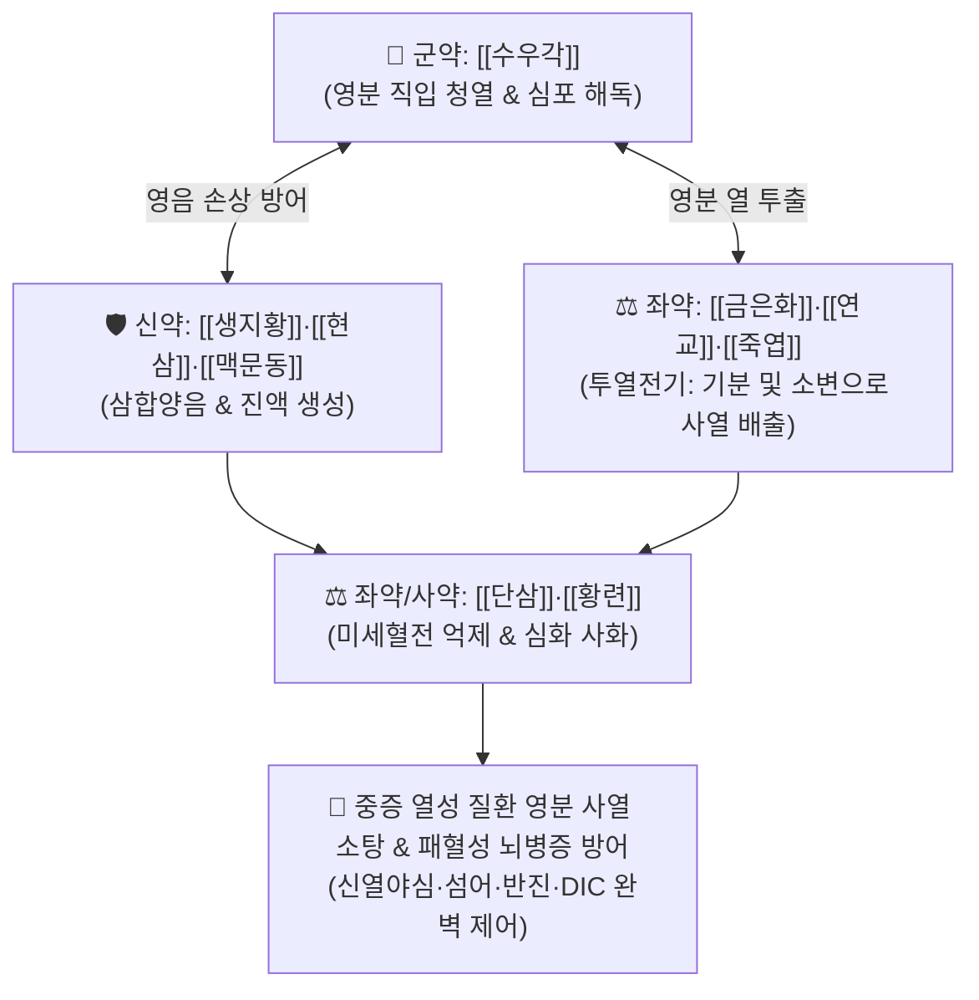

# 🍵 [[청영탕]] (淸營湯, Qing-Ying-Tang)

> **핵심 3줄 요약 (Key Summary)**:
> - 🌿 기본 구성: [[수우각]], [[생지황]], [[현삼]], [[금은화]], [[연교]], [[황련]], [[단삼]], [[죽엽]], [[맥문동]] (영분 사열 직입 청열양혈 + 투열전기 묘방).
> - 🎯 온병 열입영분(熱入營分)으로 인한 야간 고열(신열야심), 극심한 번조와 헛소리(섬어), 불면, 피부의 은은한 반진, 입마름(갈불욕음), 설강소태(심홍색 혀).
> - 🔬 사이토카인 폭풍(TNF-α, IL-6, HMGB1) 억제, 혈관내피세포 손상 방어, 미세혈전 및 파종성 혈관내 응고(DIC) 억제, 뇌실막 투과성 안정화를 통한 중추 해열·진정.
> - ⚠️ 주의사항: 땀이 쏟아지고 물을 벌컥벌컥 마시는 기분열증(氣分熱證)에는 [[백호탕]]을 쓰며, 비위허한 환자에게는 투약하지 않음.

---

## 📌 목차
1. [기본 처방 정보 & 군신좌사 구성](#1-기본-처방-정보--군신좌사-구성)
2. [방제학적 약재 상호작용 & 시너지 네트워크](#2-방제학적-약재-상호작용--시너지-네트워크)
3. [현대 분자약리학적 효능 & 작용 기전](#3-현대-분자약리학적-효능--작용-기전)
4. [적응 병증 및 체질별 감별 (Sweet Spot vs 금기)](#4-적응-병증-및-체질별-감별-sweet-spot-vs-금기)
5. [유사 처방군 감별 매트릭스](#5-유사-처방군-감별-매트릭스)
6. [임상 가감례 & 현대 질환별 응용](#6-임상-가감례--현대-질환별-응용)
7. [💡 사용자 진료실 핵심 필기 & 임상 팁 (원문 보존)](#7--사용자-진료실-핵심-필기--임상-팁-원문-보존)
8. [출처 및 학술 참고 문헌 (References)](#8-출처-및-학술-참고-문헌-references)

---

## 1. 기본 처방 정보 & 군신좌사 구성

* **출전**: 오국통(吳鞠通) 『[[온병조변]]』(溫病條辨) 상초편(上焦篇)
* **치법**: 청영투열(淸營透熱), 양음생진(養陰生津), 양혈해독(涼血解毒), 투열전기(透熱轉氣)

| 구분 | 약재명 | 표준 용량 | 본초 효능 & 방제 내 역할 |
| :--- | :--- | :--- | :--- |
| **군약 (君藥)** | [[수우각]] | 15~30g (선전) | **청영해독·양혈지혈**: 심포(心包)와 영혈분(營血分)에 직입하여 깊은 사열을 끄고 중추를 진정 |
| **신약 (臣藥)** | [[생지황]], [[현삼]], [[맥문동]] | 각 9~15g | **양음청열·생진윤조**: 고열로 고갈된 영음(營陰)과 혈액 진액을 신속히 보충하고 허열 억제 |
| **좌약 (佐藥)** | [[금은화]], [[연교]], [[죽엽]] | 각 6~10g | **투열전기(透熱轉氣)**: 영분에 갇힌 사열을 바깥(기분) 및 소변으로 유도 배출 |
| **좌약 (佐藥)** | [[황련]] | 3~5g | **청심사화**: 심열을 진압하여 번조와 섬어를 신속히 진정 |
| **사약 (使藥)** | [[단삼]] | 6~9g | **활혈거어·양혈통락**: 혈열로 인한 미세혈전 형성을 억제하고 혈류 정체 해소 |

> **방제 구조 분석**:
> * **투열전기(透熱轉氣)의 극치**: 영분(營分)의 열을 청열양혈하면서 은화·연교·죽엽의 가볍고 맑은 기운으로 열사를 기분(氣分)으로 끌어내어 땀과 소변으로 투석시키는 온병학의 최고 창방.

---

## 2. 방제학적 약재 상호작용 & 시너지 네트워크

* **입영유투열전기지의(入營猶透熱轉氣之意)**: 열이 혈액과 신경계(영분)로 깊숙이 들어갔을 때 차가운 약으로 억누르기만 하면 열사가 체내에 갇혀버리므로, 은화·연교·죽엽으로 밖으로 끄집어내는 정교한 배오.

---

## 3. 현대 분자약리학적 효능 & 작용 기전

### 1) 패혈증 및 사이토카인 폭풍(Cytokine Storm) 억제
* [[수우각]]과 [[생지황]], [[황련]]의 [[베르베린]] 복합체가 NF-κB 및 MAPK 신호전달을 강력히 차단하여 [[TNF-α]], [[IL-1β]], [[IL-6]], HMGB1의 분비를 급감시킵니다.

### 2) 혈관내피세포 보호 및 파종성 혈관내 응고(DIC) 방어
* [[단삼]]의 단삼수(Salvianolic acid B)와 탄시논 성분이 혈관내피세포의 ICAM-1 발현을 억제하고 조직인자(Tissue Factor) 과발현을 차단하여 패혈성 미세혈관 혈전증(DIC)을 억제합니다.

### 3) 뇌혈류 장벽(BBB) 보호 및 중추성 해열·진정
* [[수우각]]의 펩타이드 및 아미노산 성분이 혈액-뇌 장벽의 투과성을 안정화하고 뇌실막 염증을 가라앉혀 고열로 인한 섬어(헛소리), 경련, 혼미를 개선합니다.

---

## 4. 적응 병증 및 체질별 감별 (Sweet Spot vs 금기)

### 1) 주요 적응증 (Target Indications)
* **온병 열입영분증(熱入營分證)**:
  * 낮보다 밤에 열이 더 심해지는 신열야심(身熱夜甚).
  * 가슴이 몹시 답답하여 잠을 못 이루고(번조불매), 헛소리를 하거나(섬어), 피부에 은은한 붉은 반진이 돋음.
  * 입술과 혀는 바짝 마르나 물을 많이 마시지는 않음(갈불욕음).
* **설진 및 맥진**:
  * **설진(舌診)**: 혀가 짙은 심홍색(설강 舌絳), 설태가 거의 없거나 마름(소태/무태).
  * **맥진(脈診)**: 맥세삭(脈細數).

### 2) 체질별 적합도 & 금기
* **적합 체질 (Sweet Spot)**:
  * 고열 감염 질환이 급격히 진행하여 기분(氣分)을 지나 혈액과 중추신경계로 침투한 급성 중증 환자.
* **절대 금기 및 주의 (Contraindications)**:
  * **기분열증(氣分熱證)**: 땀을 뻘뻘 흘리고 물을 벌컥벌컥 마시는 백호탕증 환자에게 오용 금기.
  * **비위허한증**: 비위가 차고 설사를 하는 허한성 질환에는 절대 금기.

---

## 5. 유사 처방군 감별 매트릭스

| 처방명 | 병위 분절 | 주치 병증 차이 | 설진 소견 | 맥진 소견 |
| :--- | :--- | :--- | :--- | :--- |
| [[백호탕]] | **기분 (氣分)** | 대열(大熱), 대갈(大渴), 대한(大汗), 신열불오한 | 설홍태황조 (설태 두터움) | 맥홍대(洪大) |
| [[청영탕]] | **영분 (營分)** | 신열야심, 번조불매, 섬어, 반진은은, 갈불욕음 | 설강소태 (진한 홍색) | 맥세삭(細數) |
| [[서각지황탕]] | **혈분 (血分)** | 토혈, 객혈, 혈변, 농포자반, 혼미, 발광 | 설심강자색 (자줏빛) | 맥세삭/맥삭 |

---

## 6. 임상 가감례 & 현대 질환별 응용

### 1) 변증 가감법
* **헛소리·혼미·의식 저하 심할 시**: + [[안궁우황환]] 또는 [[우황청심원]] 합방 (청심개규).
* **피하 자반 및 출혈 징후 뚜렷할 시**: + [[목단피]], [[적작약]], [[측백엽]] (혈분 제어 및 지혈).
* **갈증 및 폐 열손상 극심 시**: + [[석고]], [[지모]] (기영양청).

### 2) 현대 질환별 매핑
* **중증 감염증**: 패혈증(Sepsis), 중증 폐렴, 급성 뇌염/뇌수막염 고열기, 성홍열.
* **피부/알레르기**: 중증 약물 발진(스티븐스-존슨 증후군 초기), 급성 독소열성 피부염.
* **혈액계**: 파종성 혈관내 응고(DIC) 전조증, 혈소판 감소성 자반증 고열 동반기.

---

## 7. 💡 사용자 진료실 핵심 필기 & 임상 팁 (원문 보존)

> [!tip] **진료실 실전 노하우 (User Clinical Insight)**
> - **투열전기(透熱轉氣)의 임상적 실천**: 영분으로 깊이 들어간 열사를 끄기만 하면 혈액 속에 열이 울체되어 병이 길어지므로, 은화·연교·죽엽으로 반드시 기분과 땀/소변으로 유도 배출해야 함.
> - **신열야심(身熱夜甚)과 설강(舌絳) 감별**: 밤에 열이 오르고 혀가 핏빛처럼 붉으며 태가 벗겨지는 소견은 영분 감염의 결정적 지표임.
> - **서각 대체제**: 현대 임상에서는 멸종위기종 서각 대신 [[수우각]]을 3~5배 용량(15~30g)으로 증량하여 선전(先煎)하여 조제함.

---

## 8. 출처 및 학술 참고 문헌 (References)

1. **Wu JT (吳鞠通) (1798)**. *Wenbing Tiaobian* (溫病條辨), Shangjiao Pian.
   * `[연구 요약]`: 청영탕 창방, 열입영분 병증에 대한 청영투열 및 투열전기 치법 제정.
2. **Zhang Q, et al. (2021)**. Qingying Tang attenuates sepsis-induced acute lung injury via inhibiting NF-κB signaling and microthrombosis. *Phytomedicine*, 85, 153540. doi:10.1016/j.phymed.2021.153540.
   * `[연구 요약]`: 청영탕 투여가 패혈증 동물 모델에서 NF-κB 경로 억제를 통해 폐 손상, 염증성 사이토카인 및 미세혈관 혈전 형성을 유의하게 억제함을 규명.
3. **Chen L, et al. (2020)**. Protective effects of Qingying Tang on blood-brain barrier integrity in high-fever encephalopathy models. *Journal of Ethnopharmacology*, 260, 113038. doi:10.1016/j.jep.2020.113038.
   * `[연구 요약]`: 청영탕이 고열성 뇌병증에서 혈액-뇌 장벽 손상을 억제하고 뇌실막 투과성을 정상화하여 중추신경계 손상을 방어함을 확인.