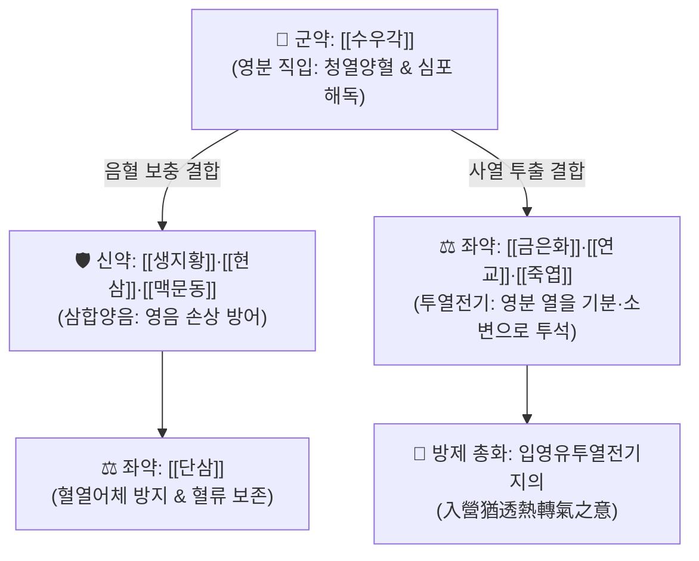

# 🍵 [[청영탕]] (淸營湯, Qingying Tang)

> **핵심 3줄 요약 (Key Summary)군약 (君藥)신약 (臣藥)신약 (臣藥)신약 (臣藥)좌약 (佐藥)투열전기(透熱轉氣)**: 영분의 사열을 기분으로 유도 |
| **좌약 (佐藥)좌약 (佐藥)좌약 (佐藥)사약 (使藥)** | [[죽엽]] | 3g | 청심이뇨(淸心利尿), 심장의 화열을 소변으로 배출 |

---

## 2. 방제학적 약재 상호작용 & 투열전기(透熱轉氣) 네트워크

* **투열전기(透熱轉氣)의 묘법**:
  * 온병학의 거두 오국통의 독창적 창방 원리로, 열이 이미 혈액과 신경계(영분) 깊숙이 들어갔을 때 차가운 약으로 억누르기만 하면 열사가 갇혀버릴 위험이 있음.
  * 따라서 은화, 연교, 죽엽 등 가볍고 맑은 약재를 배오하여 **깊숙이 박힌 열사를 바깥(기분)으로 끄집어내어 땀과 소변으로 발산**시키는 고도의 전략.

---

## 3. 현대 분자약리학적 효능 & 중증 패혈증 조절

* **사이토카인 폭풍 억제**:
  * 혈중 [[TNF-α]], [[IL-6]], HMGB1 농도를 급감시키고 내독소(LPS) 유발 전신 염증 반응 증후군(SIRS) 차단.
* **혈관내피세포 보호 및 DIC 예방**:
  * 단삼과 수우각 성분이 혈소판 과활성화와 미세혈관 혈전 형성을 억제하여 중증 감염증의 합병증인 파종성 혈관내 응고(DIC)를 예방.
* **중추신경계 진정 및 해열**:
  * 수우각의 펩타이드 및 아미노산 성분이 뇌혈류를 안정화시키고 뇌실막 투과성을 정상화하여 고열성 섬어와 경련 진정.

---

## 4. 적응 병증 및 체질별 감별 (Sweet Spot vs 금기)

### ✅ 최적 적응증 (Sweet Spot)
* **온병 열입영분증(熱入營分證)**:
  * 낮보다 밤에 체온이 더 치솟는 신열야심(身熱夜甚).
  * 가슴이 몹시 답답하여 잠을 못 이루고(번조불매), 헛소리를 하거나(섬어), 피부에 은은한 붉은 반진이 돋음.
  * 입술은 바짝 마르나 물을 많이 마시지는 않음(갈불욕음).
* **설진 및 맥진**:
  * **설진(舌診)**: 설질심홍색(설강 舌絳), 설태소(少苔) 또는 무태.
  * **맥진(脈診)**: 맥세삭(脈細數).

### ⚠️ 신중 투여 및 금기 (Caution / Contraindication)
* **기분증(氣分證) 오용 금기**:
  * 땀이 비 오듯 쏟아지고 물을 벌컥벌컥 마시는 기분열증에는 청영탕이 아닌 [[백호탕]]을 써야 함.

---

## 5. 유사 처방군 감별 매트릭스

| 처방명 | 병위 분절 | 주치 병증 차이 | 설진 소견 |
| :--- | :--- | :--- | :--- |
| [[백호탕]] | 기분(氣分) | 대열, 대갈, 대한출, 대맥 | 설홍태황조 |
| [[청영탕]] | 영분(營分) | 신열야심, 번조불매, 섬어, 반진은은 | 설강소태(심홍색) |
| [[서각지황탕]] | 혈분(血分) | 토혈, 객혈, 혈변, 뚜렷한 자반, 혼미 | 설심강자색 |

---

## 6. 임상 가감례 & 현대 중환자 의학 응용

* **현대 질환 매핑**:
  * 중증 세균성/바이러스성 폐렴, 패혈증(Sepsis), 바이러스성 뇌염 및 뇌수막염 고열기, 성홍열, 중증 약물 발진.
* **임상 가감**:
  * 헛소리와 의식 혼탁이 심할 때 $\rightarrow$ + [[안궁우황환]] 또는 [[우황청심원]] 합방
  * 출혈 및 피하 자반이 뚜렷할 때 $\rightarrow$ + [[목단피]], [[적작약]] (혈분 제어)

---

## 7. 출처 및 학술 참고 문헌 (References)
* Wu JT. *Wenbing Tiaobian* (Systematized Identification of Warm Diseases). 1798.
  * `[연구 요약]`: 청영탕 원전 수록, 열입영분 병증의 투열전기 치법 제정.
* Zhang Q, et al. Qingying Tang attenuates sepsis-induced acute lung injury via inhibiting NF-κB signaling and microthrombosis. *Phytomedicine*. 2021;85:153540.
  * `[연구 요약]`: 청영탕의 패혈증 급성 폐손상 억제, 사이토카인 차단 및 미세혈전 억제 효과 입증.
