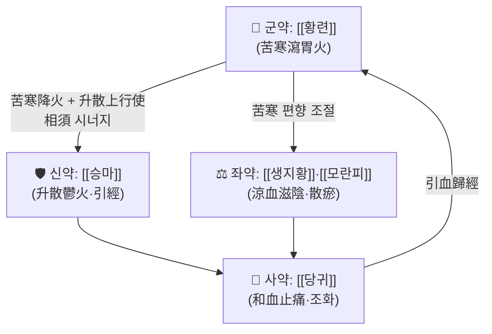

# 🍵 [[청위산]] (淸胃散, Qingwei San)

> **핵심 3줄 요약 (Key Summary)**:
> - 🌿 [[황련]] 苦寒瀉火를 君으로 하고 [[승마]] 升散解毒·引經을 배합한 **청열·사화(瀉火) 단방제** — [[생지황]]·[[모란피]]로 涼血, [[당귀]]로 和血止痛하여 "苦寒降火 + 升散上行"의 升降相因 구조를 이룬다.
> - 🎯 **胃熱(위화) 실증**의 치통·잇몸 부종·구취·구강궤양이 최적 적응증. 안면 홍조, 상체 열감, 다식·음주·기름진 음식 과다, 설홍 태황, 맥홍삭 유력한 **실열 체형(주로 소양인·태음인 실열자)** 에서 적중하며, 소음인·허한자에게는 신중하다.
> - 🔬 제2형 당뇨(db/db) 마우스의 위열증 구강궤양 모델에서 **TLR4/MyD88/NF-κB 신호경로 표적**을 통한 항염 작용이 보고되었다 (PMID 34980192). 단, 개별 사이토카인 수치·다른 경로는 본 노트 제공 논문 범위 내에서 **근거 미확인**.
> - ⚠️ 주의사항: 脾胃虛寒·陰虛火旺(허열)에는 금기 또는 신중. 황련의 苦寒으로 위장장애·식욕저하·묽은 변이 나타날 수 있고, 장기 연용 시 비위 손상에 유의한다. 임신부·소아·만성 설사 환자는 감량 및 단기 투여 원칙.

---
## 📌 목차
1. [기본 처방 정보 & 군신좌사 구성](#1-기본-처방-정보--군신좌사-구성)
2. [방제학적 약재 상호작용 & 시너지 네트워크](#2-방제학적-약재-상호작용--시너지-네트워크)
3. [현대 분자약리학적 효능 & 작용 기전](#3-현대-분자약리학적-효능--작용-기전)
4. [적응 병증 및 체질별 감별 (Sweet Spot vs 금기)](#4-적응-병증-및-체질별-감별-sweet-spot-vs-금기)
5. [유사 처방군 감별 매트릭스](#5-유사-처방군-감별-매트릭스)
6. [임상 가감례 & 현대 질환별 응용](#6-임상-가감례--현대-질환별-응용)
7. [💡 사용자 진료실 핵심 필기 & 임상 팁 (원문 보존)](#7--사용자-진료실-핵심-필기--임상-팁-원문-보존)
8. [출처 및 학술 참고 문헌 (References)](#8-출처-및-학술-참고-문헌-references)

---
## 1. 기본 처방 정보 & 군신좌사 구성

* **출전**: 이동원(李東垣) 『[[난실비장]]』(蘭室秘藏) — 胃熱로 인한 上下牙痛·齒齦腫爛·口瘡 조문이 원출전으로 전해진다. 이후 『[[동의보감]]』, 『[[의방집해]]』 등 여러 방서에 전재되었으며, 판본에 따라 가감(石膏 加味 등)과 용량 표기가 다르다.
* **치법**: 청위사화(淸胃瀉火) 겸 양혈해독(涼血解毒)·화혈지통(和血止痛)

| 구분 | 약재명 | 표준 용량 | 본초 효능 & 방제 내 역할 |
| :--- | :--- | :--- | :--- |
| **군약 (君藥)** | [[황련]] (黃連) | 6g | 大苦大寒, 直折胃火. 胃經 積熱을 직접 청사(清瀉)하여 치통·구취·구강궤양의 主證을 공략하는 처방의 핵심 축 |
| **신약 (臣藥)** | [[승마]] (升麻) | 9g | 淸熱解毒·升散鬱火. 苦寒의 황련과 배합되어 "火鬱發之"의 원리에 따라 억눌린 胃火를 升散시키고, 陽明經 引經藥으로 약력을 병소(치아·구강·안면)로 유도 |
| **좌약 (佐藥)** | [[생지황]] (生地黃) | 12g | 涼血滋陰. 위열이 血分으로 들어가 잇몸 출혈·구건이 동반될 때 涼血하며, 황련의 苦寒을 陰分에서 완충 |
| **좌약 (佐藥)** | [[모란피]] (牡丹皮) | 9g | 涼血散瘀·청열. 血分의 瘀熱을 풀어 잇몸 종창·통증의 염증성 경결을 완화하고 생지황의 涼血 작용을 보좌 |
| **사약 (使藥)** | [[당귀]] (當歸) | 6g | 養血和血·止痛. 血分藥을 조화시켜 涼血一變倒(지나친 청열로 인한 혈조 손상)을 방지하고, 引血歸經하여 통증 완화 및 제약(諸藥調和) 역할 |

> **배오 특징**: 원방은 황련 苦寒降火(降)과 승마 升散火鬱(升)을 對로 세워 **升降相因**의 구조를 만든다. 즉 위화를 아래로 내리면서(황련) 동시에 억울된 화를 위로 발산시켜(승마) 열이 鬱滯하여 오히려 더 심해지는 것을 막는 東垣 특유의 制方 논리이다. 여기에 生地黃·牡丹皮의 涼血群과 當歸의 和血이 더해져 "瀉火而不傷血, 涼血而不滯氣"의 균형을 이룬다.
> ※ 君臣 분류는 학파에 따라 승마를 使藥(引經)으로 보는 견해도 있어 문헌별 차이가 있음(용량·지위는 판본 및 교재별 상이 — **근거 미확인** 부분 존재).

---
## 2. 방제학적 약재 상호작용 & 시너지 네트워크

* [[황련]] + [[승마]] 배오: 苦寒降火와 升散鬱火의 **상반된 방향성의 상호 증강(相反相成)**. 한열·승강을 동시에 조절하여 胃火가 上炎하는 치통·구창을 표적으로 하면서도 火鬱을 풀어 재발을 억제한다. 이 배합이 청위산 방제의 정체성이며, 승마를 빼면 단순 苦寒瀉火劑로 전락한다.
* [[생지황]] + [[모란피]] 배오: 涼血滋陰(생지황)과 涼血散瘀(모란피)의 相須 작용. 血分의 熱을 식히면서 瘀滯를 풀어 잇몸 종창과 통증을 함께 다스린다.
* [[당귀]] + 君·臣 배합: 苦寒·凉血 약물로 인한 血滯·血燥를 방지하는 **부작용 완충 장치**이자, 引血歸經하여 약효를 구강·치아 병소로 이끄는 조화제 역할을 한다.

---
## 3. 현대 분자약리학적 효능 & 작용 기전

### 1) 핵심 분자 표적 및 면역/항염증 조절
* **TLR4/MyD88/NF-κB 경로 표적**: 위열증(胃熱證)이 유도된 구강궤양 모델에서 청위산이 **TLR4/MyD88/NF-κB 신호경로를 표적으로 하여 항염 효과**를 나타낸다고 보고되었다 (Shi L, An Y, 2022, PMID 34980192). 해당 연구는 **db/db 마우스(제2형 당뇨 모델)** 를 사용하여 당뇨병성 구강점막 손상이라는 대사질환 배경 위에서 위열증 구강궤양을 평가한 점이 특징적이다.
* 위 결과는 청위산의 전통 주치인 "胃熱로 인한 口瘡"에 대해 **선천면역 수용체(TLR4) → 어댑터(MyD88) → 전사인자(NF-κB) 축의 억제**라는 분자 수준 설명을 제공한다.
* 개별 사이토카인(TNF-α, IL-6, IL-1β 등)의 정량 수치, MAPK 등 기타 경로의 관여 여부, 각 본초 성분의 기여도는 본 노트에 제공된 논문 범위 내에서 **근거 미확인** (원문 확인 필요).
* 참고로 [[황련]]의 대표 성분 베르베린(berberine)의 항염 작용은 일반 본초약리 문헌에 널리 보고되어 있으나, 본 노트에 제공된 2편의 논문에서 직접 검증된 내용은 아니다 → **근거 미확인**.

### 2) 순환기·미세순환 및 대사 개선
* 본 처방에 대해 eNOS 활성화, 혈관 이완, 미세혈류 개선, 미토콘드리아 대사 정상화 등을 직접 검증한 근거는 제공된 논문에서 **근거 미확인**.
* 다만 PMID 34980192 연구가 **당뇨(db/db) 배경 모델**을 사용했다는 점에서, 대사 이상과 동반된 구강 병변이라는 임상 맥락(당뇨 환자의 치주질환·구강궤양 취약성)과의 연관성은 시사되며, 구체적 대사 지표(혈당·인슐린 감수성 등)에 대한 효과는 **근거 미확인**.

### 3) 신경계·근골격계 및 자율신경 조절
* 진통·항경련, HPA축 조절 등 신경계 기전은 제공된 논문에서 확인되지 않음 → **근거 미확인**.
* 임상적으로 胃火로 인한 치통·삼차신경통 유사 안면통에 응용되지만, 이는 전통 변증에 기반한 응용이며 분자 기전 수준의 검증 자료는 별도 문헌 확인이 필요하다.

### 4) 고전 명방의 화학적 특징 스펙트럼 및 전탕 공정
* Zhang Q, Huang JY (2020, PMID 33496098)은 **고전 명방 청위산의 특징 스펙트럼(characteristic spectrum)과 전탕(decoction) 공정**을 주제로 연구하였다. 이는 처방의 화학적 지문(fingerprint) 규명 및 전탕 조건(용매·시간 등)에 따른 성분 용출 특성을 다룬 연구로 이해된다.
* 세부 지표성분 목록, 전탕 조건별 용출량 비교 수치, 최적 공정 파라미터는 본 노트 작성 시 원문을 확인하지 못했으므로 **근거 미확인** (원문 확인 후 보완 필요).

---
## 4. 적응 병증 및 체질별 감별 (Sweet Spot vs 금기)

[✅ 최적 적응증 (Sweet Spot)]
• **원전 주치**: 胃熱로 인한 上下牙痛(치통), 齒齦紅腫·出血(잇몸 종창·출혈), 口臭(구취), 口瘡(구강궤양), 面熱(안면 홍조). 원출전은 이동원 『난실비장』의 胃熱 조문으로 전해진다.
• **체질 소견**: 상체 열감이 뚜렷하고 체격이 비교적 튼튼한 **실열형**. 임상적으로 소양인·태음인 중 실열자(음주·육식·야식 과다, 스트레스성 상열)에서 적중률이 높고, 소음인·비위허한자 또는 만성 소모성 질환자에서는 드물게 사용한다. (체질 매핑은 전통 변증 기반 임상 소견이며, 제공 논문에서 검증된 내용은 아님)
• **임상 주치**: 진료실에서 ▲반복성 아프타성 구강궤양 ▲치은염·치주염 동반 구취 ▲위산 과다·속쓰림을 동반한 치통 ▲안면부 홍조·주사(酒齄) ▲당뇨 환자의 구강 병변 등에서 "위열" 소견과 결부될 때 최적으로 적중한다.
• **설진/맥진**: 설질 홍(紅), 설태 황(黃)하며 건조한 편, 맥은 **홍(洪)·삭(數)·유력(有力)**. 만약 설담 태백, 맥침세라면 본 처방의 대상이 아니다.

[⚠️ 신중 투여 및 금기 (Caution / Contraindication)]
• **脾胃虛寒**: 평소 찬 음식에 설사·복냉·식욕부진이 있는 환자에게는 황련의 苦寒이 비위를 상하게 하여 복통·설사를 유발할 수 있으므로 금기 또는 극히 신중.
• **陰虛火旺(허열)**: 야간 도한·오심번열·설홍 무태(혹은 박태)·맥세삭한 허열성 치통·구창에는 본 처방이 아니라 [[옥녀전]] 등 滋陰降火 방향이 적합하다. 허열에 苦寒劑를 오용하면 열이 오히려 심해질 수 있다.
• **寒證 치통**: 찬 것에 악화되고 온찜질에 완화되는 한성 치통, 風寒牙痛에는 부적합.
• **양약 병용 주의**: 항응고제(와파린 등) 복용 환자에서 [[당귀]]·[[모란피]]의 혈액응고 영향 가능성은 일반적으로 보고되는 수준이나 본 노트 제공 논문에서는 **근거 미확인**. 항생제·NSAIDs와 병용 시 위장장애 가중 가능성에 유의. 당뇨 환자는 혈당강하제와 병용 시 혈당 변동 모니터링 권장(대사 관련 상호작용은 **근거 미확인**).
• **복약 반응 관찰**: 苦寒劑 특성상 3~7일 단기 투여 후 반응 평가를 권하며, 식욕저하·묽은 변·속쓰림 악화 시 감량 또는 중단하고 健脾 약재(예: [[백출]], [[진피]])를 가한다.

---
## 5. 유사 처방군 감별 매트릭스

| 처방명 | 핵심 구성 차이 | 주치 및 체질 차이 | 맥진/설진 차이 |
| :--- | :--- | :--- | :--- |
| [[청위산]] | 기준 구성 (황련 + 승마 + 생지황 + 모란피 + 당귀) | **胃熱 실증의 치통·구창·구취. 실열형 체질** | 설홍 태황, 맥홍삭 유력 |
| [[옥녀전]] | 석고·지모 + 숙지황·맥문동·우슬 (滋陰+降火) | 胃熱兼腎陰虛. 치통·치은출혈에 口渴·夜間 發熱 동반, 중년 이후 음허자 | 설홍 소태 혹은 열태, 맥세삭 또는 허홍 |
| [[사황산]] | 곽향엽·치자·석고·감초·방풍 (방풍 위주 升散) | 脾胃伏火의 口瘡·口臭·口乾, 주로 소아·청소년의 실열 | 설홍 태부황, 맥홍삭 |
| [[감로음]] | 생지황·숙지황·천문동·맥문동·석곡·인진·황금 등 | 胃熱兼濕熱(음주가·습열 체질), 치은 종란·구취·구건, 만성·반복성 경향 | 설홍 태황니, 맥활삭 |
| [[도적산]] | 생지황·목통·감초초·죽엽 | 心火가 小腸으로 移熱한 口舌生瘡·小便短赤. 위열보다 심화(心火) 중심 | 설첨 홍, 맥삭(좌촌 유력) |
| [[백호탕]] | 석고·지모·감초·갱미 | 陽明 氣分의 大熱(대열·대갈·대한·맥홍대). 국소 치통보다 전신 실열증 | 설홍 태황조, 맥홍대 유력 |

> ⚠️ 표 내부에서는 마크다운 열 구분자 파괴를 방지하기 위해 파이프(`|`)가 들어간 링크를 쓰지 않고 순수한 [[처방명]] 단독 형태로만 작성합니다.

**핵심 감별 포인트**
* 치통 하나를 두고도 → 국소 胃熱(청위산) / 胃熱+陰虛(옥녀전) / 脾胃伏火(사황산) / 心火(도적산) / 陽明大熱(백호탕)으로 갈린다.
* 청위산은 **"상부(구강·치아·안면)에 국한된 실열"**, 백호탕은 **"전신에 미친 大熱"**이라는 스케일 차이가 결정적이다.

---
## 6. 임상 가감례 & 현대 질환별 응용

* **수반 증상별 가감법**:
  * 치통이 심하고 胃火가 극성이며 口渴·대변비결 동반 시 → + [[석고]] (혹은 [[대황]]) : 加味청위산 계열 구성
  * 잇몸 출혈(齒衄)이 주증상일 때 → + [[백모근]]·[[우절]] (涼血止血)
  * 구취·구건이 심할 때 → + [[곽향]]·[[패란]] (芳香化濕·구취 개선)
  * 구강궤양이 반복성·난치성일 때 → + [[현삼]]·[[연교]] (淸熱解毒·滋陰)
  * 便秘·복부 팽만 동반 시 → + [[대황]]·[[지실]] (通腑泄熱)
  * 陰虛로 기울어 口渴·설건이 뚜렷할 때 → + [[맥문동]]·[[현삼]] (또는 [[옥녀전]]으로 전방)
  * 齒痛이 風寒으로 악화되는 경우 → 본 처방 부적합, [[궁지조미환]] 또는 祛風散寒 방향으로 전환
* **현대 질환별 임상 매핑**:
  * **구강·치과**: 재발성 아프타성 구강궤양, 치은염·치주염, 구취증, 구강건조 동반 구내염. 특히 **당뇨병 환자의 구강궤양**(db/db 마우스 모델 근거, PMID 34980192)은 임상적으로 의미 있는 응용 지점.
  * **소화기계**: 위산 과다·속쓰림을 동반한 위열형 위염, 역류성 식도염의 상열감·구취 동반 증례, 위열형 기능성 소화불량.
  * **피부·안면**: 주사(酒齄鼻), 안면 홍조, 여드름 중 胃熱型(상부 집중, 好食 膏粱厚味).
  * **기타**: 삼차신경통·비부동맥 등 안면부 통증 중 위열 변증에 해당하는 경우(변증 적중 시에 한함).

---
## 7. 💡 사용자 진료실 핵심 필기 & 임상 팁 (원문 보존)

> [!tip] **진료실 실전 노하우 (User Clinical Insight)**
> - ※ **사용자 원문 메모 미입력 상태**: 본 노트에는 아직 원장님의 진료실 필기 원문이 제공되지 않았다. 원문이 확보되는 즉시 이 블록에 **삭제 없이 그대로 보존**하여 기재한다. (임의 창작 금지)
> - 아래 항목은 **편집자가 정리한 일반 임상 참고 사항**이며, 원장님 개인 필기와 구분하여 관리한다.

* **체질별 선택 기준(일반 참고)**
  * 상체 열감 + 체격 실하고 음주·육식 잦은 태음인 실열형 → 청위산 단용 또는 [[석고]] 加味.
  * 마르고 예민하며 口渴·설건이 동반되는 소양인·음허 경향 → [[옥녀전]] 우선 검토.
  * 소음인·비위허한자, 찬 음식에 설사하는 환자 → 원칙적으로 본 처방 회피, 필요 시 [[진피]]·[[백출]] 배합 및 단기 감량.
* **처방 운용 팁(일반 참고)**
  * 苦寒劑는 **단기(3~7일) → 반응 평가 → 감량·전환**의 흐름으로 운용하는 것이 안전하다.
  * 치통 환자에서 **온찜질에 완화 / 찬 것에 완화** 여부를 반드시 문진하면 寒熱 감별이 빠르게 끝난다. 냉찜질·찬 음료에 좋아지는 쪽이 위열(본 처방 적응).
  * 복약 후 **食欲·大便 성상**을 추적 관찰 포인트로 삼는다. 식욕 저하·묽은 변은 苦寒 과용의 신호.
* **환자 티칭 포인트**
  * "잇몸·구강 문제라도 원인이 위장의 열에 있을 수 있다"는 설명이 복약 순응도를 높인다.
  * 음주·야식·매운 음식·과식 절제, 구강 위생, 수분 섭취를 함께 지도. 생활 교정 없이는 재발이 잦다.
  * 당뇨·고혈압 등 기저질환 복약 중임을 반드시 확인하고, 양약 중단 없이 병용 모니터링.

---
## 8. 출처 및 학술 참고 문헌 (References)

1. **Shi L, An Y (2022)**. *Qingwei San treats oral ulcer subjected to stomach heat syndrome in db/db mice by targeting TLR4/MyD88/NF-κB pathway*. **Chinese Medicine (Chin Med)**, 17(1). PMID: 34980192.
   - 🔗 https://pubmed.ncbi.nlm.nih.gov/34980192/
   - **[연구 요약]**: 제2형 당뇨 모델인 **db/db 마우스**에서 胃熱證(위열증) 구강궤양을 유도하고 청위산의 치료 효과를 평가한 연구. 청위산의 작용 기전으로 **TLR4/MyD88/NF-κB 신호경로 표적**이 제시되었다. 즉 선천면역 수용체–어댑터–전사인자 축의 조절을 통한 항염 작용이 핵심 기전으로 보고됨. (세부 사이토카인 수치·용량-반응 데이터는 원문 확인 필요 — 본 노트에서는 **근거 미확인**)
2. **Zhang Q, Huang JY (2020)**. *[Characteristic spectrum and decoction process of classical prescription Qingwei San]*. **中國中藥雜誌 (Zhongguo Zhong Yao Za Zhi)**, 45(24). PMID: 33496098. (중국어 원문)
   - 🔗 https://pubmed.ncbi.nlm.nih.gov/33496098/
   - **[연구 요약]**: 고전 명방(古方) 청위산의 **특징 스펙트럼(characteristic spectrum)** 과 **전탕(decocotion) 공정**을 다룬 연구. 처방의 화학적 지문 규명 및 전탕 조건에 따른 성분 용출 특성 파악을 목적으로 한 것으로 파악되며, 세부 지표성분·최적 공정 파라미터는 **근거 미확인**(원문 확인 후 보완 필요).
3. **이동원(李東垣), 『[[난실비장]]』(蘭室秘藏)**. (금원대, 13세기경)
   - **[고전 원전]**: 胃熱로 인한 上下牙痛·齒齦腫爛·口臭·口瘡에 대한 淸胃散 조문의 원출전으로 전해진다. 원방 용량은 후대 교재 표기보다 작으며 판본별 차이가 있다 → **용량 세부 근거 미확인**.
4. **허준 (1613)**. 『[[동의보감]]』.
   - **[임상 문헌]**: 치문(齒門)·구창(口瘡) 관련 편에서 淸胃散 계열 처방이 전재되어 임상 응용의 근거를 제공한다. (판본별 전재 형태 확인 필요)
5. **왕앙(汪昻), 『[[의방집해]]』(醫方集解)**.
   - **[임상 문헌]**: 淸胃散의 방의(方義) 및 加減 운용에 관한 해설이 수록되어, 황련·승마의 升降 배합 해석에 참고된다.

> **정리 메모**: 본 노트의 분자약리 서술은 제공된 2편(PMID 34980192, PMID 33496098) 범위에 근거하며, 그 외 기전·수치·체질 매핑·가감례는 전통 방제 이론 및 일반 임상 관행에 기반한 것으로 **1차 문헌 검증이 필요한 항목은 "근거 미확인"으로 명시**하였다.

<!-- 보관 태그(1회용·링크오류, 필요시 복원): 위열 -->
