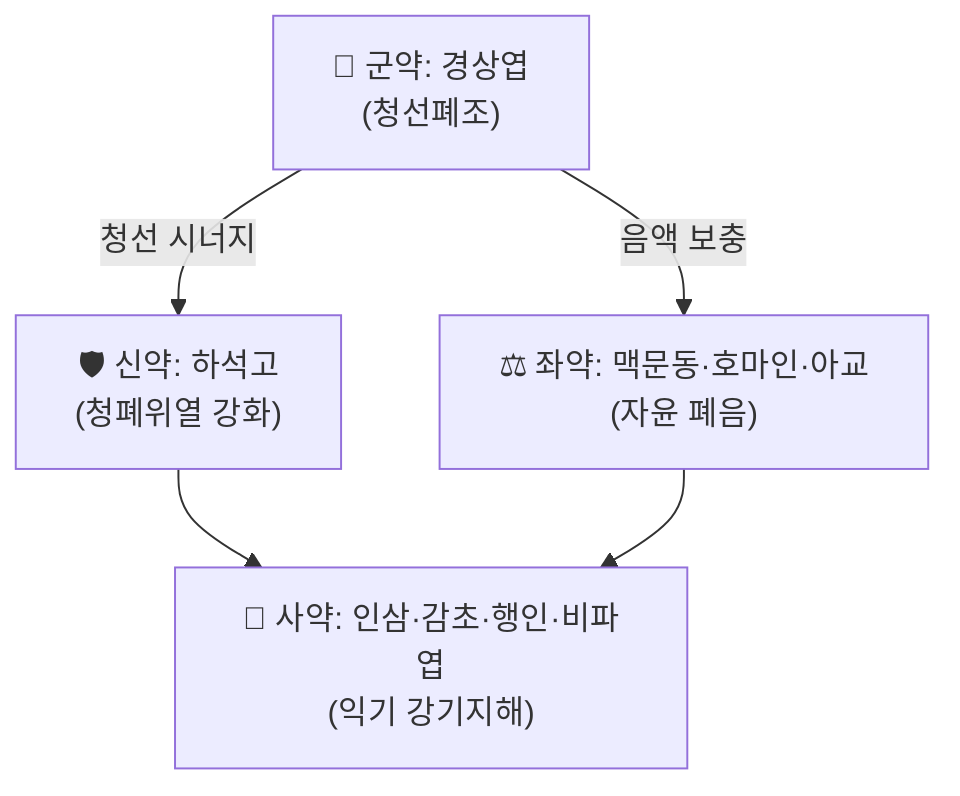

# 🍵 [[청조구폐탕]] (淸燥救肺湯, Qing Zao Jiu Fei Tang)

> **핵심 3줄 요약 (Key Summary)**:
> - 🌿 상엽(桑葉, 君藥)을 주축으로 석고·맥문동·아교·호마인 등 자윤(滋潤) 약재를 배오해 온조지사(溫燥之邪)로 소모된 폐(肺)의 기음(氣陰)을 함께 구제하는 신량감윤(辛涼甘潤)의 대표 치조제(治燥劑).
> - 🎯 가을철 건조한 사기가 폐를 침범해 생긴 마른기침·가래 없는 기침·인건(咽乾)·흉통·기천(氣喘)에 활용하며, 방사선 폐렴·마이코플라스마 폐렴·만성기침 등 현대 호흡기 질환에도 임상 응용됨.
> - 🔬 항염증·항산화·항암·면역조절 작용이 현대 약리 연구로 보고되며, 스테로이드성 항염 효과와 유사한 사이토카인 조절 기전이 제시됨.
> - ⚠️ 주의사항: 한습(寒濕)·담음(痰飮)이 위주인 습성 기침·설사 경향 환자에는 자윤 약재가 과다해 부적합하며, 비위허한(脾胃虛寒)에는 신중 투여.
---
## 📌 목차
1. [기본 처방 정보 & 군신좌사 구성](#1-기본-처방-정보--군신좌사-구성)
2. [방제학적 약재 상호작용 & 시너지 네트워크](#2-방제학적-약재-상호작용--시너지-네트워크)
3. [현대 분자약리학적 효능 & 작용 기전](#3-현대-분자약리학적-효능--작용-기전)
4. [적응 병증 및 체질별 감별 (Sweet Spot vs 금기)](#4-적응-병증-및-체질별-감별-sweet-spot-vs-금기)
5. [유사 처방군 감별 매트릭스](#5-유사-처방군-감별-매트릭스)
6. [임상 가감례 & 현대 질환별 응용](#6-임상-가감례--현대-질환별-응용)
7. [출처 및 학술 참고 문헌 (References)](#7-출처-및-학술-참고-문헌-references)
---
## 1. 기본 처방 정보 & 군신좌사 구성

* **출전**: 명말청초(明末淸初) 의가 유창(喩昌)의 『[[의문법률]]』(醫門法律) 권4 「상조문(傷燥門)」(1658년경)
* **치법**: 청선윤조(淸宣潤燥), 익기양음(益氣養陰) — "조자윤지(燥者潤之)"의 원칙에 따라 신량감윤(辛涼甘潤)한 성질로 청선강윤(淸宣降潤)의 효능을 발휘

| 구분 | 약재명 | 표준 용량(원방 기준) | 본초 효능 & 방제 내 역할 |
| :--- | :--- | :--- | :--- |
| **군약 (君藥)** | 경상엽(經霜[[상엽]]) | 3전(약 9g) | 청선폐경(淸宣肺經)의 조열(燥熱), 폐음 손상의 근본 병기를 직접 공략 |
| **신약 (臣藥)** | 하[[석고]](煆石膏) | 2전5분(약 8g) | 청폐위(淸肺胃)의 실열, 군약의 청조(淸燥) 작용을 강화 |
| **좌약 (佐藥)** | [[맥문동]]·[[호마인]]·진[[아교]] | 각 1전~1전2분(약 3~4g) | 폐음·진액을 자양(滋養)하여 조(燥)로 소모된 음액을 보충 |
| **사약 (使藥)** | 인삼(人蔘)·감초(甘草)·[[행인]]·[[비파엽]](蜜炙) | 각 7분~1전(약 2~3g) | 익기화중(益氣和中), 강기지해(降氣止咳) 및 조화제약(調和諸藥) |

> **배오 특징**: 청(淸)·윤(潤)·보(補)·강(降) 네 가지 치법이 한 방제 안에 동시에 구현되는 것이 특징으로, 상엽·석고의 청선(淸宣)과 맥문동·아교·호마인의 자윤(滋潤), 인삼·감초의 익기(益氣), 행인·비파엽의 강기지해(降氣止咳)가 승강출입(升降出入)의 균형을 이룬다.
---
## 2. 방제학적 약재 상호작용 & 시너지 네트워크

* [[상엽]] + [[석고]] 배오: 신량(辛涼)·청열(淸熱)의 상승 작용으로 온조지사(溫燥之邪)를 신속히 청산(淸散)하는 방제학적 핵심 축.
* [[맥문동]] + [[호마인]] + 아교 배오: 감윤(甘潤) 약재의 삼중 배합으로 조(燥)에 의해 소모된 폐음(肺陰)·진액을 강력히 자양하여 마른기침·인건(咽乾)을 근본적으로 개선.
* 인삼 + 감초 배오: 사군자탕(四君子湯)의 축소형 배오로 비위(脾胃)를 보하여 청윤(淸潤) 약재의 과도한 한량(寒涼)·자니(滋膩)함을 완충.
---
## 3. 현대 분자약리학적 효능 & 작용 기전

### 1) 항염증 및 사이토카인 조절
* 처방 전체가 항염증·항산화·항암·면역조절 작용을 나타내며, TNF-α·IL-6 등 염증성 사이토카인 경로 조절을 통해 기침·천식·마이코플라스마 폐렴 등 호흡기 염증 병태에서 효능이 보고됨(Advances in Clinical Medicine, 2024).
### 2) 항산화 및 폐조직 보호
* 방사선 폐렴(radiation pneumonitis) 모델 및 임상에서 폐조직 산화손상 완화와 섬유화 억제 경향이 관찰되어 방사선 치료 보조요법으로 응용된 사례가 보고됨.
### 3) 면역조절 및 항암 보조
* 폐암(肺癌) 환자의 보조 치료에서 면역기능 지표 개선 및 삶의 질 향상에 기여한다는 임상 관찰이 다수 보고되며, 주요 기전으로 Th1/Th2 균형 조절이 제시됨.
---
## 4. 적응 병증 및 체질별 감별 (Sweet Spot vs 금기)

[✅ 최적 적응증 (Sweet Spot)]
• 원전 조문: "諸氣膹鬱, 諸痿喘嘔" — 온조지사가 폐를 침범해 기(氣)가 답답하고 위축(痿)·천식(喘)·구역(嘔)이 나타나는 병증
• 임상 주치: 가을철 건조한 기후 후 발생하는 마른기침(乾咳無痰), 가래가 적거나 끈끈함, 인후 건조, 흉통, 가벼운 발열
• 설진/맥진: 설질 홍(紅)·설태 소(少) 또는 건조, 맥상 세삭(細數) 또는 허삭(虛數)
• 현대 응용: 급성 기관지염·마이코플라스마 폐렴·방사선 폐렴 후유증·만성 건성기침의 보조 치료

[⚠️ 신중 투여 및 금기 (Caution / Contraindication)]
• 담음(痰飮)·습담(濕痰)이 위주인 가래 많은 습성 기침, 설태 백니(白膩) 환자에는 자윤 약재 과다로 부적합
• 비위허한(脾胃虛寒)으로 인한 변당(便溏)·식욕부진 환자는 호마인·아교의 자니(滋膩)한 성질로 소화 부담 가능
• 표한증(表寒證)이 뚜렷한 초기 감모(感冒)에는 신량청윤(辛涼淸潤) 위주 처방이라 발산력이 부족함
---
## 5. 유사 처방군 감별 매트릭스

| 처방명 | 핵심 구성 차이 | 주치 및 체질 차이 | 맥진/설진 차이 |
| :--- | :--- | :--- | :--- |
| **[[청조구폐탕]]** | 상엽·석고·자윤약 4종·인삼 배오 | 온조상폐(溫燥傷肺)의 기음양허 건성기침 | 설홍소태, 맥세삭 |
| **[[사삼맥문동탕]]** | 사삼·[[맥문동]]·[[옥죽]]·[[상엽]] 등 | 폐위음허(肺胃陰虛)의 만성 건해·구갈 | 설질 홍건, 소태 또는 무태 — 인삼·석고 없이 양음(養陰) 위주로 더 순함 |
| **[[백합고금탕]]** | [[백합]]·[[생지황]]·[[숙지황]]·[[맥문동]] 등 | 폐신음허(肺腎陰虛)의 노수해혈(勞嗽咯血) | 만성 소모성 병정에 사용, 조증 급성기보다 허로(虛勞) 단계에 적합 |
---
## 6. 임상 가감례 & 현대 질환별 응용

* **수반 증상별 가감법**:
  * 가래가 끈끈하고 배출이 어려울 시 → + [[패모]]·[[과루인]]
  * 인후 건조·구갈이 심할 시 → + [[천화분]]·[[사삼]]
  * 발열이 뚜렷할 시 → 석고 용량 증량 또는 + [[지모]]
* **현대 질환별 임상 매핑**:
  * **호흡기계**: 급성 기관지염, 마이코플라스마 폐렴, 감기 후 잔여 마른기침, 만성 해수
  * **종양 보조**: 폐암 화학/방사선 치료 후 폐조직 보호 및 면역기능 보조
  * **이비인후과**: 건조성 인후두염, 가을철 비인두 건조 증후군
---
* **양약 상호작용 (Herb–Drug Interaction)**:
  * **면역억제제·항암제 병용** — 면역조절 작용이 보고되어 병용 시 상호작용 가능성에 대한 대규모 임상자료는 부족, 항암 치료 중인 환자는 주치의와 협진 권고.
  * **출혈 위험** — 특이적 항응고 보고는 없으나 아교(阿膠)의 지혈 경향과 항응고제 병용 시 상쇄 가능성 고려.
  * **인삼 함유로 인한 상호작용** — 항응고제·혈당강하제와 병용 시 일반적 인삼-약물 상호작용 주의사항 준용.

## 7. 출처 및 학술 참고 문헌 (References)

1. **喩昌(유창, 1658)**. 『[[의문법률]]』(醫門法律) 卷四 「傷燥門」.
   - **[고전 원전]**: 청조구폐탕의 최초 출전으로 온조지사가 폐를 손상시킨 "제기분울, 제위천구(諸氣膹鬱, 諸痿喘嘔)" 병증에 대한 치법과 방의(方意)를 기록.
2. **저자 미상 (2024)**. *清燥救肺汤的临床应用及研究进展*. **Advances in Clinical Medicine 临床医学进展**, 14(5), 2441-2446. [원문 PDF](https://pdf.hanspub.org/acm2024145_3188100254.pdf)
   - **[연구 요약]**: 청조구폐탕의 출전·구성·치법을 정리하고, 항염·항암·항산화·면역조절 작용 및 기침·천식·마이코플라스마 폐렴·방사선 폐렴·폐암 등 현대 임상 응용 사례를 종합.
3. **Sun-Ten Pharmaceutical**. *298B Qing Zao Jiu Fei Tang* 제품 규격 자료.
   - **[제제 규격]**: 상엽·석고·맥문동·감초·비파엽·행인·호마인·아교·인삼 9미 구성을 현대 제제(과립제) 기준으로 재확인.
4. **허준 (1613)**. 『[[동의보감]]』 — 조증(燥證) 관련 치조제 분류.
   - **[임상 문헌]**: 조사(燥邪) 병기 및 자윤(滋潤) 치법의 한의학적 배경.
