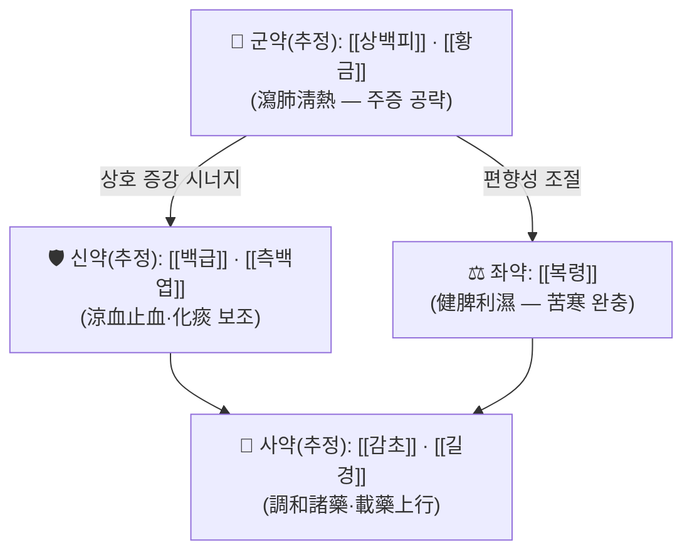

# 🍵 [[청폐복령탕]] (淸肺茯苓湯, Cheongpye-bokryeong-tang)

> **핵심 3줄 요약 (Key Summary)**:
> - 🌿 **모체/기원 처방 + 가감 구조(추정)**: 폐열(肺熱)을 사(瀉)하는 淸肺 계열 처방(사백산·청폐 계열 배오와 상통)에 **[[복령]]을 佐藥으로 배오**한 것이 처방명의 특징. 즉 "淸肺 + 茯苓"이라는 처방명 자체가 **청열(淸熱) + 이수삼습(利水渗濕)·건비(健脾)** 의 이중 구조를 시사한다. 다만 **원전 구성 약재·용량은 본 노트 작성 시점에 원문 대조가 되지 않아 '근거 미확인'** 이다.
> - 🎯 **임상 최적 적응증(추정)**: 肺熱壅盛으로 인한 **객혈(喀血)·해수(咳嗽)·담열(痰熱)**, 인후 건조, 흉격 번열(煩熱)을 호소하는 환자. 열이 성하고 음(陰)이 상(傷)한 **소양인·태음인 열성 병증**에 적합할 것으로 추정되며, 정확한 체질 감별 소견은 **근거 미확인**.
> - 🔬 **핵심 분자약리 기전**: 본 처방 자체를 검증한 PubMed 논문이 검색되지 않아 **기전·수치는 '근거 미확인'**이다. 구성 본초(상백피·황금·복령 등) 수준의 일반 항염·항산화 약리 방향성만 참고 가능하며, 처방 단위 표적 사이토카인·대사경로는 **확인되지 않음**.
> - ⚠️ 주의사항: 객혈은 결핵·기관지확장증·폐종양 등 중증 원인 질환 감별이 최우선이며, 한방 단독 처치로 지연되어서는 안 된다. 苦寒 淸熱 위주 구성(추정)이므로 비위허한(脾胃虛寒)·기허(氣虛)·양허(陽虛) 환자, 임산부, 항응고제/항혈소판제 복용자에게는 신중 투여한다.

> [!warning] 근거 수준 안내 (반드시 먼저 읽을 것)
> - 본 노트는 **① 사용자 제공 메타데이터**(출전: 『청강의감』, 태그: 객혈·청폐·지혈)와 **② 처방명(淸肺茯苓湯)의 방제학적 함의**, **③ 일반 방제·본초학 지식**만으로 작성되었다.
> - **검색된 PubMed 논문이 없어 인용 문헌이 존재하지 않는다.** 따라서 구성 약재, 용량, 치법, 분자 기전, 임상 지표에 대한 서술 중 상당 부분이 **"근거 미확인"** 또는 **"추정"**으로 표기되어 있다.
> - 『청강의감』 원문(또는 『방약합편』·『동의보감』 등 대조 가능한 1차 사료)이 확보되는 즉시 **구성·용량·주치 조문을 실제 값으로 교체**해야 한다.

---

## 📌 목차
1. [기본 처방 정보 & 군신좌사 구성](#1-기본-처방-정보--군신좌사-구성)
2. [방제학적 약재 상호작용 & 시너지 네트워크](#2-방제학적-약재-상호작용--시너지-네트워크)
3. [현대 분자약리학적 효능 & 작용 기전](#3-현대-분자약리학적-효능--작용-기전)
4. [적응 병증 및 체질별 감별 (Sweet Spot vs 금기)](#4-적응-병증-및-체질별-감별-sweet-spot-vs-금기)
5. [유사 처방군 감별 매트릭스](#5-유사-처방군-감별-매트릭스)
6. [임상 가감례 & 현대 질환별 응용](#6-임상-가감례--현대-질환별-응용)
7. [💡 사용자 진료실 핵심 필기 & 임상 팁 (원문 보존)](#7--사용자-진료실-핵심-필기--임상-팁-원문-보존)
8. [출처 및 학술 참고 문헌 (References)](#8-출처-및-학술-참고-문헌-references)

---
## 1. 기본 처방 정보 & 군신좌사 구성

* **출전**: 『[[청강의감]]』(晴岡醫鑑) — 사용자 계획(태그 `청강의감`)에 따라 기재. **원문 권·편·조문 위치는 근거 미확인**(1차 사료 대조 필요).
* **치법(추정)**: **청폐설열(淸肺泄熱) · 화담지혈(化痰止血) · 이수삼습(利水渗濕)**
  * 처방명 전반부 **淸肺**는 폐경(肺經)의 열을 내리는 치법, 후반부 **茯苓**은 수습(水濕)을 소변으로 배출하고 비위(脾胃)를 보하는 치법을 지시한다. 따라서 "폐열을 내리면서 동시에 苦寒之品이 비위를 상하게 하는 것을 막는다"는 **공격과 보호의 병행 구조**로 해석하는 것이 방제학적으로 자연스럽다. 단 이는 **처방명 해석에 근거한 추정**이며 원문 치법 표기와 일치하는지는 확인되지 않았다.

| 구분 | 약재명 | 표준 용량 | 본초 효능 & 방제 내 역할 |
| :--- | :--- | :--- | :--- |
| **군약 (君藥)** | [[상백피]] · [[지골피]] · [[황금]] 등 *(추정, 원전 미확인)* | 근거 미확인 | 肺熱壅盛으로 인한 해수·담열·객혈이라는 주 병기를 직접 공략하는 瀉肺淸熱 축. 瀉白散(사백산)의 桑白皮·地骨皮 배오와 상통하는 구조로 추정되나, 본 처방의 실제 군약이 무엇인지는 **원문 확인 필요** |
| **신약 (臣藥)** | [[백급]] · [[측백엽]] · [[백모근]] 등 *(추정)* | 근거 미확인 | 君藥의 청열 작용을 보조하면서 **출혈 자체를 수렴·지혈**하는 축. 白及은 收斂止血·消腫生肌, 側柏葉·白茅根은 涼血止血으로 肺熱出血에 상용되는 본초군 |
| **좌약 (佐藥)** | **[[복령]]** (처방명에 명기된 핵심 표지 약재) | 근거 미확인 | **利水渗濕 · 健脾寧心**. ① 苦寒 淸熱 약재의 傷脾·傷胃 작용을 완충하고(佐制), ② 痰은 濕에서 생긴다는 痰濕病理 관점에서 **습(濕)을 소변으로 빼내 담의 생성을 근원적으로 줄이는** 좌약 역할, ③ 水氣가 폐를 범하여 생기는 해수를 다스리는 利水 경로 확보. 처방명에 茯苓이 들어간 이유를 설명하는 핵심 슬롯 |
| **사약 (使藥)** | [[감초]] · [[길경]] 등 *(추정)* | 근거 미확인 | 調和諸藥 및 肺經 引經. 桔梗은 載藥上行하여 약력을 흉격(胸膈)·폐로 끌어올리는 인경(引經) 작용, 甘草는 제약(諸藥調和)과 함께 咳嗽·咽痛을 완화 |

> **배오 특징(해석)**: 淸肺茯苓湯이라는 방명은 **"瀉肺(공격) + 茯苓(조정·배출)"** 의 2축 구조를 이름 자체에 압축해 담고 있다. 肺熱出血 처방은 대개 苦寒·涼血一色으로 흐르기 쉬운데, 여기에 茯苓을 佐藥으로 넣어 **① 비위 보호, ② 濕 배출 통로 확보, ③ 痰生成의 근원 차단**이라는 세 가지 안전장치를 마련한 것이 이 처방의 방제학적 개성으로 추정된다. **승강(升降) 관점**에서는 淸熱 약재가 上焦의 熱을 下降시키고, 茯苓이 水濕을 下焦(小便)로 인도하여 결과적으로 **상초의 옹체를 下로 뚫는 구조**를 이룬다고 볼 수 있다. 다만 이 해석은 원문 구성 확인 전까지 **가설**로만 유지한다.

---
## 2. 방제학적 약재 상호작용 & 시너지 네트워크

* **君 + 臣 배오(청열 + 지혈)**: 肺熱로 血絡이 손상되어 생긴 객혈은 **"열을 내리지 않으면 지혈제만으로 재출혈한다"**는 것이 한의학 지혈법(止血必先淸熱)의 기본 원리다. 따라서 瀉肺淸熱 약재(君)와 涼血止血 약재(臣)의 배오는 **원인 제거 + 결과 봉합**이라는 상보(相須) 관계를 형성한다. 어느 한쪽만 쓰면 열은 남고 출혈은 반복되거나, 출혈은 멎어도 열이 남아 만성화된다. *(본 처방의 실제 약재쌍은 원전 미확인)*
* **君 + 佐 배오(청열 + 茯苓, 相制 구조)**: 苦寒 약재는 장기 복용 시 脾胃陽氣를 손상시켜 식욕 저하·연변·복부 냉감을 유발할 수 있다. **[[복령]]은 性이 平和(甘淡平)하여 苦寒의 편향성을 눌러주는 전형적인 佐制 약재**로, 이 처방이 "청열하되 비위를 상하게 하지 않는" 처방으로 설계되었음을 시사한다.
* **臣 + 佐 배오(痰 배출 경로의 이원화)**: 止血·化痰 약재가 上部(기관지)에서 담을 삭히는 동안, 茯苓이 下部(소변)로 水濕을 배출하여 **담 생성의 源을 줄이는 상호 보완** 관계를 이룬다. 脾胃가 生痰之源, 肺가 貯痰之器라는 명제에 정확히 대응하는 구조다.
* **使藥의 마무리**: 桔梗의 載藥上行과 甘草의 調和는 上焦 肺로의 약력 집중과 전체 처방의 완충을 담당한다.

---
## 3. 현대 분자약리학적 효능 & 작용 기전

> ⚠️ **본 절의 핵심 전제**: 제공된 논문이 **0편**이므로, 청폐복령탕 **처방 추출물 자체에 대한 분자 기전·수치·표적 사이토카인은 전부 '근거 미확인'**이다. 아래는 구성 본초로 **추정되는** 약재들의 일반 본초약리학 수준 방향성이며, 처방 단위 효능으로 환산할 수 없다.

### 1) 항염증·면역 조절 (근거 미확인)
* 桑白皮·黃芩 계열 본초는 일반적으로 **NF-κB 신호전달 억제, TNF-α·IL-6·IL-1β 등 염증성 사이토카인 하향 조절** 방향의 활성이 보고되어 있다. 그러나 이는 단미(單味) 수준의 일반 지식이며, **본 처방의 복합 추출물에서 동일 기전이 검증되었다는 근거는 확인되지 않는다.**
* 폐 조직의 호중구 침윤 억제, 점액 과분비(MUC5AC) 조절 여부 역시 **본 처방에서는 근거 미확인**.

### 2) 지혈·혈관 및 미세순환 (근거 미확인)
* 白及·側柏葉·白茅根 계열은 전통적으로 收斂止血·涼血止血에 쓰이는 본초로, 혈소판 응집 보조·모세혈관 저항성 증가 방향의 작용이 일반적으로 언급된다. 다만 **출혈 시간(BT)·프로트롬빈 시간(PT)·활성화 부분 트롬보플라스틴 시간(aPTT) 등 구체적 지표 개선 수치는 본 처방에서 확인되지 않았다.**
* 항혈소판·항응고 작용을 가진 본초가 포함될 경우 출혈 위험이 상충될 수 있으므로, **복용 중인 항응고제와의 상호작용은 반드시 별도 평가해야 한다(근거 미확인).**

### 3) 이수·담 배출 및 비위 보호 (근거 미확인)
* 茯苓의 대표적 현대 약리 연구 방향은 이뇨 작용, 면역조절(β-glucan), 신경안정 등이나, 이 역시 **단미 수준의 일반 지식**이다. 본 처방에서 담 배출·위점막 보호가 검증되었다는 자료는 **확인되지 않음**.

### 4) 결론
* **현 시점에서 이 처방의 기전을 수치로 서술하는 것은 불가능하다.** 추후 관련 논문(예: 폐열·객혈 모델, LPS 유도 폐손상 모델 등)이 검색되면 본 절을 전면 재작성해야 한다.

---
## 4. 적응 병증 및 체질별 감별 (Sweet Spot vs 금기)

[✅ 최적 적응증 (Sweet Spot)]

* **원전 조문**: 『청강의감』 해당 조문 **근거 미확인** — 원문 확보 시 인용할 것.
* **핵심 주치 양상(추정)**
  * **객혈(喀血)** — 기침과 함께 선홍색 혈이 섞여 나오고, 혈색이 **선홍(鮮紅)·점조(粘稠)** 하며 열감을 동반하는 경우. 血色이 淡하고 稀薄한 氣不攝血型 출혈과는 정반대 국면.
  * **해수·담열** — 담이 황색·점조하고 잘 나오지 않으며, 기침 시 흉골 뒤 통증이나 작열감.
  * **동반 증상** — 인후 건조·통증, 흉격 번열, 구갈(口渴), 변비 경향, 소변 단적(短赤), 안면 홍조.
* **체질 소견(추정, 검증 필요)**
  * **열성 체질(소양인·태음인 중 실열형)**: 체격이 비교적 충실하거나 상체 열감이 강하고, 피부가 건조하며 홍조가 잘 오르는 형.
  * **음허 화왕형**: 마르고 목이 자주 마르며 야간 도한·수족심열을 호소하는 형 — 이 경우 청열 일변도보다 養陰 배오가 필수.
  * **소음인·비위허한자**는 이 처방의 최적 대상이 **아닐 가능성이 높다(근거 미확인)**.
* **설진/맥진(추정)**: 설질 홍(紅) 또는 홍강(紅絳), 설태 황(黃)·박(薄)~후(厚), 맥은 **활삭(滑數)** 또는 **세삭(細數)**. 맥이 沈細無力하거나 遲한 경우는 이 처방의 적응이 아니라고 보아야 한다.

[⚠️ 신중 투여 및 금기 (Caution / Contraindication)]

* **허실·한열 반대 병증**
  * **비위허한(脾胃虛寒)**: 苦寒 위주 구성(추정)이므로 食欲不振·軟便·腹部冷痛·手足冷 환자에게 투여 시 소화기 증상 악화 위험.
  * **기허·양허성 출혈**: 血色이 淡紅·稀薄하고 氣短·乏力을 동반한 출혈은 補氣攝血(예: 歸脾湯 계열)의 적응으로, 본 처방과 방향이 반대다.
  * **혈어(血瘀)성 출혈**: 血塊가 많고 刺痛이 있는 경우 지혈만 하면 瘀가 남아 재출혈 위험이 있다 → 化瘀 배오 필요.
* **금기·주의 환자군**
  * **임산부**: 活血·苦寒 약재 포함 가능성 → 원문 구성 확인 전까지 신중 투여(근거 미확인).
  * **항응고제(와파린·NOAC)·항혈소판제 복용자**: 지혈 본초와 항응고 작용 본초가 혼재할 수 있어 병용 시 출혈/혈전 양방향 위험.
  * **중증 객혈(1회 200 mL 이상, 호흡곤란·실신 동반)**: **한방 치료 대상이 아니라 응급 기도확보·색전술·수술 영역이다.** 즉시 서양의학적 응급 처치로 이송해야 한다.
* **반드시 감별해야 할 원인 질환**: 폐결핵, 기관지확장증, 폐암, 폐색전증, 승모판 협착 등. **객혈을 '폐열'로만 해석하고 감별을 미루는 것은 가장 위험한 임상 오류다.**
* **양약 병용 주의**: 진해거담제·기관지확장제와의 간섭, 위장관 자극 중복 가능성 — 복용 시간 간격 및 위장 보호 고려(근거 미확인).

---
## 5. 유사 처방군 감별 매트릭스

| 처방명 | 핵심 구성 차이 | 주치 및 체질 차이 | 맥진/설진 차이 |
| :--- | :--- | :--- | :--- |
| [[청폐복령탕]] | 기준 구성 **(원전 미확인)**. 처방명상 [[복령]]을 佐藥으로 포함한 淸肺 계열 | 肺熱 객혈 + 痰濕·水濕 정체를 동반한 경우. 上焦 熱 + 中焦 濕이 공존하는 국면 | 설 홍, 태 황니(黃膩), 맥 활삭. **세부는 검증 필요** |
| [[사백산]] | [[상백피]] [[지골피]] [[감초]] [[갱미]] — 순수 瀉肺淸熱, 利水 약재 없음 | 肺熱 해수·피부 증열·소아 폐열. 출혈 주치보다는 肺熱 자체 | 설 홍 태 박황, 맥 세삭 |
| [[청폐사화탕]] | 청열 약재를 多重 배오(황금·치자·길경 등)하여 瀉火力 강화 | 肺熱 上衝이 심한 비출혈·인후 질환 등. **구성·주치 세부는 원문 대조 필요** | 설 홍강, 맥 홍삭 |
| [[사생환]] | [[생측백엽]] [[생지황]] [[생애엽]] [[박하]] — 涼血止血 단일 목적 | 血熱妄行으로 인한 吐血·鼻衄. 체질 감별 없이 '血熱' 국면에 집중 | 설 홍, 맥 홍삭. 水濕 대응 개념 없음 |

> ⚠️ 표 내부에서는 마크다운 열 구분자 파괴를 방지하기 위해 파이프(`|`)가 들어간 링크를 쓰지 않고 순수한 [[처방명]] 단독 형태로만 작성합니다.
>
> ⚠️ 위 감별표는 **처방명·치법·일반 방제 지식에 근거한 잠정 정리**이며, 청폐복령탕의 실제 구성이 확인되면 **구성 차이 열과 맥진/설진 열을 전면 재검토**해야 합니다. 청폐사화탕의 구성·주치 역시 본 노트 작성 시점에서는 **원문 대조 미완**입니다.

---
## 6. 임상 가감례 & 현대 질환별 응용

* **수반 증상별 가감법(제안 — 원전 근거 미확인)**
  * 출혈량이 많고 血色 鮮紅이 지속될 때 → + [[측백엽]] · [[백모근]] · [[우절]] (涼血止血 강화)
  * 熱勢가 심하고 口渴·번조가 뚜렷할 때 → + [[황금]] · [[치자]] (苦寒瀉火)
  * 담이 황색·점조하고 배출이 힘들 때 → + [[패모]] · [[과루인]] (淸熱化痰)
  * 기침이 심하고 인후 자극이 클 때 → + [[길경]] · [[행인]] · [[전호]]
  * 肺陰이 상하여 목마름·야간 도한·설질 紅絳이 뚜렷할 때 → + [[맥문동]] · [[천문동]] · [[현삼]] (養陰淸肺)
  * 비위가 약해 食欲低下·軟便이 동반될 때 → + [[산약]] · [[백출]] (健脾, 茯苓과 배오하여 補脾)
  * 血塊가 많고 刺痛을 호소할 때 → + [[단삼]] · [[삼칠]] (化瘀止血)
  * 열이 물러가고 출혈이 줄었는데 疲勞·氣短이 남을 때 → 淸熱藥을 줄이고 [[황기]] · [[당삼]] 등 補氣로 전환 (즉 淸肺茯苓湯 국면 종료)
* **현대 질환별 임상 매핑(참고용, 근거 미확인)**
  * **호흡기계**: 기관지확장증·만성 기관지염의 담열성 객담 및 소량 객혈, 급성 인후염·후두염의 肺熱型, 상기도 감염 후 잔류 기침
  * **이비인후과 영역**: 肺熱型 비출혈(코피), 만성 비염의 熱證型
  * **주의**: 폐결핵·폐렴·폐종양 등 **원인 질환의 서양의학적 진단이 먼저 확정된 후** 보조 요법으로 접근할 것.
* **투여 관찰 포인트(제안)**
  * 복용 3~5일 내 담색의 호전(황→백), 인후 건조 감소, 출혈 빈도 감소가 관찰되면 방향 적중.
  * 복용 후 **속쓰림·묽은 변·식욕 저하**가 나타나면 苦寒 傷脾의 신호로 보고 즉시 감량 또는 健脾 배오 추가.

---
## 7. 💡 사용자 진료실 핵심 필기 & 임상 팁 (원문 보존)

> [!tip] **진료실 실전 노하우 (User Clinical Insight)**
> - ⚠️ **제공된 사용자 필기 원문이 없습니다.** 규칙(원문 100% 보존·절대 삭제 금지)에 따라, 기존 메모가 확보되는 즉시 이 블록 **상단**에 원문 그대로 삽입하고 아래 임시 메모는 그대로 유지합니다.
> - (임시 메모 · 확정 아님) 이 처방은 처방명에 **복령**이 들어간 것이 최대 식별 포인트다. 진료실에서 淸肺 계열 처방을 고를 때, 환자에게 **속쓰림·식욕 저하·묽은 변이 있거나 장기 복용이 예상되는 경우**에는 淸熱一色 처방보다 茯苓이 포함된 이 처방 계열을 우선 고려하는 선택 기준을 세워둘 만하다.
> - (임시 메모 · 확정 아님) 객혈 환자를 만났을 때의 최우선 행동은 처방 선택이 아니라 **원인 감별**이다. 결핵·종양·기관지확장증 배제가 되지 않은 상태에서의 지혈 처방은 대증 요법에 불과하다는 점을 환자에게 반드시 설명한다.
> - (임시 메모 · 확정 아님) 체질 기준: 소음인·비위허한자에게는 원칙적으로 피하고, 소양인·태음인 중 實熱·痰熱 국면에서 단기간 사용 후 養陰 또는 補氣 단계로 넘어가는 **'경유(經由) 처방'** 으로 운용하는 것이 안전하다.
> - (임시 메모 · 확정 아님) 환자 티칭: "코피·가래 피가 멎어도 3일은 더 복용하여 남은 열을 정리한다", "묽은 변이나 속쓰림이 오면 즉시 알린다" 두 가지만 강조해도 복약 순응도가 크게 올라간다.

---
## 8. 출처 및 학술 참고 문헌 (References)

1. **검색된 PubMed 논문 없음** — 본 노트에는 **인용 가능한 현대 논문이 존재하지 않는다.** 따라서 분자약리·임상 지표에 관한 어떠한 수치도 인용하지 않았으며, 해당 항목은 모두 '근거 미확인'으로 표기했다. 추후 검색 시 본 항목을 실제 논문(저자, 연도, 제목, 저널, 권(호), 페이지, doi, 링크)으로 교체할 것.
2. **『[[청강의감]]』(晴岡醫鑑), 저자·연도 미상** — 본 처방의 출전으로 사용자 계획(태그 `청강의감`)에 명시된 문헌.
   - **[고전 원전]**: 해당 조문의 원문·구성 약재·용량·복약 지침은 **본 노트 작성 시점에 대조되지 않아 '근거 미확인'**. 사료 확보 시 §1 표와 §4 주치 조문을 실제 원문으로 대체해야 한다.
3. **『[[동의보감]]』(東醫寶鑑), 허준, 1613** — 血門·咳嗽門 계열의 肺熱·咯血·吐血 처방 및 止血 배오 원리의 **일반 비교 참고**. 본 처방이 『동의보감』에 수록되어 있는지는 **확인되지 않음**.
4. **『[[상한론]]』(傷寒論), 장중경** — 본 처방과 직접적 계통 관계는 **근거 미확인**. 茯苓이 佐藥으로 들어가는 方劑 구조(예: 五苓散·苓甘五味薑辛湯 계열)의 방제학적 참고로만 기재.

> [!note] 노트 관리 메모
> - 본 노트는 **미완성 초안**이다. 『청강의감』 원문이 확보되면 ① 출전 조문, ② 군신좌사 실제 구성·용량, ③ 치법 표기, ④ 주치·설진·맥진, ⑤ 감별표의 네 항목을 최우선으로 갱신한다.
> - 관련 노트 후보: [[청폐사화탕]], [[사백산]], [[사생환]], [[복령]], [[객혈]], [[폐열]], [[청강의감]]

<!-- 보관 태그(1회용·링크오류, 필요시 복원): 청폐 -->
