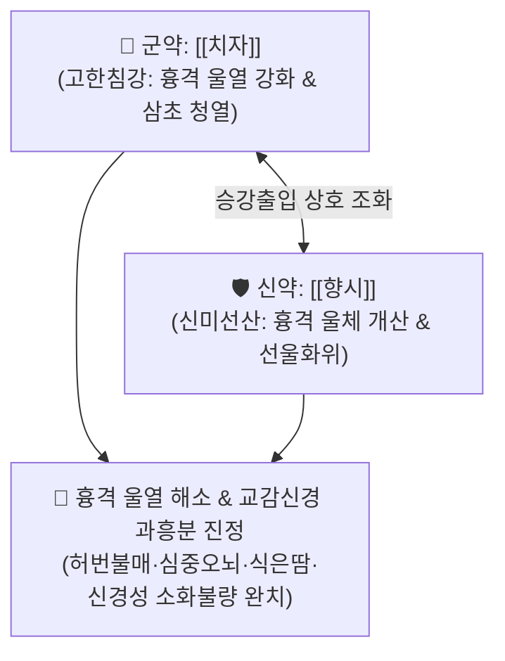

# 🍵 [[치자시탕]] (梔子豉湯, Zhizi Chidou Decoction / Shishi-to)

> **핵심 3줄 요약 (Key Summary)**:
> - 🌿 기본 구성: [[치자]](산치자), [[향시]](담두시) (2미 배오, 청열제번 및 선울화위의 상한론 고방).
> - 🎯 상한 발한·토·하 후 잔여 열사로 인한 허번불매(虛煩不得眠), 가슴이 메이고 쥐어뜯는 듯한 번조(심중오뇌), 교감신경 항진증성 자율신경실조증(식은땀, 소화불량, 심계), 위식도 역류 및 불안증.
> - 🔬 중추 GABA 수용체 조절 및 세로토닌 시스템 안정화, 위점막 염증 차단(NF-κB 억제), 심박변이도(HRV) 개선 및 과도한 교감신경 흥분성 억제.
> - ⚠️ 주의사항: 속이 차고 대변이 묽은 순수 비위허한(脾胃虛寒) 환자 및 흉격 부위의 울열이 없는 환자에게는 투약 금기.

---

## 📌 목차
1. [기본 처방 정보 & 군신좌사 구성](#1-기본-처방-정보--군신좌사-구성)
2. [방제학적 약재 상호작용 & 시너지 네트워크](#2-방제학적-약재-상호작용--시너지-네트워크)
3. [현대 분자약리학적 효능 & 작용 기전](#3-현대-분자약리학적-효능--작용-기전)
4. [적응 병증 및 체질별 감별 (Sweet Spot vs 금기)](#4-적응-병증-및-체질별-감별-sweet-spot-vs-금기)
5. [유사 처방군 감별 매트릭스](#5-유사-처방군-감별-매트릭스)
6. [임상 가감례 & 현대 질환별 응용](#6-임상-가감례--현대-질환별-응용)
7. [💡 사용자 진료실 핵심 필기 & 임상 팁 (원문 보존)](#7--사용자-진료실-핵심-필기--임상-팁-원문-보존)
8. [출처 및 학술 참고 문헌 (References)](#8-출처-및-학술-참고-문헌-references)

---

## 1. 기본 처방 정보 & 군신좌사 구성

* **출전**: 장중경(張仲景) 『[[상한론]]』(傷寒論) 태양병편(太陽病篇)
* **치법**: 청열제번(淸熱除煩), 선울화위(宣鬱和胃), 개울투표(開鬱透表)

| 구분 | 약재명 | 표준 용량 | 본초 효능 & 방제 내 역할 |
| :--- | :--- | :--- | :--- |
| **군약 (君藥)** | [[치자]] | 9~12g (산치자 기준) | **청열사화·제번량혈**: 심·흉격의 울열(鬱熱)을 가라앉히고 삼초 화열을 소변으로 배출하여 가슴 답답함 해소 |
| **신약 (臣藥)** | [[향시]] | 9~12g | **선투표사·선울화위**: 흉격에 뭉친 열사를 체표로 발산 투석시키고 위기를 화해(和解) |

> **방제 구조 분석**:
> * **청선겸시(淸宣兼施)와 일승일강(一升一降)**: [[치자]]의 쓰고 찬 성질은 아래로 열을 끌어내려 끄고(강화), [[향시]]의 맵고 가벼운 성질은 위와 밖으로 울체된 기운을 흩뜨려(승산), 흉격에 갇힌 무형의 사열(無形之邪熱)을 완벽히 해소합니다.

---

## 2. 방제학적 약재 상호작용 & 시너지 네트워크

* **산치(야생) vs 가치(재배)의 방제학적 용량 운용**:
  * 야생 [[치자]](산치자)는 약성이 강하고 쓴맛이 깊어 9g으로도 충분하나, 재배된 가치(家梔)를 사용할 때는 유효 성분 함량을 감안하여 12~15g으로 증량하여 처방 효율을 극대화합니다.
* **이담(利膽) 및 스트레스 이완**: 족소양담경의 울체를 풀어 [[온담탕]]과 유사하게 스트레스로 인한 담화(膽火) 상충을 부드럽게 이완시킵니다.

---

## 3. 현대 분자약리학적 효능 & 작용 기전

### 1) 자율신경계 균형 회복 및 교감신경 과항진 억제
* [[치자]]의 제니포사이드(Geniposide)와 제니핀(Genipin)이 중추 신경계의 $GABA_A$ 수용체와 결합하여 심계항진과 과도한 발한(식은땀), 안절부절못하는 신경성 흥분을 차단합니다.

### 2) 위점막 보호 및 위산 역류 억제
* [[향시]](발효 콩 추출물)의 이소플라본과 펩타이드가 위장 평활근의 비정상적 경련을 이완시키고, 위점막 염증성 사이토카인([[TNF-α]], [[IL-6]]) 발현을 억제하여 신경성 위염 및 가슴 쓰림을 완화합니다.

### 3) 중추성 수면 구조 개선
* 시상하부-뇌하수체-부신(HPA) 축의 과흥분을 억제하고 코르티솔 분비를 정상화하여 수면 도입 시간을 단축하고 서파 수면(Deep sleep)을 연장합니다.

---

## 4. 적응 병증 및 체질별 감별 (Sweet Spot vs 금기)

### 1) 주요 적응증 (Target Indications)
* **허번불매(虛煩不得眠) & 심중오뇌(心中懊憹)**:
  * 감기나 열병을 앓고 난 뒤 흉격에 열이 남아 가슴이 찢어질 듯 답답하고 잠을 잘 수 없는 상태.
  * 가슴 부위가 메이고 괴로워 밤새 엎치락뒤치락하며 안절부절못함.
* **교감신경 항진성 자율신경실조증**:
  * 스트레스를 받으면 땀이 비 오듯 쏟아지며 가슴이 두근거리고, 명치가 그득하며 소화가 전혀 안 되는 병증.
  * 역류성 식도염으로 인한 가슴 작열감 및 헛구역질.

### 2) 체질별 적합도 & 금기
* **적합 체질 (Sweet Spot)**:
  * 평소 예민하고 화가 많으며, 스트레스를 받으면 상체로 열이 뻗치고 가슴 답답함과 불면을 겪는 소양인·태음인.
* **절대 금기 및 주의 (Contraindications)**:
  * **비위허한자 복통·설사**: 속이 냉하고 대변이 묽으며 소화력이 쇠약한 환자는 치자의 고한성으로 인해 설사할 수 있으므로 금기.

---

## 5. 유사 처방군 감별 매트릭스

| 처방명 | 기본 구성 | 주치 병태 차이 | 가슴 증상 및 감별 포인트 |
| :--- | :--- | :--- | :--- |
| [[치자시탕]] | 치자, 향시 | **흉격 무형의 울열 (기분)** | 가슴이 메이고 쥐어뜯기듯 답답(심중오뇌), 불면, 땀 |
| [[온담탕]] | 반하, 진피, 복령, 지실, 죽여, 감초 | **담열 심담허겁 (유형의 담음)** | 잘 놀람, 가슴 두근거림, 메스꺼움, 끈적한 가래 |
| [[반하사심탕]] | 반하, 황금, 황련, 인삼, 건강, 감초, 대조 | **한열착잡 비위 비증** | 명치 밑이 그득하고 결림(심하비), 구역질, 장명 설사 |
| [[산조인탕]] | 산조인, 지모, 복령, 천궁, 감초 | **간혈부족 음허내열** | 가슴 두근거림, 식은땀(도한), 피로감 동반 불면 |

---

## 6. 임상 가감례 & 현대 질환별 응용

### 1) 변증 가감법
* **구역질 및 트림 심할 시**: + [[생강]] ([[치자생강시탕]]) - 화위지구.
* **가슴 답답함과 함께 호흡 곤란·흉부 압박감 시**: + [[지실]] ([[치자지실시탕]]) - 파기소적.
* **열병 후 변비 및 복부 팽만 동반 시**: + [[후박]], [[지실]] ([[치자후박탕]]) - 행기통변.

### 2) 현대 질환별 매핑
* **자율신경/정신과**: 자율신경실조증, 공황장애 초기, 화병, 불안신경증, 수면장애(입면장애).
* **소화기계**: 역류성 식도염, 비궤양성 기능성 소화불량, 스트레스성 위경련.
* **내분비/부인과**: 갱년기 안면홍조 및 야간 발한, 도한증.

---

## 7. 💡 사용자 진료실 핵심 필기 & 임상 팁 (원문 보존)

> [!tip] **진료실 실전 노하우 (User Clinical Insight)**
> - **족소양담경 이담 & 교감신경 항진증의 특효 처방**: 족소양담경을 소통시키고 이담하는 처방으로 [[온담탕]]과 유사하게 스트레스와 울화를 풀어줌.
> - **교감신경 항진 자율신경실조증 적중 기준**: 땀이 비 오듯 나면서 명치가 막히고 소화가 전혀 안 되는 환자에게 투약하면 교감신경 과흥분이 신속히 가라앉고 땀과 소화불량이 동시에 정상화됨.
> - **산치(야생) vs 가치(재배) 조제 요령**: 야생 [[치자]](산치자)는 약성이 강렬하나, 시중 재배 [[치자]](가치)를 사용할 때는 용량을 1.5배(12~15g)로 증량하여 전탕해야 원방 고유의 선열제번 효과를 얻을 수 있음.

---

## 8. 출처 및 학술 참고 문헌 (References)

1. **Zhang ZJ (張仲景) (200)**. *Shanghan Lun* (傷寒論), Taiyang Bing Pian.
   * `[연구 요약]`: 치자시탕 원전 수록, 발한·토·하 후 허번불매 및 심중오뇌 치료 표준 방제 제정.
