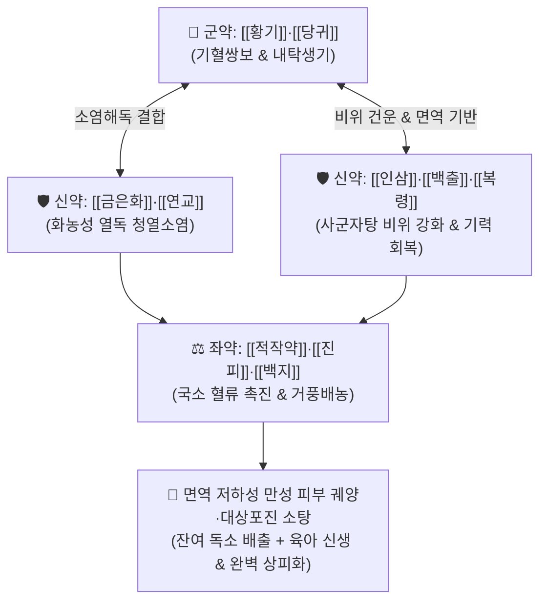

# 🍵 [[탁리소독음]] (托裏消毒飲, Tuoli Xiaodu Yin / Takuri-shodoku-in)

> **핵심 3줄 요약 (Key Summary)**:
> - 🌿 기본 구성: [[황기]], [[당귀]], [[금은화]], [[백출]], [[복령]], [[적작약]], [[연교]], [[백지]], [[진피]], [[인삼]], [[감초]] ([[사군자탕]] 보기 + 당귀·황기 생기 + 금은화·연교 해독소염 + 백지·진피 거풍행기).
> - 🎯 기혈허약(氣血虛弱)으로 인한 만성 난치성 피부 궤양, 창양 궤후(潰後) 농액 부진 및 상처 미치유, 다이어트 식단 및 고강도 운동(PT) 후 면역력 저하로 발생한 [[대상포진]], 만성 [[건선]], 만성 모낭염.
> - 🔬 섬유아세포 이동 촉진, VEGF 및 콜라겐 합성 증가(피부 장벽 재건), 대식세포 탐식능 증강, 광범위 항균 및 염증성 사이토카인(IL-1β, TNF-α) 억제.
> - ⚠️ 주의사항: 화농 초기 붉게 부어오르고 열감이 극심하며 아직 터지지 않은 실열 급성기(미성농기)에는 [[선방활명음]]을 쓰며, 상열감이 심한 환자는 인삼을 배제하여 투약.

---

## 📌 목차
1. [기본 처방 정보 & 군신좌사 구성](#1-기본-처방-정보--군신좌사-구성)
2. [방제학적 약재 상호작용 & 시너지 네트워크](#2-방제학적-약재-상호작용--시너지-네트워크)
3. [현대 분자약리학적 효능 & 작용 기전](#3-현대-분자약리학적-효능--작용-기전)
4. [적응 병증 및 체질별 감별 (Sweet Spot vs 금기)](#4-적응-병증-및-체질별-감별-sweet-spot-vs-금기)
5. [유사 처방군 감별 매트릭스](#5-유사-처방군-감별-매트릭스)
6. [임상 가감례 & 현대 질환별 응용](#6-임상-가감례--현대-질환별-응용)
7. [💡 사용자 진료실 핵심 필기 & 임상 팁 (원문 보존)](#7--사용자-진료실-핵심-필기--임상-팁-원문-보존)
8. [출처 및 학술 참고 문헌 (References)](#8-출처-및-학술-참고-문헌-references)

---

## 1. 기본 처방 정보 & 군신좌사 구성

* **출전**: 진실공(陳實功) 『[[외과정종]]』(外科正宗) 옹저문(癰疽門)
* **치법**: 탁리투농(托裏透膿), 보기양혈(補氣養血), 청열해독(淸熱解毒), 생기렴창(生肌斂瘡)

| 구분 | 약재명 | 표준 용량 | 본초 효능 & 방제 내 역할 |
| :--- | :--- | :--- | :--- |
| **군약 (君藥)** | [[황기]], [[당귀]] | 각 6~10g | **보기내탁·보혈생기**: 비폐의 양기를 돋워 고름을 밖으로 밀어내고 음혈을 보하여 새로운 살(육아조직)을 생성 |
| **신약 (臣藥)** | [[금은화]], [[연교]] | 각 6~8g | **청열소종·소염해독**: 환부의 화농성 세균 및 바이러스성 열독을 가라앉히고 림프절 부종 소퇴 |
| **신약 (臣藥)** | [[인삼]], [[백출]], [[복령]] | 각 4~6g | **건비익기·삼습**: [[사군자탕]] 구조로 소화 흡수를 돕고 면역 항체 형성을 촉진 (상열 시 인삼 거함) |
| **좌약 (佐藥)** | [[적작약]], [[진피]], [[백지]] | 각 4~6g | **활혈행기·거풍배농**: 국소 미세혈류를 순환시키고 기기를 소통시키며 고름 배출 통로를 개방 |
| **사약 (使藥)** | [[감초]] | 2~3g | **조화제약·해독**: 제약을 조화시키고 비위를 보호 |

> **방제 구조 분석**:
> * **보탁(補托)과 청열(淸熱)의 절묘한 배합**: 밥을 잘 안 먹고 기운이 없어 피부 재생이 멈춘 환자에게 [[사군자탕]]으로 비위를 돕고, [[당귀]]·[[황기]]로 기혈을 보태 살을 채우며, [[금은화]]·[[연교]]로 잔여 염증을 끄고, [[적작약]]·[[진피]]·[[백지]]로 가볍게 순환을 돌려 상처를 아물게 합니다.

---

## 2. 방제학적 약재 상호작용 & 시너지 네트워크

* **체력 저하형 피부 재생 부전의 해결**: 체력이 떨어져 피부 상처가 아물지 않을 때 단순 항생제만 쓰면 비위가 상하고 회복이 지연되므로, 내탁(內托) 보기와 해독을 병행합니다.

---

## 3. 현대 분자약리학적 효능 & 작용 기전

### 1) 혈관 신생 및 육아조직 증식 (VEGF 촉진)
* [[황기]]의 아스트라갈로사이드 IV와 [[당귀]]의 페룰산(Ferulic acid)이 혈관내피성장인자(VEGF) 및 TGF-β 발현을 촉진하여 모세혈관 신생과 콜라겐 합성을 유도, 만성 궤양의 상피화를 촉진합니다.

### 2) 광범위 항균 및 바이러스성 신경 염증 억제
* [[금은화]]의 클로로겐산과 [[연교]]의 필리린 성분이 황색포도상구균 및 수두-대상포진 바이러스(VZV)로 인한 신경 염증 반응을 억제하고 수포 침윤을 가라앉힙니다.

### 3) 대식세포 탐식능 및 면역 항체 형성 촉진
* [[사군자탕]] 다당류가 Peyer's patch 면역계를 자극하여 sIgA 분비를 늘리고 대식세포의 병원체 포식 작용을 증강시킵니다.

---

## 4. 적응 병증 및 체질별 감별 (Sweet Spot vs 금기)

### 1) 주요 적응증 (Target Indications)
* **체력·면역력 저하성 난치성 피부 질환**:
  * 극심한 다이어트 식단, 과도한 피트니스(PT) 및 스트레스로 면역력이 바닥나서 발생한 [[대상포진]](Herpes Zoster)** 및 신경통 회복기.
  * 잘 낫지 않고 각질이 일어나는 만성 [[건선]](Psoriasis)** 및 피부 궤양.
  * 창양이 곪아 터졌으나 농액이 묽고 상처가 아물지 않는 만성 모낭염, 욕창, 당뇨병성 족부 궤양.
* **만성 림프절염 및 피하 종창 회복기**.

### 2) 체질별 적합도 & 금기
* **적합 체질 (Sweet Spot)**:
  * 마르고 기운이 없으며, 소화력이 약하고 피부에 상처가 나면 곪거나 몇 달씩 아물지 않는 기혈허약(氣血虛弱) 환자.
* **절대 금기 및 주의 (Contraindications)**:
  * **미성농기(未成膿期) 실열 환자**: 아직 고름이 형성되지 않고 환부가 빨갛게 불타오르며 열이 펄펄 끓는 급성 초기에는 [[선방활명음]]을 써야 함.
  * **상열감 환자의 인삼 가감**: 평소 열이 위로 잘 뜨는 환자는 방제 내 [[인삼]]을 빼거나 사삼(沙蔘)으로 대체함.

---

## 5. 유사 처방군 감별 매트릭스

| 처방명 | 병기 분절 | 주요 약재 구성 차이 | 주치 병증 및 환자 상태 |
| :--- | :--- | :--- | :--- |
| [[선방활명음]] | **초기 미성농기 (실열)** | 금은화, 당귀산, 유향, 몰약, 백지, 천산갑 | 환부가 붉고 붓고 뜨거우며 아직 안 곪음 |
| [[투농산]] | **중기 기성농기 (내농)** | 황기, 당귀, 천궁, 조각자, 백지 | 이미 곪았으나 피부가 질겨 터지지 못함 |
| [[탁리소독음]] | **후기 궤후기 (허증)** | 사군자탕 + 황기, 당귀, 금은화, 연교, 백지 | **터진 후 상처가 아물지 않고 기력이 쇠약함** |
| [[십미패독탕]] | **피부 습열 표증** | 시호, 독활, 방풍, 형개, 길경, 복령 | 초기 화농성 여드름, 두드러기, 가려움증 |

---

## 6. 임상 가감례 & 현대 질환별 응용

### 1) 변증 가감법
* **상열감 및 두면부 열감 존재 시**: $\rightarrow$ [[인삼]]을 배제(거함)하고 [[황금]]을 가미.
* **대상포진 극심한 신경통 동반 시**: + [[현호색]], [[울금]], [[전갈]] (활혈통락지통).
* **상처가 깊고 진물이 마르지 않을 시**: + [[모려]], [[백렴]], [[오배자]] (수렴생기).

### 2) 현대 질환별 매핑
* **피부/감염 질환**: 대상포진 및 대상포진 후 신경통(PHN), 만성 판상 건선, 난치성 다발성 모낭염, 화농성 한선염 후기.
* **외과/상처 치유**: 당뇨병성 족부 궤양, 만성 욕창, 수술 후 창상 치유 지연.
* **면역 결핍**: 과도한 다이어트 후 발생한 면역 저하성 피부 트러블.

---

## 7. 💡 사용자 진료실 핵심 필기 & 임상 팁 (원문 보존)

> [!tip] **진료실 실전 노하우 (User Clinical Insight)**
> - **체력·면역력 저하 환자의 피부 재생 특효 방제**: 밥을 잘 안 먹고 기운이 없으며 피부 재생력이 완전히 바닥난 환자에게 최우선으로 투약함.
> - **다이어트·PT 후 스트레스성 대상포진 & 건선**: 무리한 다이어트 식단 조절과 고강도 PT 운동 후 극심한 스트레스로 면역력이 무너져 발생한 [[대상포진]]과 만성 [[건선]]에 탁월한 재생 효과를 발휘함.
> - **인삼 운용의 주의점**: 기본 방제에 인삼이 포함되어 있으나, 상체로 열이 뜨거나 피부 염증 부위에 붉은 열감이 남아 있는 환자에게는 [[인삼]]을 빼고(거인삼)** 투약하는 것이 안전하고 효과적임.

---

## 8. 출처 및 학술 참고 문헌 (References)

1. **Chen SG (陳實功) (1617)**. *Waike Zhengzong* (外科正宗), Vol 1.
   * `[연구 요약]`: 탁리소독음 창방, 기혈 부족으로 인한 만성 옹저 궤후 미유(未癒) 치료 표준 방제 확립.
2. * **Liang J et al. (2026)**. Mechanistic insights into Tuoli Xiaozheng Formula for hepatocellular carcinoma: An integrated network pharmacology, molecular docking, and Mendelian randomization analysis. *Medicine*, 105: e49422. [PMID: 42332510](https://pubmed.ncbi.nlm.nih.gov/42332510/)
