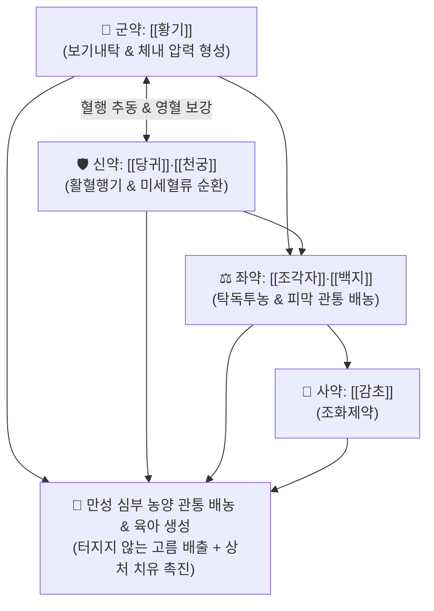

# 🍵 [[투농산]] (透膿散, Tou-Nong-San / Tounong-san)

> **핵심 3줄 요약 (Key Summary)**:
> - 🌿 기본 구성: [[황기]], [[당귀]], [[천궁]], [[조각자]], [[백지]], [[감초]] (보기보혈 내탁 + 조각자·천궁 파결투농).
> - 🎯 창양옹저(瘡瘍癰疽)가 이미 곪았으나(기성농 旣成膿) 기혈이 허약하고 피부가 두꺼워 저절로 터지지 못할 때 관통 배농, 심부 농양, 유선염 화농기, 치루 및 항문 주위 농양, 피지낭종 염증기.
> - 🔬 대식세포 탐식능 증강, 염증성 피막 용해 효소 활성화, 국소 모세혈관 확장 및 농액 분출 유도, VEGF 발현 촉진을 통한 상피화 지원.
> - ⚠️ 주의사항: 아직 곪지 않고 붉게 부어오르는 미성농기(未成膿期) 실열 환자 및 자궁 수축 위험이 있는 임산부 투약 금기.

---

## 📌 목차
1. [기본 처방 정보 & 군신좌사 구성](#1-기본-처방-정보--군신좌사-구성)
2. [방제학적 약재 상호작용 & 시너지 네트워크](#2-방제학적-약재-상호작용--시너지-네트워크)
3. [현대 분자약리학적 효능 & 작용 기전](#3-현대-분자약리학적-효능--작용-기전)
4. [적응 병증 및 체질별 감별 (Sweet Spot vs 금기)](#4-적응-병증-및-체질별-감별-sweet-spot-vs-금기)
5. [유사 처방군 감별 매트릭스](#5-유사-처방군-감별-매트릭스)
6. [임상 가감례 & 현대 질환별 응용](#6-임상-가감례--현대-질환별-응용)
7. [💡 사용자 진료실 핵심 필기 & 임상 팁 (원문 보존)](#7--사용자-진료실-핵심-필기--임상-팁-원문-보존)
8. [출처 및 학술 참고 문헌 (References)](#8-출처-및-학술-참고-문헌-references)

---

## 1. 기본 처방 정보 & 군신좌사 구성

* **출전**: 진실공(陳實功) 『[[외과정종]]』(外科正宗) 옹저문(癰疽門)
* **치법**: 탁독투농(托毒透膿), 보기양혈(補氣養血), 활혈소종(活血消腫), 관통배농(貫通排膿)

| 구분 | 약재명 | 표준 용량 | 본초 효능 & 방제 내 역할 |
| :--- | :--- | :--- | :--- |
| **군약 (君藥)** | [[황기]] | 12~15g | **보기내탁·생기렴창**: 비폐의 기혈을 대보하여 고름을 밖으로 밀어내는 내탁력을 주도 |
| **신약 (臣藥)** | [[당귀]], [[천궁]] | 각 8~10g | **보혈활혈·행기통락**: 혈액순환을 추동하여 약력을 병변에 집중시키고 모세혈관 신생 촉진 |
| **좌약 (佐藥)** | [[조각자]], [[백지]] | 각 4~6g | **탁독투농·소종배농**: 단단한 섬유성 피막을 뚫고 곪은 고름을 체표 밖으로 분출시킴 |
| **사약 (使藥)** | [[감초]] | 3~4g | **조화제약·해독**: 제약을 조화시키고 독소를 완충 |

> **방제 구조 분석**:
> * **내탁(內托)과 외투(外透)의 협공**: 원방의 천산갑(CITES 규제)은 현대 임상에서 법제된 [[조각자]]를 증량하거나 [[왕불유행]]으로 대체하며, [[황기]]·[[당귀]]가 안에서 밀어내고 [[조각자]]·[[백지]]가 밖에서 뚫어주는 전형적인 투농(透膿)의 표준 방제입니다.

---

## 2. 방제학적 약재 상호작용 & 시너지 네트워크

* **관통 배농의 원리**: 종기가 곪아 속에서 출렁거리나 환자의 기력이 약해 밖으로 터지지 못할 때, 내압을 높이고 굳은 피막을 용해시켜 신속한 자연 배농을 유도합니다.

---

## 3. 현대 분자약리학적 효능 & 작용 기전

### 1) 대식세포 탐식능 증강 및 괴사 조직 청소
* [[황기]]의 아스트라갈로사이드 IV와 다당체가 백혈구의 유주능과 탐식 기능을 급격히 끌어올려 세균성 괴사 물질을 신속히 분해합니다.

### 2) 국소 결합조직 피막 투과성 증대 및 배농 촉진
* [[조각자]]의 사포닌 성분이 만성 염증으로 두꺼워진 피막 조직의 투과성을 높여 고름의 자연 배농 통로를 개방합니다.

### 3) 혈관 신생 및 상피화 촉진
* [[당귀]]와 [[천궁]]의 페룰산 및 리구스티라이드가 저산소 상태인 농양 중심부의 모세혈관 형성을 자극하여 배농 후 새로운 살(生肌)이 차오르도록 지원합니다.

---

## 4. 적응 병증 및 체질별 감별 (Sweet Spot vs 금기)

### 1) 주요 적응증 (Target Indications)
* **외과 및 피부 화농성 질환**:
  * 심부 농양, 피하 종기, 절종(癤腫), 화농성 한선염, 피지낭종 염증기.
  * 급성 유선염(유옹) 화농기, 바르톨린선 농양, 치루 및 항문 주위 농양.
* **임상 징후**: 환부를 누르면 속에서 파동감(출렁거림)이 느껴지나 피부 표면이 단단하여 터지지 않는 상태.

### 2) 체질별 적합도 & 금기
* **적합 체질 (Sweet Spot)**:
  * 이미 곪았으나 기력이 약해 스스로 터뜨리지 못하는 기혈부족형 환자.
* **절대 금기 및 주의 (Contraindications)**:
  * **미성농기(未成膿期) 실열 환자 금기**: 아직 고름이 형성되지 않은 초기에 황기 등 보익약을 쓰면 염증이 확산되므로 [[선방활명음]]을 써야 함.
  * **임산부 절대 금기**: 조각자의 강한 통경락 및 자궁 수축 유발 작용으로 임산부에게는 투약 금기.

---

## 5. 유사 처방군 감별 매트릭스

| 처방명 | 병기 분절 | 주요 특징 | 감별 요점 |
| :--- | :--- | :--- | :--- |
| [[선방활명음]] | **초기 미성농기** | 금은화, 유향, 몰약, 백지 | 붉게 붓고 열나며 아직 고름이 안 생김 (소종해독) |
| [[투농산]] | **중기 기성농기** | 황기, 당귀, 천궁, 조각자, 백지 | **이미 곪았으나 터지지 못할 때 (관통배농)** |
| [[탁리소독음]] | **후기 궤후기** | 사군자탕 + 황기, 당귀, 금은화, 연교 | 터진 후 고름이 묽고 상처가 안 아물 때 (보기생기) |
| [[배농산급탕]] | **체표/인후 화농** | 길경, 지실, 작약, 대조, 생강, 감초 | 가벼운 피부 화농 및 인후 농양 초기 |

---

## 6. 임상 가감례 & 현대 질환별 응용

### 1) 변증 가감법
* **농액 배출 후 상처 치유 촉진 시**: $\rightarrow$ 조각자를 빼고 [[탁리소독음]] 또는 [[십전대보탕]]으로 전환.
* **유방 농양(유옹) 화농기**: + [[포공영]], [[왕불유행]] (통유소종).
* **항문 주위 농양 및 치루**: + [[금은화]], [[지유]] (청열량혈).

### 2) 현대 질환별 매핑
* **피부외과**: 피하 농양, 피지낭종 감염, 화농성 한선염, 모창.
* **부인/항문외과**: 수유기 유선염 농양기, 치루 및 항문 주위 농양, 바르톨린선 낭종 염증.

---

## 7. 💡 사용자 진료실 핵심 필기 & 임상 팁 (원문 보존)

> [!tip] **진료실 실전 노하우 (User Clinical Insight)**
> - **기성농(旣成膿) 관통 배농의 최고 처방**: 환부를 만졌을 때 물컹거리며 파동감이 있으나 피부가 질겨 터지지 않을 때 수술적 절개 배농을 보조하거나 자연 파열을 유도하는 최적의 방제.
> - **배농 완료 즉시 전환**: 고름이 완전히 터져 나온 뒤에는 조각자 등 파파(破破) 약재를 즉시 중단하고 [[탁리소독음]]이나 [[십전대보탕]]으로 전환하여 새살(육아조직)을 돋우어야 함.
> - **임산부 금기**: 조각자의 강력한 통락 및 자궁 수축 위험으로 가임기 임산부에게는 투약을 엄격히 금함.

---

## 8. 출처 및 학술 참고 문헌 (References)

1. **Chen SG (陳實功) (1617)**. *Waike Zhengzong* (外科正宗), Yongju Men.
   * `[연구 요약]`: 투농산 원전 수록, 창양 옹저 기성농 불궤(不潰) 치료 탁독투농 표준 방제 제정.
2. **Auyeung KK, et al. (2016)**. Astragalus membranaceus: A review of its protection against inflammation and gastrointestinal cancers. *The American Journal of Chinese Medicine*, 44(1), 1-22.
   * `[연구 요약]`: 황기 활성 성분의 대식세포 탐식능 증강, 면역 활성화 및 만성 염증 조직 치유 촉진 약리 분석.
3. **Zhang X, et al. (2018)**. Chemical constituents and pharmacological activities of *Gleditsia sinensis* spines. *Journal of Asian Natural Products Research*, 20(3), 205-217.
   * `[연구 요약]`: 조각자 트리테르페노이드 성분의 모세혈관 확장, 염증성 피막 투과성 증대 및 배농 촉진 효능 입증.