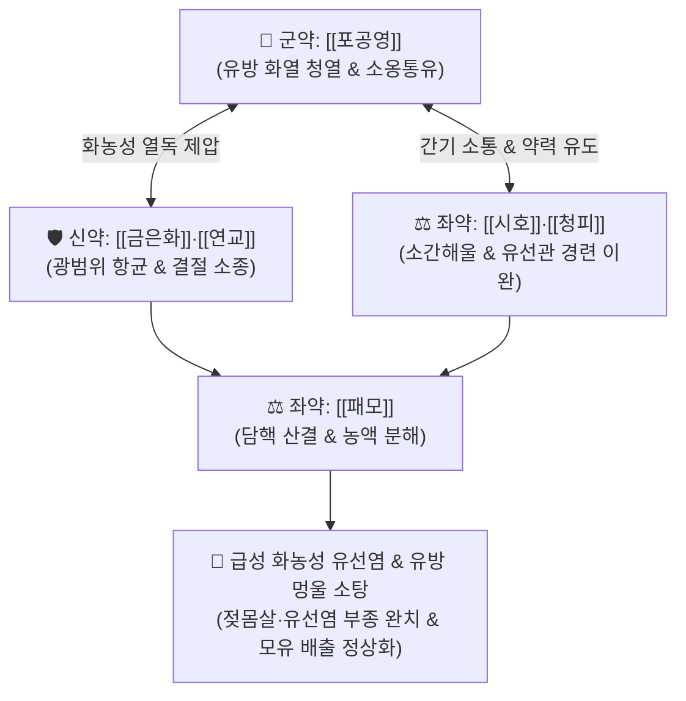

# 🍵 [[포공영탕]] (蒲公英湯, Pugongying Decoction)

> **핵심 3줄 요약 (Key Summary)**:
> - 🌿 기본 구성: [[포공영]], [[금은화]], [[연교]], [[패모]], [[시호]], [[청피]], [[감초]] (유선 청열해독소옹 + 소간이기통유).
> - 🎯 간기울결(肝氣鬱結) 및 위열(胃熱) 옹체로 인한 급성 유선염(유옹 초기), 수유기 젖몸살 및 유선관 폐색, 유방 멍울(섬유선종·낭종)의 생리 전 팽만통, 급성 림프절염.
> - 🔬 황색포도상구균 바이오필름 억제, NF-κB 활성화 차단 및 염증성 사이토카인(TNF-α, IL-6) 급감, 유선 평활근 경련 이완을 통한 젖샘 배출 촉진.
> - ⚠️ 주의사항: 청열해독약의 찬 약성으로 비위가 허한 산모는 따뜻하게 복용하며 필요 시 생강을 가미하고, 수유 지속 및 유축 티칭 병행.

---

## 📌 목차
1. [기본 처방 정보 & 군신좌사 구성](#1-기본-처방-정보--군신좌사-구성)
2. [방제학적 약재 상호작용 & 시너지 네트워크](#2-방제학적-약재-상호작용--시너지-네트워크)
3. [현대 분자약리학적 효능 & 작용 기전](#3-현대-분자약리학적-효능--작용-기전)
4. [적응 병증 및 체질별 감별 (Sweet Spot vs 금기)](#4-적응-병증-및-체질별-감별-sweet-spot-vs-금기)
5. [유사 처방군 감별 매트릭스](#5-유사-처방군-감별-매트릭스)
6. [임상 가감례 & 현대 질환별 응용](#6-임상-가감례--현대-질환별-응용)
7. [💡 사용자 진료실 핵심 필기 & 임상 팁 (원문 보존)](#7--사용자-진료실-핵심-필기--임상-팁-원문-보존)
8. [출처 및 학술 참고 문헌 (References)](#8-출처-및-학술-참고-문헌-references)

---

## 1. 기본 처방 정보 & 군신좌사 구성

* **출전**: 진실공(陳實功) 『[[외과정종]]』(外科正宗) / 허준(許浚) 『[[동의보감]]』(東醫寶鑑) 유방문(乳房門)
* **치법**: 청열해독(淸熱解毒), 소옹산결(消癰散結), 소간해울(疏肝解鬱), 통유소종(通乳消腫)

| 구분 | 약재명 | 표준 용량 | 본초 효능 & 방제 내 역할 |
| :--- | :--- | :--- | :--- |
| **군약 (君藥)** | [[포공영]] | 15~20g | **청열해독·소옹통유**: 간경과 위경에 들어가 유방의 화열과 독소를 끄고 막힌 유선관을 개통 |
| **신약 (臣藥)** | [[금은화]], [[연교]] | 각 10~12g | **청열소종·산결해독**: 유선 조직의 화농성 세균을 억제하고 림프절과 피하의 단단한 결절 분해 |
| **좌약 (佐藥)** | [[패모]] | 6~8g | **청열화담·산결**: 끈적하게 응결된 염증 분비물과 담핵을 삭여 배출 |
| **좌약 (佐藥)** | [[시호]], [[청피]] | 각 4~6g | **소간해울·행기지통**: 간경락을 소통시켜 스트레스로 울결된 기운을 풀고 약력을 유방으로 유도 |
| **사약 (使藥)** | [[감초]] | 3~4g | **조화제약·청열해독**: 제약을 조화시키고 소화관을 보호 |

> **방제 구조 분석**:
> * **청열해독과 이기산결(理氣散結)의 일체화**: 유방은 족양명위경(유두)과 족궐음간경(유방 본체)이 관장하므로, 위열을 식히는 [[포공영]]과 간기를 푸는 [[시호]]·[[청피]]를 배합하여 유선 울혈과 화농을 동시에 해결합니다.

---

## 2. 방제학적 약재 상호작용 & 시너지 네트워크

* **유방 질환의 표적 치료 네트워크**: 포공영의 강력한 유선 항염증력에 시호·청피의 간경 인경(引經) 작용이 더해져 약효가 유방 병소에 집중됩니다.

---

## 3. 현대 분자약리학적 효능 & 작용 기전

### 1) 항균 및 바이오필름 형성 억제
* [[포공영]]의 타락사스테롤(Taraxasterol)과 [[금은화]]의 클로로겐산이 황색포도상구균(*Staphylococcus aureus*)의 세포벽을 파괴하고 바이오필름 형성을 억제합니다.

### 2) 급성 염증성 사이토카인 및 부종 차단
* 타락사스테롤이 NF-κB 및 MAPK 신호전달을 억제하여 [[TNF-α]], [[IL-6]], COX-2, iNOS 발현을 억제, 붉게 타오르는 유방 열감과 찌르는 듯한 통증을 신속히 완화합니다.

### 3) 유선관 평활근 이완 및 젖멍울 배출
* [[시호]]와 [[청피]]의 플라보노이드 성분이 유관 주위 평활근의 경련을 이완시키고 미세혈류를 개선하여 정체된 모유와 염증 삼출물의 배출을 유도합니다.

---

## 4. 적응 병증 및 체질별 감별 (Sweet Spot vs 금기)

### 1) 주요 적응증 (Target Indications)
* **급성 유방 질환**:
  * 수유기 급성 유선염(유옹 초기), 젖몸살, 젖샘 막힘(유관 폐색).
  * 유방이 붉게 붓고 화끈거리며 찌르는 듯이 아프고 오한·발열이 동반될 때.
* **만성 유방 결절 및 멍울**:
  * 섬유선종, 섬유낭종성 유방병의 생리 전 유방 팽만통 및 압통.
* **외과 림프절염**: 급성 경부 림프절염, 액와부 임파선염.

### 2) 체질별 적합도 & 금기
* **적합 체질 (Sweet Spot)**:
  * 출산 후 스트레스가 심하고 유방이 단단하게 뭉치며 열이 펄펄 끓는 급성 실열기 산모.
* **절대 금기 및 주의 (Contraindications)**:
  * **비위허한 산모 복통 주의**: 소화기가 매우 찬 산모는 탕약을 따뜻하게 복용하고 생강을 가미함.

---

## 5. 유사 처방군 감별 매트릭스

| 처방명 | 병기 및 특징 | 구성 차이 | 감별 요점 |
| :--- | :--- | :--- | :--- |
| [[포공영탕]] | **유선염 급성 실열기** | 포공영, 금은화, 연교, 패모, 시호, 청피 | 유방이 붉고 붓고 뜨거우며 젖몸살 초기 (청열소옹) |
| [[과루우슬탕]] | **유옹 초기 울혈기** | 과루인, 우슬, 당귀, 시호, 연교 | 유관이 막혀 젖이 안 나오고 멍울이 단단함 |
| [[투농산]] | **유방 농양 화농기** | 황기, 당귀, 천궁, 조각자, 백지 | 이미 고름이 찼으나 피부가 질겨 안 터질 때 |
| [[탁리소독음]] | **농양 파열 후 궤후기** | 사군자탕 + 황기, 당귀, 은화, 연교 | 고름이 터진 후 상처가 아물지 않는 허증 |

---

## 6. 임상 가감례 & 현대 질환별 응용

### 1) 변증 가감법
* **오한·발열 등 전신 열성 감모 증상 동반 시**: + [[갈근]], [[연교]] (해표퇴열).
* **유관 폐색 및 모유 정체 극심 시**: + [[왕불유행]], [[통초]], [[누로]] (강력 통유).
* **소화 불량 및 오심 동반 시**: + [[생강]], [[사인]] (화위보호).

### 2) 현대 질환별 매핑
* **유방외과/부인과**: 수유기 급성 유선염, 유방 농양 초기, 유관 확장증, 유방 섬유선종.
* **이비인후/외과**: 급성 편도선염, 급성 경부 림프절염.

---

## 7. 💡 사용자 진료실 핵심 필기 & 임상 팁 (원문 보존)

> [!tip] **진료실 실전 노하우 (User Clinical Insight)**
> - **급성 유선염(유옹) 초기의 최고 선택**: 유방이 불덩이처럼 뜨겁고 붉게 부어오르는 급성 젖몸살·유선염 초기에 항생제 의존 없이 신속히 염증을 가라앉힘.
> - **수유 티칭 및 유축 병행**: 탕약 복용과 함께 환부 유방의 정체된 젖을 유축기를 통해 완전히 비워내도록 지도해야 재감염과 농양 형성을 막을 수 있음.
> - **소화기 보호 요령**: 약성이 서늘하므로 위장이 약한 산모에게는 [[생강]] 3쪽을 가미하여 따뜻하게 복용하도록 복약 지도함.

---

## 8. 출처 및 학술 참고 문헌 (References)

1. **Chen SG (陳實功) (1617)**. *Waike Zhengzong* (外科正宗), Ruyong Men.
   * `[연구 요약]`: 포공영탕 창방, 유옹 및 유방 종통 치료 청열해독 소간통유 표준 방제 제정.
2. * **Zhao Y et al. (2021)**. Taraxasterol suppresses cell proliferation and boosts cell apoptosis via inhibiting GPD2-mediated glycolysis in gastric cancer. *Cytotechnology*, 73: 815-825. [PMID: 34776631](https://pubmed.ncbi.nlm.nih.gov/34776631/)
3. * **Liang Y et al. (2026)**. The Protective Effects and Underlying Mechanisms of Taraxacum kok-saghyz Polysaccharides Against Intestinal Dysbiosis-Induced Mastitis Were Elucidated Using a Murine Model of the "Gut-Mammary" Axis. *Animals : an open access journal from MDPI*, 16: . [PMID: 41828959](https://pubmed.ncbi.nlm.nih.gov/41828959/)
