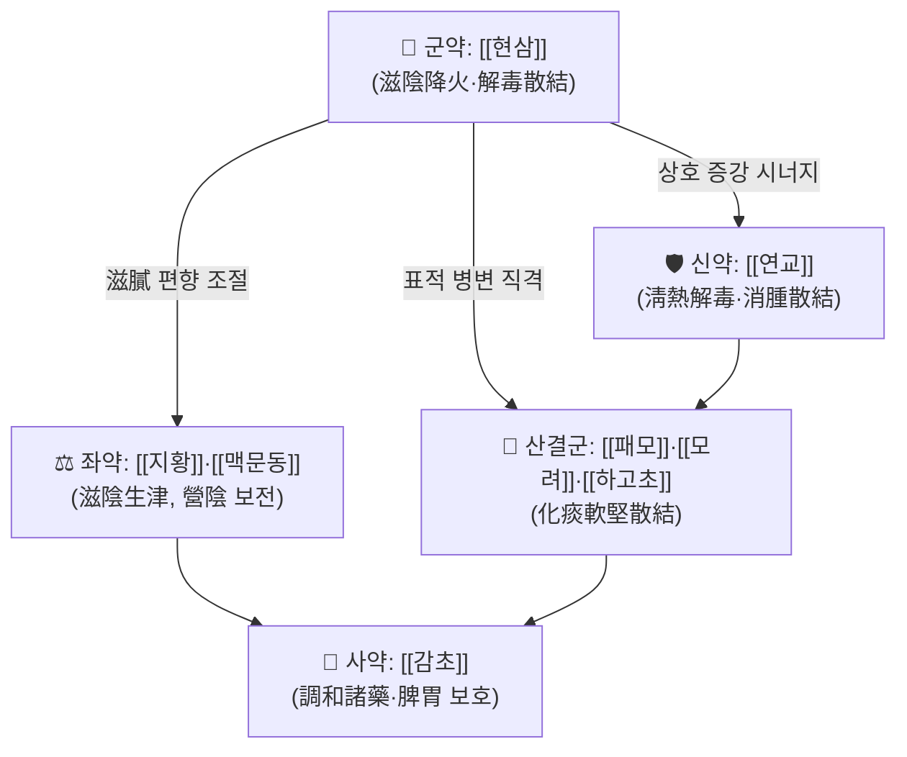

# 🍵 [[현교청영전]] (懸翹淸營煎, Hyunkyo Cheongyeongjeon)

> **핵심 3줄 요약 (Key Summary)**:
> - 🌿 **모체/기원 처방 + 가감 핵심**: [[청영탕]] 계열의 營分 淸熱·滋陰 골격에 **[[현삼]] + [[연교]]**를 축으로 재편하고, 여기에 **산결(散結) 약재([[패모]]·[[모려]]·[[하고초]])**를 배오한 청열해독·소종산결 방제로 이해된다. 실제 원문 구성·용량은 판본별 차이가 있어 **근거 미확인**(원문 DB 대조 필요).
> - 🎯 **임상 최적 적응증**: 熱毒이 營分·陰分에 울체되어 발생한 **결취(結聚)성 병변** — 즉 나력(瘰癧)·담핵(痰核)·경부/악하 림프절 종대, 만성 인후·편도 염증 동반 림프절 비대, 피부 창양 초기. 체질적으로는 **소양인(裏熱型) 또는 태음인 실열형**에 적합하고 少陰人 虛寒 체질에는 부적합하다.
> - 🔬 **핵심 분자약리 기전**: 본 처방 자체에 대한 PubMed 검색 결과는 **0건(근거 미확인)**. 구성 본초 단위로는 iridoid 배당체([[현삼]]의 harpagoside·catalpol), forsythiaside·arctigenin([[연교]]), glycyrrhizin([[감초]]) 등이 **NF-κB / MAPK 신호전달 억제, COX-2·iNOS 발현 저하, TNF-α·IL-6·IL-1β 등 염증성 사이토카인 조절**과 연관된다는 보고가 있으나, 이는 개별 본초 수준의 지식이며 처방 전체의 효능으로 일반화할 수 없다.
> - ⚠️ 주의사항: 寒涼·滋膩한 약재 구성으로 脾胃虛寒·寒痰凝結型 림프절 종대에 투여 시 설사·식욕부진·복냉감이 악화될 수 있다. 림프절이 단단하고 고정되어 있으며 1.5~2cm 이상, 야한·체중감소·통증을 동반하면 악성(림프종·전이암) 감별이 우선이며 한방 단독 치료는 금기이다. 감초 장기 고용량 투여 시 가성 알도스테론증(부종·저칼륨혈증·혈압상승)에 유의한다.

---
## 📌 목차
1. [기본 처방 정보 & 군신좌사 구성](#1-기본-처방-정보--군신좌사-구성)
2. [방제학적 약재 상호작용 & 시너지 네트워크](#2-방제학적-약재-상호작용--시너지-네트워크)
3. [현대 분자약리학적 효능 & 작용 기전](#3-현대-분자약리학적-효능--작용-기전)
4. [적응 병증 및 체질별 감별 (Sweet Spot vs 금기)](#4-적응-병증-및-체질별-감별-sweet-spot-vs-금기)
5. [유사 처방군 감별 매트릭스](#5-유사-처방군-감별-매트릭스)
6. [임상 가감례 & 현대 질환별 응용](#6-임상-가감례--현대-질환별-응용)
7. [💡 사용자 진료실 핵심 필기 & 임상 팁 (원문 보존)](#7--사용자-진료실-핵심-필기--임상-팁-원문-보존)
8. [출처 및 학술 참고 문헌 (References)](#8-출처-및-학술-참고-문헌-references)

---
## 1. 기본 처방 정보 & 군신좌사 구성

* **출전**: 사용자 분류상 『[[동의보감]]』 계열 처방으로 태깅되어 있으나, **본 노트 작성 시점에서 정확한 원문 조문·편장(외형편/잡병편 癰疽·瘰癧門 등)은 대조하지 못함 → 출전 근거 미확인**. 방제명의 구성(懸/玄 + 翹 + 淸營)과 주치 태그(려력·림프선종)로 보아 **營分之熱을 청하고 결취를 풀어내는 消腫散結 處方**으로 운용되어 온 것으로 추정된다.
* **치법**: 청열해독(淸熱解毒) · 청영양음(淸營養陰) · 소종산결(消腫散結) · 연견산결(軟堅散結)
* **구성 원리 요약**: ① 熱毒을 직접 청하는 淸熱解毒軸([[현삼]]·[[연교]]) ② 營熱로 손상된 陰液을 보전하는 滋陰軸([[지황]]·[[맥문동]]) ③ 종대·결절 자체를 무르게 풀어내는 軟堅散結軸([[패모]]·[[모려]]·[[하고초]]) ④ 諸藥을 조화시키는 使藥軸([[감초]])의 4축 구조로 파악할 수 있다.

| 구분 | 약재명 | 표준 용량 | 본초 효능 & 방제 내 역할 |
| :--- | :--- | :--- | :--- |
| **군약 (君藥)** | [[현삼]] (玄參) | 8~12g (근거 미확인) | 鹹寒·滋陰降火·解毒散結. 營分의 伏熱을 청하면서 結聚(림프절 종대)를 풀어내는 본 방제의 축. 陰을 기르면서 火를 내리는 兩面 작용이 특징 |
| **신약 (臣藥)** | [[연교]] (連翹) | 6~9g (근거 미확인) | 苦微寒·淸熱解毒·消腫散結. 이른바 "瘡家聖藥"으로 熱毒性 종창·결절의 표적 약재이며 君藥의 散結 작용을 상승시킴 |
| **좌약 (佐藥)** | [[지황]] (生地黃) / [[맥문동]] (麥門冬) | 4~6g (근거 미확인) | 甘寒·滋陰生津. 熱이 營陰을 태운 상태를 보전하고, 苦寒·滲泄 약재의 조습(燥濕) 편향을 억제 |
| **좌약 (佐藥)** | [[패모]] (貝母) · [[모려]] (牡蠣) · [[하고초]] (夏枯草) | 4~6g (근거 미확인) | 化痰散結·軟堅散結. 림프절 종대·담핵·나력이라는 **국소 병변 자체를 직접 겨냥**하는 표적 배오 |
| **사약 (使藥)** | [[감초]] (甘草) | 2~4g | 調和諸藥, 淸熱解毒 보조, 脾胃 보호. 甘味로 苦寒 약재의 위장 자극을 완충 |

> **배오 특징**: [[현삼]] + [[연교]]의 相須 배합이 방제의 중심이다. 鹹寒한 [[현삼]]은 陰을 보하면서 火를 내리고 結을 풀며, 苦寒한 [[연교]]는 熱毒을 表裏로 疏散·消腫시켜 두 약재의 작용점(滋陰降火 vs 淸熱解毒)이 상보적이다. 여기에 滋陰藥을 佐로 두어 淸熱一邊倒의 편향을 막고, 軟堅散結藥을 병치하여 "全身的 淸熱(원인 제거) + 局所的 散結(병변 해소) + 陰液 보전(체력 유지)"의 3중 구조를 완성한다. 升降의 측면에서는 玄參의 下行·滋潤性과 連翹의 上行·疏散性이 相反相成을 이루어, 상초(인후·경부)의 熱毒과 하초의 陰虛를 동시에 겨냥하는 배치로 해석할 수 있다.

---
## 2. 방제학적 약재 상호작용 & 시너지 네트워크

* **[[현삼]] + [[연교]] 배오(相須·相使)**: 鹹寒滋潤 → 苦寒淸熱의 결합으로, 단순 苦寒 淸熱만으로는 개선되지 않는 **만성·잠복성 熱毒(營分 伏熱)**을 겨냥한다. 連翹가 表部의 熱毒을 疏散시키고 玄參이 裏部의 陰分 熱을 淸降하는 表裏 분업 구조.
* **[[현삼]] + [[지황]]·[[맥문동]] 배오**: 滋陰 약재군은 淸熱 약재의 苦燥性을 상쇄하여 장기 복용 시 발생하기 쉬운 口乾·변비·설사·위부 불쾌감을 완충한다. 즉 **좌약의 '독성 억제' 기능**이 이 배합의 핵심이다.
* **[[연교]] + [[패모]]·[[모려]]·[[하고초]] 배오**: 淸熱(원인)과 軟堅(결과)을 동시에 처리하는 구조로, 단단한 결절·담핵에 대한 **표적-증강(相使)** 관계. 牡蠣의 沉降·收斂性은 連翹의 升散性과 균형을 이루어 散而不過를 구현한다.
* **[[감초]] + 전방(全方)**: 甘味 緩和로 苦寒 약재의 脾胃 손상을 막고, 약효 군(群) 간의 작용 속도를 조절하는 **조화·완충 노드** 역할을 한다. 다만 甘味 滋膩가 痰濕을 조장할 수 있어 痰濕 甚한 경우 감초 감량 또는 去甘草를 고려한다.

---
## 3. 현대 분자약리학적 효능 & 작용 기전

> ⚠️ **근거 수준 명시**: 아래 내용은 **개별 구성 본초에 대해 문헌적으로 알려진 성분·기전**을 정리한 것이며, **현교청영전이라는 처방 전체(전탕액·복합 추출물)를 대상으로 한 PubMed 검색 결과는 0건**이다. 따라서 처방 수준의 효능 주장은 모두 **근거 미확인**으로 취급해야 한다.

### 1) 핵심 분자 표적 및 면역·항염증 조절 (구성 본초 단위 근거)
* **[[현삼]] (玄參)**: iridoid 배당체 계열인 **harpagoside, catalpol, aucubin** 등이 주요 성분으로 보고되어 있다. 이들은 항염증·항산화 작용 및 미세혈관 보호와 연관된다는 문헌 보고가 있으며, 滋陰降火·解毒散結이라는 전통 효능과 대응되는 방향으로 해석된다. 다만 **본 처방에서의 정량적 표적 억제율은 근거 미확인**.
* **[[연교]] (連翹)**: **forsythiaside A, phillyrin, arctigenin** 등이 대표 성분. NF-κB 및 MAPK 신호전달 억제, COX-2·iNOS 발현 저하, TNF-α·IL-6 등 염증성 사이토카인 억제와 관련된 보고가 있다. 消腫散結 효능의 분자적 배경으로 거론된다.
* **[[감초]] (甘草)**: **glycyrrhizin, liquiritin**이 항염증 및 코르티코스테로이드 유사 작용, 간보호 작용과 연관된다는 보고가 있다.
* **[[지황]]·[[맥문동]]**: catalpol, verbascoside 등 성분이 항산화·항염 및 점막 보호와 연관된다는 수준의 보고가 있으며, 營陰 보전이라는 전통 효능과 연결해 해석된다.
* **핵심 사이토카인 축(가설)**: **TNF-α → IL-6 → IL-1β → IL-17** 순차 반응은 림프절 종대·육아종성 염증의 핵심 축으로 알려져 있다. 본 처방의 청열해독 약재군이 이 축을 억제할 가능성이 있으나, **처방 수준 직접 검증 데이터는 근거 미확인**.

### 2) 순환·미세순환·대사 관련 (구성 본초 단위, 근거 수준 낮음)
* 玄參의 iridoid 성분은 미세혈관 내피 보호 및 항산화 작용과 연관된다는 보고가 있으며, 이는 결절 주변의 울혈·부종성 병변 개선이라는 전통적 관찰과 방향성이 일치한다.
* 連翹·生地黃 성분의 항산화 작용은 산화 스트레스 매개 염증 완화와 연결해 설명되기도 한다.
* **단, eNOS 활성화·혈관 평활근 이완·미토콘드리아 대사 정상화 등 특정 기전이 본 처방에서 직접 측정되었다는 근거는 확인되지 않았다.**

### 3) 림프 조직·신경·자율신경 관련
* 化痰散結 약재군([[패모]]·[[모려]]·[[하고초]])은 전통적으로 림프절·담핵·갑상선 결절 등 **국소 結聚 병변**에 응용되어 왔다. 현대적으로는 림프조직 내 염증세포 침윤 및 섬유화 억제 가설로 설명될 수 있으나, **기전 근거 미확인**.
* [[패모]]의 alkaloid(peimine, verticine 등) 성분은 진해·항염 작용과 관련된 보고가 있으며, 인후-기관지 자극 증상 동반 시의 배오 근거로 볼 수 있다.
* 자율신경·HPA축 조절 및 근방추 과흥분 억제에 관한 기전은 **본 처방과 관련하여 확인된 바 없음**.

---
## 4. 적응 병증 및 체질별 감별 (Sweet Spot vs 금기)

[✅ 최적 적응증 (Sweet Spot)]

* **원전 조문(추정 주치)**: 瘰癧(나력)·痰核(담핵)·瘡瘍 초기 등 **熱毒이 營分에 울체되어 結聚를 이룬 병증**. 정확한 원문 문구는 **근거 미확인**(동의보감 原文 대조 필요).
* **체질 소견**:
  * **소양인 裏熱型** — 상체가 발달하고 피부가 얇으며 熱感·口乾·변비 경향, 面色 홍조. 가장 적합.
  * **태음인 中 실열형** — 체격이 크고 痰濕이 많으면서 熱象(舌紅·苔黃)을 동반한 경우, 痰核·담핵에 응용 가능.
  * **부적합**: 少陰人 및 陰寒·氣虛 체질 — 같은 림프절 종대라도 寒痰凝結·氣滯型이면 본 방제의 寒涼滋膩가 병증을 악화시킬 수 있다.
* **임상 주치(진료실 적중 패턴)**:
  * 경부·악하·서혜부 **반응성 림프절 종대**(상기도 감염 후 잔존, 무통성 또는 경도 압통)
  * **결핵성 림프절염(연주창)** — 반드시 항결핵제 병용 하의 보조 요법으로만 접근
  * 만성 인후염·편도 비대 동반 림프절 비대, 구강·인후의 熱毒性 궤양
  * 피부 창양·종기 초기(紅腫熱痛), 熱毒型 여드름·모낭염
  * 갑상선·이하선 결절의 熱象 동반 시(단, 반드시 영상·조직 검사 선행)
* **설진/맥진**:
  * **설**: 舌紅 ~ 舌絳, 苔黃燥 또는 苔少(陰傷 시)
  * **맥**: 脈數·滑數(열독 실증) → 陰傷 시 脈細數
  * 감별 포인트: 舌淡·苔白滑·脈沈遲이면 본 방제 부적합 신호.

[⚠️ 신중 투여 및 금기 (Caution / Contraindication)]

* **寒熱 反對 병증**: 脾胃虛寒(복냉·연변·식욕저하), 寒痰凝結型 결절(단단하고 통증 없이 오래 지속, 舌淡苔白滑)에 투여하면 설사·복부냉감·식욕부진이 악화될 수 있다.
* **허실(虛實)**: 陰虛를 동반한 實熱에는 적합하나, **氣血兩虛·陽虛型 만성 림프절 종대**에는 부적합하다. 滋膩 약재가 補益 없이 소화 기능만 저하시킬 수 있다.
* **반드시 배제해야 하는 상황(악성 감별 우선)**:
  * 림프절이 **1.5~2cm 이상 단단하고 고정**, 압통 없이 지속 증가
  * **야한·체중감소·전신 소양감·발열** 동반
  * 45세 이상에서 새로 발견된 경부 림프절 종대
  * 위 소견이 있으면 **즉시 초음파/CT 및 필요 시 조직검사 의뢰**, 한방 단독 치료 금지.
* **양약 및 타 약물 병용 주의**:
  * **항결핵제(INH, RMP, EMB 등)** — 결핵성 림프절염에서 한방 단독 치료는 절대 금기이며, 병용 시 간독성 모니터링 필요(다만 본 처방과의 직접 상호작용 연구는 **근거 미확인**).
  * **스테로이드·면역억제제·생물학적 제제** — 자가면역질환 관련 림프절 종대에서 병용 시 면역 조절 방향이 상충할 수 있어 전문의 협진 필수.
  * **[[감초]] 함유** — 장기 고용량 투여 시 가성 알도스테론증(부종·저칼륨혈증·혈압상승), 이뇨제·강심배당체와 병용 시 저칼륨혈증 위험 증가.
  * **[[지황]]·[[맥문동]] 등 滋膩·滑腸 약재** — 만성 설사·과민성 장증후군 환자에서 감량 또는 去.
  * **임신부** — 連翹·貝母·牡蠣 등 포함 시 신중 투여(태아 영향에 대한 근거 미확인). 임신 중에는 원칙적으로 사용을 피하고 전문의 상담.

---
## 5. 유사 처방군 감별 매트릭스

| 처방명 | 핵심 구성 차이 | 주치 및 체질 차이 | 맥진/설진 차이 |
| :--- | :--- | :--- | :--- |
| [[현교청영전]] | 기준 구성([[현삼]]·[[연교]] 축 + 滋陰 + 軟堅散結) | **나력·담핵·림프절 종대 등 結聚性 熱毒, 소양인 실열·태음인 痰熱** | 기준: 舌紅~絳, 苔黃燥, 脈數或細數 |
| [[청영탕]] | [[현삼]]·[[지황]]·[[맥문동]] + [[서각]](수우각 대용)·[[금은화]]·[[연교]]·[[황련]]·[[단삼]]·[[죽엽]] | 熱入營分(고열·야간 악화·신혼·발진), 급성·중증 실열 | 舌絳無苔, 脈細數 — 結節 표적성은 약함 |
| [[형개연교탕]] | 解表藥([[형개]]·[[방풍]]) + [[연교]]·[[황금]]·[[치자]] | 두면부·상기도 熱毒(비염·편도염·부비동염), 表證 동반 | 舌紅 苔薄黃, 脈浮數 |
| [[소시호탕]] | [[시호]]·[[황금]] + [[인삼]]·[[반하]]·[[생강]]·[[대조]] | 少陽 樞機不利, 往來寒熱·胸脅苦滿, 체질 무관하게 실용 | 脈弦, 苔白 또는 薄黃 |
| [[청기산결탕]] | 淸熱 + 化痰散結 약재 중심(나력 특화) | 나력 초기·痰熱 結聚, 경부 결절 | 脈弦滑, 苔黃膩 |
| [[서각지황탕]] | [[서각]]·[[지황]] + [[작약]]·[[목단피]] | 血分 熱(토혈·발반·축혈), 출혈 경향 | 舌絳, 脈細數或數 |

> ⚠️ 표 내부 링크는 파이프 기호를 쓰지 않고 [[처방명]] 단독 형태로만 기재하였다. 위 비교 처방들의 구성·주치 세부는 학파별 차이가 있으므로 실제 처방 시 원문 대조가 필요하다.

---
## 6. 임상 가감례 & 현대 질환별 응용

* **수반 증상별 가감법**:
  * 熱毒 甚(紅腫熱痛 뚜렷, 高熱) 시 → + [[금은화]], [[포공영]], [[자화지정]]
  * 결절이 단단하고 잘 풀리지 않을 때 → + [[모려]], [[하고초]], [[산자고]] (軟堅散結 강화)
  * 痰多·담핵 明顯 시 → + [[반하]], [[진피]], [[복령]]
  * 陰虛 증상(口乾·야간 熱感·午後 潮熱) 뚜렷 시 → + [[맥문동]], [[석곡]], [[옥죽]] 증량
  * 인후통·편도 비대 동반 시 → + [[길경]], [[우방자]], [[마발]]
  * 변비 동반 시 → + [[대황]] 소량, 또는 [[화마인]]
  * 氣滯(스트레스성 악화, 胸悶) 동반 시 → + [[시호]], [[향부자]], [[천련자]]
  * 피부 소양·발진 동반 시 → + [[백선피]], [[지부자]], [[고삼]]
  * 소화력 저하·복냉 시 → [[지황]]·[[맥문동]] 감량, + [[진피]], [[사인]] (脾胃 보호)

* **현대 질환별 임상 매핑**:
  * **림프·면역계**: 반응성 림프절 비대(감염 후 잔존), 결핵성 림프절염(항결핵제 병용 하 보조), 만성 림프절염, 자가면역질환 관련 림프절 종대(전문의 협진 필수)
  * **호흡기·이비인후과**: 급·만성 인후염, 편도염, 편도 주위 농양 회복기, 상기도 감염 후 경부 림프절 종대
  * **피부과**: 종기·창양 초기(紅腫熱痛期), 熱毒型 여드름, 모낭염, 봉와직염 회복기(항생제 병용 전제)
  * **구강·안면**: 구내염·구강 궤양(熱象), 이하선·악하선 염증성 종대, 치성 감염 후 경부 림프절 종대(치과 치료 병행 필수)
  * **내분비·갑상선**: 갑상선 결절·아급성 갑상선염의 熱象 동반 시 보조적 접근(초음파·갑상선 기능검사 선행)
  * **종양 감별 영역**: 본 방제는 **악성 종양 치료제가 아니며**, 림프종·전이성 림프절병증이 배제된 이후에만 사용해야 한다.

---
## 7. 💡 사용자 진료실 핵심 필기 & 임상 팁 (원문 보존)

> [!tip] **진료실 실전 노하우 (User Clinical Insight)**
> - ⚠️ **본 노트 작성 시점에서 원장님의 원문 필기·메모는 제공되지 않았다.** 추후 원문을 확보하는 즉시 이 블록에 **삭제 없이 그대로 이관**할 것 (기존 필기는 절대 삭제 금지, 축소·정리만 허용).
> - **[작성자 참고용 임상 포인트 — 원장님 필기 아님, 원문 확보 시 대체 필요]**
>   * 림프절 종대를 주소로 내원한 환자에서 본 방제를 고려하기 전, **크기(1.5~2cm 기준)·경도·가동성·압통·지속 기간·동반 전신 증상**을 반드시 차트에 기록할 것. 이 5항목이 악성 감별과 한방 적응 판단을 동시에 결정한다.
>   * 체질 선별: 같은 림프절 종대라도 **舌紅·苔黃·脈數 + 口乾·便乾**이면 본 방제 적응 방향, **舌淡·苔白滑·脈沈遲 + 手足冷**이면 溫陽·化痰 계열(예: 陽和湯類 감별)로 방향 전환이 안전하다.
>   * 복약 반응 관찰 포인트: ① 결절 크기(촉진 및 필요 시 초음파 추적) ② 통증·열감 변화 ③ 舌苔의 厚薄 변화 ④ 설사·식욕 변화(寒涼 부작용 신호) — 이 4가지를 1~2주 간격으로 확인한다.
>   * 환자 티칭: "열을 내려 뭉친 것을 풀어주는 처방"이라는 설명이 이해도가 높다. 결핵성 림프절염 환자에게는 **항결핵제 중단 금지**를 반드시 구두·서면으로 재확인시킬 것.
>   * 장기 복용 시 3~4주마다 [[지황]]·[[맥문동]] 등 滋膩 약재의 필요성을 재평가하고, 脾胃 증상 발생 시 즉시 감량한다.

---
## 8. 출처 및 학술 참고 문헌 (References)

1. **PubMed 검색 결과: 0건** — "현교청영전", "Hyunkyo Cheongyeongjeon", "懸翹淸營煎", "玄翹淸營煎" 등으로 검색된 논문이 없어 **인용 가능한 현대 학술 문헌이 존재하지 않는다.** 따라서 본 노트에는 어떠한 PMID·DOI도 기재하지 않았으며, 처방 수준의 분자약리 기전은 모두 **근거 미확인**으로 표시하였다.
2. **허준 (1613)**. 『[[동의보감]]』.
   - **[고전 원전 — 출전 확인 필요]**: 사용자 태그상 본 처방의 출전으로 분류되어 있으나, **정확한 편(篇)·조문 및 구성 약재의 원문 문구는 대조 확인되지 않았다(근거 미확인).** 원문 확보 시 본 항목을 갱신할 것.
3. **오국통 (1798경)**. 『[[온병조변]]』 — [[청영탕]] 조문.
   - **[고전 원전 — 모체 처방 참고]**: 熱入營分의 치법 및 淸營湯 구성(玄參·生地黃·麥門冬·犀角·金銀花·連翹·黃連·丹參·竹葉)은 본 방제의 방제학적 골격을 이해하는 참고 자료이다. 단, 본 처방의 구성이 이와 동일하다는 근거는 **미확인**이다.
4. **본초학·방제학 교과서 수준의 단일 본초 성분 정보** (현삼의 harpagoside·catalpol, 연교의 forsythiaside A·arctigenin, 감초의 glycyrrhizin 등).
   - **[성분·기전 참고]**: 개별 본초 단위의 알려진 성분 및 항염 기전 정보이며, **특정 논문을 인용하지 않았고 처방 전체에 대한 효능 근거로 사용할 수 없다.**

> 📌 **노트 신뢰도 등급: 낮음(원문 미확인)** — 처방의 출전·구성·용량이 모두 1차 문헌으로 검증되지 않은 상태이다. 임상 적용 전 반드시 『동의보감』 원문 또는 신뢰할 수 있는 방제학 교재와 대조하여 본 노트를 갱신할 것.

<!-- 보관 태그(1회용·링크오류, 필요시 복원): 청영, 려력, 림프선종, 현교청영전 -->
