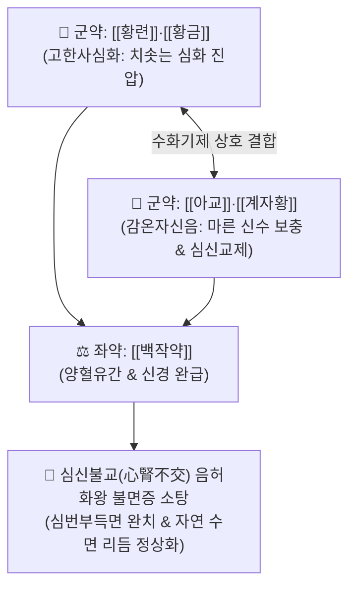

# 🍵 [[황련아교탕]] (黃連阿膠湯, Huang-Lian-E-Jiao-Tang / Oren-ekyo-to)

> **핵심 3줄 요약 (Key Summary)**:
> - 🌿 기본 구성: [[황련]], [[아교]], [[황금]], [[백작약]], [[계자황]] (황련·황금의 사심화 + 아교·계자황의 자신수, 자음강화 교제심신 최고 명방).
> - 🎯 소음병 음허화왕(陰虛火旺) 및 심신불교(心腎不交)로 인한 극심한 가슴 답답함과 번조로 밤에 전혀 잠을 이루지 못하는 난치성 불면증(심번부득면 心煩不得眠), 손발바닥 열감(오심번열), 건망증, 갱년기 안면홍조 및 신경쇠약.
> - 🔬 GABA_A 수용체 알로스테릭 조절을 통한 중추 진정, 뇌간/시상하부 5-HT(세로토닌) 농도 상승 및 NREM 수면 연장, 계자황 레시틴의 아세틸콜린 합성 촉진을 통한 인지기능 보호.
> - ⚠️ 주의사항: 속이 차고 설사를 자주 하는 비위허한(脾胃虛寒) 환자에게는 금기이며, 조제 시 계자황이 익어 굳지 않도록 미온 상태에서 유화(Emulsion) 조제 준수.

---

## 📌 목차
1. [기본 처방 정보 & 군신좌사 구성](#1-기본-처방-정보--군신좌사-구성)
2. [방제학적 약재 상호작용 & 시너지 네트워크](#2-방제학적-약재-상호작용--시너지-네트워크)
3. [현대 분자약리학적 효능 & 작용 기전](#3-현대-분자약리학적-효능--작용-기전)
4. [적응 병증 및 체질별 감별 (Sweet Spot vs 금기)](#4-적응-병증-및-체질별-감별-sweet-spot-vs-금기)
5. [유사 처방군 감별 매트릭스](#5-유사-처방군-감별-매트릭스)
6. [임상 가감례 & 현대 질환별 응용](#6-임상-가감례--현대-질환별-응용)
7. [💡 사용자 진료실 핵심 필기 & 임상 팁 (원문 보존)](#7--사용자-진료실-핵심-필기--임상-팁-원문-보존)
8. [출처 및 학술 참고 문헌 (References)](#8-출처-및-학술-참고-문헌-references)

---

## 1. 기본 처방 정보 & 군신좌사 구성

* **출전**: 장중경(張仲景) 『[[상한론]]』(傷寒論) 소음병편(少陰病篇)
* **치법**: 자음강화(滋陰降火), 교제심신(交濟心腎), 청심안신(淸心安神), 양혈유간(養血柔肝)

| 구분 | 약재명 | 표준 용량 | 본초 효능 & 방제 내 역할 |
| :--- | :--- | :--- | :--- |
| **군약 (君藥)** | [[황련]] | 8~12g | **사심화·청열제번**: 치솟아 오른 심장의 불길을 끄고 중추 과흥분을 신속히 진정 |
| **군약 (君藥)** | [[아교]] | 8~12g (양화) | **자음보혈·보신수**: 바닥난 신장과 혈액의 진액을 채워 심화(心火)를 제어 (따뜻한 탕액에 녹여 복용) |
| **신약 (臣藥)** | [[황금]] | 4~6g | **청열조습·사폐열**: 상초의 잔여 열을 끄고 황련의 사화 작용 보조 |
| **좌약 (佐藥)** | [[백작약]] | 6~9g | **양혈유간·완급지통**: 간혈을 자양하고 근육과 혈관 연축을 완화하여 심신 안정 |
| **사약 (使藥)** | [[계자황]] | 2개 (생투입) | **자음양혈·심신통락**: 신선한 달걀노른자로 심음과 신음을 직통으로 연결하고 제약을 유화 |

> **특수 전탕 및 조제 프로토콜**:
> 1. 황련, 황금, 백작약을 물로 먼저 달여 찌꺼기를 깨끗이 거릅니다.
> 2. 따뜻하게 거른 탕액에 [[아교]]를 넣고 저어서 완전히 녹입니다(양화 烊化).
> 3. 탕액이 살짝 식어 미지근해졌을 때 신선한 달걀노른자([[계자황]]) 2개를 깨 넣고 재빨리 저어 유화(Emulsion) 상태로 만들어 복용합니다. (절대 펄펄 끓는 상태에 넣어 계란이 익어 굳지 않도록 주의).

---

## 2. 방제학적 약재 상호작용 & 시너지 네트워크

* **수승화강(水升火降)과 교제심신(交濟心腎)**: 인체는 신수(腎水)가 올라가 심장을 적시고, 심화(心火)가 내려가 신장을 덥혀야 안정을 찾습니다. 본 방은 위로는 불을 끄고(황련·황금), 아래로는 물을 채워(아교·계자황) 위아래의 신경-호르몬 축을 다시 연결합니다.

---

## 3. 현대 분자약리학적 효능 & 작용 기전

### 1) GABA_A 수용체 알로스테릭 조절 및 중추 진정
* [[황련]]의 [[베르베린]]이 벤조디아제핀 수용체 부위와 상호작용하여 중추신경계의 억제성 신경전달을 증강, 약물 의존성 없이 불안과 뇌파 과흥분을 억제합니다.

### 2) 세로토닌(5-HT) 농도 상승 및 NREM 수면 연장
* 동물 실험에서 황련아교탕 투여 시 시상하부 및 뇌간의 세로토닌 합성 효소가 활성화되어 5-HT 분비가 증가하고, 깊은 잠을 주관하는 비급속안구운동(NREM) 수면 시간이 유의하게 연장됩니다.

### 3) 뇌신경 영양 공급 및 콜린성 신경 활성화
* [[계자황]]의 레시틴(포스파티딜콜린)과 필수 지질이 뇌 내 아세틸콜린 합성을 촉진하여 만성 불면으로 인한 뇌 피로, 건망증 및 인지 저하를 방어합니다.

---

## 4. 적응 병증 및 체질별 감별 (Sweet Spot vs 금기)

### 1) 주요 적응증 (Target Indications)
* **음허화왕(陰虛火旺) 심신불교형 극심한 불면증**:
  * 소음병 또는 만성 과로 후 진액이 바닥나서 가슴이 답답하고 안절부절못하여 밤에 눈을 붙이지 못하는 상태(심번부득면).
  * 손발바닥이 화끈거림(오심번열), 식은땀(도한), 가슴 두근거림, 입마름(인건).
* **설진 및 맥진**:
  * **설진(舌診)**: 혀가 짙은 붉은색(설강 舌絳), 설태가 거의 없거나 벗겨짐(무태/소태).
  * **맥진(脈診)**: 맥세삭(脈細數).

### 2) 체질별 적합도 & 금기
* **적합 체질 (Sweet Spot)**:
  * 체형이 마르고 피부가 건조하며, 혀가 붉고 만성 스트레스와 불면에 시달리는 음허(陰虛) 환자.
* **절대 금기 및 주의 (Contraindications)**:
  * **비위허한 설사 환자 금기**: 속이 차고 대변이 묽은 환자에게는 황련의 고한성과 아교의 자니성이 위장 장애를 유발하므로 금기.

---

## 5. 유사 처방군 감별 매트릭스

| 처방명 | 병태 생리 | 주요 구성 차이 | 감별 요점 & 설맥 |
| :--- | :--- | :--- | :--- |
| [[황련아교탕]] | **신음고갈 + 심화독항 (음허화왕)** | 황련, 아교, 황금, 백작약, 계자황 | **가슴이 극도로 답답하여 밤새 뒤척임**, 설강소태, 맥세삭 |
| [[산조인탕]] | **간혈부족 + 허열상충** | 산조인, 지모, 복령, 천궁, 감초 | 가슴 두근거림, 피로감, 식은땀 동반 불면, 맥현세 |
| [[천왕보심단]] | **심신불교 음혈허** | 생지황, 현삼, 당귀, 맥문동, 백자인 | 손발바닥 열감, 구갈, 건망, 만성 쇠약, 설홍 |
| [[귀비탕]] | **심비양허 (기혈허)** | 당귀, 용안육, 산조인, 원지, 인삼, 백출 | 사려과다, 식욕부진, 소화불량 동반 불면, 설담태백 |

---

## 6. 임상 가감례 & 현대 질환별 응용

### 1) 변증 가감법
* **도한(야간 식은땀) 및 가슴 두근거림 심할 시**: + [[모려]], [[부소맥]], [[산조인]] (영심지한).
* **안면홍조 및 상열감 극심 시**: + [[지모]], [[황백]] (자음강화).
* **기억력 감퇴 및 건망 극심 시**: + [[원지]], [[석창포]] (총명개규).

### 2) 현대 질환별 매핑
* **신경정신과**: 난치성 만성 불면증, 조울증의 조증기 흥분, 수면유지장애, 범불안장애.
* **부인과/자율신경**: 갱년기 안면홍조 및 심계항진, 자율신경실조증.
* **피부/출혈 질환**: 혈열성 출혈 질환(자궁출혈, 혈변) 동반 불면증.

---

## 7. 💡 사용자 진료실 핵심 필기 & 임상 팁 (원문 보존)

> [!tip] **진료실 실전 노하우 (User Clinical Insight)**
> - **불면증 환자의 설강소태(舌絳少苔) 포착**: 혀가 핏빛처럼 붉고 태가 완전히 벗겨져 있으면서 "가슴이 답답해 미치겠고 밤에 1분도 못 잔다"고 호소하는 환자에게 황련아교탕은 단 1~2첩으로도 즉각적인 수면 유도를 이끌어냄.
> - **조제 시 계자황 유화(Emulsion) 기술**: 달걀노른자를 뜨거운 물에 넣으면 단백질이 변성되어 계란국이 되므로, 반드시 탕액을 40~50℃ 정도로 식힌 후 생노른자를 넣고 빠르게 저어 뽀얗게 유화시켜 복용하도록 티칭해야 함.
> - **소화기 반응 확인**: 아교의 소화 부담을 줄이기 위해 식후 30분에 따뜻하게 복용하도록 지도함.

---

## 8. 출처 및 학술 참고 문헌 (References)

1. **Zhang ZJ (張仲景) (200)**. *Shanghan Lun* (傷寒論), Shaoyin Bing Pian.
   * `[연구 요약]`: 황련아교탕 원전 수록, 소음병 심번부득면 치료 자음강화 교제심신 표준 방제 제정.
2. * **Zhang J et al. (2026)**. Huanglian-ejiao decoction ameliorates doxorubicin-induced cardiomyocyte apoptosis and autophagic flux dysregulation by up-regulating ubiquilin1. *Journal of ethnopharmacology*, 357: 120751. [PMID: 41101550](https://pubmed.ncbi.nlm.nih.gov/41101550/)
3. **Korean Neuropsychiatric Association (2020)**. *Korean Neuropsychiatry Textbook*. Jipmundang.
   * `[연구 요약]`: 황련아교탕의 심신불교형 신경쇠약 및 갱년기 수면장애 개선 임상 근거 및 작용 기전 수록.
