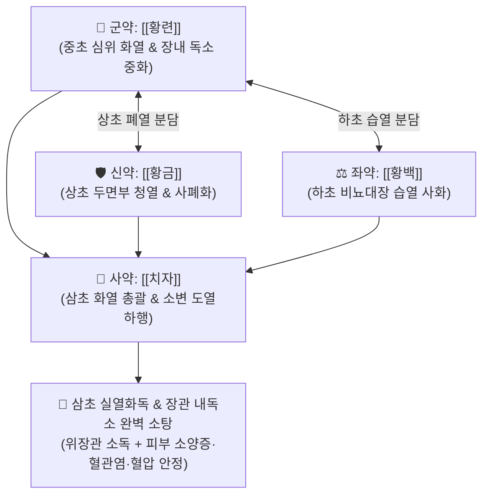

# 🍵 [[황련해독탕]] (黃連解毒湯, Huang-Lian-Jie-Du-Tang / Oren-gedoku-to)

> **핵심 3줄 요약 (Key Summary)**:
> - 🌿 기본 구성: [[황련]], [[황금]], [[황백]], [[치자]] (삼초 고한사화·청열해독의 최고 표준 방제).
> - 🎯 삼초 실열화독(實熱火毒), 장내 미생물 불균형(디스바이오시스)으로 인한 장관 독소 유입, 소양증 위주의 피부 질환([[아토피 피부염]], [[여드름]], [[습진]], [[두드러기]], 주부습진, 음부소양증, 임산부 소양증), 상초 이화작용 과열(안면홍조·구갈·불면·고혈압).
> - 🔬 세균 및 내독소(LPS) 중화 및 장벽 투과성 개선, NF-κB/MAPK 차단을 통한 TNF-α·IL-6 억제, 혈관염 개선 및 국소 뇌혈류량 증가, 위점막 병변 축소 및 혈소판 응집 억제.
> - ⚠️ 주의사항: 극도로 차고 쓴 약성으로 인해 평소 속이 차고 대변이 묽은 비위허한(脾胃虛寒) 환자에게는 금기이며, 피부가 건조할 때는 [[당귀음자]]와 합방.

---

## 📌 목차
1. [기본 처방 정보 & 군신좌사 구성](#1-기본-처방-정보--군신좌사-구성)
2. [방제학적 약재 상호작용 & 시너지 네트워크](#2-방제학적-약재-상호작용--시너지-네트워크)
3. [현대 분자약리학적 효능 & 작용 기전](#3-현대-분자약리학적-효능--작용-기전)
4. [적응 병증 및 체질별 감별 (Sweet Spot vs 금기)](#4-적응-병증-및-체질별-감별-sweet-spot-vs-금기)
5. [유사 처방군 감별 매트릭스](#5-유사-처방군-감별-매트릭스)
6. [임상 가감례 & 현대 질환별 응용](#6-임상-가감례--현대-질환별-응용)
7. [💡 사용자 진료실 핵심 필기 & 임상 팁 (원문 보존)](#7--사용자-진료실-핵심-필기--임상-팁-원문-보존)
8. [출처 및 학술 참고 문헌 (References)](#8-출처-및-학술-참고-문헌-references)

---

## 1. 기본 처방 정보 & 군신좌사 구성

* **출전**: 왕도(王燾) 『[[외대비요]]』(外臺秘要) 인용 『최씨방』(崔氏方)
* **치법**: 사화해독(瀉火解毒), 청열조습(淸熱燥濕), 양혈소염(涼血消炎), 장관정화(腸管淨化)

| 구분 | 약재명 | 표준 용량 | 본초 효능 & 방제 내 역할 |
| :--- | :--- | :--- | :--- |
| **군약 (君藥)** | [[황련]] | 6~9g | **사심화·청중초열**: 심장과 위장의 실화를 끄고 장관 세균 및 내독소(LPS)를 중화 |
| **신약 (臣藥)** | [[황금]] | 6~9g | **청상초열·사폐화**: 폐열과 두면부로 치솟는 풍열을 진압하여 안면홍조와 두피 염증 차단 |
| **좌약 (佐藥)** | [[황백]] | 4~6g | **청하초열·사신화**: 방광과 대장의 습열을 내리고 골증허열을 억제 |
| **사약 (使藥)** | [[치자]] | 6~9g | **통사삼초·도열하행**: 상·중·하 삼초의 모든 화열을 소변으로 끌고 나가 배출 |

> **방제 구조 분석**:
> * **삼초 분치(三焦分治)와 도열하행(導熱下行)**: [[황금]]은 상초(폐), [[황련]]은 중초(심·비위), [[황백]]은 하초(신·방광·대장)를 각각 분담하여 사화하고, [[치자]]가 삼초 전체의 화열을 엮어 소변으로 배출시키는 완벽한 3D 입체 사화 구조.

---

## 2. 방제학적 약재 상호작용 & 시너지 네트워크

* **위장관의 '빨간약(포비돈)' 작용**: 유해균 증식과 내독소 분비로 오염된 장점막을 천연 살균하듯 정화하여 전신 염증의 원천을 차단합니다.

---

## 3. 현대 분자약리학적 효능 & 작용 기전

### 1) 세균·내독소(LPS) 중화 및 장벽 투과성 개선
* [[황련]]의 [[베르베린]]과 [[황금]]의 [[바이칼린]]이 장내 그람음성균 세포벽에 결합하여 세균 및 분비되는 외독소·내독소(LPS)를 결합 비활성화(염색 효과)시키고 장 점막 밀착연접(Tight junction)을 강화합니다.

### 2) 혈관염 개선 및 국소 뇌혈류량 증가 (혈압 조절)
* 혈관 내피세포의 eNOS를 활성화하여 혈관 평활근 연축을 풀고, 혈관염증을 개선하며 국소 뇌혈류량을 증가시켜 혈압 상승을 억제하고 혈소판 응집을 차단합니다.

### 3) 위점막 장애 면적 축소 및 항궤양 작용
* 위산 과다 분비 및 스트레스성 위점막 혈류 장애를 개선하여 위점막 손상 면적을 현저히 축소시킵니다.

### 4) 상초 이화작용(Catabolism) 과열 진정
* 대사적으로 상초의 과도한 이화작용(에너지 과다 소모 및 열 발생)을 억제하여 전신 고열, 대갈(구갈), 안면 상열감을 가라앉힙니다.

---

## 4. 적응 병증 및 체질별 감별 (Sweet Spot vs 금기)

### 1) 주요 적응증 (Target Indications)
* **피부과 질환 (가려움증 위주)**:
  * 가려움이 주증상인 [[아토피 피부염]], 안면 화농성 [[여드름]], 급·만성 [[습진]], [[두드러기]], 주부습진.
  * 질염 및 음부소양증, 임산부 소양증(단기 투여).
* **소화기 및 장내 환경 질환**:
  * 장내 미생물총 불균형(디스바이오시스), 잦은 설사/변비 교대, 염증성 장질환.
* **심혈관 및 자율신경계**:
  * 고혈압성 안면홍조, 두통, 심계항진, 번조불안, 불면증, 코피(비출혈).

### 2) 체질별 적합도 & 금기
* **적합 체질 (Sweet Spot)**:
  * 얼굴이 붉고 체격이 건실하며, 열이 많고 성격이 급하며 갈증과 불면을 호소하는 소양인·태음인 실열형 환자.
* **절대 금기 및 주의 (Contraindications)**:
  * **비위허한증 환자 금기**: 평소 배가 차고 묽은 변을 보며 소화가 안 되는 환자에게 장기 투약 금기.
  * **건조성 피부 환자**: 피부가 바짝 마르고 각질이 심한 음혈허 환자는 단독 투약하지 않고 [[당귀음자]]와 합방.

---

## 5. 유사 처방군 감별 매트릭스

| 처방명 | 구성 차이 | 주치 병태 차이 | 감별 요점 |
| :--- | :--- | :--- | :--- |
| [[황련해독탕]] | 황련, 황금, 황백, 치자 | **삼초 실열화독 (변비 없음)** | **전신 화독, 피부 소양증, 혈관염, 불면** |
| [[삼황사심탕]] | 대황, 황련, 황금 | **중초 실열 + 변비 (대황 추가)** | 대황으로 독소를 더 확실히 빼내나 몸에 무리가 될 수 있음 |
| [[온청음]] | 황련해독탕 + 사물탕 | **혈허 + 열독** | 건조하고 가려운 만성 피부염, 갱년기 출혈 |
| [[당귀음자]] | 사물탕 + 황기, 백질려, 방풍, 형개 | **혈허풍조 (건조성 가려움)** | 피부가 버석거리고 진물 없이 가려움 극심 |

---

## 6. 임상 가감례 & 현대 질환별 응용

### 1) 변증 가감법
* **피부가 건조하고 각질이 일어나는 가려움증**: $\rightarrow$ [[당귀음자]] 또는 [[사물탕]]과 합방 ([[온청음]] 구조).
* **변비가 심하고 독소 배출이 급할 시**: + [[대황]] ([[삼황사심탕]] 계열).
* **피부 농포와 진물이 심할 시**: + [[금은화]], [[연교]], [[포공영]].

### 2) 현대 질환별 매핑
* **피부과**: 아토피 피부염, 중증 여드름, 화폐상 습진, 급성 두드러기, 접촉성 피부염, 주부습진.
* **소화기과**: 장내 유해균 과다 증식, 급성 세균성 장염, 알코올성 위염.
* **순환기/정신과**: 본태성 고혈압 두통, 뇌혈관염, 조증성 불면증.

---

## 7. 💡 사용자 진료실 핵심 필기 & 임상 팁 (원문 보존)

> [!tip] **진료실 실전 노하우 (User Clinical Insight)**
> - **위장관의 '빨간약(포비돈)' 항균·항염 원리**: 장내 미생물 환경이 무너져 유해균 독소가 혈류를 타고 전신으로 번질 때, 위장관에 빨간약을 발라주듯 세균과 내독소(LPS)를 결합·염색하여 불활성화시킴.
> - **가려움 위주 피부 질환의 1차 선택**: 아토피 피부염에서 가려움이 극심한 경우, 임산부 가려움, 음부소양증, 화농성 여드름, 습진, 두드러기, 주부습진에 신속한 진정 효과를 발휘함.
> - **피부 건조 시 당귀음자 합방**: 피부에 진물이 없고 바짝 마르며 가려울 때는 황련해독탕 단독 투여를 피하고 [[당귀음자]]나 [[사물탕]]을 반드시 합방하여 음혈을 보강해야 함.
> - **상초 기화(氣化)의 현대적 의미**: 상초의 기화는 현대 생리학적으로 '이화작용(Catabolism)'을 의미하며, 이화작용이 지나치게 항진되면 상열감, 체중 감소, 염증열이 폭발하므로 황련해독탕으로 이를 진정시킴.
> - **삼황사심탕과의 감별**: 삼황사심탕은 [[대황]]이 추가되어 장관 독소를 더욱 강력히 배출시키지만 체력 소모가 크므로, 설사 경향이 있거나 체력이 중간 이하인 환자에게는 황련해독탕이 훨씬 안전함.

---

## 8. 출처 및 학술 참고 문헌 (References)

1. **Wang T (王燾) (752)**. *Waitai Miyao* (外臺秘要), citing *Cui Shi Fang*.
   * `[연구 요약]`: 황련해독탕 원전 수록, 삼초 실열화독 치료 사화해독 표준 방제 제정.
2. * **Nose M et al. (2026)**. Berberine is a key active component underlying the anti-allergic actions of orengedokuto in a murine model of contact hypersensitivity. *Journal of natural medicines*, 80: 1142-1151. [PMID: 42204064](https://pubmed.ncbi.nlm.nih.gov/42204064/)
3. * **Zhang DM et al. (2007)**. Effect of baicalin and berberine on transport of nimodipine on primary-cultured, rat brain microvascular endothelial cells. *Acta pharmacologica Sinica*, 28: 573-8. [PMID: 17376298](https://pubmed.ncbi.nlm.nih.gov/17376298/)
