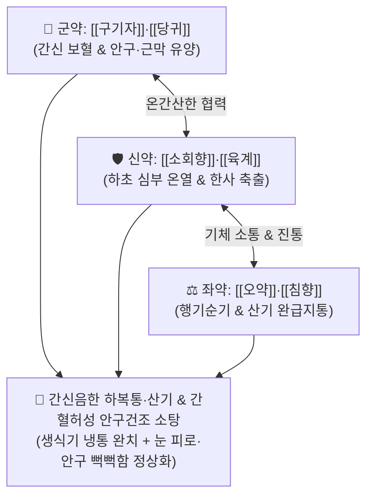

# 🍵 [[난간전]] (煖肝煎, Nuangan Decoction)

> **핵심 3줄 요약 (Key Summary)**:
> - 🌿 기본 구성: [[당귀]], [[구기자]], [[소회향]], [[육계]], [[오약]], [[침향]], [[복령]], [[생강]] (구기자·당귀의 보간신양혈 + 소회향·육계의 온간산한 + 오약·침향의 순기지통).
> - 🎯 간신음한(肝腎陰寒) 및 기혈 부족으로 인한 하복부 냉통(소복냉통), 고환·음낭 산통(한산 寒疝), 여성 한성 월경통, 야간 스마트폰 과다 사용으로 인한 안구건조·눈 뻑뻑함(간혈허성 안건증).
> - 🔬 골반강 및 생식기 미세혈관 확장, TRPM8/TRPA1 냉각 통각 수용체 과흥분 억제, 안구 미세혈류 촉진 및 눈물막 지질층 안정화, 평활근 경련 완화(진경지통).
> - ⚠️ 주의사항: 간담 습열이나 음허화왕으로 인한 음낭 종통, 안구 충혈, 번열이 있는 실열 환자에게는 투약 금기.

---

## 📌 목차
1. [기본 처방 정보 & 군신좌사 구성](#1-기본-처방-정보--군신좌사-구성)
2. [방제학적 약재 상호작용 & 시너지 네트워크](#2-방제학적-약재-상호작용--시너지-네트워크)
3. [현대 분자약리학적 효능 & 작용 기전](#3-현대-분자약리학적-효능--작용-기전)
4. [적응 병증 및 체질별 감별 (Sweet Spot vs 금기)](#4-적응-병증-및-체질별-감별-sweet-spot-vs-금기)
5. [유사 처방군 감별 매트릭스](#5-유사-처방군-감별-매트릭스)
6. [임상 가감례 & 현대 질환별 응용](#6-임상-가감례--현대-질환별-응용)
7. [💡 사용자 진료실 핵심 필기 & 임상 팁 (원문 보존)](#7--사용자-진료실-핵심-필기--임상-팁-원문-보존)
8. [출처 및 학술 참고 문헌 (References)](#8-출처-및-학술-참고-문헌-references)

---

## 1. 기본 처방 정보 & 군신좌사 구성

* **출전**: 장경악(張景岳) 『[[경악전서]]』(景岳全書) 신방팔진(新方八陣) 온진(溫陣)
* **치법**: 온보간신(溫補肝腎), 산한지통(散寒止痛), 행기소간(行氣疏肝), 양혈명목(養血明目)

| 구분 | 약재명 | 표준 용량 | 본초 효능 & 방제 내 역할 |
| :--- | :--- | :--- | :--- |
| **군약 (君藥)** | [[구기자]], [[당귀]] | 각 9~12g | **자보간신·양혈윤조**: 간신(肝腎)의 음혈을 크게 보하여 근막(肝主筋)을 유양하고 눈의 진액 고갈 해소 |
| **신약 (臣藥)** | [[소회향]], [[육계]] | 각 4~6g | **온간산한·난신지통**: 간경락과 하초의 깊은 한사를 덥혀 몰아내고 생식기·골반강 혈류 순환 촉진 |
| **좌약 (佐藥)** | [[오약]], [[침향]] | 각 3~5g | **순기지통·소간행기**: 간기의 울결을 소통시키고 기체로 인한 하복부와 산기 팽만통을 신속히 완화 |
| **좌약 (佐藥)** | [[복령]], [[생강]] | 각 4~6g | **건비삼습·온위화중**: 비위를 따뜻하게 돕고 하초의 불필요한 수습 정체 배출 |

> **방제 구조 분석**:
> * **온보(溫補)와 행기(行氣)의 황금 결합**: 단순한 진통제나 온리제가 아니라, [[구기자]]·[[당귀]]로 마른 간혈을 적셔 근육을 부드럽게 풀면서, [[소회향]]·[[육계]]·[[오약]]으로 차가운 한사를 몰아내어 하초와 두면부 경락의 혈행을 동시에 뚫어줍니다.

---

## 2. 방제학적 약재 상호작용 & 시너지 네트워크

* **보간양혈(補肝養血)과 간주근(肝主筋) 완화**: 간은 근육을 주관하므로(간주근), 당귀·구기자가 간혈을 채워 골반저근육과 안근의 긴장을 풀고, 소회향·육계가 찬 기운을 흩어 경련성 통증을 멈춥니다.

---

## 3. 현대 분자약리학적 효능 & 작용 기전

### 1) 골반강 미세순환 개선 및 평활근 경련 이완
* [[소회향]]의 아네톨(Anethole)과 [[육계]]의 [[신남알데하이드]]가 말초 세혈관을 확장시키고, 자궁 및 고환 거근 평활근의 비정상적 수축을 이완시켜 한랭 유발성 통증을 차단합니다.

### 2) 안구 미세혈류 촉진 및 눈물막 지질층 안정화
* [[구기자]]의 지아잔틴(Zeaxanthin)과 베타인(Betaine) 성분이 망막 모세혈관 혈류를 개선하고, 마이봄선(Meibomian gland) 염증을 억제하여 야간 스마트폰 사용으로 인한 눈물막 파괴와 안구건조증을 개선합니다.

### 3) 냉각 통각 수용체(TRPA1/TRPM8) 과흥분 차단
* [[오약]]의 세스퀴테르펜 성분이 한랭 자극에 반응하는 감각 신경의 통각 신호 전달을 차단하여 냉각 과민성 신경통을 진정시킵니다.

---

## 4. 적응 병증 및 체질별 감별 (Sweet Spot vs 금기)

### 1) 주요 적응증 (Target Indications)
* **간신음한성(肝腎陰寒) 비뇨생식기 질환**:
  * 아랫배가 차갑고 묵직하게 쥐어짜듯 아픈 소복냉통(少腹冷痛).
  * 고환이 땅기고 아프거나 음낭이 차갑고 축축하게 붓는 산기(한산 寒疝), 정계정맥류성 둔통, 부고환염 회복기.
  * 여성의 한성(寒性) 원발성 월경통, 골반강 냉증, 성교통.
* **간혈허성 안과 질환 (원장님 핵심 진료 노하우)**:
  * 밤늦게 스마트폰을 오래 보아 눈이 뻑뻑하고 건조하며 모래가 들어간 듯 아픈 만성 안구건조증.
  * 눈이 쉽게 피로하고 침침하며 시력이 흐려지는 안정피로(Asthenopia).

### 2) 체질별 적합도 & 금기
* **적합 체질 (Sweet Spot)**:
  * 몸이 차고 추위를 몹시 타며, 아랫배가 냉하고 눈이 침침하며 마른 체형의 소음인·태음인 한증 환자.
* **절대 금기 및 주의 (Contraindications)**:
  * **간담 습열 실증**: 고환이나 아랫배가 붉게 붓고 열감이 펄펄 끓으며 소변이 붉은 환자는 [[용담사간탕]]을 써야 하며, 난간전 투약 금기.

---

## 5. 유사 처방군 감별 매트릭스

| 처방명 | 병태 생리 | 주요 구성 차이 | 주치 부위 및 감별 포인트 |
| :--- | :--- | :--- | :--- |
| [[난간전]] | **간신허한 + 간기울체** | 구기자, 당귀, 소회향, 육계, 오약, 침향 | **소복냉통, 고환 산통, 눈 뻑뻑함(안건증)** |
| [[천태오약산]] | **간경 한응기체 실증** | 오약, 천련자, 소회향, 목향, 청피, 고련근 | 고환이 붓고 찌르듯 아픈 급성 산기 실열증 |
| [[당귀사역탕]] | **혈허내한 + 경맥 울체** | 당귀, 계지, 작약, 세신, 통초, 감초 | 사지 말초 수족냉증, 동상, 레이노병 |
| [[소복축어탕]] | **하초 어혈 + 한응** | 오약, 소회향, 당귀, 천궁, 몰약, 포황, 오령지 | 아랫배 콕콕 찌르는 칼로 베는 듯한 어혈 통증 |

---

## 6. 임상 가감례 & 현대 질환별 응용

### 1) 변증 가감법
* **근육 긴장 및 경련성 복통 극심 시**: + [[작약]], [[감초]] ([[작약감초탕]] 구조 결합) $\rightarrow$ 간주근(肝主筋) 완급지통 극대화.
* **야간 스마트폰 과다로 인한 눈 마름 극심 시**: $\rightarrow$ [[구기자]] 용량을 15~20g으로 증량하고 + [[결명자]], [[산수유]] 가미.
* **한랭성 월경통 및 골반 어혈 동반 시**: + [[현호색]], [[향부자]] (활혈이기).

### 2) 현대 질환별 매핑
* **비뇨생식기과**: 음낭수종, 만성 고환통, 정계정맥류 냉통, 만성 비세균성 전립선염.
* **부인과**: 한랭성 속발성/원발성 월경통, 골반 울혈 증후군, 자궁 발육 부전성 냉통.
* **안과**: 만성 안구건조증(Dry Eye Syndrome), 컴퓨터/스마트폰 영상표시장치 증후군(VDT 증후군).

---

## 7. 💡 사용자 진료실 핵심 필기 & 임상 팁 (원문 보존)

> [!tip] **진료실 실전 노하우 (User Clinical Insight)**
> - **작약 가미를 통한 간주근(肝主筋) 완화**: 간이 주관하는 근막(筋膜)과 골반저근의 경련성 긴장을 풀 때는 [[작약]]을 8~12g 적극 가미하여 근육 이완과 진통 효과를 배가시킴.
> - **야간 스마트폰 안건증 & 구기자 처방 요령**: 밤늦게 어두운 방에서 스마트폰을 보아 눈이 뻑뻑하고 마르며 시야가 침침한 간혈허성 눈 피로 환자에게 [[구기자]]를 대량 배오**하여 간신음혈을 자양하면 눈의 건조감과 피로가 신속히 사라짐.
> - **남성 고환 냉통의 감별**: 고환을 만졌을 때 차갑고 쪼그라들며 묵직하게 당길 때 최상의 적중률을 보이며, 열감이 있는 급성 부고환염에는 절대 쓰지 않음.

---

## 8. 출처 및 학술 참고 문헌 (References)

1. **Zhang JA (張景岳) (1624)**. *Jingyue Quanshu* (景岳全書), Xinfang Bazhen, Wen-zhen.
   * `[연구 요약]`: 난간전 창방, 간신음한으로 인한 소복냉통 및 산기 치료 표준 방제 확립.
2. * **Yang Y et al. (2026)**. Dietary Lycium barbarum Polysaccharides Support Retinal Redox Homeostasis Through Gut Microbiota-Associated Metabolic Modulation. *Food science & nutrition*, 14: e72215. [PMID: 42614456](https://pubmed.ncbi.nlm.nih.gov/42614456/)
