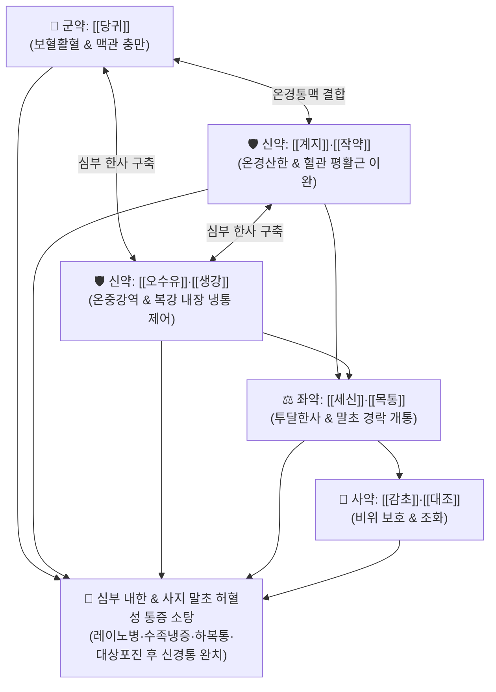

# 🍵 [[당귀사역가오수유생강탕]] (當歸四逆加吳茱萸生薑湯, Danggwisayeok-ga-osuyu-saenggang-tang / Toki-shigaku-ka-goshuyu-shokyo-to)

> **핵심 3줄 요약 (Key Summary)**:
> - 🌿 기본 구성: [[당귀]], [[계지]], [[작약]], [[세신]], [[목통]], [[감초]], [[대조]], [[오수유]], [[생강]] ([[당귀사역탕]]의 온경양혈통맥 + 오수유·생강의 온위강역산한).
> - 🎯 평소 혈허(血虛)에 체내 깊숙이 한사(寒邪)가 침범하여 발생하는 극심한 수족냉증, [[레이노병]], 만성 한랭성 [[두드러기]], 한랭 유발 하복통·요하지통, 수술 후 하복부 통증, [[대상포진]] 후 신경통, 동상.
> - 🔬 eNOS 활성화 및 NO 방출 촉진을 통한 말초 세혈관 확장, TRPM8/TRPA1 냉각 통각 수용체 억제, 프로스타글란딘 합성을 통한 위점막 혈류 개선 및 내장 평활근 경련 완화.
> - ⚠️ 주의사항: 오수유·세신·계지의 강렬한 신온성으로 인해 체내 음허화왕(陰虛火旺) 및 실열로 인한 상열감·출혈 경향 환자에게는 투약 금기.

---

## 📌 목차
1. [기본 처방 정보 & 군신좌사 구성](#1-기본-처방-정보--군신좌사-구성)
2. [방제학적 약재 상호작용 & 시너지 네트워크](#2-방제학적-약재-상호작용--시너지-네트워크)
3. [현대 분자약리학적 효능 & 작용 기전](#3-현대-분자약리학적-효능--작용-기전)
4. [적응 병증 및 체질별 감별 (Sweet Spot vs 금기)](#4-적응-병증-및-체질별-감별-sweet-spot-vs-금기)
5. [유사 처방군 감별 매트릭스](#5-유사-처방군-감별-매트릭스)
6. [임상 가감례 & 현대 질환별 응용](#6-임상-가감례--현대-질환별-응용)
7. [💡 사용자 진료실 핵심 필기 & 임상 팁 (원문 보존)](#7--사용자-진료실-핵심-필기--임상-팁-원문-보존)
8. [출처 및 학술 참고 문헌 (References)](#8-출처-및-학술-참고-문헌-references)

---

## 1. 기본 처방 정보 & 군신좌사 구성

* **출전**: 장중경(張仲景) 『[[상한론]]』(傷寒論) 궐음병편(厥陰病篇)
* **치법**: 온경산한(溫經散寒), 양혈통맥(養血通脈), 온위강역(溫胃降逆), 산한지통(散寒止痛)

| 구분 | 약재명 | 표준 용량 | 본초 효능 & 방제 내 역할 |
| :--- | :--- | :--- | :--- |
| **군약 (君藥)** | [[당귀]] | 10~12g | **보혈양혈·활혈통경**: 혈액을 보충하여 맥관을 채우고 말초 미세혈류를 순환시킴 |
| **신약 (臣藥)** | [[계지]], [[작약]] | 각 8~10g | **온경산한·화영지통**: [[작약감초탕]] 구조로 혈관과 근육 연축을 풀고 혈맥을 덥혀 통양(通陽) |
| **신약 (臣藥)** | [[오수유]], [[생강]] | 각 4~8g | **온중강역·산한지구**: 궐음간경과 양명위경의 차가운 음한을 데우고 구역감과 심한 냉통 진압 |
| **좌약 (佐藥)** | [[세신]], [[목통]] | 각 3~5g | **투달한사·통리경맥**: 뼛속 깊은 한사를 흩뜨리고 막힌 경맥을 뚫어 말초까지 약력 전달 |
| **사약 (使藥)** | [[감초]], [[대조]] | 각 4~6g | **익기화중·조화제약**: 비위를 도와 기혈 생성을 뒷받침하고 급박한 통증 완화 |

> **방제 구조 분석**:
> * **내외표리(內外表裏) 동치**: [[당귀사역탕]]이 표부(경맥 말초)의 혈허한랭을 다스린다면, 여기에 [[오수유]]와 [[생강]]을 더해 이부(위장과 복강 심부)의 냉적과 구역을 함께 몰아내는 궐음병 내한외랭(內寒外冷)의 최고 방제입니다.

---

## 2. 방제학적 약재 상호작용 & 시너지 네트워크

* **보혈과 파한(破寒)의 완벽한 융합**: 피가 모자라면서 찬 기운이 뼈마디와 혈관을 옥죌 때, 피를 채워주면서(당귀·작약·대조) 강력한 온열 약재(계지·세신·오수유·생강)로 혈관을 뚫어냅니다.

---

## 3. 현대 분자약리학적 효능 & 작용 기전

### 1) 혈관내피세포 eNOS 활성화 및 강력한 말초혈관 확장
* [[계지]]의 [[신남알데하이드]]와 [[당귀]]의 페룰산이 혈관내피의 eNOS 인산화를 촉진하여 산화질소(NO) 생성을 증가시키고, 레이노 현상으로 수축된 세동맥 평활근을 강력히 확장시킵니다.

### 2) TRPM8 / TRPA1 냉각 통각 수용체 과흥분 차단
* [[세신]]의 메틸유게놀과 [[오수유]]의 에보디아민(Evodiamine)이 한랭 자극에 반응하는 TRPA1 통각 채널을 탈감작시켜 한랭 과민성 통증 및 신경통을 진정시킵니다.

### 3) 만성 신경 손상 및 대상포진 후 신경통(PHN) 개선
* 척수 후각 신경세포의 감작(Sensitization)을 억제하고 혈류 공급을 개선하여 대상포진 후 신경통, 수술 후 반흔 통증, 만성 요하지통을 완화합니다.

---

## 4. 적응 병증 및 체질별 감별 (Sweet Spot vs 금기)

### 1) 주요 적응증 (Target Indications)
* **사지 말초 혈류 장애 및 한랭 질환**:
  * 추위에 노출되면 손발이 하얗게 질리고 저리며 찌르는 듯 아픈 [[레이노병]](Raynaud's disease) 및 극심한 [[수족냉증]].
  * 매년 겨울철 반복되는 동상, 만성 한랭성 [[두드러기]].
* **심부 한랭성 통증 (원장님 핵심 진료 노하우)**:
  * 체질이 허약하고 손발이 찬 환자의 한랭 유발성 하복통, 요통, 좌골신경통, 사지관절통.
  * 복부 수술 후 유착성 하복부 둔통 및 냉감.
  * 만성 [[대상포진]] 후 신경통(PHN)**, 당뇨병성 말초신경병증의 저림 및 냉통.

### 2) 체질별 적합도 & 금기
* **적합 체질 (Sweet Spot)**:
  * 체형이 마르고 안색이 창백하며, 평소 추위를 몹시 타고 찬 음식을 먹으면 배가 아프거나 토하는 소음인·태음인 혈허한증 환자.
* **절대 금기 및 주의 (Contraindications)**:
  * **실열 및 음허화왕 환자 금기**: 손발바닥에 열이 나고 입이 마르며 번열이 있는 환자에게는 투약 금기.

---

## 5. 유사 처방군 감별 매트릭스

| 처방명 | 기본 구성 차이 | 주치 병태 차이 | 감별 요점 |
| :--- | :--- | :--- | :--- |
| [[당귀사역탕]] | 당귀, 계지, 작약, 세신, 통초, 감초, 대조 | **표부 혈허한랭 (경락)** | 손발 끝이 차고 저린 단순 수족냉증 |
| [[당귀사역가오수유생강탕]] | 당귀사역탕 + **오수유, 생강** | **표리 혈허내한 (경락 + 장부)** | **수족냉증 + 구역질/심한 하복통/내장냉통** |
| [[사역탕]] | 부자, 건강, 감초 | **소음병 신양쇠미 (양허)** | 전신 쇠약, 자한, 맥미세, 쇼크 상태 (회양구역) |
| [[오수유탕]] | 오수유, 인삼, 생강, 대조 | **궐음/양명 허한 구토** | 심한 두통, 구토, 헛구역질 위주 (사지냉통 적음) |

---

## 6. 임상 가감례 & 현대 질환별 응용

### 1) 변증 가감법
* **하복부 어혈 찌르는 통증 동반 시**: + [[현호색]], [[몰약]], [[도인]] (활혈거어지통).
* **기력 저하 및 피로 극심 시**: + [[황기]], [[인삼]] (기혈쌍보).
* **좌골신경통 및 요하지 냉통 극심 시**: + [[독활]], [[우슬]], [[두충]] (보간신강근골).

### 2) 현대 질환별 매핑
* **말초혈관/류마티스**: 레이노 증후군, 버거씨병(폐색성 혈전혈관염), 한랭성 두드러기, 동상.
* **신경통/통증의학과**: 대상포진 후 신경통(PHN), 수술 후 만성 골반통, 좌골신경통.
* **부인과/소화기과**: 한랭성 불임증, 중증 월경통, 만성 한냉성 위장관 경련.

---

## 7. 💡 사용자 진료실 핵심 필기 & 임상 팁 (원문 보존)

> [!tip] **진료실 실전 노하우 (User Clinical Insight)**
> - **허약 체질 환자의 한랭 유발 전신 통증 제1선 방제**: 체질이 허약하고 손발이 얼음장 같은 환자가 찬바람을 쐬거나 겨울철에 심해지는 하복통, 요통, 사지통을 호소할 때 가장 확실한 치료 효과를 발휘함.
> - **레이노병 & 만성 한랭 두드러기의 특효**: 추위 노출 시 손가락이 하얗게 질리는 레이노병 및 찬 공기 노출 시 피부가 부풀어 오르는 만성 두드러기에 혈관 확장과 냉각 통각 차단을 동시에 이끌어냄.
> - **대상포진 후 신경통 및 수술 후 하복통**: 피부 병변이 아문 뒤에도 살을 에이는 듯한 신경통이 남아 있거나, 복부 수술 후 만성 냉통으로 고생하는 환자에게 말초 미세혈류를 뚫어 극적인 통증 경감을 유도함.

---

## 8. 출처 및 학술 참고 문헌 (References)

1. **Zhang ZJ (張仲景) (200)**. *Shanghan Lun* (傷寒論), Jueyin Bing Pian.
   * `[연구 요약]`: 당귀사역가오수유생강탕 원전 수록, 내유구한(內有久寒) 혈허한궐 치료 표준 방제 제정.
