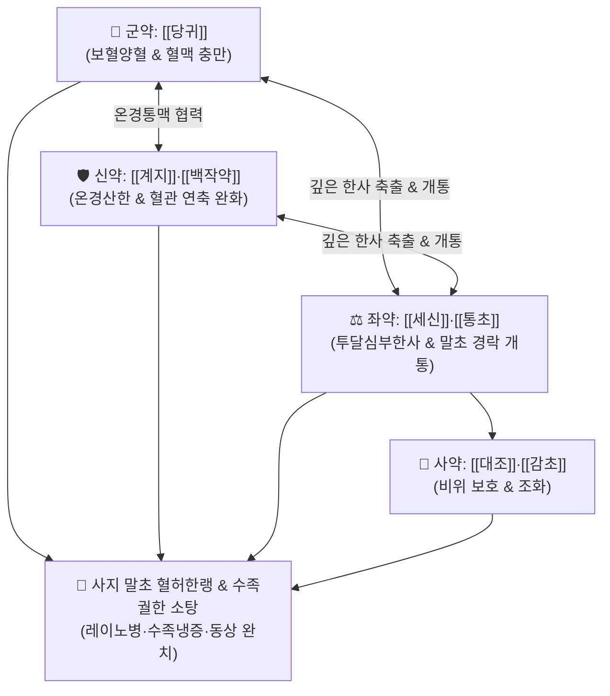

# 🍵 [[당귀사역탕]] (當歸四逆湯, Danggwisayeok-tang / Toki-shigaku-to)

> **핵심 3줄 요약 (Key Summary)**:
> - 🌿 기본 구성: [[당귀]], [[계지]], [[백작약]], [[세신]], [[통초]], [[대조]], [[감초]] (계지탕 변방 + 당귀·세신·통초의 온경산한·양혈통맥).
> - 🎯 궐음병 혈허내한(血虛內寒)으로 인한 사지 말초의 극심한 냉통(수족궐한 手足厥寒), 레이노 증후군, 수족냉증, 만성 재발성 동상, 폐색성 혈전혈관염(버거씨병), 맥세요욕절(脈細欲絶).
> - 🔬 혈관내피세포 eNOS 활성화 및 산화질소(NO) 방출 촉진, 혈소판 응집 억제(TXA2 억제), TRPM8/TRPA1 냉각 통각 수용체 과흥분 차단을 통한 말초 미세혈류 정상화.
> - ⚠️ 주의사항: 실열(實熱)이나 음허화왕(陰虛火旺)으로 손발바닥이 화끈거리는 번열 환자에게는 절대 금기이며, 세신은 3g 이내 정량 준수.

---

## 📌 목차
1. [기본 처방 정보 & 군신좌사 구성](#1-기본-처방-정보--군신좌사-구성)
2. [방제학적 약재 상호작용 & 시너지 네트워크](#2-방제학적-약재-상호작용--시너지-네트워크)
3. [현대 분자약리학적 효능 & 작용 기전](#3-현대-분자약리학적-효능--작용-기전)
4. [적응 병증 및 체질별 감별 (Sweet Spot vs 금기)](#4-적응-병증-및-체질별-감별-sweet-spot-vs-금기)
5. [유사 처방군 감별 매트릭스](#5-유사-처방군-감별-매트릭스)
6. [임상 가감례 & 현대 질환별 응용](#6-임상-가감례--현대-질환별-응용)
7. [💡 사용자 진료실 핵심 필기 & 임상 팁 (원문 보존)](#7--사용자-진료실-핵심-필기--임상-팁-원문-보존)
8. [출처 및 학술 참고 문헌 (References)](#8-출처-및-학술-참고-문헌-references)

---

## 1. 기본 처방 정보 & 군신좌사 구성

* **출전**: 장중경(張仲景) 『[[상한론]]』(傷寒論) 궐음병편(厥陰病篇)
* **치법**: 온경산한(溫經散寒), 양혈통맥(養血通脈), 완급지통(緩急止痛)

| 구분 | 약재명 | 표준 용량 | 본초 효능 & 방제 내 역할 |
| :--- | :--- | :--- | :--- |
| **군약 (君藥)** | [[당귀]] | 10~12g | **보혈양혈·활혈행기**: 혈액을 풍부히 보충하여 맥락을 채우고 말초까지 온기를 전달 |
| **신약 (臣藥)** | [[계지]], [[백작약]] | 각 8~10g | **온경산한·화영지통**: 경맥을 덥히고 혈관 평활근 연축을 풀어 혈류 저항 감소 |
| **좌약 (佐藥)** | [[세신]], [[통초]] | 각 3~6g | **신온투달·통리경락**: 뼛속 깊은 한사를 흩뜨리고 막힌 모세혈관과 경맥을 개통 |
| **사약 (使藥)** | [[대조]], [[감초]] | 각 4~6g | **익기화중·조화제약**: 비위를 도와 기혈 생성을 보좌하고 제약을 조화 |

> **방제 구조 분석**:
> * **계지탕의 온경보혈적 진화**: [[계지탕]]에서 생강을 빼고 [[당귀]]·[[세신]]·[[통초]]를 배합하여, 표(表)의 풍한을 푸는 데서 나아가 **혈관 속의 찬 기운을 몰아내고 혈관을 충만하게 채우는** 온경양혈(溫經養血) 방제로 전환시켰습니다.

---

## 2. 방제학적 약재 상호작용 & 시너지 네트워크

* **보혈(補血) 없는 산한(散寒)은 불가**: 혈액이 부족하면 혈관이 비어 찬 기운에 쉽게 수축되므로, 당귀·작약으로 피를 채우고 계지·세신으로 덥혀 혈행을 뚫는 상호보완적 메커니즘.

---

## 3. 현대 분자약리학적 효능 & 작용 기전

### 1) 혈관내피 eNOS 활성화 및 산화질소(NO) 방출
* [[계지]]의 [[신남알데하이드]]와 [[당귀]]의 페룰산이 혈관내피세포의 eNOS를 인산화하여 NO 방출을 촉진, 수축된 세동맥 평활근을 이완시킵니다.

### 2) 혈소판 응집 억제 및 혈류 점도 개선
* [[백작약]]의 [[페오니플로린]]과 당귀 성분이 트롬복산 A2(TXA2) 생성을 억제하여 미세순환 혈전을 방지하고 혈액 유동성을 향상시킵니다.

### 3) TRPM8 / TRPA1 냉각 통각 수용체 억제
* [[세신]]의 메틸유게놀이 한랭 자극에 과민해진 감각 신경의 통각 전달을 억제하여 냉각 유발성 이질통과 시린 통증을 차단합니다.

---

## 4. 적응 병증 및 체질별 감별 (Sweet Spot vs 금기)

### 1) 주요 적응증 (Target Indications)
* **혈허한궐(血虛寒厥) 수족냉증**:
  * 추위에 노출되면 손발 끝이 얼음장처럼 차갑고 창백해지며 감각이 마비되는 상태(수족궐한).
  * [[레이노병]](Raynaud's phenomenon)**, 폐색성 혈전혈관염(버거씨병).
  * 매년 겨울마다 손가락, 발가락, 귓바퀴가 붓고 가려우며 헐어 터지는 만성 동상.
* **혈허성 한랭 복통 및 관절통**: 아랫배가 차고 묵직하게 아픈 월경통, 산후풍(産後風) 관절 시림.
* **설진 및 맥진**:
  * **설진(舌診)**: 설담태백(舌淡苔白).
  * **맥진(脈診)**: 맥세요욕절(脈細欲絶, 실처럼 가늘어 끊어질 듯한 맥).

### 2) 체질별 적합도 & 금기
* **적합 체질 (Sweet Spot)**:
  * 체구가 마르고 혈색이 창백하며, 겨울철만 되면 손발이 시려 잠을 못 자는 소음인·태음인 혈허형 환자.
* **절대 금기 및 주의 (Contraindications)**:
  * **실열 환자 금기**: 손발바닥이 화끈거리고 열이 나는 음허화왕 및 실열증 환자 금기.

---

## 5. 유사 처방군 감별 매트릭스

| 처방명 | 병태 생리 | 주요 구성 차이 | 주치 및 감별 포인트 |
| :--- | :--- | :--- | :--- |
| [[당귀사역탕]] | **혈허내한 (경락 표부)** | 당귀, 계지, 작약, 세신, 통초, 대조, 감초 | **단순 말초 수족냉증, 동상, 레이노병** |
| [[당귀사역가오수유생강탕]] | **혈허내한 + 장부 심부한** | 당귀사역탕 + **오수유, 생강** | **수족냉증 + 심한 구역질/하복통/내장냉통** |
| [[사역탕]] | **신양쇠미 (양허 전신)** | 부자, 건강, 감초 | 전신 쇠약, 자한, 혼미, 쇼크 (회양구역) |
| [[황기계지오물탕]] | **기허혈체 (혈비)** | 황기, 계지, 작약, 생강, 대조 | 피부 감각 마비(혈비), 저림 위주 (통증 적음) |

---

## 6. 임상 가감례 & 현대 질환별 응용

### 1) 변증 가감법
* **체내 구한(久寒)으로 구역질 및 심한 복통 동반 시**: + [[오수유]], [[생강]] ([[당귀사역가오수유생강탕]]).
* **어혈 찌르는 통증 및 생리통 심할 시**: + [[도인]], [[홍화]], [[현호색]] (활혈거어).
* **허리·무릎 시림 및 관절통 심할 시**: + [[우슬]], [[두충]], [[독활]] (보신강근골).

### 2) 현대 질환별 매핑
* **혈관/결합조직 질환**: 레이노 증후군, 만성 동상, 버거씨병, 전신경화증 초기 말초냉증.
* **신경계 질환**: 말초신경염, 좌골신경통 한냉형, 산후 신경통.
* **부인과 질환**: 원발성 한랭성 월경통, 산후풍 수족냉증.

---

## 7. 💡 사용자 진료실 핵심 필기 & 임상 팁 (원문 보존)

> [!tip] **진료실 실전 노하우 (User Clinical Insight)**
> - **맥세요욕절(脈細欲絶)의 혈허한랭 포착**: 손발이 몹시 차면서 맥을 짚었을 때 실처럼 가늘어 겨우 만져지는 환자에게 당귀사역탕은 말초 혈관을 열고 혈류량을 즉각 회복시키는 최적의 방제.
> - **만성 난치성 동상 치료 SOP**: 매년 겨울철 손발이 트고 헐어 고생하는 환자에게 늦가을(10~11월)부터 예방적으로 투약하면 동상 재발을 완벽히 차단함.
> - **복약 티칭**: 약을 따뜻하게 복용하도록 지도하고, 복용 기간 중에는 냉수 목욕, 찬 음료 섭취, 과도한 냉방 노출을 금지해야 함.

---

## 8. 출처 및 학술 참고 문헌 (References)

1. **Zhang ZJ (張仲景) (200)**. *Shanghan Lun* (傷寒論), Jueyin Bing Pian.
   * `[연구 요약]`: 당귀사역탕 원전 수록, 수족궐한 및 맥세요욕절 치료 온경산한 양혈통맥 표준 방제 제정.
2. * **Zhang D et al. (2026)**. Danggui Sini Decoction Alleviates Sciatica by Reducing Peripheral Sensitization through Downregulation of Transient Receptor Potential Channels in Dorsal Root Ganglions. *Chinese journal of integrative medicine*. [PMID: 42686949](https://pubmed.ncbi.nlm.nih.gov/42686949/)
