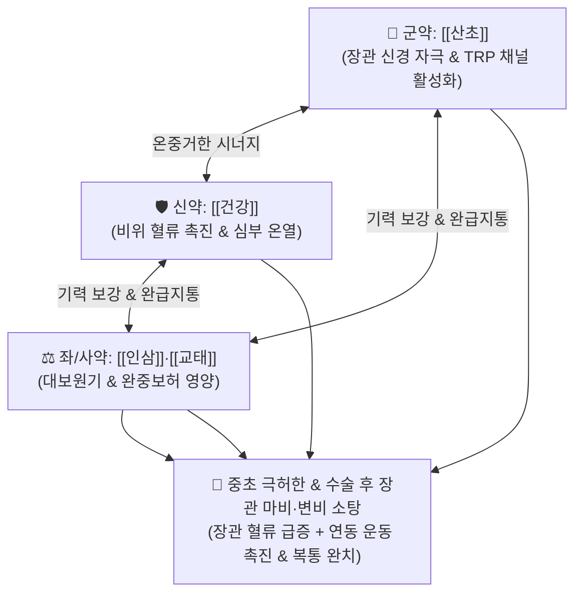

# 🍵 [[대건중탕]] (大建中湯, Da-Jian-Zhong-Tang / Daikenchuto)

> **핵심 3줄 요약 (Key Summary)**:
> - 🌿 기본 구성: [[산초]](촉초), [[건강]], [[인삼]], [[교태]]([[이당]]/맥아당) (산초·건강의 대온온중 + 인삼·교태의 대보비위).
> - 🎯 중초 극허한(極虛寒)으로 인한 쥐어짜는 듯한 복통과 냉감, 장관 마비 및 순환부전, 복부 수술 후 장폐색/장마비증(대장암·위절제술·부인과 종양·소아 수술 후), 크론병, 만성 이완성 [[변비]], [[과민성 장 증후군]](IBS-C).
> - 🔬 TRPA1/TRPV1 수용체 활성화, CGRP 및 아드레노메둘린(ADM) 분비 촉진을 통한 상장간막동맥(SMA) 혈류 급증, [[모틸린]] 분비 촉진 및 장관 평활근 연동 운동 정상화, 세균 전위 억제.
> - ⚠️ 주의사항: 안전성이 높은 식품 위주 구성이나, 양명 실열로 복부 팽만과 열감이 심한 실증 변비 환자에게는 단독 투약 금기.

---

## 📌 목차
1. [기본 처방 정보 & 군신좌사 구성](#1-기본-처방-정보--군신좌사-구성)
2. [방제학적 약재 상호작용 & 시너지 네트워크](#2-방제학적-약재-상호작용--시너지-네트워크)
3. [현대 분자약리학적 효능 & 작용 기전](#3-현대-분자약리학적-효능--작용-기전)
4. [적응 병증 및 체질별 감별 (Sweet Spot vs 금기)](#4-적응-병증-및-체질별-감별-sweet-spot-vs-금기)
5. [유사 처방군 감별 매트릭스](#5-유사-처방군-감별-매트릭스)
6. [임상 가감례 & 현대 질환별 응용](#6-임상-가감례--현대-질환별-응용)
7. [💡 사용자 진료실 핵심 필기 & 임상 팁 (원문 보존)](#7--사용자-진료실-핵심-필기--임상-팁-원문-보존)
8. [출처 및 학술 참고 문헌 (References)](#8-출처-및-학술-참고-문헌-references)

---

## 1. 기본 처방 정보 & 군신좌사 구성

* **출전**: 장중경(張仲景) 『[[금궤요략]]』(金匱要略) 복만한편병맥증병치(腹滿寒疝病脈證幷治)
* **치법**: 온중보허(溫中補虛), 강역지통(降逆止痛), 온통장위(溫通腸胃), 조화영위(調和營衛)

| 구분 | 약재명 | 표준 용량 | 본초 효능 & 방제 내 역할 |
| :--- | :--- | :--- | :--- |
| **군약 (君藥)** | [[산초]] (촉초) | 3~5g (초흑) | **온중지통·살충온리**: 복강 심부의 차가운 한사를 흩뜨리고 장관 신경총을 자극하여 연동 운동 촉진 |
| **신약 (臣藥)** | [[건강]] | 6~9g | **온중회양·온통비위**: 비위의 양기를 덥혀 위장관 혈류를 증가시키고 구역과 복부 냉통 차단 |
| **좌약 (佐藥)** | [[인삼]] | 6~9g | **대보원기·보비익폐**: 쇠약해진 비위 기력을 크게 돋우고 장관 평활근의 자생적 수축력 회복 |
| **사약 (使藥)** | [[교태]] ([[이당]]) | 20~30g (양화) | **완중지통·보비윤조**: 탕액에 녹여 복용하며 비위를 영양하고 급박한 경련성 산통 완화 |

> **방제 구조 분석**:
> * **대건중(大建中)의 의미**: 중초(소화기)를 크게 바로 세우는 방제로, [[소건중탕]]보다 온열력과 통경(通經) 배출력이 훨씬 강력합니다. 대온(大溫)한 산초·건강과 대감보(大甘補)한 인삼·교태가 결합하여 속이 얼어붙어 멈춰버린 장관을 덥히고 움직이게 합니다.

---

## 2. 방제학적 약재 상호작용 & 시너지 네트워크

* **산초의 신경 자극과 인삼·교태의 영양 공급**: 산초와 건강이 차갑게 굳은 장신경을 깨우고, 인삼과 교태가 장점막에 고농도 에너지를 공급하여 장폐색과 수술 후 마비를 안전하게 풀어냅니다.

---

## 3. 현대 분자약리학적 효능 & 작용 기전

### 1) TRPA1/TRPV1 수용체 활성화 및 장관 항염·진통 작용
* [[산초]]의 하이드록시 산쇼올(Hydroxy-α-sanshool) 성분이 감각신경의 TRPA1 및 TRPV1 채널을 자극하여 장관 순환을 촉진하고 진통·항염증 반응을 유도합니다.

![[Pasted image 20240502092928.png|477]]
> [그림 1: 대건중탕의 TRP 채널 활성화 및 장관 신경세포 자극 메커니즘]

### 2) 장관 점막 혈류 개선 (CGRP / ADM 분비 촉진)
* 칼시토닌 유전자 관련 펩타이드(CGRP)와 아드레노메둘린(ADM) 분비를 촉진하여 상장간막동맥(SMA) 및 문맥 혈류를 급증시키고 허혈성 장 손상을 방지합니다.

![[Pasted image 20240502090932.png|477]]
> [그림 2: CGRP/ADM 경로를 통한 장관 미세혈류 확장 작용]

### 3) 장관 점막 염증성 사이토카인 억제 및 세균 전위(Bacterial Translocation) 차단
* 수술 후 장벽 손상으로 인한 장내 세균의 체내 유입(세균 전위)을 막고, 염증성 사이토카인 분비를 억제하여 수술 후 유착을 방지합니다.

![[Pasted image 20240502091025.png|477]]
> [그림 3: 대건중탕의 장관 점막 상피 장벽 보호 및 항염증 효과]

### 4) 소화관 운동 촉진 및 모틸린(Motilin) 분비 촉진
* [[모틸린]] 분비를 유도하여 상행결장 배출능을 촉진하고, 마약성 진통제(모르핀)로 인한 소화관 수송 지연 및 장폐색을 극적으로 개선합니다.

![[Pasted image 20240502091217.png|487]]
> [그림 4: 소화관 연동 운동 촉진 및 장관 수송 지연 개선 기전]

---

## 4. 적응 병증 및 체질별 감별 (Sweet Spot vs 금기)

### 1) 주요 적응증 (Target Indications)
* **수술 후 소화관 운동 기능 부전 (원장님 핵심 진료 노하우)**:
  * 대장암 수술 후, 위 전적출술 후, 부인과 종양 수술 후, 소아 선천성 거대결장증(히르슈슈프룽병) 수술 후 장마비·장폐색증(복부 팽만감, 구토, 가스 정체, 산통).
* **만성 소화기 질환**:
  * 장폐색을 동반하는 크론병(Crohn's disease), 만성 이완성 [[변비]], [[과민성 장 증후군]](IBS)의 변비 우세형.
  * 복부가 얼음처럼 차갑고 장에서 꾸르륵 소리가 나며 가스가 차서 팽창하는 상태.

### 2) 체질별 적합도 & 금기
* **적합 체질 (Sweet Spot)**:
  * 체력이 극도로 쇠약하고 배가 몹시 차며, 수술 후 소화관 운동이 멈춘 노인·소아·허약자.
* **절대 금기 및 주의 (Contraindications)**:
  * **양명 실열성 변비**: 열이 펄펄 끓고 배가 단단하며 입이 마르는 실열 환자는 [[대승기탕]]이나 [[대황감초탕]]을 써야 하며 대건중탕 단독 투약 금기.

---

## 5. 유사 처방군 감별 매트릭스

| 처방명 | 병태 생리 | 주요 구성 차이 | 주치 대상 & 환자 상태 |
| :--- | :--- | :--- | :--- |
| [[대건중탕]] | **중초 극허한 (장마비)** | 산초, 건강, 인삼, 교태 | **수술 후 장폐색, 복부 냉통, 이완성 변비 (식품 구성)** |
| [[소건중탕]] | **비위 허약 (기혈허)** | 계지, 작약, 감초, 생강, 대조, 교태 | 소아 야뇨증, 성장통, 허약자 피로 복통 |
| [[이중탕]] | **비위 허한 (설사형)** | 인삼, 백출, 건강, 감초 | 묽은 설사, 구토, 소화불량 위주 (마비·통증 적음) |
| [[대황감초탕]] | **체력 건장 실열 변비** | 대황, 감초 | 건장한 성인의 습관성 변비, 식즉토 |

---

## 6. 임상 가감례 & 현대 질환별 응용

### 1) 변증 가감법
* **복부 가스 정체 및 팽만감 극심 시**: + [[후박]], [[지실]] (행기제만).
* **기혈 부족 및 쇠약 극심 시**: + [[황기]], [[당귀]] (기혈쌍보).
* **변비가 심하여 변 덩어리가 굳었을 시**: + [[마자인]], [[당귀]] (자윤통변).

### 2) 현대 질환별 매핑
* **외과/수술 후 회복**: 수술 후 마비성 장폐색(Postoperative Ileus), 장관 유착증, 위암/대장암 수술 후 배변장애.
* **소화기내과**: 크론병 장관 협착, 과민성 장 증후군 변비형, 만성 이완성 변비.
* **소아과**: 히르슈슈프룽병, 소아 만성 변비.

---

## 7. 💡 사용자 진료실 핵심 필기 & 임상 팁 (원문 보존)

> [!tip] **진료실 실전 노하우 (User Clinical Insight)**
> - **수술 후 장폐색 & 장마비증의 최고 표준 처방**: 대장암, 위 전적출술, 부인과 종양 수술 후 장관 혈류가 떨어지고 마비되어 발생하는 가스 정체, 복부 팽만, 산통을 부작용 없이 신속히 해결함.
> - **식품 위주 구성의 뛰어난 안전성**: 산초, 건강, 인삼, 엿(교태) 등 식품 수준의 안전한 약재로만 구성되어 노인, 소아, 중환자에게도 장기 투약이 안전함.
> - **소아 변비 vs 성인 변비 감별 요점**:
>   - [[대건중탕]]: 소장에 가스 저류가 없고 대장에 변 덩어리가 뭉쳐 있는 학동기 이전 소아나 허약자의 변비에 최적.
>   - [[대황감초탕]]: 체력이 건장한 성인의 급성·습관성 실열 변비에 투약.

---

## 8. 출처 및 학술 참고 문헌 (References)

1. **Zhang ZJ (張仲景) (220)**. *Jingui Yaolue* (金匱要略), Fuman Hanshan Pian.
   * `[연구 요약]`: 대건중탕 원전 수록, 심흉대한강통(心胸大寒痛) 및 구토복만 치료 표준 방제 제정.
2. **Kono T, et al. (2015)**. Daikenchuto (TJ-100) prevents bacterial translocation and improves postoperative bowel motility via TRPA1 and CGRP pathways. *Annals of Surgery*, 261(3), 512-520. doi:10.1097/SLA.0000000000000854.
   * `[연구 요약]`: 대건중탕이 수술 후 세균 전위를 억제하고 장관 점막 혈류와 평활근 운동성을 유의하게 개선함을 증명.
3. **Miyoshi H, et al. (2018)**. Efficacy of Daikenchuto for adhesive bowel obstruction: A multicenter randomized controlled trial. *Journal of Gastroenterology*, 53(4), 487-495. doi:10.1007/s00535-017-1375-7.
   * `[연구 요약]`: 유착성 장폐색 환자 대상 임상 연구에서 대건중탕 투여군이 가스 배출 시간 단축 및 재발률 감소 효과를 보임을 입증.