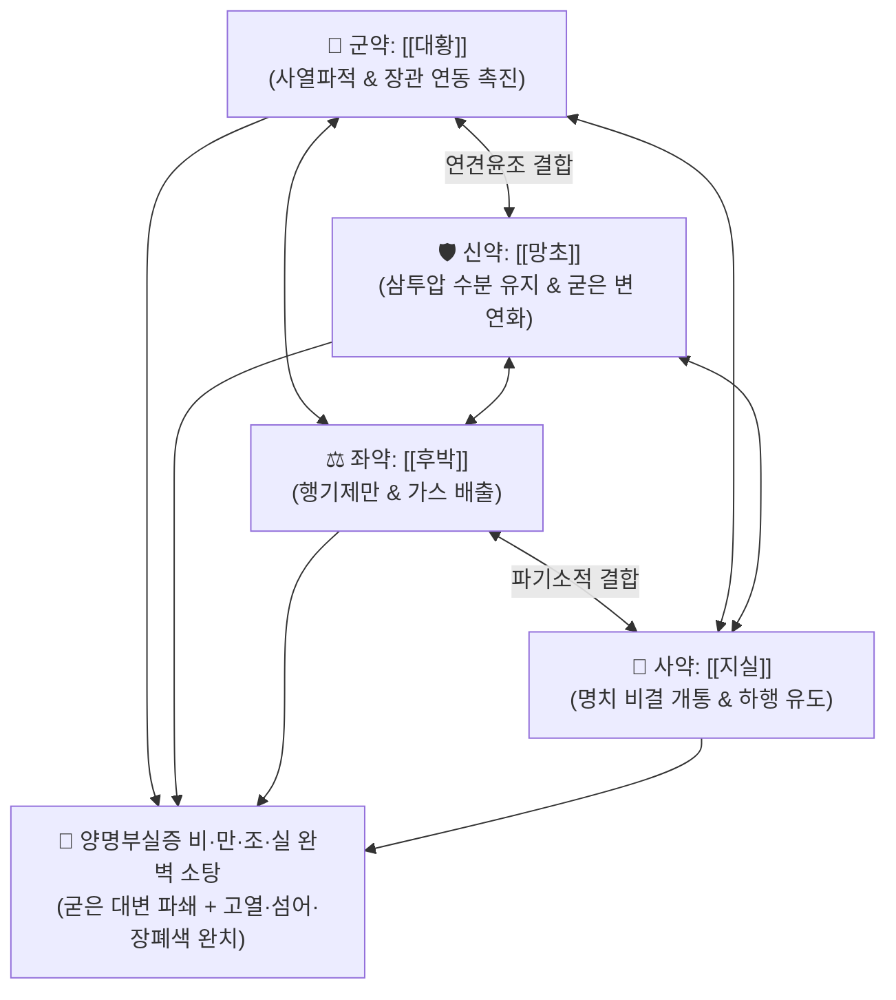

# 🍵 [[대승기탕]] (大承氣湯, Da-Cheng-Qi-Tang / Dai-joki-to)

> **핵심 3줄 요약 (Key Summary)**:
> - 🌿 기본 구성: [[대황]], [[망초]], [[지실]], [[후박]] (비·만·조·실 4대 양명부실증을 소탕하는 준하열결 대표 방제).
> - 🎯 양명부실증(陽明腑實證)으로 인한 극심한 변비, 복부 팽만과 압통(복만통거안), 조열(潮熱), 헛소리(섬어), 열결방류(熱結旁流, 굳은 변 뒤로 악취 나는 맑은 물만 찔끔거림), 고열성 장폐색.
> - 🔬 센노사이드의 레인안트론 대사를 통한 대장 연동 촉진, 황산나트륨 삼투압 작용으로 변 연화, 마그놀롤·헤스페리딘의 장내가스 배출 및 내독소(LPS) 혈류 유입 차단.
> - ⚠️ 주의사항: 강력한 공하제이므로 비위허한, 임산부, 체력 쇠약 노인 및 복통이 유연한 환자에게는 절대 금기 (중병즉지).

---

## 📌 목차
1. [기본 처방 정보 & 군신좌사 구성](#1-기본-처방-정보--군신좌사-구성)
2. [방제학적 약재 상호작용 & 시너지 네트워크](#2-방제학적-약재-상호작용--시너지-네트워크)
3. [현대 분자약리학적 효능 & 작용 기전](#3-현대-분자약리학적-효능--작용-기전)
4. [적응 병증 및 체질별 감별 (Sweet Spot vs 금기)](#4-적응-병증-및-체질별-감별-sweet-spot-vs-금기)
5. [유사 처방군 감별 매트릭스](#5-유사-처방군-감별-매트릭스)
6. [임상 가감례 & 현대 질환별 응용](#6-임상-가감례--현대-질환별-응용)
7. [💡 사용자 진료실 핵심 필기 & 임상 팁 (원문 보존)](#7--사용자-진료실-핵심-필기--임상-팁-원문-보존)
8. [출처 및 학술 참고 문헌 (References)](#8-출처-및-학술-참고-문헌-references)

---

## 1. 기본 처방 정보 & 군신좌사 구성

* **출전**: 장중경(張仲景) 『[[상한론]]』(傷寒論) 양명병편(陽明病篇)
* **치법**: 준하열결(峻下熱結), 사화구음(瀉火救陰), 통부설열(通腑泄熱), 파기소만(破氣消滿)

| 구분 | 약재명 | 표준 용량 | 본초 효능 & 방제 내 역할 |
| :--- | :--- | :--- | :--- |
| **군약 (君藥)** | [[대황]] | 10~15g (후하) | **사열통변·파적도체**: 장관의 굳은 실열과 조시(燥屎)를 강력하게 밀어내어 배출 |
| **신약 (臣藥)** | [[망초]] | 9~12g (양화) | **윤조연견·사열통변**: 삼투압으로 수분을 끌어들여 돌처럼 굳은 대변을 부드럽게 녹임 |
| **좌약 (佐藥)** | [[후박]] | 12~20g (선전) | **행기제만·강역화위**: 장관의 심한 가스 정체와 복부 팽만감을 제거 (제만 굴곡) |
| **사약 (使藥)** | [[지실]] | 9~12g | **파기소적·산결통부**: 명치 밑이 꽉 막힌 비결(痞結)을 뚫어 약력을 하행시킴 |

> **방제 구조 분석 및 4대 증상 매핑**:
> * **비(痞)·만(滿)·조(燥)·실(實) 완비**:
>   * **비(痞)**: 가슴·명치가 그득히 막힘 $\rightarrow$ [[지실]]
>   * **만(滿)**: 복부가 가스로 팽창함 $\rightarrow$ [[후박]]
>   * **조(燥)**: 대변이 바짝 말라 굳음 $\rightarrow$ [[망초]]
>   * **실(實)**: 변비로 누르면 아프고 저항감 $\rightarrow$ [[대황]]

---

## 2. 방제학적 약재 상호작용 & 시너지 네트워크

* **전탕 순서의 절대 원칙**: 후박과 지실을 먼저 달여 기(氣)를 열고, 대황을 나중에 넣어 사하력을 보존하며, 마지막에 망초를 녹여 넣는 엄격한 조제 프로토콜.

---

## 3. 현대 분자약리학적 효능 & 작용 기전

### 1) 센노사이드의 레인안트론 대사 및 대장 점막 자극
* [[대황]]의 센노사이드(Sennoside A, B)가 대장 내 혐기성 세균에 의해 활성형 대사체인 레인안트론(Rheinanthrone)으로 전환되어 아우에르바흐 신경총을 직접 자극, 강력한 연동 운동을 유발합니다.

### 2) 황산나트륨 삼투압 작용 및 수분 재흡수 억제
* [[망초]](황산나트륨)가 장관 내 삼투압을 높여 수분 흡수를 차단하고 장관 내로 수분을 끌어들여 돌처럼 굳은 변괴를 연화시킵니다.

### 3) 장관 마그놀롤/헤스페리딘의 장내가스 배출 및 내독소(LPS) 유입 차단
* [[후박]]의 마그놀롤과 [[지실]]의 플라보노이드가 장관 경련을 풀고 가스를 배출시키며, 장벽 손상으로 인한 세균 내독소(LPS)의 혈류 유입을 차단하여 패혈증 및 전신 염증을 방어합니다.

---

## 4. 적응 병증 및 체질별 감별 (Sweet Spot vs 금기)

### 1) 주요 적응증 (Target Indications)
* **양명부실증(陽明腑實證) 급성 실열 변비**:
  * 대변을 며칠간 보지 못하고, 배가 팽팽하게 불러오르며 손을 대지도 못하게 아픈 상태(복만통거안).
  * 오후에 체온이 치솟는 일포조열(日晡潮熱), 헛소리를 하고 옷을 벗어 던지는 섬어(譫語), 손발에 땀이 축축하게 뱀.
* **열결방류(熱結旁流)**:
  * 장 속에 단단한 굳은 변이 막혀 있으면서, 냄새가 지독한 맑은 똥물만 찔끔찔끔 설사하듯 배출되는 병증.
* **급성 마비성/기계성 장폐색 초기 실증, 뇌출혈 급성기 뇌압 상승**.

### 2) 체질별 적합도 & 금기
* **적합 체질 (Sweet Spot)**:
  * 체격이 장대하고 근육질이며, 얼굴이 붉고 목소리가 크며 맥이 침실(沈實)한 양명 실열 환자.
* **절대 금기 및 주의 (Contraindications)**:
  * **임산부 및 노인 허약자 절대 금기**: 강력한 자궁 수축 및 기력 탈진 위험.
  * **비위허한 및 만성 허증 변비 금기**: 장관 무력형 변비에는 [[마자인환]]이나 [[대건중탕]]을 써야 함.

---

## 5. 유사 처방군 감별 매트릭스

| 처방명 | 비(痞) | 만(滿) | 조(燥) | 실(實) | 구성 차이 | 주치 강도 |
| :--- | :---: | :---: | :---: | :---: | :--- | :--- |
| [[대승기탕]] | ✅ | ✅ | ✅ | ✅ | 대황, 망초, 후박, 지실 | **최강 준하제**: 고열, 섬어, 심한 복만통 |
| [[소승기탕]] | ✅ | ✅ | ❌ | ✅ | 대황, 후박, 지실 (망초 제외) | **중등도 공하제**: 팽만과 변비 (굳은 변 적음) |
| [[조위승기탕]] | ❌ | ❌ | ✅ | ✅ | 대황, 망초, 감초 (후박·지실 제외) | **완만 사하제**: 조열과 변비 (가스 팽만 적음) |
| [[대황감초탕]] | ❌ | ❌ | ❌ | ✅ | 대황, 감초 | **단순 급성 변비 및 식즉토** |

---

## 6. 임상 가감례 & 현대 질환별 응용

### 1) 변증 가감법
* **복통이 덜하고 팽만감 위주일 시**: $\rightarrow$ 망초를 빼고 [[소승기탕]]으로 전환.
* **가스 팽만 없이 변비와 구갈만 있을 시**: $\rightarrow$ 후박·지실을 빼고 [[조위승기탕]]으로 전환.
* **노인성 진액 부족 변비 동반 시**: + [[현삼]], [[맥문동]], [[생지황]] ([[증액승기탕]]).

### 2) 현대 질환별 매핑
* **소화기 응급 질환**: 급성 기계성/마비성 장폐색, 분변 매복(Fecal Impaction), 담도 감염성 패혈증.
* **신경계 응급 질환**: 급성 뇌출혈/뇌경색 고열성 뇌부종(장관 배출을 통한 뇌압 강하).
* **중환자 의학**: 중증 패혈증성 다발성 장기 부전(MODS) 장관 정화.

---

## 7. 💡 사용자 진료실 핵심 필기 & 임상 팁 (원문 보존)

> [!tip] **진료실 실전 노하우 (User Clinical Insight)**
> - **비·만·조·실 4대 징후 확인 필수**: 가슴이 답답하고(비), 배가 부르며(만), 변이 굳고(조), 배를 누르면 아픈(실) 4대 증상이 모두 갖추어졌을 때만 대승기탕을 선택해야 함.
> - **열결방류(熱結旁流)의 오진 방지**: 환자가 설사를 한다고 호소하나 배를 눌렀을 때 단단한 덩어리가 만져지고 악취 나는 물만 나온다면 설사약(지사제)을 쓰면 사망에 이를 수 있으며, 반드시 대승기탕으로 굳은 변을 뚫어내야 함.
> - **중병즉지(重病卽止) 원칙**: 대변이 한 번 시원하게 쏟아져 복부 팽만과 열이 내리면 즉시 복용을 중단하여 정기 손상을 막아야 함.

---

## 8. 출처 및 학술 참고 문헌 (References)

1. **Zhang ZJ (張仲景) (200)**. *Shanghan Lun* (傷寒論), Yangming Bing Pian.
   * `[연구 요약]`: 대승기탕 원전 수록, 양명부실증 준하열결 및 사화구음 표준 방제 제정.
