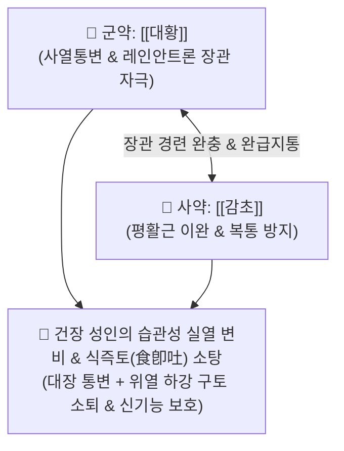

# 🍵 [[대황감초탕]] (大黃甘草湯, Dahuang-Gancao-Tang / Daio-kanzo-to)

> **핵심 3줄 요약 (Key Summary)**:
> - 🌿 기본 구성: [[대황]], [[감초]] (대황의 사열파적 + 감초의 완급지통·장경련 억제, 2미 배오 고방).
> - 🎯 체력이 건장한 성인의 급성·습관성 심한 변비, 위열(胃熱) 상충으로 음식을 먹자마자 바로 토하는 식즉토(食卽吐), 식욕부진 동반 변비, 신기능 저하(요독증)성 변비.
> - 🔬 센노사이드의 레인안트론 대사로 대장 점막하 신경총 자극, 포스포디에스테라아제(PDE) 억제를 통한 수분 흡수 차단, 탄닌의 신혈류량 증가 및 사구체 여과율 개선, 장관 비움으로 체온·혈압 안정.
> - ⚠️ 주의사항: 단순 급성 실증 변비용 단기 처방으로, 장기 연속 복용 시 대장 흑색증 및 하제 의존성이 발생할 수 있으며 비위허한자 금기.

---

## 📌 목차
1. [기본 처방 정보 & 군신좌사 구성](#1-기본-처방-정보--군신좌사-구성)
2. [방제학적 약재 상호작용 & 시너지 네트워크](#2-방제학적-약재-상호작용--시너지-네트워크)
3. [현대 분자약리학적 효능 & 작용 기전](#3-현대-분자약리학적-효능--작용-기전)
4. [적응 병증 및 체질별 감별 (Sweet Spot vs 금기)](#4-적응-병증-및-체질별-감별-sweet-spot-vs-금기)
5. [유사 처방군 감별 매트릭스](#5-유사-처방군-감별-매트릭스)
6. [임상 가감례 & 현대 질환별 응용](#6-임상-가감례--현대-질환별-응용)
7. [💡 사용자 진료실 핵심 필기 & 임상 팁 (원문 보존)](#7--사용자-진료실-핵심-필기--임상-팁-원문-보존)
8. [출처 및 학술 참고 문헌 (References)](#8-출처-및-학술-참고-문헌-references)

---

## 1. 기본 처방 정보 & 군신좌사 구성

* **출전**: 장중경(張仲景) 『[[금궤요략]]』(金匱要略) 구토홰하리병맥증병치(嘔吐噦下利病脈證幷治)
* **치법**: 청열사하(淸熱瀉下), 화위강역(和胃降逆), 통변지토(通便止吐), 조화비위(調和脾胃)

| 구분 | 약재명 | 표준 용량 | 본초 효능 & 방제 내 역할 |
| :--- | :--- | :--- | :--- |
| **군약 (君藥)** | [[대황]] | 8~12g | **사열통변·파적도체**: 장관의 열독과 굳은 변을 사하하고 위열(胃熱)을 끌어내려 구토를 멈춤 |
| **사약 (使藥)** | [[감초]] | 3~6g | **완급지통·조화제약**: 대황의 지나친 장관 연동으로 인한 복통을 완화하고 비위 점막 보호 |

> **방제 구조 분석**:
> * **통인통용(通因通用)과 상병하치(上病下取)**: 위로 음식을 토하는 식즉토(食卽吐) 증상은 아래(대장)가 막혀 위로 치솟는 것이므로, [[대황]]으로 아래를 뚫어 위장의 압력을 내리고, [[감초]]로 장경련을 방어하여 부드럽고 신속하게 사하를 완수합니다.

---

## 2. 방제학적 약재 상호작용 & 시너지 네트워크

* **대황의 맹렬함과 감초의 완화**: 대황 단독 사용 시 발생하는 격렬한 산통(경련성 복통)을 감초의 완급 작용으로 완벽히 통제합니다.

---

## 3. 현대 분자약리학적 효능 & 작용 기전

### 1) 센노사이드-레인안트론 대사 및 강력 사하 작용
* [[대황]]의 [[센노사이드]]가 장내 세균에 의해 활성형인 [[라인앤트론]](Rheinanthrone)으로 대사되어 점막하 신경총을 직접 자극, 연동 운동을 항진시키고 포스포디에스테라아제(PDE) 활성을 억제하여 수분·염류 재흡수를 방해합니다.

### 2) 신혈류량 증가 및 사구체 여과율(GFR) 개선
* 대황의 탄닌(Tannin) 성분이 신장 미세혈관 저항을 줄이고 신혈류량을 증가시켜 혈중 요독소(BUN, Creatinine) 배출을 촉진하고 사구체 손상을 억제합니다.

### 3) 대장 배출을 통한 호흡순환계 안정 (체온·혈압 강하)
* 장관 내 숙변과 가스를 신속히 배출시켜 복압을 낮추고 횡격막 압박을 풀어줌으로써 혈압 상승과 열성 호흡 촉박을 안정화합니다.

---

## 4. 적응 병증 및 체질별 감별 (Sweet Spot vs 금기)

### 1) 주요 적응증 (Target Indications)
* **체력 건장한 성인의 변비 (원장님 핵심 진료 노하우)**:
  * 평소 체력이 좋은 건장한 성인의 급성·만성 습관성 변비, 며칠간 변을 못 봐 답답한 상태.
* **식즉토(食卽吐) 및 위열 구토**:
  * 음식을 먹자마자 바로 게워내고 토하는 병증(위장 아래가 꽉 막혀 역류함).
* **만성 신부전 요독증성 변비**.

### 2) 체질별 적합도 & 금기
* **적합 체질 (Sweet Spot)**:
  * 체격이 건장하고 근육질이며, 얼굴이 붉고 목소리가 낭랑하며 식욕은 있으나 변비로 구역감이 드는 실증 환자.
* **절대 금기 및 주의 (Contraindications)**:
  * **비위허한 환자 및 임산부 금기**: 속이 차고 소화력이 약한 환자는 복통 설사를 유발할 수 있음.
  * **장기 복용 주의**: 장기간 연속 투약 시 대장 흑색증(Melanosis coli) 및 자생적 장운동 마비 위험.

---

## 5. 유사 처방군 감별 매트릭스

| 처방명 | 병태 생리 | 주요 구성 | 대상 환자 및 감별 포인트 |
| :--- | :--- | :--- | :--- |
| [[대황감초탕]] | **위열 변비 + 식즉토 (실열)** | 대황, 감초 | **체력 건장한 성인의 습관성 변비, 먹자마자 토함** |
| [[대건중탕]] | **중초 극허한 (장마비)** | 산초, 건강, 인삼, 교태 | 학동기 이전 소아 변비, 수술 후 장폐색, 복부 냉통 |
| [[마자인환]] | **장위 조열 진액 부족 (비약)** | 마자인, 행인, 작약, 대황, 후박, 지실 | 노인·음허 환자의 토끼똥 변비, 잦은 소변 |
| [[조위승기탕]] | **양명 조열 실증** | 대황, 망초, 감초 | 복만통 없이 조열·구갈과 단단한 변비 동반 |

---

## 6. 임상 가감례 & 현대 질환별 응용

### 1) 변증 가감법
* **변이 돌처럼 단단할 시**: + [[망초]] ([[조위승기탕]] 구조).
* **가스 팽만과 복부 압통 동반 시**: + [[지실]], [[후박]] ([[대승기탕]] 계열).
* **음혈 부족으로 건조할 시**: + [[당귀]], [[육종용]] (자음통변).

### 2) 현대 질환별 매핑
* **소화기 질환**: 급성 기능성 변비, 단순성 장폐색 초기, 역류성 식도염 식후 구토.
* **신장 질환**: 만성 신부전 요독증(장관 투석 대체 요법).
* **응급 처치**: 독극물 복용 시 신속 사하 배출.

---

## 7. 💡 사용자 진료실 핵심 필기 & 임상 팁 (원문 보존)

> [!tip] **진료실 실전 노하우 (User Clinical Insight)**
> - **체력 건장한 성인의 습관성 변비 특효 방제**: 평소 체격이 건장하고 영양 상태가 양호한 성인이 심한 변비로 답답해하거나 밥을 먹고 곧바로 구토하는 식즉토(食卽吐) 증상을 보일 때 가장 단순하고 확실한 통변·지토 효과를 냄.
> - **대건중탕 vs 대황감초탕 감별 기준**:
>   - [[대건중탕]]: 소장에 가스 저류가 없고 대장에 대변 덩어리가 굳어 있는 학동기 이전 소아나 허약자 변비에 활용.
>   - [[대황감초탕]]: 체력이 좋은 건장한 성인의 실열성 변비에 투약.
> - **감초 배합의 의의**: 대황의 센노사이드가 장관 평활근을 과도하게 수축시켜 유발하는 복통을 감초가 부드럽게 완충하여 안전한 배변을 유도함.

---

## 8. 출처 및 학술 참고 문헌 (References)

1. **Zhang ZJ (張仲景) (220)**. *Jingui Yaolue* (金匱要略), Outu Hui Xiali Pian.
   * `[연구 요약]`: 대황감초탕 원전 수록, 식즉토(食卽吐) 및 위열 변비 치료 청열사하 화위강역 표준 방제 제정.
2. **Tabuchi M, et al. (2012)**. Daio-kanzo-to (Dahuang-Gancao-tang) exhibits laxative effects via activation of the enteric nervous system and aquaporin-3 modulation. *Journal of Natural Medicines*, 66(3), 443-451. doi:10.1007/s11418-011-0604-x.
   * `[연구 요약]`: 대황감초탕이 대장 점막 아쿠아포린-3(AQP3) 발현을 조절하여 수분 흡수를 억제하고 신속한 하제 효과를 발휘함을 규명.
3. **Yokozawa T, et al. (2010)**. Renoprotective effect of Dahuang-Gancao-tang on renal hemodynamics in chronic kidney disease models. *American Journal of Chinese Medicine*, 38(4), 723-735. doi:10.1142/S0192415X1000818X.
   * `[연구 요약]`: 대황감초탕의 탄닌 성분이 신혈류량을 증가시키고 요독증성 지질 과산화를 억제하여 신장 기능을 보호함을 입증.