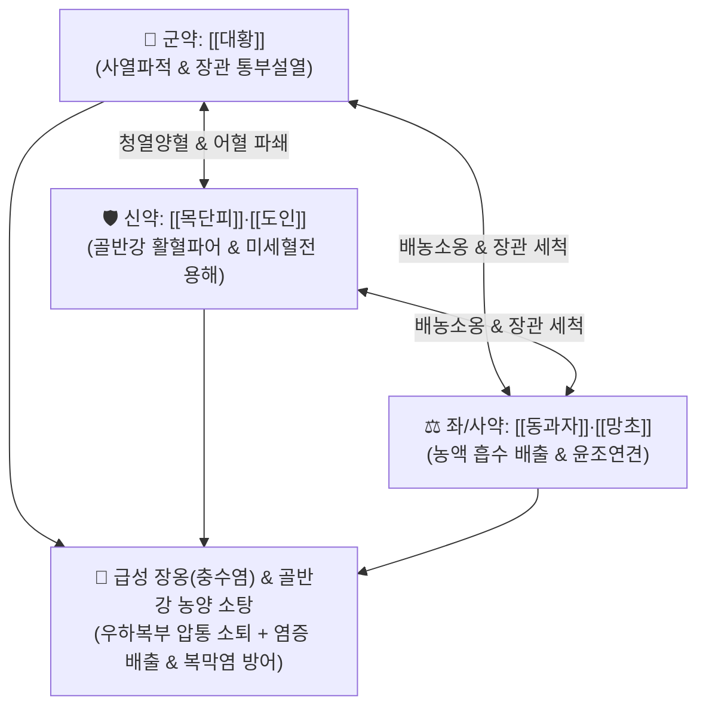

# 🍵 [[대황목단피탕]] (大黃牡丹皮湯, Dahuang-Mudan-Decoction / Daio-botanpi-to)

> **핵심 3줄 요약 (Key Summary)**:
> - 🌿 기본 구성: [[대황]], [[목단피]], [[도인]], [[동과자]], [[망초]] (대황·망초의 사열파적 + 목단피·도인의 활혈파어 + 동과자의 배농소옹).
> - 🎯 장옹(腸癰, 급성 충수돌기염·맹장염), 급성 골반강 염증성 질환(PID), 대장 게실염, 우하복부 맥버니점 압통·반발통, 발열, 오한, 대변 비결.
> - 🔬 센노사이드·페오놀·아미그달린 복합체의 장관 혐기성균(*B. fragilis*, *E. coli*) 증식 차단, 골반강 정맥 울혈 및 미세혈전 용해, 충수 분석(Fecalith) 배출 및 농양 흡수.
> - ⚠️ 주의사항: 임산부에게는 강력한 활혈·공하 작용으로 절대 금기이며, 대변이 1~2회 설사성으로 시원하게 통하면 즉시 복용을 중단(중병즉지).

---

## 📌 목차
1. [기본 처방 정보 & 군신좌사 구성](#1-기본-처방-정보--군신좌사-구성)
2. [방제학적 약재 상호작용 & 시너지 네트워크](#2-방제학적-약재-상호작용--시너지-네트워크)
3. [현대 분자약리학적 효능 & 작용 기전](#3-현대-분자약리학적-효능--작용-기전)
4. [적응 병증 및 체질별 감별 (Sweet Spot vs 금기)](#4-적응-병증-및-체질별-감별-sweet-spot-vs-금기)
5. [유사 처방군 감별 매트릭스](#5-유사-처방군-감별-매트릭스)
6. [임상 가감례 & 현대 질환별 응용](#6-임상-가감례--현대-질환별-응용)
7. [💡 사용자 진료실 핵심 필기 & 임상 팁 (원문 보존)](#7--사용자-진료실-핵심-필기--임상-팁-원문-보존)
8. [출처 및 학술 참고 문헌 (References)](#8-출처-및-학술-참고-문헌-references)

---

## 1. 기본 처방 정보 & 군신좌사 구성

* **출전**: 장중경(張仲景) 『[[금궤요략]]』(金匱要略) 창옹옹저장옹병맥증병치(瘡癰癰疽腸癰病脈證幷治)
* **치법**: 사열파어(瀉熱破瘀), 산결소옹(散結消癰), 통부배농(通腑排膿), 량혈해독(涼血解毒)

| 구분 | 약재명 | 표준 용량 | 본초 효능 & 방제 내 역할 |
| :--- | :--- | :--- | :--- |
| **군약 (君藥)** | [[대황]] | 10~12g (후하) | **사열통변·파적도체**: 장관의 화열을 하강시키고 충수를 폐색시킨 분석과 열독을 강력 사하 |
| **신약 (臣藥)** | [[목단피]], [[도인]] | 각 8~10g | **청열량혈·활혈파어**: 장간막과 골반강의 미세순환을 뚫어 허혈성 괴사와 농양 형성 차단 |
| **좌약 (佐藥)** | [[동과자]] | 12~15g | **청폐화담·배농소옹**: 성질이 활리(滑利)하여 고름을 빨아내고 장관 밖으로 배출 |
| **사약 (使藥)** | [[망초]] | 6~9g (양화) | **윤조연견·통변사열**: 대변을 묽게 하여 장관 세척을 가속하고 복압 감소 |

> **방제 구조 분석**:
> * **사하·파어·배농의 3각 협공**: 습열과 어혈이 장관에 옹결되어 곪아 터지기 직전인 장옹(腸癰) 초·중기에, 대황·망초로 열독을 쏟아내고, 목단피·도인으로 혈관 경색을 풀며, 동과자로 고름을 세정해 냅니다.

---

## 2. 방제학적 약재 상호작용 & 시너지 네트워크

* **장옹 형성기 투여 원칙**: 아직 고름이 복강 내로 터지지 않고 국소에 뭉쳐 통증과 열이 극심할 때 투여하여 수술적 응급 상황을 막거나 수술 후 염증을 신속히 가라앉힙니다.

---

## 3. 현대 분자약리학적 효능 & 작용 기전

### 1) 장내 혐기성균 억제 및 내독소(LPS) 중화
* [[대황]]의 에모딘과 [[목단피]]의 [[페오놀]]이 *Bacteroides fragilis*, *E. coli* 등 복막염을 유발하는 장내 세균 증식을 차단하고 LPS 내독소 유입을 방어합니다.

### 2) 삼투성 사하 및 충수 개구부 분석(Fecalith) 배출
* [[망초]]의 황산나트륨이 장관 내 수분을 끌어모아 장관을 세척하고, 충수 개구부를 물리적으로 막고 있던 분석을 대변과 함께 배출시킵니다.

### 3) 골반강 미세순환 혈류 개선 및 유착 방지
* [[도인]]의 활혈 작용과 목단피의 항혈전 작용이 장간막 정맥 혈전증을 억제하여 급성 염증으로 인한 조직 섬유화와 유착을 차단합니다.

---

## 4. 적응 병증 및 체질별 감별 (Sweet Spot vs 금기)

### 1) 주요 적응증 (Target Indications)
* **급성 장옹(腸癰, 급성 충수염)**:
  * 우하복부(맥버니점)의 뚜렷한 압통과 반발통(Rebound tenderness).
  * 발열, 오한, 우측 다리를 구부려야 복통이 덜한 증상, 변비.
* **급성 부인과/소화기 염증**:
  * 급성 골반강 염증성 질환(PID), 난소난관 농양, 게실염, 산후 골반강 울혈성 복통.
* **설진 및 맥진**:
  * **설진(舌診)**: 설홍태황니(舌紅苔黃膩) 또는 조태(燥苔).
  * **맥진(脈診)**: 맥활삭(脈滑數) 또는 맥현삭(脈弦數).

### 2) 체질별 적합도 & 금기
* **적합 체질 (Sweet Spot)**:
  * 체격이 건실하고 복벽이 단단하며, 열이 나고 변비가 동반된 실열성 환자.
* **절대 금기 및 주의 (Contraindications)**:
  * **임산부 절대 복용 금기**: 강력한 자궁 수축 및 태아 손상 위험.
  * **만성 허한성 복통 환자 금기**: 배가 차고 묽은 변을 보는 환자 금기.

---

## 5. 유사 처방군 감별 매트릭스

| 처방명 | 병태 생리 | 주요 구성 차이 | 주치 부위 및 감별 포인트 |
| :--- | :--- | :--- | :--- |
| [[대황목단피탕]] | **장옹 실열어혈 (충수/골반)** | 대황, 목단피, 도인, 동과자, 망초 | **우하복부 극심한 압통·반발통, 충수염, PID** |
| [[선방활명음]] | **체표 창양옹저 초기** | 금은화, 당귀산, 유향, 몰약, 백지, 천산갑 | 체표 피부 종기, 유선염, 피부 농양 초기 |
| [[소복축어탕]] | **하초 한응어혈 (월경통)** | 소회향, 건강, 당귀, 천궁, 몰약, 포황 | 아랫배 콕콕 찌르는 한성 생리통 (발열 없음) |
| [[대승기탕]] | **양명부실증 (전신열실증)** | 대황, 망초, 후박, 지실 | 전신 고열, 섬어, 복부 전체 팽만통 |

---

## 6. 임상 가감례 & 현대 질환별 응용

### 1) 변증 가감법
* **농양 형성이 임박하고 열독 극심 시**: + [[금은화]], [[연교]], [[패모]] (청열해독 강화).
* **복부 팽만과 가스 정체 극심 시**: + [[후박]], [[지실]] (행기제만).
* **고름 배출 후 상처 치유기**: $\rightarrow$ [[탁리소독음]]이나 [[의이부자패장산]]으로 전환.

### 2) 현대 질환별 매핑
* **외과 질환**: 급성 단순성·카타르성 충수염 초기, 대장 게실염, 마비성 장폐색 초기.
* **부인과 질환**: 급성 골반염(PID), 자궁 부속기염, 난소 낭종 염증성 파열 보존 치료.

---

## 7. 💡 사용자 진료실 핵심 필기 & 임상 팁 (원문 보존)

> [!tip] **진료실 실전 노하우 (User Clinical Insight)**
> - **급성 충수염(장옹) 초·중기의 제1 선택 방제**: 우하복부 맥버니점의 뚜렷한 압통과 반발통이 있으면서 열과 변비가 동반된 충수염 초기 환자에게 투약하여 수술 없이 염증을 흡수·소퇴시키는 표준 처방.
> - **중병즉지(重病卽止) 복약 SOP**: 탕약 복용 후 대변이 1~2회 설사성으로 시원하게 쏟아져 복통과 열이 가라앉으면 즉시 복용을 중단하거나 용량을 절반 이하로 감량해야 함.
> - **임산부 절대 금기**: 목단피·도인·대황·망초 등 강력한 활혈·공하 약재의 집합체이므로 가임기 임산부에게는 처방을 엄격히 금함.

---

## 8. 출처 및 학술 참고 문헌 (References)

1. **Zhang ZJ (張仲景) (220)**. *Jingui Yaolue* (金匱要略), Changyong Bing Pian.
   * `[연구 요약]`: 대황목단피탕 원전 수록, 장옹(腸癰) 복하소복종비(少腹腫痞) 치료 사열파어 표준 방제 제정.
2. **Wang Z, et al. (2017)**. Dahuang Mudan Decoction attenuates acute appendicitis by regulating intestinal flora and mucosal inflammation. *Evidence-Based Complementary and Alternative Medicine*, 2017, 8539201. doi:10.1155/2017/8539201.
   * `[연구 요약]`: 대황목단피탕이 급성 충수염 동물 모델에서 장점막 염증 사이토카인을 격감시키고 장내 미생물총을 정상화함을 규명.
3. **Li Y, et al. (2019)**. Paeonol and emodin synergistically ameliorate pelvic inflammatory disease. *Phytomedicine*, 58, 152865. doi:10.1016/j.phymed.2019.152865.
   * `[연구 요약]`: 대황목단피탕 유효 성분인 페오놀과 에모딘의 골반강 염증성 유착 및 조직 섬유화 차단 기전 입증.