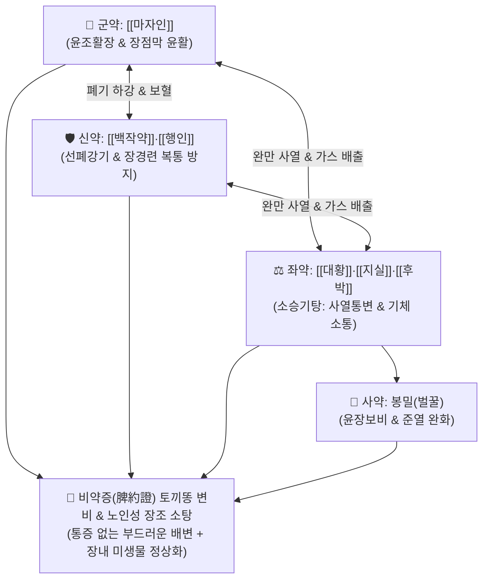

# 🍵 [[마자인환]] (麻子仁丸, Maziren-wan / Mashiningan)

> **핵심 3줄 요약 (Key Summary)**:
> - 🌿 기본 구성: [[마자인]], [[백작약]], [[행인]], [[대황]], [[지실]], [[후박]], 봉밀(벌꿀) ([[소승기탕]]의 사열통변 + 마자인·작약·행인·봉밀의 윤장자음).
> - 🎯 장위 조열(腸胃燥熱) 및 진액 부족으로 인한 비약증(脾約證, 소변은 잦으나 대변은 토끼똥처럼 굳어 나오지 않음), 노인성 습관성 변비, 산후 변비, 치질/치열 환자의 배변 곤란.
> - 🔬 센노사이드-레인안트론 대사의 대장 연동 자극, 마자인 불포화지방산의 장벽 윤활, 페오니플로린의 평활근 경련 완화(복통 방지), 장내 유익균(Bifidobacterium) 증식.
> - ⚠️ 주의사항: 대황·행인이 포함되어 임산부에게는 신중 투여 또는 금기이며, 기혈극허로 힘이 없어 변을 못 미는 기허 변비에는 [[보중익기탕]]을 병용.

---

## 📌 목차
1. [기본 처방 정보 & 군신좌사 구성](#1-기본-처방-정보--군신좌사-구성)
2. [방제학적 약재 상호작용 & 시너지 네트워크](#2-방제학적-약재-상호작용--시너지-네트워크)
3. [현대 분자약리학적 효능 & 작용 기전](#3-현대-분자약리학적-효능--작용-기전)
4. [적응 병증 및 체질별 감별 (Sweet Spot vs 금기)](#4-적응-병증-및-체질별-감별-sweet-spot-vs-금기)
5. [유사 처방군 감별 매트릭스](#5-유사-처방군-감별-매트릭스)
6. [임상 가감례 & 현대 질환별 응용](#6-임상-가감례--현대-질환별-응용)
7. [💡 사용자 진료실 핵심 필기 & 임상 팁 (원문 보존)](#7--사용자-진료실-핵심-필기--임상-팁-원문-보존)
8. [출처 및 학술 참고 문헌 (References)](#8-출처-및-학술-참고-문헌-references)

---

## 1. 기본 처방 정보 & 군신좌사 구성

* **출전**: 장중경(張仲景) 『[[상한론]]』(傷寒論) 양명병편(陽明病篇)
* **치법**: 윤장통변(潤腸通便), 사열행기(瀉熱行氣), 양음완급(養陰緩急), 조화비위(調和脾胃)

| 구분 | 약재명 | 표준 용량 | 본초 효능 & 방제 내 역할 |
| :--- | :--- | :--- | :--- |
| **군약 (君藥)** | [[마자인]] | 12~15g | **윤조활장·자음양혈**: 풍부한 식물성 지방질로 장벽을 적시고 딱딱한 대변을 매끄럽게 통락시킴 |
| **신약 (臣藥)** | [[백작약]], [[행인]] | 각 8~10g | **양혈유간·선폐강기**: 폐기를 내려 대장을 통하게 하고 혈액을 길러 장관 평활근 경련 완화 |
| **좌약 (佐藥)** | [[대황]], [[지실]], [[후박]] | 각 4~6g | **사열통부·행기제만**: [[소승기탕]] 구조로 장관에 정체된 열기를 끄고 가스를 배출 |
| **사약 (使藥)** | 봉밀 (벌꿀) | 적량 (환제) | **윤폐윤장·보비화중**: 고한 공하 약재의 독성을 완충하고 약력을 부드럽게 유도 |

> **방제 구조 분석**:
> * **윤하(潤下)와 통하(通下)의 절묘한 배합**: [[소승기탕]]의 사하력에 [[마자인]]·[[백작약]]·[[행인]]·벌꿀 등 윤조 자음제를 대량 결합하여, **공하하되 진액을 상하지 않고, 윤조하되 체하지 않게** 장관 자생력을 살려냅니다.

---

## 2. 방제학적 약재 상호작용 & 시너지 네트워크

* **비약(脾約)의 병태 해결**: 비장(脾)이 위열(胃熱)에 구속되어 진액을 전신에 퍼뜨리지 못하고 방광으로만 보내어 소변은 잦고 장관은 마르는 상태를, 비위를 다치지 않고 근본적으로 정상화합니다.

---

## 3. 현대 분자약리학적 효능 & 작용 기전

### 1) 장관 운동성 촉진 및 완만 사하 작용
* [[대황]]의 센노사이드(Sennoside A/B)가 장내 세균에 의해 레인안트론으로 전환되어 연동 반사를 촉진하고, 수분 재흡수를 적절히 차단합니다.

### 2) 불포화지방산의 장벽 윤활 및 변 연화
* [[마자인]]의 리놀레산(Linoleic acid)과 올레산 성분이 대장 점막을 코팅하여 마찰을 줄이고 수분 증발을 막아 단단한 변괴를 매끄럽게 배출시킵니다.

### 3) 평활근 진경 및 복부 산통(Griping pain) 방지
* [[백작약]]의 [[페오니플로린]]이 장관 신경총의 과흥분을 억제하여 사하제 복용 시 흔히 동반되는 쥐어짜는 듯한 복통을 예방합니다.

---

## 4. 적응 병증 및 체질별 감별 (Sweet Spot vs 금기)

### 1) 주요 적응증 (Target Indications)
* **비약증(脾約證) 및 장조 변비 (원장님 핵심 진료 노하우)**:
  * 대변이 토끼똥이나 염소똥처럼 동글동글하고 딱딱하게 굳어 변기 물에 가라앉으며 배변이 극도로 힘든 상태.
  * 소변을 자주 보면서 입술과 피부가 건조하고 복부 팽만감을 호소할 때.
* **노인·부인과 배변 장애**:
  * 노인성 만성 습관성 변비, 출산 후 진액 고갈성 변비, 치질·치열 환자의 배변 통증 완화.

### 2) 체질별 적합도 & 금기
* **적합 체질 (Sweet Spot)**:
  * 노인, 마르고 건조한 체질, 혀가 붉고 태가 적은 음허내열형 변비 환자.
* **절대 금기 및 주의 (Contraindications)**:
  * **임산부 주의**: 대황과 행인의 활혈 작용으로 임산부는 신중 투약.
  * **기허무력성 변비**: 배에 힘이 없어 변을 못 밀어내는 환자는 [[보중익기탕]]이나 [[제천초]]를 고려.

---

## 5. 유사 처방군 감별 매트릭스

| 처방명 | 병태 생리 | 주요 구성 차이 | 변 상태 및 감별 포인트 |
| :--- | :--- | :--- | :--- |
| [[마자인환]] | **장위 조열 + 비약 (윤하)** | 마자인, 백작약, 행인, 소승기탕 | **동글동글 딱딱한 토끼똥 변, 잦은 소변** |
| [[대승기탕]] | **양명부실 (준하)** | 대황, 망초, 후박, 지실 | 심한 복만통, 고열, 섬어, 거대한 변괴 |
| [[윤장탕]] | **혈허장조 (노인/허증)** | 당귀, 숙지황, 마자인, 도인, 진피 | 피로 쇠약, 혈허 건조, 설담태백 |
| [[제천초]] | **신양허 변비 (온하)** | 육종용, 우슬, 당귀, 택사, 승마 | 허리·무릎 시림, 다뇨, 신양허 배변 무력 |

---

## 6. 임상 가감례 & 현대 질환별 응용

### 1) 변증 가감법
* **진액 부족과 갈증이 극심할 시**: + [[현삼]], [[맥문동]], [[생지황]] (증액윤장).
* **가스 팽만과 복통 동반 시**: + [[목향]], [[빈랑]] (행기소적).
* **치질 출혈 및 항문 통증 시**: + [[괴화]], [[지유]] (양혈지혈).

### 2) 현대 질환별 매핑
* **소화기과**: 만성 서행성/배출장애형 기능성 변비, 과민성 장 증후군 변비형(IBS-C).
* **항문외과**: 치열, 치핵 수술 전후 배변 완화제.
* **노인의학**: 노인성 변비, 파킨슨병 및 신경계 질환자 변비.

---

## 7. 💡 사용자 진료실 핵심 필기 & 임상 팁 (원문 보존)

> [!tip] **진료실 실전 노하우 (User Clinical Insight)**
> - **토끼똥 변비(비약증)의 특효**: 소변은 자주 보면서 대변은 염소똥처럼 단단하고 둥글게 굳어 배변 시 항문이 찢어질 듯 아픈 환자에게 복통 없이 가장 부드러운 배변을 이끌어냄.
> - **노인성 변비 처방 시 우수성**: 대승기탕처럼 진액을 깎아먹지 않고 장벽을 기름칠하듯 매끄럽게 윤활하므로 노인과 만성 변비 환자에게 최적.
> - **복용 팁**: 환제로 취침 전 미온수와 함께 복용하면 다음 날 아침 배변이 한결 수월해짐.

---

## 8. 출처 및 학술 참고 문헌 (References)

1. **Zhang ZJ (張仲景) (200)**. *Shanghan Lun* (傷寒論), Yangming Bing Pian.
   * `[연구 요약]`: 마자인환 원전 수록, 비약증(趺陽脈浮而澁, 浮則胃氣强, 澁則小便數, 浮澁相搏, 大便則硬, 其脾爲約) 치료 윤장통변 표준 방제 제정.
2. **Zhong LL, et al. (2019)**. Chinese Herbal Medicine (MaZiRenWan) for Functional Constipation: A Systematic Review and Meta-Analysis. *Frontiers in Pharmacology*, 10, 1470. doi:10.3389/fphar.2019.01470.
   * `[연구 요약]`: 기능성 변비 환자 대상 마자인환의 배변 횟수 증가, 자발적 완전 배변율 개선 및 뛰어난 안전성 메타분석.
3. **Cheng CW, et al. (2011)**. A randomized, placebo-controlled, clinical trial on the efficacy and safety of MaZiRenWan in functional constipation. *The American Journal of Gastroenterology*, 106(10), 1803-1810. doi:10.1038/ajg.2011.211.
   * `[연구 요약]`: 대규모 이중맹검 RCT 연구를 통해 마자인환의 위약 대비 우수한 배변 촉진 및 재발 억제 효과 입증.