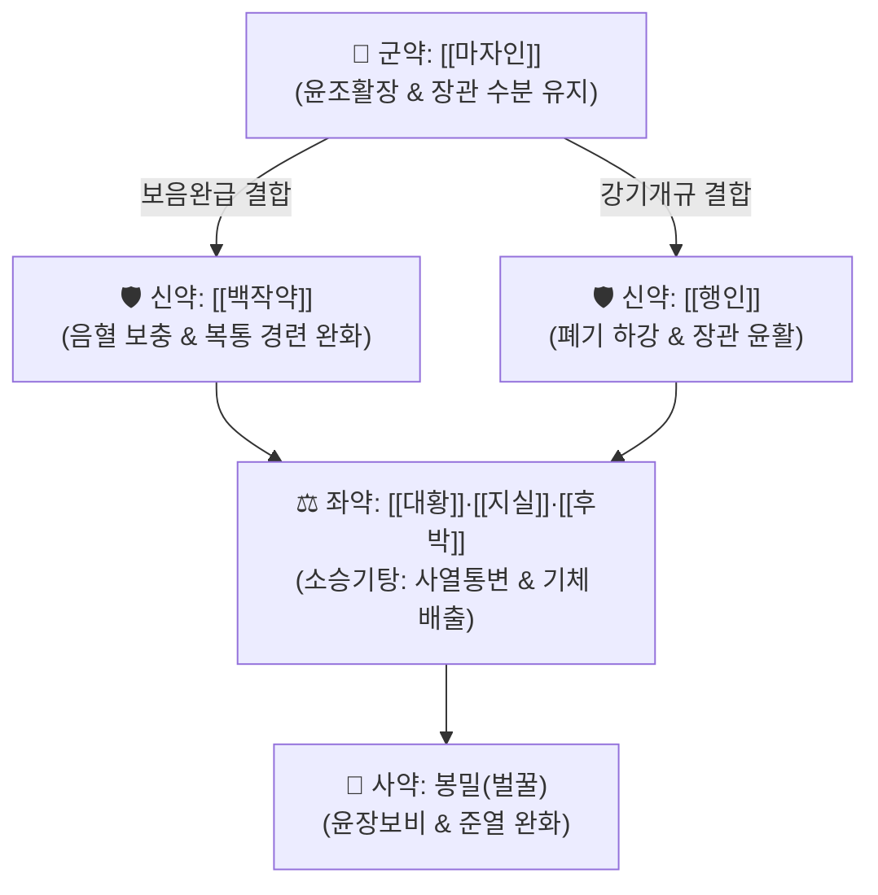

# 🍵 [[마자인환]] (麻子仁丸, Maziren-wan)

> **핵심 3줄 요약 (Key Summary)군약 (君藥)신약 (臣藥)신약 (臣藥)좌약 (佐藥)좌약 (佐藥)좌약 (佐藥)사약 (使藥)** | 봉밀(벌꿀) | 적량 | 윤폐윤장(潤肺潤腸), 고한 공하 약성 완화 및 제약 조화 |

---

## 2. 방제학적 약재 상호작용 & 시너지 네트워크

* **윤하(潤下)와 통하(通下)의 절묘한 배합**:
  * 소승기탕([[대황]], [[지실]], [[후박]])의 공하 작용에 [[마자인]], [[백작약]], [[행인]], 벌꿀 등 윤조 자음제를 대량 배합하여 **공하하되 진액을 상하지 않고, 윤조하되 체하지 않게** 구성한 대표 방제.
  * 비약(脾約)이란 비장(脾)이 위열(胃熱)에 구속되어 진액을 전신에 퍼뜨리지 못하고 방광으로만 보내어 소변은 잦고 장관은 마르는 병태를 의미하며, 비위를 손상시키지 않고 장관 운동을 복원합니다.

---

## 3. 현대 분자약리학적 효능 & 작용 기전

* **장관 운동성 촉진 및 수분 분비 증가**:
  * 대황의 센노사이드(Sennoside A/B)가 대장 내 미생물에 의해 레인안트론(Rheinanthrone)으로 대사되어 수분·전해질 흡수를 억제하고 장관 연동 반사를 자극.
  * 마자인의 다가불포화지방산(리놀레산, 알파리놀렌산)이 장벽을 윤활하고 변의 경도를 유연화.
* **장관 평활근 진경 및 복통 완화**:
  * 작약의 [[페오니플로린]] 성분이 자율신경 말단 및 평활근 세포의 경련을 안정화시켜 사하제 복용 시 발생하는 복부 산통(Griping pain)을 방지.
* **장내 마이크로바이옴 개선**:
  * 올리고당 및 지질 성분이 장내 유익균(Bifidobacterium 등)의 증식을 돕고 장관 장벽 기능을 보호.

---

## 4. 적응 병증 및 체질별 감별 (Sweet Spot vs 금기)

### ✅ 최적 적응증 (Sweet Spot)
* **비약증(脾約證) 및 장조변비(腸燥便秘)**:
  * 대변이 토끼똥처럼 동글동글하고 딱딱하게 굳어 나오지 않음.
  * 소변 횟수는 잦거나 정상이면서 복부 팽만감과 배변 곤란 호소.
  * 노인성 습관성 변비, 수술 후 장 마비 회복기, 산후 변비, 치질/치열로 배변 시 통증이 극심한 환자.
* **설진 및 맥진**:
  * **설진(舌診)**: 설홍(舌紅), 설태건황(苔乾黃) 또는 설태소(少苔).
  * **맥진(脈診)**: 맥침삭(脈沈數) 또는 맥삭유력(數有力).

### ⚠️ 신중 투여 및 금기 (Caution / Contraindication)
* **임산부 금기/신중**:
  * 대황과 행인의 자궁 수축 및 활혈 파기 작용으로 인해 임산부 투여 금기.
* **음혈극허(陰血極虛) 주의**:
  * 기혈이 극도로 쇠약하여 기운이 없어 변을 밀어내지 못하는 기허변비에는 단독 사용을 피하고 [[보중익기탕]]이나 [[제천초]]를 고려.

---

## 5. 유사 처방군 감별 매트릭스

| 처방명 | 핵심 구성 차이 | 주치 병증 차이 | 설진/맥진 감별 |
| :--- | :--- | :--- | :--- |
| [[마자인환]] | [[마자인]], 소승기탕, [[백작약]], [[행인]] | 비약변비, 토끼똥 변, 복창, 구갈 | 설홍태건, 맥침삭 |
| [[대승기탕]] | 대황, 망초, 지실, 후박 | 양명부실증, 극심한 조열, 섬어, 복만통 | 설홍태황조열, 맥침실 |
| [[윤장탕]] | 당귀, 숙지황, 마자인, 도인, 진피 | 노인·허약자 혈허장조 변비, 윤활 위주 | 설담태박백, 맥세약 |
| [[제천초]] | 육종용, 우슬, 당귀, 택사, 승마 | 신양허 변비, 요통, 다뇨, 배변 무력 | 설담태백, 맥침지 |

---

## 6. 임상 가감례 & 현대 질환별 응용

* **수반 증상별 임상 가감**:
  * 진액 부족과 장조가 심할 때 $\rightarrow$ + [[현삼]], [[맥문동]]
  * 복부 팽만과 가스 참이 극심할 때 $\rightarrow$ + [[목향]], [[빈랑]]
  * 치질 출혈 및 항문 작열감 동반 시 $\rightarrow$ + [[괴화]], [[지유]]
  * 기허로 배변 시 힘이 부족할 때 $\rightarrow$ + [[황기]], [[백출]]
* **현대 질환 매핑**:
  * 기능성 만성 변비(배출 장애형 및 서행성), 과민성 대장 증후군(변비형), 항문열창 및 치핵 환자의 배변 완화.

---

## 7. 출처 및 학술 참고 문헌 (References)
* Zhang ZJ. *Shanghan Lun* (Treatise on Febrile Diseases). ca. 210.
  * `[연구 요약]`: 마자인환 비약증 조문(趺陽脈浮而澁, 浮則胃氣强, 澁則小便數, 浮澁相搏, 大便則硬, 其脾爲約) 수록.
* Zhong LL, et al. Chinese Herbal Medicine (MaZiRenWan) for Functional Constipation: A Systematic Review and Meta-Analysis. *Front Pharmacol*. 2019;10:1470.
  * `[연구 요약]`: 기능성 변비 환자 대상 마자인환의 배변 횟수 증가, 자발적 완전 배변율 개선 및 안전성 메타분석.
