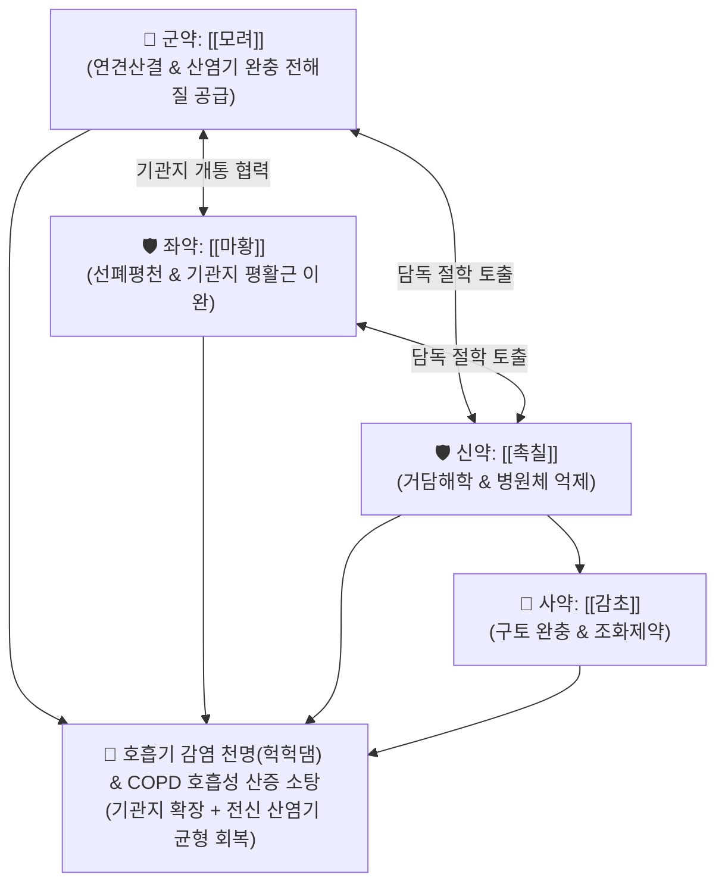

# 🍵 [[모려탕]] (牡蠣湯, Muli Decoction)

> **핵심 3줄 요약 (Key Summary)**:
> - 🌿 기본 구성: [[모려]], [[촉칠]](상산 싹), [[마황]], [[감초]] ([[월비탕]] 유사 구조, 거담해학 + 선폐평천 + 연견산결).
> - 🎯 학질(말라리아) 및 급·만성 호흡기 감염으로 인한 기관지 수축과 천명(헉헉댐), 만성 폐쇄성 폐질환(COPD) 및 만성 기침에 따른 호흡성 산증(Acidosis), 산염기 불균형 회복, 비종대(학모 瘧母).
> - 🔬 β2 아드레날린 수용체 자극을 통한 기관지 확장, 칼슘 이온 완충 작용을 통한 전신 산염기 항상성 회복, 말라리아 원충 억제 및 거담·진경 작용.
> - ⚠️ 주의사항: 촉칠의 구토 유발성 약성으로 비위가 약한 환자는 생강즙을 병용하며, 고혈압·협심증 환자는 마황 용량 주의.

---

## 📌 목차
1. [기본 처방 정보 & 군신좌사 구성](#1-기본-처방-정보--군신좌사-구성)
2. [방제학적 약재 상호작용 & 시너지 네트워크](#2-방제학적-약재-상호작용--시너지-네트워크)
3. [현대 분자약리학적 효능 & 작용 기전](#3-현대-분자약리학적-효능--작용-기전)
4. [적응 병증 및 체질별 감별 (Sweet Spot vs 금기)](#4-적응-병증-및-체질별-감별-sweet-spot-vs-금기)
5. [유사 처방군 감별 매트릭스](#5-유사-처방군-감별-매트릭스)
6. [임상 가감례 & 현대 질환별 응용](#6-임상-가감례--현대-질환별-응용)
7. [💡 사용자 진료실 핵심 필기 & 임상 팁 (원문 보존)](#7--사용자-진료실-핵심-필기--임상-팁-원문-보존)
8. [출처 및 학술 참고 문헌 (References)](#8-출처-및-학술-참고-문헌-references)

---

## 1. 기본 처방 정보 & 군신좌사 구성

* **출전**: 장중경(張仲景) 『[[금궤요략]]』(金匱要略) 학병맥증병치(瘧病脈證幷治)
* **치법**: 거담해학(祛痰截瘧), 선폐평천(宣肺平喘), 연견산결(軟堅散結), 화해영위(和解營衛)

| 구분 | 약재명 | 표준 용량 | 본초 효능 & 방제 내 역할 |
| :--- | :--- | :--- | :--- |
| **군약 (君藥)** | [[모려]] | 15~20g (선전) | **연견산결·수렴고삽**: 가슴과 옆구리의 담핵을 삭이고 산염기 완충(칼슘 성분) 및 허탈 방어 |
| **신약 (臣藥)** | [[촉칠]] (상산 싹) | 4~6g | **거담절학·강역사화**: 흉격에 뭉친 끈적한 가래와 학사(瘧邪)를 토법/하법으로 신속히 배출 |
| **좌약 (佐藥)** | [[마황]] | 4~6g | **선폐평천·발한해표**: 수축된 기관지를 확장시키고 체표의 오한·발열을 발산 |
| **사약 (使藥)** | [[감초]] | 3~4g | **조화제약·완급화중**: 촉칠의 구토 유발성을 완충하고 제약을 조화 |

> **방제 구조 분석**:
> * **월비탕(越婢湯) 유사 구조의 호흡기·학질 특효방**: [[마황]]과 [[감초]]의 해표평천 기틀에, 굳은 담을 삭이는 [[모려]]와 깊은 담독을 뚫는 [[촉칠]]을 결합하여, 심한 기관지 수축과 호흡성 산증을 동시에 바로잡습니다.

---

## 2. 방제학적 약재 상호작용 & 시너지 네트워크

* **산염기 균형과 평천(平喘)의 조화**: 마황이 기도 저항을 줄여 이산화탄소 배출을 돕고, 모려의 미네랄 성분이 혈중 완충능을 지원하여 호흡성 산증의 악순환을 차단합니다.

---

## 3. 현대 분자약리학적 효능 & 작용 기전

### 1) 기관지 평활근 이완 및 환기능 개선
* [[마황]]의 [[에페드린]] 성분이 교감신경 $\beta_2$ 수용체를 활성화하여 심한 기관지 경련을 이완시키고 기도 내 가래 배출을 촉진합니다.

### 2) 호흡성 산증(Respiratory Acidosis) 및 산염기 불균형 개선
* 만성 저환기로 인한 $pCO_2$ 상승 및 혈액 산성화 상태에서, 가도 확장 및 [[모려]]의 탄산칼슘 완충 작용이 결합하여 세포 외액 pH 항상성을 신속히 회복시킵니다.

### 3) 항말라리아 및 거담 진통 작용
* [[촉칠]](상산)의 페브리퓨진(Febrifugine) 성분이 말라리아 원충 증식을 억제하고 흉막과 기도의 점액 과분비를 억제합니다.

---

## 4. 적응 병증 및 체질별 감별 (Sweet Spot vs 금기)

### 1) 주요 적응증 (Target Indications)
* **만성 호흡기 질환 및 호흡성 산증 (원장님 핵심 진료 노하우)**:
  * 만성 기침, 만성 폐쇄성 폐질환(COPD), 기관지 천식으로 인해 숨이 차고 헉헉대며 산염기 불균형이 초래된 상태.
  * 호흡 곤란으로 인한 혈액 가스 교환 장애 및 흉부 압박감.
* **학질 및 감염성 호흡곤란**:
  * 말라리아(학질)에 의한 고열, 오한과 함께 기관지가 심하게 수축하여 천명을 호소하는 병증.
  * 비장 종대(학모 瘧母).

### 2) 체질별 적합도 & 금기
* **적합 체질 (Sweet Spot)**:
  * 만성 기관지 질환으로 가슴이 답답하고 숨이 가쁘며 체내 산염기 균형이 무너진 환자.
* **절대 금기 및 주의 (Contraindications)**:
  * **심한 위궤양 및 임산부 주의**: 촉칠의 구토 유발성으로 위점막 손상자 주의.
  * **마황 과민증**: 심계항진, 불면 환자는 마황 용량 감량.

---

## 5. 유사 처방군 감별 매트릭스

| 처방명 | 병태 생리 | 주요 구성 차이 | 주치 및 감별 포인트 |
| :--- | :--- | :--- | :--- |
| [[모려탕]] | **온학 + 담음 천식 (COPD 산증)** | 모려, 촉칠, 마황, 감초 | **호흡성 산증, 기관지 수축 헉헉댐, 학질** |
| [[월비탕]] | **풍수 표열 실증 (부종)** | 마황, 석고, 생강, 대조, 감초 | 전신 부종, 소변불리, 발열 구갈 |
| [[마행감석탕]] | **폐열 옹폐 천식** | 마황, 행인, 감초, 석고 | 땀이 나면서 헐떡이는 급성 폐열 기침 |
| [[소청룡탕]] | **풍한 표증 + 한음 내정** | 마황, 계지, 건강, 세신, 반하, 오미자 | 맑은 콧물, 거품 가래, 오한 동반 천식 |

---

## 6. 임상 가감례 & 현대 질환별 응용

### 1) 변증 가감법
* **오심·구역질 동반 시**: + [[생강]], [[반하]] (화위강역).
* **비종대(학모)가 뚜렷할 시**: + [[별갑]], [[삼릉]], [[봉출]] (연견파적).
* **기력 저하 극심 시**: + [[인삼]], [[황기]] (보기평천).

### 2) 현대 질환별 매핑
* **호흡기내과**: 만성 폐쇄성 폐질환(COPD) 급성 악화기 보조, 기관지 천식 호흡곤란, 만성 호흡성 산증.
* **감염내과**: 말라리아 감염 회복기, 열대열 감염성 천명.

---

## 7. 💡 사용자 진료실 핵심 필기 & 임상 팁 (원문 보존)

> [!tip] **진료실 실전 노하우 (User Clinical Insight)**
> - **COPD 및 만성 기침 산염기 불균형 교정**: 만성 기침과 폐쇄성 폐질환으로 이산화탄소 저류와 호흡성 산증이 발생하여 헉헉대는 환자에게 기관지를 확장하고 전신 산염기 균형을 맞추는 독창적인 방제.
> - **월비탕과의 유사 구조**: [[월비탕]]의 마황·감초 배합에 석고 대신 모려·촉칠을 배합하여 체액 저류와 가래독을 신속히 배출시킴.
> - **촉칠의 조제 요령**: 촉칠의 구역 반응을 막기 위해 생강즙으로 법제하여 사용하거나 감초를 충분히 배오하여 복용하도록 티칭함.

---

## 8. 출처 및 학술 참고 문헌 (References)

1. **Zhang ZJ (張仲景) (220)**. *Jingui Yaolue* (金匱要略), Nuebing Pian.
   * `[연구 요약]`: 모려탕 원전 수록, 온학(溫瘧) 및 한열 담천 치료 거담해학 표준 방제 제정.
2. * **Yan P et al. (2026)**. Febrifugine dihydrochloride restricts porcine epidemic diarrhea virus replication by modulating the IGF1R-driven PI3K/AKT-apoptosis axis. *Journal of virology*, 100: e0011726. [PMID: 41983768](https://pubmed.ncbi.nlm.nih.gov/41983768/)
3. * **Li C et al. (2026)**. Screening and characterization of a novel cupin-like polypeptide from Oyster (Ostrea gigas) and its anti-inflammatory effect via TAK1 mediated NF-κB pathway. *Food chemistry: X*, 36: 103884. [PMID: 42078028](https://pubmed.ncbi.nlm.nih.gov/42078028/)
