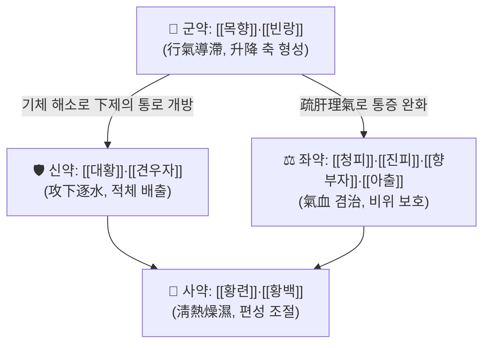

# 🍵 [[목향빈랑환]] (木香槟榔丸, Muxiang Binglang Wan)

> **핵심 3줄 요약 (Key Summary)**:
> - 🌿 모체/기원 처방: 금원대(金元代) 장종정(張從正)의 『[[유문사친]](儒門事親)』을 원방으로 하는 **행기(行氣) + 공하(攻下) + 청열조습(淸熱燥濕)** 3축 복합 방제. [[목향]]·[[빈랑]]을 군약으로, [[대황]]·[[견우자]](黑丑)로 積滯를 밀어내고, [[청피]]·[[진피]]·[[향부자]]·[[아출]]로 기체를 뚫으며, [[황련]]·[[황백]]으로 습열을 청소하는 구조. 즉 **[[지출도체환]] 계열의 소적도체(消積導滯) + [[대승기탕]] 계열의 통하(通下)를 이기제(理氣劑)로 묶은 처방**이다.
> - 🎯 임상 최적 적응증: **실증(實證)·열증(熱證)의 습열적체(濕熱積滯)** — 완복창만창통(脘腹脹滿脹痛), 애기탄산(噯氣吞酸), 대변불통 혹은 하리적백(下痢赤白)·이질후중(裏急後重), 설태 황후니(黃厚膩), 맥 실활삭(實滑數). 음주·육식 과다한 **태음인·소양인 실증 체형(비만·근육질·피부 번들거림)** 에서 적중률이 높다. 소음인·허한자·노약자·임신부에는 원칙적으로 부적합.
> - 🔬 핵심 분자약리 기전: 개별 본초 수준에서 안트라퀴논(대황: emodin·rhein·sennoside)의 **대장 운동 촉진·수분 분비**, arecoline(빈랑)의 **콜린성 장운동 항진**, berberine(황련·황백)의 **AMPK 활성·NF-κB 억제·장내균총 조절**, costunolide/dehydrocostus lactone(목향)의 **NF-κB·iNOS/COX-2 억제**가 보고되어 있다. 다만 **목향빈랑환 복합 추출물 자체에 대한 분자·임상 연구는 본 검색에서 확인되지 않음(근거 미확인)**.
> - ⚠️ 주의사항: 峻下 작용이 강한 공하제다. 임신부(견우자·대황의 자궁흥분·유산 위험), 수유부, 노약자·소아, 脾胃虛寒·허한성 설사, 탈수·전해질 이상, 소화성 궤양·장출혈 위험군, 만성 염증성 장질환 급성 악화기에는 금기 또는 극히 신중. 장기 연용 시 의존성 변비·수분전해질 소실·신장 부담(견우자 독성) 우려. 항응고제·항생제·강심배당체·기타 사하제와의 병용 주의.

---
## 📌 목차
1. [기본 처방 정보 & 군신좌사 구성](#1-기본-처방-정보--군신좌사-구성)
2. [방제학적 약재 상호작용 & 시너지 네트워크](#2-방제학적-약재-상호작용--시너지-네트워크)
3. [현대 분자약리학적 효능 & 작용 기전](#3-현대-분자약리학적-효능--작용-기전)
4. [적응 병증 및 체질별 감별 (Sweet Spot vs 금기)](#4-적응-병증-및-체질별-감별-sweet-spot-vs-금기)
5. [유사 처방군 감별 매트릭스](#5-유사-처방군-감별-매트릭스)
6. [임상 가감례 & 현대 질환별 응용](#6-임상-가감례--현대-질환별-응용)
7. [💡 사용자 진료실 핵심 필기 & 임상 팁 (원문 보존)](#7--사용자-진료실-핵심-필기--임상-팁-원문-보존)
8. [출처 및 학술 참고 문헌 (References)](#8-출처-및-학술-참고-문헌-references)
---
## 1. 기본 처방 정보 & 군신좌사 구성

* **출전**: 금원대(金元代) **장종정(張從正, 子和)** 『[[유문사친]](儒門事親)』의 木香槟榔丸을 원방으로 한다. 장종정은 대표적 **공사파(攻邪派)** 의학자로, "적체가 있으면 마땅히 쳐서 없애야 한다"는 攻邪論에 입각해 汗·吐·下 三法을 중시했고, 본 방은 그중 **하법(下法)** 을 理氣·淸熱과 결합한 대표 처방이다.
* **후대 전승**: 『[[단계심법]](丹溪心法)』 등 후대 문헌에 유사 가감방이 전하며, 『[[동의보감]](東醫寶鑑)』 등 조선 문헌에도 적취(積聚)·이질(痢疾) 문에 유사 방이 수록되어 있는 것으로 보이나 **판본별 구성 약재 대조는 추가 확인 필요(근거 미확인)**.
* **치법**: **행기소적(行氣消積), 청열조습(淸熱燥濕), 통하도체(通下導滯)** — 즉 積滯를 攻下로 쳐내면서 氣滯를 풀어주고, 그 틈에 낀 濕熱을 苦寒으로 씻어내는 3중 구조. 이질처럼 "설사가 나는데도" 오히려 通下法을 쓰는 **통인통용(通因通用)** 의 전형적 응용이다.
* **제형**: 원방은 등분(等分)을 가루내어 水丸(혹은 醋糊丸)으로 만들어 **생강탕(生薑湯) 또는 온수로 복용**한다. 임상에서는 湯劑(탕제)로 가감하여 쓰는 경우가 많다. 아래 용량은 탕제 전용 시의 통상 참고 범위이며, 원방의 等分 丸劑와는 제형·용량 체계가 다르다.

| 구분 | 약재명 | 표준 용량 | 본초 효능 & 방제 내 역할 |
| :--- | :--- | :--- | :--- |
| **군약 (君藥)** | [[목향]], [[빈랑]] | 각 6~9g (원방 等分) | **목향**: 신온(辛溫)으로 行氣止痛·健脾消食. 脾胃의 氣滯를 풀어 완복창만을 주로 치료. **빈랑**: 苦辛溫으로 下氣導滯·행수소적(行水消積)·살충. 목향이 위완(胃脘)의 氣를 升散시키면 빈랑은 장(腸)의 적체를 降氣시켜 밀어내려 **升降 한 쌍의 축**을 이룬다. |
| **신약 (臣藥)** | [[대황]], [[견우자]](黑丑) | 대황 6~9g, 견우자 4~6g | **대황**: 苦寒 峻下. 積熱을 泄하고 燥屎를 通한다(瀉下攻積·淸熱瀉火). **견우자(흑축)**: 苦寒有毒, 瀉下逐水·소적살충. 군약이 만든 氣滯 해소의 흐름에 **물리적 배출구**를 열어 적체·수습(水濕)을 아래로 끌어내린다. |
| **좌약 (佐藥)** | [[청피]], [[진피]], [[향부자]], [[아출]] | 각 4~6g | **청피**: 疏肝破氣·消積化滯(간기 울결에서 온 脘腹脹痛). **진피**: 理氣健脾·燥濕化痰, 비위 보호. **향부자**: 疏肝理氣·止痛, 氣滯 통증의 요약. **아출**: 行氣破血·消積止痛, 氣滯가 血滯로 심화된 積塊를 겸治. 네 약재가 氣·血·肝·脾를 나눠 담당해 **기체 네트워크를 다층으로 해소**한다. |
| **사약 (使藥)** | [[황련]], [[황백]] | 각 3~6g | 苦寒으로 淸熱燥濕·瀉火解毒. 적체에 깃든 濕熱(이질·하리적백의 병리)을 청소하고, 대황·견우자의 峻下로 인한 燥烈함과 津液 소모를 **苦寒淸熱로 상쇄·조절**하여 제약(制約) 역할을 한다. |

> **배오 특징**: 본 방은 **①행기(木香·檳榔·靑皮·陳皮·香附·莪朮) → ②공하(大黃·牽牛子) → ③청열조습(黃連·黃柏)** 의 3층 구조로 되어 있다. 단순히 설사시키는 下劑가 아니라, **기체를 풀어 적체의 '길'을 열고(行氣), 그 길로 적체와 습열을 밀어내며(通下), 남은 열독을 씻어내는(淸熱)** 협동 설계다. 升降의 관점에서는 목향·향부자가 升散·疏達, 빈랑·대황·견우자가 降泄을 담당하여 **승강출입(升降出入)의 막힌 축을 동시에 복원**한다.
>
> ※ 군신좌사 배속은 문헌·교재에 따라 일부 차이가 있다. 황련·황백을 佐藥으로, 진피를 使藥으로 보는 견해도 있으므로 **배오 해석은 학파별 차이가 있음**을 감안해 읽는다.

---
## 2. 방제학적 약재 상호작용 & 시너지 네트워크

* **[[목향]] + [[빈랑]] 배오**: 상호 상승(相須) 관계. 목향은 中焦 氣滯를 芳香으로 疏通하고, 빈랑은 하초(下焦) 적체를 降氣로 끌어내린다. 둘을 함께 쓰면 **상초의 氣가 막히지 않고 하초의 積이 밀려나는** 승강 순환이 만들어지며, 이것이 본 방 전체의 골격이다.
* **[[대황]] + [[견우자]] 배오**: 대황이 熱結·燥屎를 泄하고 견우자가 水濕·積滯를 逐하는 상사(相使) 관계. 단, 견우자는 有毒·자극성이 강해 **대황 단독보다 위장 자극·복통·수양성 설사 위험이 커지므로, 임상에서는 견우자를 빼거나 量을 줄여 2제(大黃+枳實 등)로 대체하는 응용이 많다**.
* **[[청피]] + [[향부자]] 배오**: 疏肝理氣의 대표 배합. 스트레스성·간울성 복통·팽만(기능성 소화불량, IBS)에 대한 표적성이 높다.
* **[[황련]] + [[황백]] 배오**: 濕熱 하리(下痢)의 핵심 苦寒 배합. 대황·견우자의 攻下가 만든 熱과 적체 부패로 인한 濕熱을 청소하여, **공하의 편향성(燥烈·탈수)을 조절하는 완충 장치** 역할을 한다.
* **[[아출]] + [[진피]] 배오**: 破血行氣(아출)와 理氣健脾(진피)의 결합. 단순 氣滯를 넘어 積塊·혈체가 동반된 만성 복부 팽만·종괴감에 대응하며, 아출의 峻烈함을 진피가 和緩하게 받쳐준다.

---
## 3. 현대 분자약리학적 효능 & 작용 기전

> ⚠️ 아래 내용은 **개별 구성 본초에 대해 보고된 약리 기전을 정리한 것**이다. **목향빈랑환 복합 처방 자체를 대상으로 한 분자·임상 연구는 본 노트 작성 시 검색된 PubMed 논문이 없어 근거 미확인**이며, 처방 전체의 효능으로 단정할 수 없다.

### 1) 위장관 운동 조절 및 하제(瀉劑) 기전
* **[[대황]]**: 안트라퀴논류(sennoside A/B, rhein, emodin)가 대장에서 세균에 의해 활성 대사체로 전환되어 **대장 연동운동 촉진 + 장내 수분·전해질 분비 증가**를 유도한다. 이는 자극성 하제의 전형적 기전으로, 본 방의 "통하도체" 작용의 중심축으로 추정된다.
* **[[빈랑]]**: arecoline이 **콜린성 M수용체를 흥분**시켜 장관 평활근 운동을 항진시키고, 동시에 기생충체 근육을 마비시켜 구충 효과를 낸다(전통적 살충 효능의 약리적 배경).
* **[[견우자]]**: pharbitin(수지 배당체)이 장 점막을 자극하여 **자극성 사하**를 일으킨다. 자극성이 강해 복통·구역을 동반할 수 있으며, 독성·신장 부담 논란이 있으므로 **현대 임상에서는 사용을 제한하는 추세**다.
* **[[목향]]**: 芳香성 정유(costunolide, dehydrocostus lactone 등)가 **위장 평활근 경련을 억제**하고 담즙 분비를 촉진하는 방향으로 보고되어, 行氣止痛 효능과 연결된다.

### 2) 항염·항균 및 면역 조절
* **[[황련]]·[[황백]]**: berberine, palmatine, phellodendrine 등이 **NF-κB 신호 억제, iNOS·COX-2 발현 감소, TNF-α·IL-6·IL-1β 등 염증성 사이토카인 억제**를 나타내며, 그람음성 장내 병원균(이질균·대장균 등)에 대한 항균 작용이 보고되어 있다. 또한 berberine은 **장내 균총 구성 조절** 및 AMPK 활성화를 통한 대사 개선 효과가 보고된다.
* **[[목향]]**: costunolide 계열이 NF-κB·MAPK 경로 억제를 통한 항염 작용을 나타낸다는 보고가 있다.
* **[[향부자]]**: α-cyperone 등이 진통·항염 작용을 나타낸다는 보고가 있다.
* → 이들 기전은 **이질·급성 장염에서의 濕熱 제거 및 염증성 통증 완화**라는 전통 효능과 개념적으로 정합적이나, **복합 처방 수준에서의 검증은 미확인**이다.

### 3) 대사·간담도 및 기타
* **[[대황]]**: rhein·emodin의 간 보호·항섬유화, 담즙 분비 촉진(利膽) 작용이 보고되어 있어, 濕熱黃疸·담낭 질환 응용의 약리적 배경이 된다.
* **[[아출]]**: curcumol, curdione 등의 **항종양·항혈전·항염** 작용이 세포·동물 수준에서 보고되어 있으며, 전통적 破血消積 효능과 연결된다.
* **[[청피]]·[[진피]]**: hesperidin, nobiletin 등 플라보노이드의 항산화·혈관 보호·항염 작용이 보고되어 있다.
* ⚠️ 위 기전들은 대부분 **세포·동물 실험 수준**이며, 사람에서의 임상적 유효성·용량-반응 관계는 **근거 미확인**이다.

---
## 4. 적응 병증 및 체질별 감별 (Sweet Spot vs 금기)

[✅ 최적 적응증 (Sweet Spot)]
* **원전 주치(개념 정리)**: 積滯內停·濕熱內阻로 인한 脘腹痞滿脹痛, 噯氣吞酸, 大便不通 또는 下痢赤白·裏急後重, 舌苔黃膩, 脈實. 『[[유문사친]](儒門事親)』의 攻邪論에 따른 積滯 공격 처방으로, **원문 조문 그대로의 인용은 판본 대조가 필요하여 여기서는 요약 서술만 한다**.
* **체질 소견**:
  * **태음인 실증**: 체격이 크고 복부 지방이 많으며, 음주·육식·야식이 잦고 얼굴·피부가 번들거리며 유분이 많은 편. 대변이 무겁고 시원치 않음.
  * **소양인 실증**: 상체가 발달하고 열이 위로 오르는 편(두면부 열감·구취), 성격이 급하고 스트레스 시 복통·설사가 반복됨.
  * **부적합 체형**: 마르고 피부가 건조하며 손발이 찬 **소음인**, 기력이 떨어지고 식욕이 없는 **허약자**, 만성 피로·빈혈 소견자.
* **임상 주치(진료실 적중 양상)**:
  * 과식·폭식·음주 후 **심한 복부 팽만 + 트림·속쓰림 + 변비**가 동반된 급성기.
  * **이질형 장염**: 설사가 잦은데도 볼 때 시원치 않은 **후중감(裏急後重)**, 점액·점혈이 섞인 변.
  * 입 냄새, 설태가 두껍고 누렇고 끈적함, 아침에 입이 쓰고 텁텁함.
* **설진/맥진**:
  * 설질: 홍(紅) 또는 홍강(紅絳), 설태는 **황후니(黃厚膩)** 또는 황조니(黃燥膩).
  * 맥상: **실(實)·활(滑)·삭(數)**, 또는 大而有力. 만약 맥이 沈細無力하거나 虛弱하면 본 방의 적응이 아니다.

[⚠️ 신중 투여 및 금기 (Caution / Contraindication)]
* **허실(虛實) 반대**: 脾胃虛寒·허한성 만성 설사(오리온복냉, 새벽 설사, 무른 변에 소화 안 됨)에 투여하면 **복통·설사 악화, 기력 탈진, 탈수**를 유발할 수 있다. 열증(熱證)이 아닌 寒積에는 부적합.
* **한열(寒熱) 반대**: 大黃·黃連·黃柏·牽牛子가 모두 苦寒 峻烈하므로, **음허(陰虛)·진액 부족·만성 소모성 질환자**에게는 苦寒이 脾胃를 상하게 한다.
* **금기 환자군**:
  * **임신부·수유부** — 견우자(자궁 흥분·유산 위험), 대황(골반 충혈·유산 유발 가능)로 **금기**.
  * 노약자·소아·병후 회복기(正氣虛) — 攻下는 正氣를 손상시킨다.
  * 소화성 궤양 활동기, 위장관 출혈 소견자, 장폐색 의심(진단 전 함부로 下法 금지).
  * 탈수·전해질 이상·신기능 장애자 — 견우자·대황의 신장 부담.
  * 월경과다·자궁출혈 환자 — 破血·下行 작용.
* **양약 및 타 약물 병용 주의**:
  * **항응고·항혈소판제**(와파린, 아스피린 등) — 대황·아출의 혈액응고 영향 가능성.
  * **항생제·장내균총 조절제** — berberine의 균총 조절과 상호 영향 가능(근거 미확인).
  * **기타 사하제·완하제** 병용 시 과도한 설사·탈수 위험.
  * **당뇨약·강심배당체** 복용자 — 대황의 전해질 소실이 이상반응을 유발할 수 있음.
* **복용 반응 관찰 포인트**: 복용 후 **1~2회 무른 변까지만 반응으로 보고, 하루 3회 이상 수양성 설사·복통·구역·어지럼이 나타나면 즉시 감량·중단**한다. 3~5일 이상 연용하지 않는다.

---
## 5. 유사 처방군 감별 매트릭스

| 처방명 | 핵심 구성 차이 | 주치 및 체질 차이 | 맥진/설진 차이 |
| :--- | :--- | :--- | :--- |
| [[목향빈랑환]] | 기준 구성: 목향·빈랑·대황·견우자·청피·진피·향부자·아출·황련·황백 | 실증·열증의 습열적체, 이질 후중감, 변비+팽만. 태음인·소양인 실증 | 설태 황후니, 맥 실활삭·유력 |
| [[지출도체환]] | 대황·지실·신곡·복령·황금·황련·백출·택사 (행기파적 약재 부족, 이수·소식 강화) | 濕熱食積으로 인한 胸脘痞悶·설사. 공격성이 목향빈랑환보다 완만, 식상·습체 중심 | 설태 황니이되 후하지 않음, 맥 활수(滑數)하나 상대적으로 연함 |
| [[보화환]] | 산사·신곡·내복자·반하·진피·복령·연교 | 單純 食積(과식)으로 인한 애기·복창. 攻下 없음, 소아·노약자·허약자에게도 비교적 안전 | 설태 후니, 맥 활(滑)하되 數하지 않음 |
| [[목향순기환]] | 목향·후박·진피·사인·향부·창출·지각·감초 | 氣滯 위주의 창만·애기, 寒濕 기체에도 응용. 공하 작용 없어 만성·허약자에 사용 가능 | 설태 백니, 맥 弦·緩 |
| [[대승기탕]] | 대황·망초·지실·후박 (이기·청열 약재 없음) | 陽明腑實의 痞·滿·燥·實·堅, 고열·복통 거부·변비. 순수 峻下 | 설태 황조(黃燥)·초흑, 맥 沈實·遲 |

> ⚠️ 표 내부에서는 마크다운 열 구분자 파괴를 방지하기 위해 파이프(`|`)가 들어간 링크를 쓰지 않고 순수한 [[처방명]] 단독 형태로만 작성합니다.

**감별 요점 한 줄 정리**
* **변비 + 팽만 + 습열(설태 황니)** → [[목향빈랑환]]
* **식상 + 무른 변 + 속이 꽉 막힘** → [[지출도체환]]
* **과식 후 단순 소화불량, 허약자·소아** → [[보화환]]
* **스트레스성 창만, 寒濕 기체, 만성** → [[목향순기환]]
* **고열 + 변비 + 단단한 복벽(燥屎)** → [[대승기탕]]

---
## 6. 임상 가감례 & 현대 질환별 응용

* **수반 증상별 가감법**:
  * 복통·이질 후중감 심함 → + [[백작약]]·[[감초]] ([[작약감초탕]] 의미의 緩急止痛 배합)
  * 변비가 주증이고 燥屎가 뚜렷 → + [[망초]] ([[대승기탕]] 가미 개념) 혹은 대황 증량
  * 과식·식상이 뚜렷 → + [[산사]]·[[신곡]]·[[내복자]] ([[보화환]] 합방)
  * 습열 황달·입 쓰고 담즙 역류감 → + [[인진]]·[[치자]]
  * 오심·구역·구토 동반 → + [[반하]]·[[생강]] (생강탕 복용법과도 부합, 和胃止嘔)
  * 積塊·종괴감·혈체 동반 → + [[삼릉]] ([[아출]]과 배합 시 破血消積 강화)
  * 기생충 의심(복통·항문 소양감) → + [[사군자]]·[[뇌환]] 등 구충 약재 (전통적 살충 효능 강화)
  * 허약자로 攻下가 부담될 때 → 견우자 제거, 대황 감량 + [[백출]]·[[복령]] 등 健脾 약재로 正氣 보호
* **현대 질환별 임상 매핑** (⚠️ 아래는 전통 변증에 근거한 **응용 가능성 수준의 정리**이며, 본 처방의 무작위 임상시험 근거는 확인되지 않음):
  * **소화기계**: 급성 위장염, 세균성 이질·식중독성 장염(습열형), 기능성 소화불량(실증·열증), 기능성 변비, 과민성 장증후군 설사형의 실열 아형, 위식도 역류의 濕熱型.
  * **간담도계**: 급성 담낭염·담석증의 습열형(利膽 목적), 지방간·대사증후군의 습열·담습형.
  * **감염·기생충**: 장내 기생충증(전통적 구충 응용).
  * **피부·구강**: 습열형 여드름·구내염·구취(변비 동반 시).
  * **기타**: 음주 후 숙취성 위장 장애, 비만 환자의 복부 팽만.
  * → 모두 **실증·열증·습열 조건이 충족될 때만** 제한적으로 고려하며, 허약자·만성 소모성 질환에는 쓰지 않는다는 원칙을 유지한다.

---
## 7. 💡 사용자 진료실 핵심 필기 & 임상 팁 (원문 보존)

> [!tip] **진료실 실전 노하우 (User Clinical Insight)**
> - *(원장님 기존 필기 원문이 아직 이 노트에 입력되지 않은 상태입니다. 기존 메모가 확인되면 이 블록에 **삭제 없이 그대로** 이관하고, 아래 초안은 참고용으로만 유지합니다.)*
>
> - **처방 선택 기준(초안)**
>   - 소음인·허약자에게는 쓰지 않는다. 태음인·소양인의 **실증**에서만, 그것도 **단기간(3~5일 이내)** 으로 제한해 투여한다.
>   - 환자의 얼굴이 붉고 기름지며, 설태가 두껍고 누렇고 끈적할 때가 전형적 적응. 반대로 설태가 희고 얇거나 설질이 담백하면 쓰지 않는다.
>   - 복용 후 반응으로 용량을 조절한다. "하루 1~2회 무른 변" 이면 적정, "물 같은 변 + 복통" 이면 즉시 중단·감량.
> - **환자 티칭 포인트**
>   - "설사시키는 약"이라는 인식을 줄이고, "막힌 것을 뚫고 쌓인 열을 씻어내는 약"이라고 설명한다.
>   - 복용 중 술·기름진 음식·야식을 금하도록 지도. 수분 섭취를 충분히 하도록 안내(탈수 예방).
>   - 임신 가능성이 있는 여성에서는 **반드시 복용 전 확인**. 견우자·대황 때문에 임신 중에는 금기임을 명확히 고지.
> - **복약 반응 관찰 포인트**
>   - 배변 횟수·성상, 복통·구역·어지럼 여부, 소변량(탈수 신호), 피부 발진.
>   - 장기 연용 시 의존성 변비·전해질 이상 우려 → 증상 호전 시 즉시 감량·중단하고 健脾 처방으로 전환.

---
## 8. 출처 및 학술 참고 문헌 (References)

1. **(검색 결과 안내)** 본 노트 작성 시 제공된 PubMed 논문 데이터가 **없음**. 따라서 현대 학술 논문·PMID·DOI 인용은 **일절 기재하지 않으며**, 존재하지 않는 문헌을 창작하지 않는다. 본문 3장의 분자약리 기전은 **개별 구성 본초에 대한 일반적으로 알려진 약리 지식 수준**의 서술이며, 처방 복합체 수준의 임상·기전 근거는 **미확인**임을 명시한다.
2. **장종정(張從正, 金元代)**. 『[[유문사친]](儒門事親)』.
   - **[고전 원전]**: 攻邪論(汗·吐·下 三法)에 입각한 積滯 치료 방제. 목향빈랑환의 원방 출전으로, 등분 水丸·生薑湯下 복용법과 積滯·濕熱·이질 주치 개념의 근거.
   - ※ 정확한 조문 인용은 판본 대조가 필요하여 본 노트에서는 요약 서술로 대체함.
3. **허준(許浚, 1613)**. 『[[동의보감]](東醫寶鑑)』.
   - **[임상 문헌]**: 적취(積聚)·이질(痢疾) 문에 유사 방제가 수록된 것으로 알려져 있음. **한국 문헌에서의 정확한 수록 위치·구성 약재 대조는 추가 확인 필요(근거 미확인)**.
4. **한의학 방제학 교재(대학 공통 교재)**.
   - **[일반 참고]**: 군신좌사 배속, 치법(行氣消積·淸熱燥濕·通下導滯), 유사 처방군([[지출도체환]], [[목향순기환]], [[보화환]], [[대승기탕]]) 감별의 일반 이론 근거. 판본·저자별로 배속에 차이가 있음.

<!-- 보관 태그(1회용·링크오류, 필요시 복원): 소적, 통하, 습열적체, 이질후중감 -->
