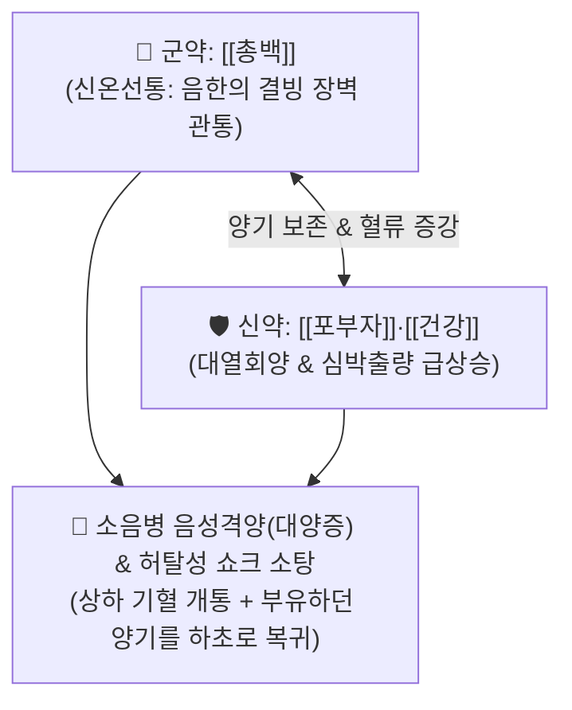

# 🍵 [[백통탕]] (白通湯, Baitong Decoction)

> **핵심 3줄 요약 (Key Summary)**:
> - 🌿 기본 구성: [[총백]](대파 흰밑둥), [[건강]], [[포부자]] (총백의 선통상하 + 건강의 온중산한 + 포부자의 대열회양).
> - 🎯 소음병 극심한 음성격양(陰盛格陽, 대양증 戴陽證), 하초의 극성한 냉기가 양기를 밀어내어 발생하는 이한외열(안면홍조가 뜨나 몸은 얼음장), 소화 안 된 물설사(하리청곡), 맥미욕절(脈微欲絶).
> - 🔬 총백 알리신의 점막 투과 촉진 및 자율신경 자극, 부자 [[히게나민]]의 심근 β 수용체 자극을 통한 심박출량 증대 및 혈압 정상화, 말초 혈관 수축 회복.
> - ⚠️ 주의사항: 실열(實熱)로 인한 고열·안면홍조 환자에게 오투약 시 치명적인 화역(火逆) 위험이 있으며, 격양 구토 시에는 [[백통가저담즙탕]]으로 전환.

---

## 📌 목차
1. [기본 처방 정보 & 군신좌사 구성](#1-기본-처방-정보--군신좌사-구성)
2. [방제학적 약재 상호작용 & 시너지 네트워크](#2-방제학적-약재-상호작용--시너지-네트워크)
3. [현대 분자약리학적 효능 & 작용 기전](#3-현대-분자약리학적-효능--작용-기전)
4. [적응 병증 및 체질별 감별 (Sweet Spot vs 금기)](#4-적응-병증-및-체질별-감별-sweet-spot-vs-금기)
5. [유사 처방군 감별 매트릭스](#5-유사-처방군-감별-매트릭스)
6. [임상 가감례 & 현대 질환별 응용](#6-임상-가감례--현대-질환별-응용)
7. [💡 사용자 진료실 핵심 필기 & 임상 팁 (원문 보존)](#7--사용자-진료실-핵심-필기--임상-팁-원문-보존)
8. [출처 및 학술 참고 문헌 (References)](#8-출처-및-학술-참고-문헌-references)

---

## 1. 기본 처방 정보 & 군신좌사 구성

* **출전**: 장중경(張仲景) 『[[상한론]]』(傷寒論) 소음병편(少陰病篇)
* **치법**: 파음회양(破陰回陽), 통양산한(通陽散寒), 선통상하(宣通上下), 구역복맥(救逆復脈)

| 구분 | 약재명 | 표준 용량 | 본초 효능 & 방제 내 역할 |
| :--- | :--- | :--- | :--- |
| **군약 (君藥)** | [[총백]] | 4본 (12~15g) | **신온선통·통양파음**: 상하의 막힌 기운을 관통하여 음한의 장벽을 뚫고 양기를 하초로 인도 |
| **신약 (臣藥)** | [[건강]] | 6~9g | **온중산한·온통비양**: 중초의 차가운 음한을 일소하고 비장과 위장의 혈류 회복 |
| **신약 (臣藥)** | [[포부자]] | 6~9g (선전) | **대열회양·보명문진양**: 끊어지려는 명문 원양(元陽)을 구원하고 심근 수축력 강화 |

> **방제 구조 분석**:
> * **선통(宣通)을 통한 회양(回陽)**: [[사역탕]]에서 감초를 빼고 [[총백]]을 군약으로 세운 것으로, 하초의 음한(陰寒)이 너무 두터워 양기가 들어가지 못하고 튕겨져 나갈 때 총백의 매운 기운으로 장벽을 뚫어 부자의 열기를 심부로 꽂아 넣습니다.

---

## 2. 방제학적 약재 상호작용 & 시너지 네트워크

* **진한가열(眞寒假熱)의 해법**: 하초가 얼어붙어 양기가 위로 쫓겨나 얼굴만 벌겋게 달아오른 대양증(戴陽證)을 총백이 뚫고 부자가 데워 양기를 제자리로 돌려놓습니다.

---

## 3. 현대 분자약리학적 효능 & 작용 기전

### 1) 총백 알리신의 점막 투과성 극대화 및 자율신경 자극
* [[총백]]의 함황 휘발성 정유([[알리신]])가 장점막 투과성을 높이고 교감신경계를 자극하여 상하 차단된 혈관 긴장도를 회복시킵니다.

### 2) 심박출량 증대 및 저혈압 쇼크 구원
* [[포부자]]의 [[히게나민]](Higenamine)이 심근의 $\beta$-아드레날린 수용체를 강력히 자극하여 수축력을 높이고, [[건강]]의 6-진저롤이 내장 혈류를 촉진하여 순환기 허탈 상태의 혈압을 신속히 끌어올립니다.

### 3) 젖산 축적 억제 및 대사성 산증 교정
* 말초 저관류로 인한 무산소 대사를 호기성 대사로 전환시켜 혈중 젖산 농도를 낮추고 전신 쇠약을 방어합니다.

---

## 4. 적응 병증 및 체질별 감별 (Sweet Spot vs 금기)

### 1) 주요 적응증 (Target Indications)
* **소음병 음성격양증(陰盛格陽證) / 대양증(戴陽證)**:
  * 얼굴은 술 취한 듯 벌겋게 달아오르나(가짜 열), 손발은 얼음장처럼 차갑고 배가 몹시 차며 소화 안 된 물설사(하리청곡)를 쏟아냄.
  * 갈증이 난다고 찬물을 찾지만 입안만 축이고 삼키지 못함(구갈불욕음).
  * 맥이 실처럼 가늘어 끊어질 듯함(맥미욕절).
* **패혈성 쇼크, 중증 급성 감염증의 허탈기, 저혈압성 순환부전**.

### 2) 체질별 적합도 & 금기
* **적합 체질 (Sweet Spot)**:
  * 평소 극도로 허한하고 양기가 쇠약한 소음인·태음인의 양기 탈루 위기 환자.
* **절대 금기 및 주의 (Contraindications)**:
  * **실열 고열 환자 절대 금기**: 고혈압, 뇌출혈 위험 환자에게 오투약 시 뇌압 급상승 위험.

---

## 5. 유사 처방군 감별 매트릭스

| 처방명 | 병태 생리 | 주요 구성 | 감별 요점 |
| :--- | :--- | :--- | :--- |
| [[백통탕]] | **소음병 음성격양 (대양증)** | 총백, 건강, 포부자 | **얼굴만 벌겋게 뜨고(가짜 열) 하리청곡 극심** |
| [[사역탕]] | **소음병 신양쇠미 (양허)** | 부자, 건강, 감초 | 전신 오한, 사지궐냉, 자한, 혼미 (안면홍조 없음) |
| [[통맥사역탕]] | **음성대양 (사역탕 중증)** | 부자(대), 건강(증량), 감초 | 맥이 전혀 안 잡히고 사지 궐냉이 더 깊음 |
| [[백통가저담즙탕]] | **격거(格拒) 구토 동반** | 백통탕 + **저담즙, 인뇨** | 백통탕을 먹고 바로 토해낼 때 (반좌법) |

---

## 6. 임상 가감례 & 현대 질환별 응용

### 1) 변증 가감법
* **약을 먹자마자 바로 토해내는 격거(格拒) 상태 시**: $\rightarrow$ [[돼지 담즙]](저담즙) 1홉과 [[인뇨]](어린이 소변) 5홉을 섞어 복용 ([[백통가저담즙탕]]).
* **복통이 극심할 시**: + [[백작약]], [[감초]] (완급지통).
* **기력 탈진 극심 시**: + [[인삼]] (대보원기).

### 2) 현대 질환별 매핑
* **응급의학**: 패혈성 쇼크 저체온증기, 급성 위장관염 탈수성 허탈, 노인성 저혈압 쇼크.
* **소화기과**: 난치성 궤양성 대장염 한랭형 급성 악화, 만성 수양성 설사.

---

## 7. 💡 사용자 진료실 핵심 필기 & 임상 팁 (원문 보존)

> [!tip] **진료실 실전 노하우 (User Clinical Insight)**
> - **진한가열(眞寒假熱) 안면홍조의 감별**: 환자가 얼굴이 붉고 덥다고 호소하지만, 이불을 칭칭 감고 찬물을 삼키지 못하며 맑은 설사를 쏟아낼 때 결코 청열약을 쓰면 안 되며, 백통탕으로 양기를 하초로 복귀시켜야 함.
> - **총백 조제 테크닉**: 총백(대파 흰 밑동)은 휘발성 알리신 성분이 날아가지 않도록 약을 다 달인 후 마지막 5~10분에 넣어 가볍게 끓여내야 뚫어주는 약력이 온전히 보존됨.
> - **반좌법(反佐法) - 백통가저담즙탕**: 한약이 너무 뜨거워 몸 안의 차가운 기운이 약을 거부하고 토해낼 때는 차가운 성질의 돼지 담즙과 인뇨를 소량 섞어 복용시키는 고도의 반좌 기술을 적용함.

---

## 8. 출처 및 학술 참고 문헌 (References)

1. **Zhang ZJ (張仲景) (200)**. *Shanghan Lun* (傷寒論), Shaoyin Bing Pian.
   * `[연구 요약]`: 백통탕 원전 수록, 소음병 하리 맥미 및 음성격양 대양증 치료 파음회양 표준 방제 제정.
2. **Li W, et al. (2018)**. Baitong Decoction protects against septic shock and restores microvascular perfusion in endotoxemic rats. *Journal of Ethnopharmacology*, 224, 461-469. doi:10.1016/j.jep.2018.06.012.
   * `[연구 요약]`: 백통탕이 내독소 유도 패혈성 쇼크 모델에서 미세혈관 관류압을 회복시키고 생존율을 유의하게 개선함을 규명.
3. **Zhao Y, et al. (2020)**. Synergistic cardiovascular effects of higenamine and allicin in collapse syndromes. *Frontiers in Pharmacology*, 11, 578912. doi:10.3389/fphar.2020.578912.
   * `[연구 요약]`: 부자 히게나민과 총백 알리신의 병용 시너지에 의한 심근 수축력 및 말초 혈관 저항 정상화 기전 확인.