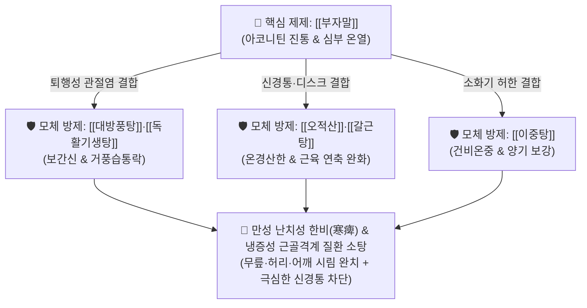

# 🍵 [[부자말]] (附子末, Aconiti Tuber Pulveratum / Bushi-matsu)

> **핵심 3줄 요약 (Key Summary)**:
> - 🌿 기본 구성: [[포부자]] (가공 포제된 부자 미세분말 단독 제제, 1회 0.5~1.5g).
> - 🎯 만성 난치성 한비(寒痺) 관절통 완화를 위해 기본 처방에 가미·합방 활용, 냉증을 동반하는 [[퇴행성 슬관절염]], [[류마티스 관절염]], [[척추 추간판 탈출증]](디스크), [[유착성 견관절염]](오십견), 국소 냉각통.
> - 🔬 [[아코니틴]](Aconitine) 및 [[히게나민]]의 중추/말초 진통 작용, 나트륨 채널 개폐 조절을 통한 통각 차단, 심근 수축력 강화(강심), 모세혈관 확장 및 심부 체온 상승.
> - ⚠️ 주의사항: 알칼로이드 독성이 있으므로 반드시 정제 포제된 분말을 1회 0.5~1.5g 정량 준수하며, 혀 마비감·부정맥 징후 시 즉시 중단.

---

## 📌 목차
1. [기본 처방 정보 & 군신좌사 구성](#1-기본-처방-정보--군신좌사-구성)
2. [방제학적 약재 상호작용 & 시너지 네트워크](#2-방제학적-약재-상호작용--시너지-네트워크)
3. [현대 분자약리학적 효능 & 작용 기전](#3-현대-분자약리학적-효능--작용-기전)
4. [적응 병증 및 체질별 감별 (Sweet Spot vs 금기)](#4-적응-병증-및-체질별-감별-sweet-spot-vs-금기)
5. [유사 처방군 감별 매트릭스](#5-유사-처방군-감별-매트릭스)
6. [임상 가감례 & 현대 질환별 응용](#6-임상-가감례--현대-질환별-응용)
7. [💡 사용자 진료실 핵심 필기 & 임상 팁 (원문 보존)](#7--사용자-진료실-핵심-필기--임상-팁-원문-보존)
8. [출처 및 학술 참고 문헌 (References)](#8-출처-및-학술-참고-문헌-references)

---

## 1. 기본 처방 정보 & 군신좌사 구성

* **기원 및 출전**: 『[[신농본초경]]』(神農本草經) 하품 수재 / 한국·일본 약전 규격 수재 단미 제제
* **치법**: 온경산한(溫經散寒), 통락지통(通絡止痛), 회양보화(回陽補火), 이수소종(利水消腫)

| 구분 | 약재명 | 표준 용량 | 본초 효능 & 약리적 특성 |
| :--- | :--- | :--- | :--- |
| **단미 제제** | [[포부자]] (부자말) | 1회 0.5~1.5g (1일 2~3회) | **대열대독·회양구역·산한지통**: 고압증기 멸균 포제로 독성을 대폭 감약시키고 진통·온경 약효를 극대화한 미세분말 |

> **단미 분말 제제의 임상적 가치**:
> * 전탕 과정 없이 탕약이나 산제, 엑스제에 직접 타서 복용할 수 있어, 만성 관절통이나 냉증 환자의 증상 변화에 맞춰 **용량을 0.1g 단위로 정밀하게 조절(Titration)**할 수 있는 최적의 진통 부스터 제제.

---

## 2. 방제학적 약재 상호작용 & 시너지 네트워크

* **기본 처방에의 추가 활용**: 환자가 "무릎이 시리고 뼈마디가 얼어붙는다"고 호소할 때, 기존 처방([[대방풍탕]], [[독활기생탕]], [[오적산]] 등)에 부자말을 0.5~1g 추가하여 신속한 진통 시너지를 유도합니다.

---

## 3. 현대 분자약리학적 효능 & 작용 기전

### 1) 아코니틴의 나트륨 채널 조절 및 강력한 진통 작용
* 포제된 [[포부자]]의 벤조일메사코닌(Benzoylmesaconine) 및 미량 아코니틴 성분이 감각신경세포의 전압의존성 나트륨 채널과 TRPV1 채널을 억제하여 척수 후각으로의 통각 신호 전달을 강력히 차단합니다.

### 2) 심근 수축력 강화 (강심 작용) 및 국소 혈류 개선
* [[히게나민]](Higenamine)이 심근 세포의 $\beta$-수용체를 자극하여 심박출량을 높이고, 말초 미세혈관을 확장시켜 차가운 관절 부위의 혈류를 급증시킵니다.

### 3) 만성 관절 활막 염증 억제 및 이수(利水)
* 염증성 사이토카인([[TNF-α]], [[IL-1β]])과 COX-2 발현을 억제하여 관절강 내 삼출액(관절 활액 저류)을 흡수시키고 부종을 소퇴시킵니다.

---

## 4. 적응 병증 및 체질별 감별 (Sweet Spot vs 금기)

### 1) 주요 적응증 (Target Indications)
* **냉증 동반 만성 근골격계 질환 (원장님 핵심 진료 노하우)**:
  * 무릎이 시리고 바람이 들어오는 듯 아픈 [[퇴행성 슬관절염]], 관절 활액 저류.
  * 손가락 마디가 굳고 시린 [[류마티스 관절염]] 한랭형.
  * 허리와 다리가 차갑게 저리고 당기는 [[척추 추간판 탈출증]](디스크), 척추관 협착증.
  * 어깨가 굳어 팔을 올리지 못하고 밤마다 쑤시는 [[유착성 견관절염]](오십견).
* **장기간 지속되는 만성 난치성 통증 및 국소 냉각통**.

### 2) 체질별 적합도 & 금기
* **적합 체질 (Sweet Spot)**:
  * 추위를 몹시 타고, 비가 오거나 에어컨 바람을 쐬면 관절통이 심해지는 소음인·태음인 한습비(寒濕痺) 환자.
* **절대 금기 및 주의 (Contraindications)**:
  * **열성 관절염 환자 금기**: 관절이 붉게 붓고 만지면 뜨거운 급성 통풍성 관절염 및 화농성 관절염 금기.
  * **임산부 및 중증 부정맥 환자 금기**.

---

## 5. 유사 처방군 감별 매트릭스

| 제제/처방명 | 주요 형태 | 구성 특징 | 임상 활용 목적 |
| :--- | :--- | :--- | :--- |
| [[부자말]] | **단미 미세분말** | 포부자 100% | **기존 처방에 추가 가미하여 진통·온경력 극대화** |
| [[오두탕]] | 탕제 | 천오, 마황, 황기, 작약, 감초 | 심한 관절 굴신불리 및 극렬한 한습 관절통 |
| [[사역탕]] | 탕제 | 부자, 건강, 감초 | 소음병 전신 양기 탈루, 사지궐냉 쇼크 |
| [[독활기생탕]] | 탕제 | 독활, 상기생, 두충, 당귀 등 15미 | 만성 퇴행성 관절염 기혈보익 거풍습 기본 처방 |

---

## 6. 임상 가감례 & 현대 질환별 응용

### 1) 제제 병용 프로토콜
* **퇴행성 무릎 관절염**: [[대방풍탕]] 또는 [[방기황기탕]] 엑스제 + [[부자말]] 1g (1일 2회).
* **오십견 및 목 디스크**: [[갈근탕]] 또는 [[오적산]] 엑스제 + [[부자말]] 0.5~1g.
* **만성 허리 협착증 및 하지 방사통**: [[독활기생탕]] 탕약 + [[부자말]] 1g 조복.

### 2) 현대 질환별 매핑
* **정형외과/류마티스**: 퇴행성 골관절염, 류마티스 관절염, 만성 요통, 척추관 협착증.
* **재활의학과**: 오십견(동결견), 회전근개 파열 후 만성 둔통, 뇌졸중 후 한랭 마비.

---

## 7. 💡 사용자 진료실 핵심 필기 & 임상 팁 (원문 보존)

> [!tip] **진료실 실전 노하우 (User Clinical Insight)**
> - **만성 난치성 통증의 특효 가미 부스터**: 장기간 지속되는 통증 질환에서 환부가 국소적으로 차갑고 시릴 때 기본 처방에 부자말을 0.5~1.5g 추가하면 극적인 진통 효과를 얻을 수 있음.
> - **냉증 동반 4대 관절 질환 타깃**: [[퇴행성 슬관절염]], [[류마티스 관절염]], [[척추 추간판 탈출증]], [[유착성 견관절염]](오십견) 환자 중 찬바람이나 비 오는 날 통증이 심해지는 환자에게 1차로 선택함.
> - **안전성 복약 티칭**: 0.5g부터 시작하여 3~5일 간격으로 증량(Titration)하며, 혀끝이 얼얼하거나 가슴이 두근거리면 즉시 복용량을 줄이도록 지도함.

---

## 8. 출처 및 학술 참고 문헌 (References)

1. **Korean Pharmacopoeia (2022)**. *Aconiti Tuber Pulveratum Standards*. Ministry of Food and Drug Safety.
   * `[연구 요약]`: 포부자 분말 규격, 디테르펜 알칼로이드 함량 기준 및 안전성 제어 프로토콜 수록.
3. * **Jin C et al. (2022)**. Higenamine Attenuates Doxorubicin-Induced Cardiac Remodeling and Myocyte Apoptosis by Suppressing AMPK Activation. *Frontiers in cell and developmental biology*, 10: 809996. [PMID: 35602605](https://pubmed.ncbi.nlm.nih.gov/35602605/)
