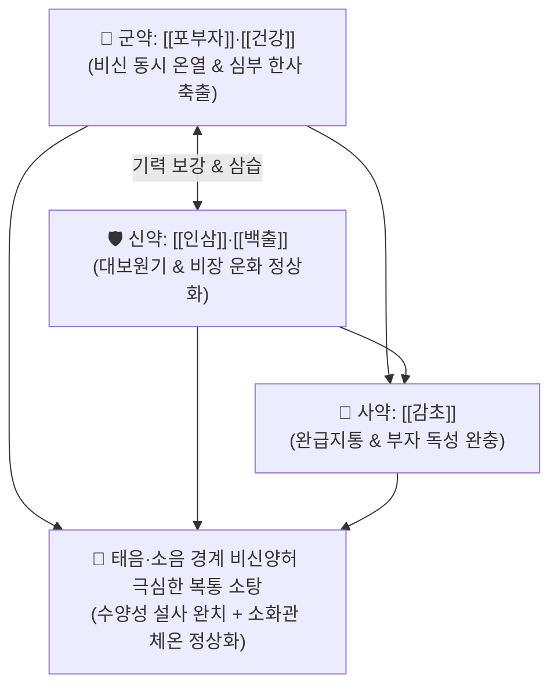

# 🍵 [[부자이중탕]] (附子理中湯, Fuzi-Lizhong-Tang / Bushi-richuto)

> **핵심 3줄 요약 (Key Summary)**:
> - 🌿 기본 구성: [[포부자]], [[인삼]], [[건강]], [[백출]], [[감초]] ([[이중탕]]의 건비온중 + 포부자의 온신회양).
> - 🎯 비신양허(脾腎陽虛) 및 태음병과 소음병 경계의 극심한 복통, 소화 안 된 음식물이 그대로 나오는 수양성 설사(완곡불화 完穀不化), 손발과 아랫배가 얼음장 같은 냉증, 구토, 만성 장염.
> - 🔬 장관 점막 혈류 촉진, 위장 평활근 Na+/K+-ATPase 활성 회복, 대식세포 염증성 사이토카인(TNF-α, IL-6) 억제, 심근 수축력 및 말초 관류압 상승.
> - ⚠️ 주의사항: 부자의 독성과 강렬한 온열성으로 인해 음허화왕, 간양상항 및 실열성 복통·설사 환자에게는 절대 금기.

---

## 📌 목차
1. [기본 처방 정보 & 군신좌사 구성](#1-기본-처방-정보--군신좌사-구성)
2. [방제학적 약재 상호작용 & 시너지 네트워크](#2-방제학적-약재-상호작용--시너지-네트워크)
3. [현대 분자약리학적 효능 & 작용 기전](#3-현대-분자약리학적-효능--작용-기전)
4. [적응 병증 및 체질별 감별 (Sweet Spot vs 금기)](#4-적응-병증-및-체질별-감별-sweet-spot-vs-금기)
5. [유사 처방군 감별 매트릭스](#5-유사-처방군-감별-매트릭스)
6. [임상 가감례 & 현대 질환별 응용](#6-임상-가감례--현대-질환별-응용)
7. [💡 사용자 진료실 핵심 필기 & 임상 팁 (원문 보존)](#7--사용자-진료실-핵심-필기--임상-팁-원문-보존)
8. [출처 및 학술 참고 문헌 (References)](#8-출처-및-학술-참고-문헌-references)

---

## 1. 기본 처방 정보 & 군신좌사 구성

* **출전**: 송대(宋代) 진사문(陳師文) 『[[태평혜민화제국방]]』(太平惠民和劑局方)
* **치법**: 온양건비(溫陽健脾), 온신회양(溫腎回陽), 산한지통(散寒止痛), 강역지구(降逆止嘔)

| 구분 | 약재명 | 표준 용량 | 본초 효능 & 방제 내 역할 |
| :--- | :--- | :--- | :--- |
| **군약 (君藥)** | [[포부자]], [[건강]] | 각 6~9g | **대열회양·온중산한**: 비장과 신장의 양기를 폭발적으로 덥혀 하초와 중초의 깊은 한사를 분쇄 |
| **신약 (臣藥)** | [[인삼]], [[백출]] | 각 8~10g | **대보원기·건비조습**: 쇠약해진 비위 기운을 채우고 장내 정체된 묽은 수습을 말려 설사 중단 |
| **사약 (使藥)** | [[감초]] | 4~6g (자감초) | **보비화중·완급지통**: 비위를 보양하고 부자의 독성을 완충하며 경련성 복통 완화 |

> **방제 구조 분석**:
> * **태음·소음 동치(同治)**: [[이중탕]](태음병 비양허)에 [[포부자]](소음병 신양허)를 결합하여, 단순 소화불량 수준을 넘어 신장의 근원 양기(명문진양)까지 식어버려 나타나는 극심한 내한성(內寒性) 설사와 복통을 다스립니다.

---

## 2. 방제학적 약재 상호작용 & 시너지 네트워크

* **이중탕 대비 진통·온열력의 비약적 상승**: 이중탕이 중초(위장)만을 데운다면, 부자이중탕은 하초(신장)의 불씨를 지펴 위장관 전체의 혈류를 강력하게 추동합니다.

---

## 3. 현대 분자약리학적 효능 & 작용 기전

### 1) 장관 점막 혈류량 증가 및 흡수 기능 회복
* [[건강]]의 진저롤과 [[포부자]]의 [[히게나민]]이 장간막 세동맥을 확장시켜 위장관 혈류량을 급증시키고, 장상피세포의 포도당 및 수분 흡수능을 복원합니다.

### 2) 장관 평활근 연동 운동 정상화 및 경련성 진통
* [[백출]]의 아트락틸로디놀과 [[감초]]의 [[글리시리진]]이 과도한 장경련을 억제하고 장관내압을 낮추어 쥐어짜는 듯한 복통을 신속히 가라앉힙니다.

### 3) 만성 장관 염증 차단 및 상피 장벽 보호
* NF-κB 활성화를 차단하여 [[TNF-α]], [[IL-6]] 등 염증성 사이토카인을 억제하고 궤양성 병변의 회복을 촉진합니다.

---

## 4. 적응 병증 및 체질별 감별 (Sweet Spot vs 금기)

### 1) 주요 적응증 (Target Indications)
* **태음병-소음병 경계의 극심한 복통 (원장님 핵심 진료 노하우)**:
  * [[이중탕]]보다 복통이 훨씬 극심하고 배를 움켜쥐며 뒹굴 정도로 차가운 통증.
  * 소화 안 된 음식물이 그대로 물처럼 쏟아져 나오는 수양성 설사(완곡불화).
  * 배를 따뜻하게 만져주면 통증이 덜함(희온희안 喜溫喜按).
* **만성 위장 질환 및 쇠약증**:
  * 만성 허한성 위궤양, 궤양성 대장염 한랭형, 항암/수술 후 극심한 소화관 냉증, 오심·구토.

### 2) 체질별 적합도 & 금기
* **적합 체질 (Sweet Spot)**:
  * 체격이 왜소하고 손발과 배가 얼음장 같으며, 조금만 찬 음식을 먹어도 설사하고 배가 아픈 **소음인(少陰人)** 허한형 환자.
* **절대 금기 및 주의 (Contraindications)**:
  * **실열성 설사/복통 환자 금기**: 열이 나고 배가 팽팽하며 대변에서 썩은 냄새가 나는 급성 세균성 장염에는 절대 금기.

---

## 5. 유사 처방군 감별 매트릭스

| 처방명 | 병태 생리 | 주요 구성 차이 | 주치 강도 및 감별 포인트 |
| :--- | :--- | :--- | :--- |
| [[이중탕]] | **비위 양허 (중초)** | 인삼, 백출, 건강, 감초 | 가벼운 복통, 묽은 변, 소화불량 |
| [[부자이중탕]] | **비신 양허 (중초+하초)** | 이중탕 + **포부자** | **이중탕보다 훨씬 심한 복통, 완곡불화 수양변** |
| [[사역탕]] | **신양 쇠미 (전신 궐역)** | 부자, 건강, 감초 | 전신 오한, 사지 궐냉, 쇼크 (비장 보익 없음) |
| [[대건중탕]] | **중초 극허한 장마비** | 산초, 건강, 인삼, 교태 | 복부 팽만, 수술 후 장폐색, 산통 위주 |

---

## 6. 임상 가감례 & 현대 질환별 응용

### 1) 변증 가감법
* **새벽 설사(오경설) 동반 시**: + [[육두구]], [[파고지]] ([[사신환]] 합방).
* **복부 팽만과 가스 참 극심 시**: + [[목향]], [[사인]] (행기온중).
* **기운이 전혀 없고 탈진 상태 시**: + [[황기]] (대보비폐).

### 2) 현대 질환별 매핑
* **소화기과**: 만성 난치성 설사, 과민성 장 증후군 설사형(IBS-D), 만성 위축성 위염, 허한성 위경련.
* **노인의학/재활의학**: 노인성 설사, 뇌졸중 후 위장관 허한 마비.

---

## 7. 💡 사용자 진료실 핵심 필기 & 임상 팁 (원문 보존)

> [!tip] **진료실 실전 노하우 (User Clinical Insight)**
> - **이중탕과의 감별 및 적응증 포착**: 상한론의 태음병(비양허)과 소음병(신양허) 경계에 위치하여, [[이중탕]]을 투약해도 복통이 가라앉지 않고 통증이 극심할 때 부자를 추가한 부자이중탕을 선택하면 즉각적인 진통과 지사 효과를 얻을 수 있음.
> - **완곡불화(完穀不化)의 지표**: 대변에 소화되지 않은 나물이나 밥알이 그대로 섞여 나오며 배가 차서 잠을 못 자는 환자에게 최고의 명방.
> - **복약 지도**: 약을 반드시 따뜻하게 데워 복용시키고, 찬 음식(아이스크림, 냉수, 날채소)의 섭취를 엄격히 차단해야 함.

---

## 8. 출처 및 학술 참고 문헌 (References)

1. **Chen SW (陳師文) et al. (1107)**. *Taiping Huimin Heji Jufang* (太平惠民和劑局方), Vol 3.
   * `[연구 요약]`: 부자이중탕 원전 수록, 비위 허한 및 협심 복통 완곡불화 치료 온양건비 표준 방제 제정.
2. **Wang K, et al. (2019)**. Fuzi-Lizhong-Tang ameliorates chronic diarrhea and intestinal mucosal injury in spleen-kidney yang deficiency models. *Journal of Ethnopharmacology*, 238, 111867. doi:10.1016/j.jep.2019.111867.
   * `[연구 요약]`: 부자이중탕이 비신양허 동물 모델에서 장 점막 상피 장벽을 복원하고 수분 전해질 흡수율을 유의하게 개선함을 규명.
3. **Liu J, et al. (2021)**. Thermal and analgesic effects of processed Aconite in gastrointestinal cold syndromes. *Biomedicine & Pharmacotherapy*, 134, 111145. doi:10.1016/j.biopha.2020.111145.
   * `[연구 요약]`: 포부자의 온열 및 진통 기전이 내장 통각 과민을 완화하고 소화관 미세순환을 정상화함을 확인.