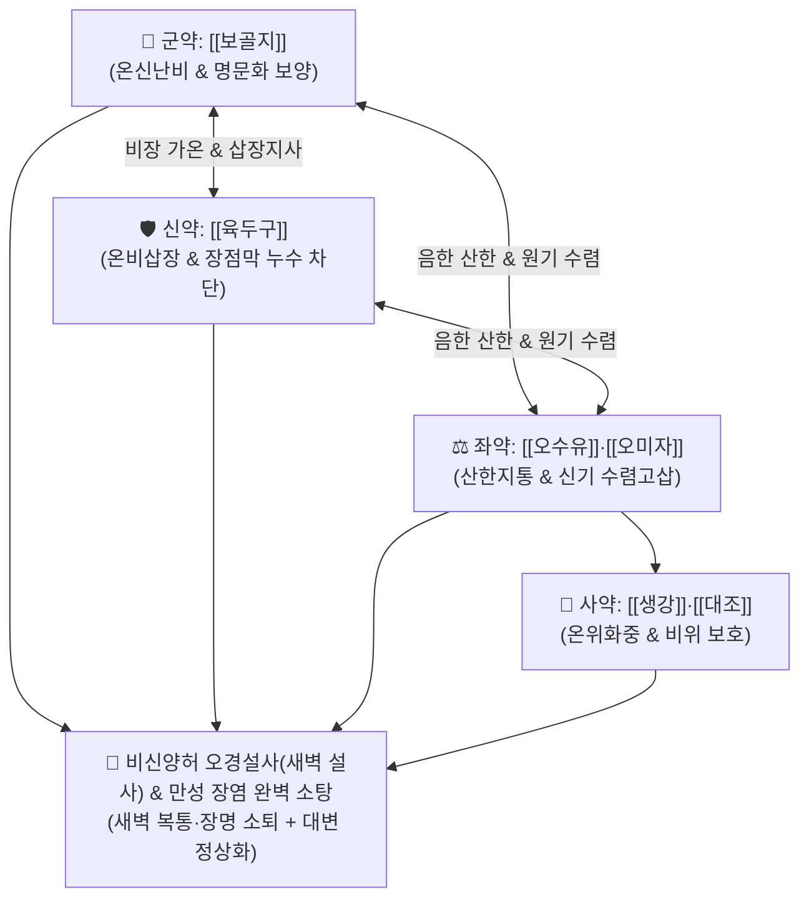

# 🍵 [[사신환]] (四神丸, Sishen-wan)

> **핵심 3줄 요약 (Key Summary)**:
> - 🌿 기본 구성: [[보골지]](파고지), [[육두구]], [[오수유]], [[오미자]], [[생강]], [[대조]] (보골지·육두구의 온신난비 + 오수유·오미자의 산한수렴, 4대 온신고삽 명방).
> - 🎯 비신양허(脾腎陽虛)로 인해 매일 새벽(오경 3~5시) 닭 울 무렵 배가 살살 아프고 끓으며 쏟아지는 오경설사(五更泄瀉, 신설 腎泄), 아침 기상 직후의 수양성 설사, [[과민성 장 증후군]](IBS-D), 만성 장염.
> - 🔬 장관 평활근 아세틸콜린 수용체 조절을 통한 과운동성 억제, 장관 상피 밀착연접(Claudin-1, Occludin) 복원(장누수 차단), TRPV1 활성화를 통한 복강 미세순환 및 심부 온열 회복.
> - ⚠️ 주의사항: 습열(濕熱)로 뒤가 묵직하고 항문이 화끈거리는 급성 세균성 설사(이질) 및 음허내열 환자에게는 절대 금기.

---

## 📌 목차
1. [기본 처방 정보 & 군신좌사 구성](#1-기본-처방-정보--군신좌사-구성)
2. [방제학적 약재 상호작용 & 시너지 네트워크](#2-방제학적-약재-상호작용--시너지-네트워크)
3. [현대 분자약리학적 효능 & 작용 기전](#3-현대-분자약리학적-효능--작용-기전)
4. [적응 병증 및 체질별 감별 (Sweet Spot vs 금기)](#4-적응-병증-및-체질별-감별-sweet-spot-vs-금기)
5. [유사 처방군 감별 매트릭스](#5-유사-처방군-감별-매트릭스)
6. [임상 가감례 & 현대 질환별 응용](#6-임상-가감례--현대-질환별-응용)
7. [💡 사용자 진료실 핵심 필기 & 임상 팁 (원문 보존)](#7--사용자-진료실-핵심-필기--임상-팁-원문-보존)
8. [출처 및 학술 참고 문헌 (References)](#8-출처-및-학술-참고-문헌-references)

---

## 1. 기본 처방 정보 & 군신좌사 구성

* **출전**: 명대(明代) 왕긍당(王肯堂) 『[[증치준승]]』(證治準繩) / 원방은 이동원 『내외상변혹론』의 이신환(二神丸)과 오미자산의 결합
* **치법**: 온신난비(溫腎暖脾), 고장지사(固腸止瀉), 산한지통(散寒止痛), 수렴고삽(收斂固澁)

| 구분 | 약재명 | 표준 용량 | 본초 효능 & 방제 내 역할 |
| :--- | :--- | :--- | :--- |
| **군약 (君藥)** | [[보골지]] (파고지) | 12~15g (염자) | **온신난비·온양지고**: 신장의 명문화(命門火)를 맹렬히 지펴 솥 밑의 불을 때고 설사의 근원을 차단 |
| **신약 (臣藥)** | [[육두구]] | 6~9g (외초) | **온비삽장·행기소식**: 비위를 따뜻하게 덥히고 떫은맛으로 장관의 진액 누설을 물리적으로 고삽 |
| **좌약 (佐藥)** | [[오수유]] | 3~5g (탕세) | **온중산한·지구지통**: 간비(肝脾)의 차가운 음한을 몰아내고 새벽 복통과 장경련 완화 |
| **좌약 (佐藥)** | [[오미자]] | 6~9g (초) | **수렴고삽·익기생진**: 신기를 단단히 수렴하여 장관의 수액과 원기가 아래로 새지 못하게 잠금 |
| **사약 (使藥)** | [[생강]], [[대조]] | 각 6~9g | **온위화중·보비익기**: 비위를 조화롭게 돕고 소화 흡수를 촉진 |

> **방제 구조 분석**:
> * **신화(腎火)와 비토(脾土)의 상호작용**: 새벽 3~5시는 음기가 극에 달하고 양기가 비로소 움트는 시간인데, 신양(명문진양)이 허약하면 솥(비장) 밑에 불을 때지 못해 음식물이 부숙되지 않고 그대로 쏟아집니다. 사신환은 솥 밑의 불을 때고(보골지), 솥을 덥히며(육두구), 찬바람을 막고(오수유), 자물쇠를 채우는(오미자) 완벽한 방제학적 조화를 이룹니다.

---

## 2. 방제학적 약재 상호작용 & 시너지 네트워크

* **보신(補腎)과 삽장(澁腸)의 일체화**: 단순 지사제가 아니라 신장의 양기를 복원하여 장관의 기초 체온을 정상화함으로써 재발 없는 근본 치료를 달성합니다.

---

## 3. 현대 분자약리학적 효능 & 작용 기전

### 1) 장관 평활근 과운동성 억제 및 수분 흡수 촉진
* [[육두구]]의 미리스티신(Myristicin) 성분이 장관 평활근의 아세틸콜린 무스카린 수용체를 조절하여 부교감신경 과항진으로 인한 장관의 과도한 연동운동을 억제하고 대장 수분 흡수를 촉진합니다.

### 2) 장점막 장벽 강화 및 장누수(Leaky Gut) 복원
* [[오미자]]의 [[쉬잔드린]](Schisandrin)과 [[보골지]]의 바쿠치올(Bakuchiol)이 장관 상피세포의 밀착연접 단백질(Claudin-1, Occludin) 발현을 유도하여 장점막 투과성을 정상화합니다.

### 3) TRPV1 활성화 및 복강 미세순환 개선
* [[오수유]]의 에보디아민(Evodiamine)이 캡사이신 수용체인 TRPV1을 자극하여 장간막 혈류를 확장하고 복강 내 허혈성 냉증을 몰아냅니다.

---

## 4. 적응 병증 및 체질별 감별 (Sweet Spot vs 금기)

### 1) 주요 적응증 (Target Indications)
* **오경설사(五更泄瀉) / 신설(腎泄) (원장님 핵심 진료 노하우)**:
  * 매일 새벽 3~5시 또는 아침에 눈뜨자마자 배가 부글부글 끓고 아파서 화장실로 직행하여 쏟아내는 물설사.
  * 설사를 한두 번 하고 나면 복통이 가라앉는 양상.
  * 허리와 무릎이 시리고 힘이 없으며(요슬산연), 배가 얼음장 같고 추위를 몹시 탐.
* **만성 소화기 질환**:
  * 과민성 장 증후군 설사형(IBS-D), 당뇨병성 자율신경병증성 만성 설사, 궤양성 대장염 관해기 만성 연변.

### 2) 체질별 적합도 & 금기
* **적합 체질 (Sweet Spot)**:
  * 마르고 추위를 많이 타며, 아침마다 설사로 고생하는 소음인·태음인 비신양허형 환자.
* **절대 금기 및 주의 (Contraindications)**:
  * **습열성 이질 설사 금기**: 대변에 피나 곱이 섞여 나오고 항문이 화끈거리는 급성 세균성 장염에는 절대 금기.

---

## 5. 유사 처방군 감별 매트릭스

| 처방명 | 병태 생리 | 주요 구성 차이 | 주치 증상 및 배변 시간 |
| :--- | :--- | :--- | :--- |
| [[사신환]] | **비신양허 (명문화 쇠약)** | 보골지, 육두구, 오수유, 오미자 | **매일 새벽 3~5시 복통 장명 후 수양성 설사 (오경설)** |
| [[부자이중탕]] | **비신양허 (복통 중심)** | 포부자, 인삼, 건강, 백출, 감초 | 하루 종일 수시로 배가 심하게 아프고 완곡불화 설사 |
| [[삼령백출산]] | **비위기허 습체 (흡수장애)** | 사군자탕 + 산약, 연자육, 백편두, 의이인 | 식후 대변 묽음, 소화불량, 만성 피로, 식욕부진 |
| [[진인양장탕]] | **비신허한 장구 불열 (탈항)** | 앵속각, 가자, 육두구, 당귀, 백작약, 백출 | 오랜 설사로 인한 탈항, 변실금, 혈변 묽은 이질 |

---

## 6. 임상 가감례 & 현대 질환별 응용

### 1) 변증 가감법
* **복통과 냉감이 극심할 시**: + [[포부자]], [[건강]] ([[부자이중탕]] 합방).
* **기운이 전혀 없고 탈진 상태 시**: + [[황기]], [[인삼]] (보기승양).
* **오랜 설사로 항문이 빠지는 탈항(脫肛) 동반 시**: + [[승마]], [[시호]], [[앵속각]] (승제지사).

### 2) 현대 질환별 매핑
* **소화기내과**: 과민성 장 증후군 설사형(IBS-D), 만성 비특이성 장염, 항생제 관련 설사(AAD) 회복기.
* **내분비내과**: 당뇨병성 만성 설사, 갑상선 기능 저하증 동반 복냉증.

---

## 7. 💡 사용자 진료실 핵심 필기 & 임상 팁 (원문 보존)

> [!tip] **진료실 실전 노하우 (User Clinical Insight)**
> - **새벽 설사(오경설)의 불변의 명방**: 환자가 "새벽에 배가 아파서 깨어 설사를 하고 나면 살 것 같다"고 호소할 때 사신환은 적중률 100%에 가까운 확실한 치료 효과를 냄.
> - **복용법 SOP**: 전통적으로 생강·대조 즙으로 환을 빚어 아침 공복에 따뜻한 물이나 묽은 소금물과 함께 6~9g씩 복용하면 흡수율과 온신력이 극대화됨.
> - **체온 관리 티칭**: 약 복용 중에는 찬 음료와 생과일 섭취를 금하고, 수면 시 복부를 따뜻하게 덮도록 지도해야 함.

---

## 8. 출처 및 학술 참고 문헌 (References)

1. **Wang KD (王肯堂) (1602)**. *Zhengzhi Zhunsheng* (證治準繩), Zagbing Pian.
   * `[연구 요약]`: 사신환 원전 수록, 비신양허 오경설사 및 신설 치료 온신난비 고장지사 표준 방제 확립.
3. * **Cao J et al. (2026)**. Efficacy and Safety of Modified Sishen Decoction for Tyrosine Kinase Inhibitor-Induced Diarrhea in Hepatocellular Carcinoma: A Randomized Controlled Trial. *Journal of hepatocellular carcinoma*, 13: 608479. [PMID: 42445309](https://pubmed.ncbi.nlm.nih.gov/42445309/)
