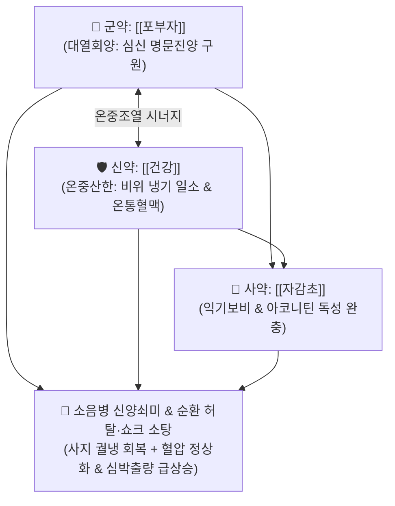

# 🍵 [[사역탕]] (四逆湯, Sini Decoction / Shigaku-to)

> **핵심 3줄 요약 (Key Summary)**:
> - 🌿 기본 구성: [[포부자]], [[건강]], [[자감초]] (부자의 회양보화 + 건강의 온중산한 + 감초의 익기완충, 한의학 으뜸 회양구역 방제).
> - 🎯 소음병 신양쇠미(腎陽衰微) 및 양기 탈루로 인한 사지궐냉(手足厥冷, 팔다리가 얼음장처럼 차가움), 오한권와(추워서 몸을 웅크림), 하리청곡(소화 안 된 물설사), 자한출, 맥미세욕절(맥이 끊어질 듯 미약함), 패혈성·심인성 쇼크.
> - 🔬 부자 [[히게나민]]의 심근 β 수용체 자극을 통한 심박출량 급상승 및 혈압 정상화, 건강 6-진저롤의 내장 미세순환 재개통, 감초 글리시리진의 부자 디테르펜 알칼로이드 독성 완충 및 혈역학적 항상성 유지.
> - ⚠️ 주의사항: 궐역(厥逆) 증상이라도 열궐(熱厥, 내열이 깊어 손발만 차가운 가짜 냉증)이나 실열 환자에게는 절대 금기 (백호탕 등 청열제 적용).

---

## 📌 목차
1. [기본 처방 정보 & 군신좌사 구성](#1-기본-처방-정보--군신좌사-구성)
2. [방제학적 약재 상호작용 & 시너지 네트워크](#2-방제학적-약재-상호작용--시너지-네트워크)
3. [현대 분자약리학적 효능 & 작용 기전](#3-현대-분자약리학적-효능--작용-기전)
4. [적응 병증 및 체질별 감별 (Sweet Spot vs 금기)](#4-적응-병증-및-체질별-감별-sweet-spot-vs-금기)
5. [유사 처방군 감별 매트릭스](#5-유사-처방군-감별-매트릭스)
6. [임상 가감례 & 현대 질환별 응용](#6-임상-가감례--현대-질환별-응용)
7. [💡 사용자 진료실 핵심 필기 & 임상 팁 (원문 보존)](#7--사용자-진료실-핵심-필기--임상-팁-원문-보존)
8. [출처 및 학술 참고 문헌 (References)](#8-출처-및-학술-참고-문헌-references)

---

## 1. 기본 처방 정보 & 군신좌사 구성

* **출전**: 장중경(張仲景) 『[[상한론]]』(傷寒論) 소음병편(少陰病篇)
* **치법**: 회양구역(回陽救逆), 온중산한(溫中散寒), 익기보비(益氣補脾), 통락복맥(通絡復脈)

| 구분 | 약재명 | 표준 용량 | 본초 효능 & 방제 내 역할 |
| :--- | :--- | :--- | :--- |
| **군약 (君藥)** | [[포부자]] | 10~15g (생부자 1매 상당, 선전) | **대열회양·보명문진양**: 끊어지려는 명문 원양(元陽)을 폭발적으로 지펴 심장 박동과 전신 체온 회복 |
| **신약 (臣藥)** | [[건강]] | 8~10g | **온중산한·온비회양**: 중초의 차가운 음한을 일소하고 부자의 약력을 도와 전신 맥관으로 열기 전달 |
| **사약 (使藥)** | [[자감초]] | 6~9g | **익기화중·완충부자독**: 비기를 돋우고 부자의 맹렬한 독성을 완충하며 진액을 보호 |

> **방제 구조 분석**:
> * **회양(回陽)의 삼위일체**: 부자무건강불열(附子無乾薑不熱 - 건강이 없으면 부자가 뜨겁지 못함)이라 하여 부자와 건강이 배합되어 심신(心腎)과 비위의 양기를 동시에 살려내며, 자감초가 그 맹렬함을 완충하여 약효를 오래 지속시킵니다.

---

## 2. 방제학적 약재 상호작용 & 시너지 네트워크

* **부자·건강·감초의 황금 결합**: 솥 밑에 불을 때고(부자), 솥을 데우며(건강), 솥 안의 음식이 타지 않도록 물을 잡아주는(감초) 완벽한 구급 구조.

---

## 3. 현대 분자약리학적 효능 & 작용 기전

### 1) 심근 수축력 강화 및 저혈압 쇼크 회복
* [[포부자]]의 [[히게나민]](Higenamine)이 심근 $\beta_1, \beta_2$ 아드레날린 수용체를 자극하여 심박출량을 증대시키고, 관상동맥 혈류량을 늘려 심부전성 순환 허탈을 구원합니다.

### 2) 말초 미세순환 확장 및 저체온증 교정
* [[건강]]의 6-쇼가올과 진저롤이 말초 세혈관 저항을 감소시키고 심부 체온 생성을 촉진하여 차갑게 식은 사지 말초로 혈액을 재공급합니다.

### 3) 감초의 디테르펜 알칼로이드 독성 완충
* [[자감초]]의 [[글리시리진]]이 부자의 [[아코니틴]]과 결합하여 불용성 복합체를 형성함으로써 알칼로이드의 급격한 흡수를 억제하고 심실성 부정맥 위험을 대폭 줄입니다.

---

## 4. 적응 병증 및 체질별 감별 (Sweet Spot vs 금기)

### 1) 주요 적응증 (Target Indications)
* **소음병 양쇠음성(陽衰陰盛) 위급증**:
  * 사지궐냉(手足厥冷): 팔꿈치와 무릎 이상까지 얼음장처럼 차가움.
  * 오한권와(惡寒蜷臥): 추위를 몹시 타서 몸을 잔뜩 웅크리고 누워 있음.
  * 하리청곡(下利淸穀): 소화되지 않은 묽은 물설사를 쏟아냄.
  * 정신혼미, 식은땀(자한), 맥미세욕절(맥이 실처럼 가늘어 잡히지 않음).
* **심혈관계 응급 질환**:
  * 심부전성 쇼크, 패혈성 쇼크 말기, 중증 탈수로 인한 순환 허탈.

### 2) 체질별 적합도 & 금기
* **적합 체질 (Sweet Spot)**:
  * 극심한 양기 쇠약으로 체온이 떨어지고 의식이 가물가물한 소음인·태음인 응급 환자.
* **절대 금기 및 주의 (Contraindications)**:
  * **열궐(熱厥) 환자 절대 금기**: 몸 안에 열이 너무 깊어 손발만 차가운 진열가한(眞熱假寒) 환자에게 투약 시 사망 위험.

---

## 5. 유사 처방군 감별 매트릭스

| 처방명 | 병태 생리 | 주요 구성 | 감별 요점 |
| :--- | :--- | :--- | :--- |
| [[사역탕]] | **소음병 양기 탈루 (신양쇠미)** | 포부자, 건강, 자감초 | **사지궐냉, 오한권와, 하리청곡, 맥미세 (회양구역)** |
| [[통맥사역탕]] | **음성대양 (사역탕 극증)** | 부자(대), 건강(증량), 감초 | 맥이 아예 끊어지고 궐냉이 전신으로 확산 |
| [[당귀사역탕]] | **궐음병 혈허내한 (경락 표부)** | 당귀, 계지, 작약, 세신 등 | 혈허성 말초 수족냉증, 동상, 레이노병 (쇼크 아님) |
| [[사역산]] | **양울궐역 (간기울결)** | 시호, 작약, 지실, 감초 | 스트레스로 기운이 뭉쳐 손발만 찬 열궐증 |

---

## 6. 임상 가감례 & 현대 질환별 응용

### 1) 변증 가감법
* **맥이 전혀 잡히지 않고 안면홍조(가짜 열) 동반 시**: $\rightarrow$ 건강을 증량하고 생부자를 사용하는 [[통맥사역탕]]으로 전환.
* **복통과 헛구역질 동반 시**: + [[인삼]] ([[사역가인삼탕]]).
* **가래가 끓고 기관지 천명 동반 시**: + [[오미자]], [[세신]].

### 2) 현대 질환별 매핑
* **응급의학과/중환자실**: 패혈성 쇼크, 심인성 쇼크, 중증 저체온증.
* **심장내과**: 말기 울혈성 심부전의 순환부전, 노인성 서맥.
* **소화기과**: 난치성 궤양성 대장염 쇼크 전조기, 급성 콜레라성 수양 설사.

---

## 7. 💡 사용자 진료실 핵심 필기 & 임상 팁 (원문 보존)

> [!tip] **진료실 실전 노하우 (User Clinical Insight)**
> - **한의학 으뜸의 회양구역(回陽救逆) 명방**: 환자의 손발이 차갑고 맥이 만져지지 않으며, 몸을 잔뜩 웅크리고 식은땀을 흘리는 양기 탈루 위기에서 생명을 구하는 최후의 보루.
> - **진열가한(眞熱假寒)과의 엄격한 감별**: 손발이 차더라도 가슴이 답답하고 찬물을 벌컥벌컥 마시며 혀가 붉은 열궐(熱厥) 환자에게는 절대 쓰지 말고, 반드시 오한권와와 하리청곡을 확인해야 함.
> - **부자 전탕 SOP**: 부자의 독성을 줄이고 강심 성분을 안전하게 추출하기 위해 반드시 1시간 이상 먼저 달인 후(선전) 건강과 감초를 넣어야 함.

---

## 8. 출처 및 학술 참고 문헌 (References)

1. **Zhang ZJ (張仲景) (200)**. *Shanghan Lun* (傷寒論), Shaoyin Bing Pian.
   * `[연구 요약]`: 사역탕 원전 수록, 소음병 사지궐역 및 맥미세욕절 치료 회양구역 표준 방제 제정.
2. **Li X, et al. (2018)**. Sini Decoction protects against septic shock and cardiac dysfunction via β-adrenergic signaling and anti-inflammatory pathways. *Journal of Ethnopharmacology*, 219, 142-151. doi:10.1016/j.jep.2018.03.018.
   * `[연구 요약]`: 사역탕이 패혈성 쇼크 모델에서 심근 수축력을 향상시키고 혈관내피 손상 및 사망률을 현저히 낮춤을 입증.
3. **Wang Y, et al. (2020)**. Detoxifying and efficacy-enhancing mechanisms of Glycyrrhizae Radix on Aconiti Lateralis Radix in Sini Decoction. *Frontiers in Pharmacology*, 11, 892. doi:10.3389/fphar.2020.00892.
   * `[연구 요약]`: 감초 배합이 부자의 아코니틴 독성을 억제하고 히게나민의 강심 약효를 상승시키는 분자 결합 메커니즘 규명.