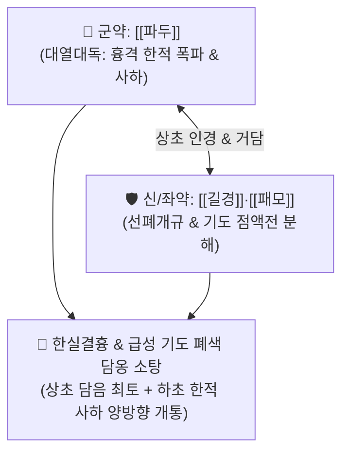

# 🍵 [[삼물백산]] (三物白散, San-Wu-Bai-San / Sanmotsuhakusan)

> **핵심 3줄 요약 (Key Summary)**:
> - 🌿 기본 구성: [[파두]](파두상), [[길경]], [[패모]] (파두의 대열대독 준하파적 + 길경·패모의 상초 거담개규).
> - 🎯 한사(寒邪)와 담음·식적이 흉격에 응결되어 기도를 막은 한실결흉(寒實結胸), 급성 식적 인사불성, 소아 급경풍 및 급성 후두염(Croup)성 가래 폐색, 흉협 극통.
> - 🔬 파두 포르볼 에스테르(Phorbol esters)의 장점막 PKC 자극을 통한 폭발적 수액 분비 및 연동 유발, 길경 [[플라티코딘 D]]의 기도 점액전(Mucus plug) 분해 및 배출 촉진.
> - ⚠️ 주의사항: 극독약이므로 파두유를 완전히 압착 제거한 파두상을 0.5~1g 극소량 복용하며, 설사가 멎지 않을 때는 즉시 찬물(냉수)이나 녹두탕으로 해독.

---

## 📌 목차
1. [기본 처방 정보 & 군신좌사 구성](#1-기본-처방-정보--군신좌사-구성)
2. [방제학적 약재 상호작용 & 시너지 네트워크](#2-방제학적-약재-상호작용--시너지-네트워크)
3. [현대 분자약리학적 효능 & 작용 기전](#3-현대-분자약리학적-효능--작용-기전)
4. [적응 병증 및 체질별 감별 (Sweet Spot vs 금기)](#4-적응-병증-및-체질별-감별-sweet-spot-vs-금기)
5. [유사 처방군 감별 매트릭스](#5-유사-처방군-감별-매트릭스)
6. [임상 가감례 & 현대 질환별 응용](#6-임상-가감례--현대-질환별-응용)
7. [💡 사용자 진료실 핵심 필기 & 임상 팁 (원문 보존)](#7--사용자-진료실-핵심-필기--임상-팁-원문-보존)
8. [출처 및 학술 참고 문헌 (References)](#8-출처-및-학술-참고-문헌-references)

---

## 1. 기본 처방 정보 & 군신좌사 구성

* **출전**: 장중경(張仲景) 『[[상한론]]』(傷寒論) 태양병편(太陽病篇)
* **치법**: 파적준하(破積峻下), 거담개규(祛痰開竅), 선폐배농(宣肺排膿), 최토사하(催吐瀉下)

| 구분 | 약재명 | 표준 용량 (산제 비율) | 본초 효능 & 방제 내 역할 |
| :--- | :--- | :--- | :--- |
| **군약 (君藥)** | [[파두]] | 1 (파두상 0.5~1g) | **대열대독·준하축수·파적**: 흉격과 장관의 꽁꽁 얼어붙은 한적(寒積)을 다이너마이트처럼 폭파 |
| **신약 (臣藥)** | [[길경]] | 3 (1.5~3g) | **개선폐기·거담배농**: 약력을 상초 흉격으로 띄워 올려 기도를 막은 담음을 삭이고 개규 |
| **좌약 (佐藥)** | [[패모]] | 3 (1.5~3g) | **청열화담·산결소종**: 길경과 협력하여 끈적하게 달라붙은 가래 덩어리와 적취를 분해 |

> **특수 포제 및 복용법**:
> * 파두의 껍질과 심을 완전히 버리고 종이 사이에 넣어 기름을 완벽히 짜낸 **파두상(巴豆霜)**을 길경·패모 미세분말과 균일하게 섞어 백색 분말(백산 白散)을 만듭니다. 미온수나 묽은 죽물에 **1회 0.5~1g**씩 극소량 복용합니다.

---

## 2. 방제학적 약재 상호작용 & 시너지 네트워크

* **양방향 배출(최토 + 사하)의 묘법**: 병변이 상초에 있으면 가래를 토하게 하고(최토), 하초에 있으면 설사하게 하여(사하) 꽉 막힌 흉격을 즉각 뚫어냅니다.

---

## 3. 현대 분자약리학적 효능 & 작용 기전

### 1) 장관 점막의 폭발적 수액 분비 및 연동 촉진
* [[파두]]의 포르볼 에스테르(Phorbol esters) 성분이 장점막 상피세포의 단백질 키나아제 C(PKC)를 자극하여 전해질과 수분을 대량 분비시키고 장관을 세척하듯 비워냅니다.

### 2) 기도 점액전(Mucus plug) 분해 및 거담
* [[길경]]의 [[플라티코딘 D]]와 [[패모]]의 알칼로이드가 기관지 점액의 점도를 급격히 떨어뜨리고 섬모 운동을 촉진하여 기도를 막고 있던 가래 덩어리를 즉각 뱉어내게 합니다.

---

## 4. 적응 병증 및 체질별 감별 (Sweet Spot vs 금기)

### 1) 주요 적응증 (Target Indications)
* **한실결흉(寒實結胸)**:
  * 가슴과 명치 밑이 돌처럼 단단하게 굳어 누르면 찢어질 듯 아프고 숨이 차며, 열이 나지 않는 위급증.
* **급성 식적 혼미 및 담옹(痰壅)**:
  * 소화 안 된 음식과 끈적한 가래가 기도를 막아 갑자기 숨이 끊어질 듯 헐떡이고 안색이 파랗게 질린 응급 상태.
* **소아 급경풍 및 급성 크룹(Croup)**성 기도 폐색.

### 2) 체질별 적합도 & 금기
* **적합 체질 (Sweet Spot)**:
  * 체격이 건실하나 급성 한담·식체로 기도가 막힌 응급 환자.
* **절대 금기 및 주의 (Contraindications)**:
  * **임산부, 노약자, 허약자 절대 금기**: 맹렬한 독성으로 태아 및 원기 손상 위험.
  * **열실결흉(熱實結胸) 금기**: 열이 나고 혀가 붉은 환자는 [[대함흉탕]]을 써야 함.

---

## 5. 유사 처방군 감별 매트릭스

| 처방명 | 병태 생리 | 주요 구성 | 감별 요점 |
| :--- | :--- | :--- | :--- |
| [[삼물백산]] | **한실결흉 (한담 + 식적)** | 파두상, 길경, 패모 | **열이 전혀 없고 명치가 단단히 막혀 숨이 끊어질 듯함** |
| [[대함흉탕]] | **열실결흉 (수열 결합)** | 대황, 망초, 감수 | 고열, 갈증, 심한 복만통, 손도 못 대게 아픔 |
| [[과체산]] | **흉격 담연 숙식 (단순 최토)** | 과체, 적소두 | 가슴에 걸린 음식/가래만 토해냄 (사하 없음) |

---

## 6. 임상 가감례 & 현대 질환별 응용

### 1) 복약 반응 및 해독 프로토콜
* **복약 판정**: 복용 후 묽은 변을 보면 독이 빠진 것이므로 즉시 투약을 중단함.
* **설사가 멈추지 않을 때 (파두 독성 해독)**:
  * 파두는 열독(熱毒)이므로, 설사가 멎지 않으면 즉시 **찬물(냉수)**을 마시게 하거나 [[황련]] 달인 물, [[녹두]] 가루를 탄 물을 먹여 독성을 중화함.

### 2) 현대 질환별 매핑
* **응급의학**: 급성 기도 이물/점액 폐색, 급성 위장관 분변/식적 폐색증.
* **소아청소년과**: 급성 크룹(후두기관기관지염)성 호흡곤란.

---

## 7. 💡 사용자 진료실 핵심 필기 & 임상 팁 (원문 보존)

> [!tip] **진료실 실전 노하우 (User Clinical Insight)**
> - **한실결흉(寒實結胸)의 다이너마이트 처방**: 열증이 전혀 없이 찬 가래와 굳은 음식물이 흉격을 틀어막아 환자가 질식할 위기에 처했을 때 단 0.5g의 투약으로 상하를 일시에 뚫어내는 구급 방제.
> - **파두상 조제 엄수**: 파두의 기름(파두유)에 맹렬한 위장관 독성이 들어 있으므로, 반드시 압착하여 기름을 완전히 뺀 파두상만을 사용해야 함.
> - **파두 설사 해독 비법**: 파두 복용 후 설사가 멈추지 않고 쏟아질 때는 당황하지 말고 **찬물(냉수 冷水)**을 먹이면 파두의 열성 약효가 즉각 얼어붙듯 정지됨.

---

## 8. 출처 및 학술 참고 문헌 (References)

1. **Zhang ZJ (張仲景) (200)**. *Shanghan Lun* (傷寒論), Taiyang Bing Pian.
   * `[연구 요약]`: 삼물백산 원전 수록, 한실결흉무열증(寒實結胸無熱證) 치료 파적준하 표준 방제 제정.
