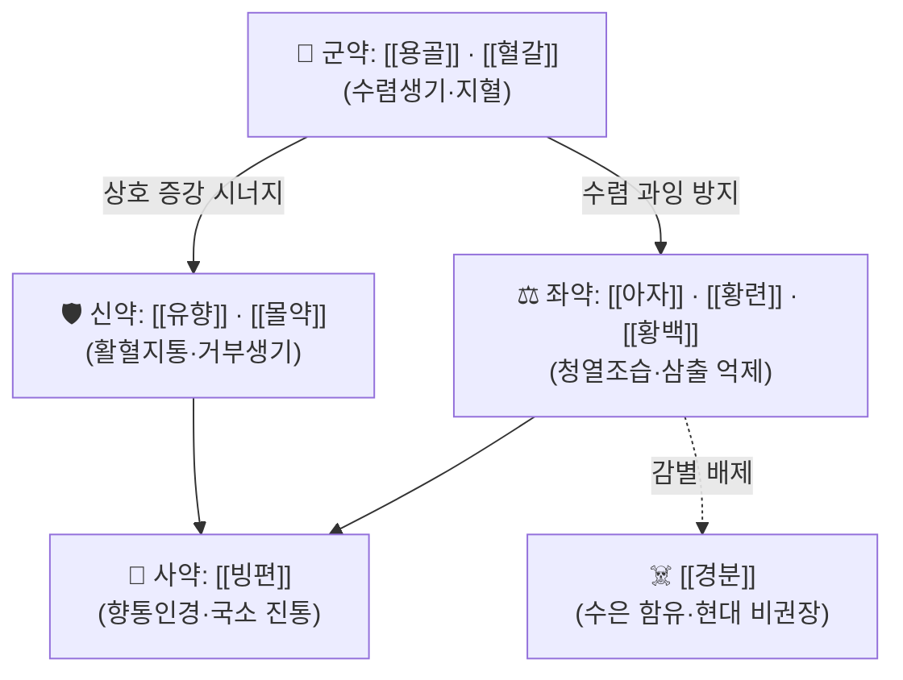

# 🍵 [[생기산]] (生肌散, Shengji San / Shengji Powder)

> **핵심 3줄 요약 (Key Summary)**:
> - 🌿 창양(瘡瘍) 국소에 직접 산포(散布)하는 **외용(外用) 산제**로, 수렴생기(收斂生肌)·활혈지통(活血止痛)·청열해독(淸熱解毒)·향통인경(香通引經) 약재를 배합하는 처방군. 문헌별 구성이 크게 달라 **고정 배오가 존재하지 않음** — 본 노트는 다문헌 공통 약재군을 기준으로 정리.
> - 🎯 최적 적응증은 **만성 난치성 창상** — 욕창(褥瘡), 당뇨병성 족부궤양, 화상·외상 후 창면, 수술 창면 지연 치유, 치루·치핵 절제 후 창면. 외용제 특성상 체질(태음인/소음인/소양인) 감별의 비중은 내복 처방보다 낮고, **국소 창면의 상태(삼출·부종·육아조직·감염 여부)가 처방 선택의 핵심 지표**.
> - 🔬 분자약리 기전으로는 **COX-2/PGE2 염증 경로 억제** 및 **창상 염증 미세환경(inflammatory microenvironment) 조절**을 통한 창상 치유 촉진이 보고됨(연관 처방인 養陰生肌散 및 生肌膏 연구, PMID 35016473 / 42756423).
> - ⚠️ 주의사항: 급성 화농성 감염기에는 단독 사용 금기 — 먼저 배농·청창(淸創)이 선행되어야 함. 일부 고전 구성에 포함되는 [[경분]](輕粉, 염화제일수은)은 **수은 함유 독성 약재**로 현대 임상에서는 사용을 피하는 것이 원칙. 신기능 저하·임신부·소아·수은 과민자에게 금기.

---
## 📌 목차
1. [기본 처방 정보 & 군신좌사 구성](#1-기본-처방-정보--군신좌사-구성)
2. [방제학적 약재 상호작용 & 시너지 네트워크](#2-방제학적-약재-상호작용--시너지-네트워크)
3. [현대 분자약리학적 효능 & 작용 기전](#3-현대-분자약리학적-효능--작용-기전)
4. [적응 병증 및 체질별 감별 (Sweet Spot vs 금기)](#4-적응-병증-및-체질별-감별-sweet-spot-vs-금기)
5. [유사 처방군 감별 매트릭스](#5-유사-처방군-감별-매트릭스)
6. [임상 가감례 & 현대 질환별 응용](#6-임상-가감례--현대-질환별-응용)
7. [💡 사용자 진료실 핵심 필기 & 임상 팁 (원문 보존)](#7--사용자-진료실-핵심-필기--임상-팁-원문-보존)
8. [출처 및 학술 참고 문헌 (References)](#8-출처-및-학술-참고-문헌-references)
---
## 1. 기본 처방 정보 & 군신좌사 구성

* **출전**: 生肌散은 단일 출전 처방이 아니라 **외과(外科) 문헌 계열에 다수 동명이방(同名異方)이 존재**하는 처방군이다. 명대 외과서 및 『[[동의보감]]』 창양문 계열에서 수렴생기(收斂生肌) 목적의 산제가 반복 인용되나, **본 노트 작성 시점에서 특정 원전 조문·판본과의 1:1 대조를 완료하지 못했으므로 출전 확정은 근거 미확인으로 표시**한다. 임상에서는 "생기산"을 고정 처방명이라기보다 **수렴·생기 외용 산제의 처방 원형(prototype)** 으로 이해하는 것이 안전하다.
* **치법**: 거부생기(去腐生肌), 수렴지통(收斂止痛), 청열해독(淸熱解毒), 활혈화어(活血化瘀) — 즉 **창면의 부패 조직을 제거하고 육아조직·상피화를 촉진하는 국소 치법**.
* **제형 특성**: 분말(散)을 창면에 직접 산포(sprinkling)하거나, 참기름·꿀·바셀린·파스상 약재와 배합하여 **연고(膏)나 유제(油劑)로 전환**하여 사용한다. 이 전환 제형이 후술할 [[생기고]](生肌膏) 계열이며, PMID 42756423의 연구 대상도 이 연고 제형이다.

| 구분 | 약재명 | 표준 용량 | 본초 효능 & 방제 내 역할 |
| :--- | :--- | :--- | :--- |
| **군약 (君藥)** | [[용골]] (煅龍骨) 또는 [[혈갈]] | 배합비 기준 (문헌별 상이, 절대 용량 근거 미확인) | 수렴고삽(收斂固澁)·지혈생기(止血生肌). 창면 삼출물과 출혈을 억제하고 육아조직 표면을 안정화하는 중심 약재 |
| **신약 (臣藥)** | [[유향]] · [[몰약]] | 배합비 기준 (문헌별 상이) | 활혈지통(活血止痛)·소종생기(消腫生肌). 창면 국소 미세순환을 개선하고 통증·부종을 완화하여 군약의 생기 작용을 강화 |
| **좌약 (佐藥)** | [[아자]] · [[황련]] · [[황백]] | 배합비 기준 (문헌별 상이) | 청열조습(淸熱燥濕)·수렴지혈. 창면의 열독·삼출·부패를 억제하고 군신약의 온조(溫燥)한 편향을 제어 |
| **사약 (使藥)** | [[빙편]] (龍腦) | 소량 (0.1~1% 수준, 문헌별 상이) | 향통주약(香通走藥)·청열지통. 약효를 창면 깊이로 유도하고 국소 청량감·진통을 부여 |
| **(주의 약재)** | [[경분]] (輕粉) | 현대 사용 비권장 | 고전 생기산류에 거부(去腐)·살충 목적으로 다용되었으나 **수은 화합물**로 신독성·접촉성 피부염 위험. 본 노트에서는 감별용으로만 기록 |

> **배오 특징**: 생기산의 배오 원리는 **"거부(去腐)와 생기(生肌)의 순차적 균형"** 이다. 거부력이 강한 [[경분]]·[[황련]] 계열만 쓰면 창면이 자극되어 육아조직 성장이 지연되고, 수렴력이 강한 [[용골]]·[[아자]]만 쓰면 부패 조직과 삼출물이 갇혀 화농이 심해진다. 따라서 **활혈지통의 [[유향]]·[[몰약]]을 중간층에 배치하여 "제거–순환–충전"의 3단 흐름을 만드는 것**이 방제학적 핵심이며, [[빙편]]의 향통성(香通性)이 약물 침투를 보조한다. 즉 승강(升降)으로 보면 청열·수렴의 강(降)과 활혈·향통의 산(散)이 짝을 이루는 구조다.

---
## 2. 방제학적 약재 상호작용 & 시너지 네트워크

* [[용골]] + [[혈갈]] 배오: **상수(相須)** 관계. 용골의 고삽수렴과 혈갈의 활혈산어(活血散瘀)·지혈생기가 서로 보완하여, 출혈성·삼출성 창면에서 혈액과 삼출물을 동시에 잡으면서 육아조직을 보호한다.
* [[유향]] + [[몰약]] 배오: 전통적으로 반드시 짝을 이루어 쓰는 **상수(相須)** 배합. 기(氣)를 소통시키는 유향과 혈(血)을 활하게 하는 몰약이 창면의 어혈·부종·통증을 함께 해소한다. 단, **피부 자극·접촉성 피부염을 유발할 수 있어 농도 조절이 필요**(근거 수준: 전통 문헌 및 일반 약리학 서술).
* [[아자]] + [[황련]]·[[황백]] 배오: 수렴(아자)과 청열(황련·황백)의 **상사(相使)** 관계로, 감염성 삼출이 있는 창면에서 국소 항균·건조 환경을 조성한다. 다만 과도한 건조는 상피화를 방해하므로 삼출이 줄면 수렴 약재 비중을 낮춘다.
* [[빙편]] → 전체 처방 유도: 사약(使藥)으로서 **향통인경**하여 약물이 창면 심부로 침투하도록 돕고, 동시에 국소 청량·진통 효과를 제공한다.
* [[경분]] → 감별용: 고전에서는 "거부(去腐)의 요약"으로 중시되었으나 수은 독성 때문에 현대 한의 임상에서는 **[[황련]]·[[황백]]·[[아자]] 등으로 대체하는 것이 안전**하다.

---
## 3. 현대 분자약리학적 효능 & 작용 기전

> ⚠️ 아래 기전은 **생기산 원방 자체의 연구가 아니라, 동일 계열 파생 처방(養陰生肌散, 生肌膏)의 연구 결과**이다. 원방 자체에 대한 RCT·기전 연구는 본 노트에서 **근거 미확인**이다.

### 1) 핵심 분자 표적 및 면역/항염증 조절 — COX-2/PGE2 경로

* **養陰生肌散(양음생기산) — 항암 화학요법 후 구강궤양 모델** (Liu Y, Ren S, 2021, PMID 35016473): 화학요법 후 발생한 구강궤양에서 **COX-2(cyclooxygenase-2) / PGE2(prostaglandin E2) 경로 억제**를 통한 염증 억제와 창상 치유 촉진이 보고되었다. COX-2는 아라키돈산을 PGE2로 전환하는 유도형 효소로, 점막 염증·통증·부종의 중심 매개체이다. 즉 **점막 및 피부 창면에서 프로스타글란딘 매개 염증 반응을 낮추어 치유 환경을 조성하는 것**이 핵심 기전으로 제시되었다.
  - 연구 요약: 구강궤양 창상 모델에서 COX-2/PGE2 축 억제 → 염증 완화 → 창상 치유 촉진.
  - 구체적인 사이토카인 정량값(TNF-α, IL-6, IL-1β의 수치 변화) 및 통계치는 본 노트에서 **근거 미확인**(초록 수준 정보만 확인).

### 2) 창상 염증 미세환경(inflammatory microenvironment) 조절 — 만성 창상

* **生肌膏(생기고) — 당뇨병성 족부궤양(DFU) 모델** (Dai R, Guo J, 2026, PMID 42756423): 생기고가 **염증 미세환경을 조절하여 당뇨병성 족부궤양 창상 치유를 가속**한다고 보고되었다. 당뇨병성 궤양은 고혈당에 의한 만성 염증·산화 스트레스·미세혈관 병변으로 **치유가 정체된 대표적 난치성 창상**이며, 이 연구는 생기고 계열 처방이 그 정체를 깨는 방향으로 작용함을 시사한다.
  - 연구 요약: 당뇨병성 족부궤양 창상에서 염증 미세환경 조절 → 창상 치유 촉진.
  - 대식세포 M1/M2 극성 전환, 특정 사이토카인·성장인자(TGF-β, VEGF 등)의 정량적 변화, 신호 경로(NF-κB, MAPK 등)의 개별 기여도는 본 노트에서 **근거 미확인**.

### 3) 국소 작용 기전 (전통 약리 서술 수준)

* **수렴·단백 응고**: [[용골]]·[[아자]]의 탄닌·무기질 성분이 창면 삼출 단백질과 결합하여 얇은 보호막을 형성 → 삼출 감소 및 2차 감염 방어.
* **국소 항균·청열**: [[황련]]·[[황백]]의 베르베린 등 알칼로이드가 그람양성·음성균 억제에 관여한다는 것이 일반 약리학적 서술이나, **생기산 배합 상태에서의 항균력 정량은 근거 미확인**.
* **미세순환 개선·육아조직 촉진**: [[유향]]·[[몰약]]의 활혈 작용이 국소 혈류를 개선하고 섬유아세포 증식·콜라겐 침착을 돕는다는 전통 해석이 있으나, **생기산 자체의 분자 경로 규명은 근거 미확인**.

---
## 4. 적응 병증 및 체질별 감별 (Sweet Spot vs 금기)

[✅ 최적 적응증 (Sweet Spot)]
• 원전 조문: 창양(瘡瘍)으로 **부(腐)가 이미 제거되었으나 기육(肌肉)이 생기지 않는 단계** — 즉 "거부"가 끝나고 "생기"가 필요한 국면. 급성 화농기(부(腐)가 성한 단계)는 생기산의 적응이 아니라는 것이 전통 외과의 공통된 지침.
• 체질 소견: **외용 처방이므로 체질 감별의 비중이 내복 처방보다 낮다.** 다만 회복 지연이 전신 허손(氣血兩虛)에서 오는 경우에는 내복 보기·보혈 처방(예: [[십전대보탕]], [[보중익기탕]] 계열)과 병용하는 것이 정석. 창면이 창백·담백하고 육아조직 성장이 느리면 기혈허(氣血虛)를 겸한 것으로 본다.
• 임상 주치: 욕창(褥瘡), 당뇨병성 족부궤양, 정맥성 하지궤양, 화상 2도 이상 창면, 외상·수술 창면의 지연 치유, 치루·치핵·농양 절개 후 개방 창면, 조대술(措帶術) 후 창면.
• 국소 창면 소견(설진·맥진에 해당): 삼출물이 탁하고 부패취가 강하며 주위가 붉고 열감이 있으면 **열독(熱毒) 우세 → 청열 약재([[황련]]·[[황백]]) 비중 증량**. 삼출이 맑고 창면이 창백·냉감이며 육아조직이 무디면 **기혈허·한습(寒濕) 우세 → 수렴·온양 약재 및 내복 보익제 병용**. 통증·부종이 심하면 [[유향]]·[[몰약]] 증량.
• 전신 맥상: 창상 환자에서 맥이 세삭(細數)하면 음허·허열을 겸한 것으로 보아 청열·양음 내복제 병용을 고려(단, 이는 생기산 고유 지표가 아니라 창상 외과 일반의 변증 지침).

[⚠️ 신중 투여 및 금기 (Caution / Contraindication)]
• **급성 화농성 감염기 금기**: 농(膿)이 차 있고 주위 봉와직염이 진행 중인 창면에 생기산을 바로 산포하면 배농로가 막혀 염증이 심부로 확산될 수 있다. **반드시 절개·배농·청창(淸創) 후 사용**한다.
• **[[경분]] 함유 제제 금기군**: 신기능 저하자, 임신부·수유부, 영아·소아, 수은 과민자, 안면·점막·생식기 부위 적용. 수은 중독(구내염, 신독성, 신경독성) 위험.
• **출혈성 소인·항응고제 복용자**: [[유향]]·[[몰약]]·[[혈갈]]의 활혈 작용으로 국소 출혈이 증가할 수 있어 주의(근거 수준: 전통 문헌 및 일반 약리 서술).
• **접촉성 피부염·과민반응**: 향약(유향·몰약·빙편)에 의한 알레르기성 접촉 피부염이 흔하다. 창면 주위 정상 피부에 발진·소양감이 생기면 즉시 중단.
• **양약·타 약물 병용 주의점**:
  * **포비돈 요오드, 과산화수소, 클로르헥시딘 등 강력 소독제와 동시 도포 금지** — 단백 변성 및 약효 상쇄. 세척 후 **생리식염수로 충분히 헹군 뒤** 산포한다.
  * 국소 항생제 연고(무피로신 등)와 병용 시 **시간차를 두고** 도포하여 서로의 기제를 막지 않도록 한다.
  * 습윤 드레싱(하이드로콜로이드, 폼 드레싱)과 병용 시 분말이 드레싱에 흡착되어 떨어져 나갈 수 있으므로 **연고·유제 제형으로 전환**하여 사용한다.
  * 전신 항생제·혈당 조절제 등 기저 질환 치료를 대체할 수 없다 — 생기산은 **국소 보조 요법**이다.

---
## 5. 유사 처방군 감별 매트릭스

| 처방명 | 핵심 구성 차이 | 주치 및 체질 차이 | 국소 소견(창면) 차이 |
| :--- | :--- | :--- | :--- |
| [[생기산]] | 수렴([[용골]]·[[혈갈]]) + 활혈([[유향]]·[[몰약]]) + 청열([[황련]]·[[황백]]) + 향통([[빙편]]) | **부(腐) 제거 후 생기 단계**, 삼출·통증·부종이 남은 창면 | 삼출 중등도, 육아조직 담홍색, 부패취 경도 |
| [[생기고]] | 생기산 약재를 유지(油劑)·연고 기제로 전환, 제형이 연고 | 만성 창상·당뇨발 등 **건조·습윤 드레싱 병용이 필요한 경우** | 창면이 건조하거나 드레싱 밀착이 필요한 상태 |
| [[양음생기산]] | 생기 약재 + 양음(養陰) 계열 배합 | **점막 창상**, 항암 화학요법 후 구강궤양 등 음허를 겸한 창면 | 점막 궤양, 건조·작열감 동반 |
| [[빙붕산]] | 붕사 + [[빙편]] 중심, 수렴·생기 약재 없음 | 구강·인후 점막 염증, 아프타성 궤양 | 점막 발적·동통 위주, 결손이 얕음 |
| [[황련해독탕]] | 청열해독 위주(황련·황금·황백·치자) | **급성 열독성 피부·창면 세척용**, 생기력은 약함 | 발적·열감·삼출 심한 급성기 |
| [[자운고]] | 청열해독 + 활혈생기 + 윤부(潤膚) | 화상·창양 전반, 통증·화농 완화 | 열감·동통·화농이 동반된 창면 |

> ⚠️ 표 내부에서는 마크다운 열 구분자 파괴를 방지하기 위해 파이프(`|`)가 들어간 링크를 쓰지 않고 순수한 [[처방명]] 단독 형태로만 작성합니다.

---
## 6. 임상 가감례 & 현대 질환별 응용

* **창면 상태별 가감법**:
  * 삼출물이 많고 부패취가 강할 때 $\rightarrow$ + [[황련]]·[[황백]] (또는 [[황련해독탕]] 세척 후 산포)
  * 통증·부종이 심할 때 $\rightarrow$ + [[유향]]·[[몰약]] 증량
  * 출혈이 멎지 않을 때 $\rightarrow$ + [[삼칠근]]·[[포황]](탄제)
  * 창면이 창백·냉담하고 육아조직 성장이 무딜 때 $\rightarrow$ + [[육계]]·[[건강]] 소량(온통) 또는 내복 [[십전대보탕]] 병용
  * 가려움·주위 발진 동반 시 $\rightarrow$ 향약([[빙편]]·[[유향]]) 감량, [[고삼]]·[[지부자]] 계열 소량 배합
  * 건조·각질화 창면 $\rightarrow$ + [[당귀]]·[[자초]] 등 윤부(潤膚)·활혈 약재, 또는 연고 제형으로 전환
* **현대 질환별 임상 매핑**:
  * **창상·피부외과**: 욕창, 당뇨병성 족부궤양, 정맥성 하지궤양, 화상 창면, 외상성 결손 창면, 수술 창면 지연 치유.
  * **항문·직장외과**: 치루·치핵·농양 절개 후 개방 창면, 조대술 후 창면 관리 — 삼출이 많고 통증이 심한 부위라 생기산 계열의 전통적 적응.
  * **구강·점막**: 아프타성 구강궤양, 항암 화학요법·방사선 치료 후 구강 점막염 — 이 영역은 **[[양음생기산]] 계열**이 연구된 영역이며(PMID 35016473), 일반 생기산 산포제와는 구성·적응이 다르다.
  * **족부·당뇨 관리**: 당뇨병성 족부궤양에서 **[[생기고]] 계열 연고가 염증 미세환경을 조절하여 치유를 촉진**한 연구가 있다(PMID 42756423). 실제 진료에서는 혈당 조절·감압(off-loading)·족부 위생 관리와 반드시 병행해야 한다.
  * **피부과**: 만성 습진·피부궤양의 수렴·건조 목적(단, 급성 삼출기에는 부적합).

---
## 7. 💡 사용자 진료실 핵심 필기 & 임상 팁 (원문 보존)

> [!tip] **진료실 실전 노하우 (User Clinical Insight)**
> - ⚠️ **원장님 원문 메모가 아직 이 노트에 입력되지 않았습니다.** 기존에 정리해 두신 진료실 필기(처방 선택 기준, 환자 티칭 멘트, 복약·도포 반응 관찰 포인트)를 이 블록에 그대로 붙여 넣어 주세요. 아래 항목은 템플릿 기본 골격에 맞춘 **임시 정리**이며, 원문이 들어오면 대체·보존합니다.
> - **처방 선택의 실제 기준**: 체질(소음인/태음인)보다 **창면의 국소 소견**이 우선이다. ① 삼출이 탁하고 열감·부패취가 있으면 먼저 청열·세척([[황련해독탕]] 계열) 후 생기산, ② 삼출이 없고 창백·냉담하면 수렴·온양 위주로 가고 내복 보익제를 병용.
> - **환자 티칭 핵심 3가지**: ① 창면은 매일 생리식염수로 세척 후 산포하며 **소독제(요오드·과산화수소)와 섞지 말 것**, ② 창면이 붉게 번지거나 열이 나고 고름 냄새가 심해지면 **즉시 내원**(생기산은 감염 치료제가 아님), ③ 당뇨 환자는 **혈당 조절 없이는 어떤 생기 처방도 듣지 않는다**는 점을 강하게 교육.
> - **관찰 포인트**: 도포 3~7일 내 ① 삼출량 감소, ② 창면 색조가 암적색 → 담홍색으로 변화, ③ 주위 부종 감소, ④ 육아조직 융기(창면이 차오르는 느낌)가 나타나면 반응 양호. 반대로 ① 통증 증가, ② 주위 발진·소양감(접촉성 피부염), ③ 창면 확대·악취 심화는 **중단 신호**.
> - **제형 전환 팁**: 분말이 드레싱에 붙어 떨어지면 연고·유제로 만들어 사용하고, 삼출이 심한 초기에는 분말 산포가 유리하다.

---
## 8. 출처 및 학술 참고 문헌 (References)

1. **Liu Y, Ren S (2021)**. *Study on the inhibition of inflammation by the cyclooxygenase-2 (COX-2)/prostaglandin E2 (PGE2) pathway and the promotion of wound healing of oral ulcer of Yangyin Shengji powder after chemotherapy*. **Ann Palliat Med**. PMID: 35016473
   - **[연구 요약]**: 항암 화학요법 후 발생한 구강궤양에서 **養陰生肌散(양음생기산)** 이 COX-2/PGE2 염증 경로를 억제하고 창상 치유를 촉진함을 보고. COX-2는 아라키돈산을 PGE2로 전환하는 유도형 효소로, 점막 염증·통증의 중심 매개체이다. 본 연구는 생기(生肌) 처방군의 항염·창상 치유 기전을 분자 수준에서 제시한 근거이다. 구체적 사이토카인 정량값 및 신호 경로의 개별 기여도는 본 노트에서 **근거 미확인**.
2. **Dai R, Guo J (2026)**. *Shengji ointment accelerates diabetic foot ulcer wound healing by regulating inflammatory microenvironment*. **Front Pharmacol**. PMID: 42756423
   - **[연구 요약]**: **生肌膏(생기고)** 가 **염증 미세환경(inflammatory microenvironment) 조절**을 통해 당뇨병성 족부궤양 창상 치유를 가속함을 보고. 당뇨병성 궤양은 만성 염증·미세혈관 병변으로 치유가 정체된 대표적 난치성 창상이며, 생기고 계열 처방이 이 정체를 완화하는 방향으로 작용함을 시사한다. 대식세포 극성 전환·성장인자·신호 경로의 세부 기전은 본 노트에서 **근거 미확인**.
3. **고전 원전 (출전 확정 보류)**: 生肌散은 외과 문헌 계열에 **동명이방(同名異方)** 이 다수 존재하여 특정 출전을 단정하지 않았다. 『[[동의보감]]』 창양(瘡瘍) 문헌 및 명·청대 외과서 계열에서 수렴생기 산제가 반복 인용되는 것은 확인되나, **본 노트 작성 시점에서 판본·조문 1:1 대조가 완료되지 않아 출전 및 원문 조문은 근거 미확인으로 표시**한다.
   - **[임상 문헌]**: 거부(去腐) 후 생기(生肌) 단계에서 수렴·활혈·청열 약재를 산포한다는 전통 지침, 및 고전 구성에 수은 함유 약재([[경분]])가 포함될 수 있다는 점을 감별 정보로 기록.

> **정리**: 생기산은 **"고정된 한 장의 처방"이 아니라 "창면 상태에 따라 조립되는 외용 산제 처방군"** 이다. 따라서 본 노트는 ① 다문헌 공통 약재군(수렴–활혈–청열–향통), ② 계열 파생 처방(양음생기산·생기고)의 현대 연구 근거, ③ 창면 소견 기반의 가감 원칙을 중심으로 정리하였고, 확정할 수 없는 출전·용량·분자 경로는 모두 **근거 미확인**으로 명시하였다.