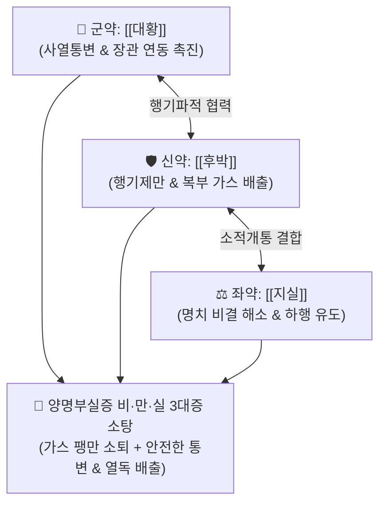

# 🍵 [[소승기탕]] (小承氣湯, Xiao-Cheng-Qi-Tang / Sho-joki-to)

> **핵심 3줄 요약 (Key Summary)**:
> - 🌿 기본 구성: [[대황]], [[지실]], [[후박]] ([[대승기탕]]에서 망초를 제외하여 자극성을 완화한 경하행기 방제).
> - 🎯 양명부실증(陽明腑實證) 중 비(痞)·만(滿)·실(實)이 뚜렷하나 망초의 연견이 필요할 정도로 돌처럼 굳지는 않은 중등도 변비, 복부 가스 팽만 및 압통, 급성 장염/이질 초기의 복통 및 이급후중, 헛소리(섬어) 초기.
> - 🔬 [[센노사이드]]의 대장 점막 신경총 자극 연동 촉진, [[마그놀롤]]·[[헤스페리딘]]의 장관 가스 배출 및 장벽 평활근 경련 완화, 장내 세균 독소 배출.
> - ⚠️ 주의사항: 대승기탕보다는 부드러우나 공하제이므로 비위허한 환자, 임산부, 체력 쇠약 노인에게는 신중 투여 (중병즉지).

---

## 📌 목차
1. [기본 처방 정보 & 군신좌사 구성](#1-기본-처방-정보--군신좌사-구성)
2. [방제학적 약재 상호작용 & 시너지 네트워크](#2-방제학적-약재-상호작용--시너지-네트워크)
3. [현대 분자약리학적 효능 & 작용 기전](#3-현대-분자약리학적-효능--작용-기전)
4. [적응 병증 및 체질별 감별 (Sweet Spot vs 금기)](#4-적응-병증-및-체질별-감별-sweet-spot-vs-금기)
5. [유사 처방군 감별 매트릭스](#5-유사-처방군-감별-매트릭스)
6. [임상 가감례 & 현대 질환별 응용](#6-임상-가감례--현대-질환별-응용)
7. [💡 사용자 진료실 핵심 필기 & 임상 팁 (원문 보존)](#7--사용자-진료실-핵심-필기--임상-팁-원문-보존)
8. [출처 및 학술 참고 문헌 (References)](#8-출처-및-학술-참고-문헌-references)

---

## 1. 기본 처방 정보 & 군신좌사 구성

* **출전**: 장중경(張仲景) 『[[상한론]]』(傷寒論) 양명병편(陽明病篇)
* **치법**: 경하열결(輕下熱結), 행기제만(行氣除滿), 통부설열(通腑泄熱), 소적도체(消積導滯)

| 구분 | 약재명 | 표준 용량 | 본초 효능 & 방제 내 역할 |
| :--- | :--- | :--- | :--- |
| **군약 (君藥)** | [[대황]] | 8~12g (후하) | **사열통변·파적도체**: 장관의 열독과 굳은 대변을 밀어내어 배출 |
| **신약 (臣藥)** | [[후박]] | 6~9g | **행기제만·강역화위**: 장관의 심한 가스 정체와 복부 팽만감을 제거 |
| **좌약 (佐藥)** | [[지실]] | 6~9g | **파기소적·산결통부**: 명치 밑이 꽉 막힌 비결(痞結)을 뚫어 약력을 하행시킴 |

> **방제 구조 분석**:
> * **망초(芒硝)를 뺀 이유**: 대변이 돌처럼 단단하게 굳어 삼투압으로 녹여야 하는 '조(燥)'의 단계가 아닐 때는, 점막 자극이 심한 망초를 빼고 [[대황]]·[[후박]]·[[지실]] 3미만으로 기(氣)를 돌려 가스를 빼내고 부드럽게 통변시킵니다.

---

## 2. 방제학적 약재 상호작용 & 시너지 네트워크

* **행기(行氣)와 사하(瀉下)의 일체화**: 기운이 돌지 않으면 대변이 나가지 못하므로 후박·지실로 기를 먼저 뚫어 대황의 사하력을 완벽히 뒷받침합니다.

---

## 3. 현대 분자약리학적 효능 & 작용 기전

### 1) 장관 연동 운동 촉진 및 완만 사하
* [[대황]]의 센노사이드가 대장 내 미생물에 의해 레인안트론으로 대사되어 아우에르바흐 신경총을 자극, 장관 연동을 항진시켜 대변 정체를 해소합니다.

### 2) 복부 가스 정체 해소 및 항경련 작용
* [[후박]]의 마그놀롤(Magnolol)과 [[지실]]의 헤스페리딘이 장관 평활근의 경련을 완화하고 소화관 가스 배출을 촉진하여 복부 팽만감을 신속히 가라앉힙니다.

### 3) 장관 내독소(LPS) 혈류 유입 차단
* 정체된 대변과 세균 독소를 배출시켜 장점막 장벽 손상과 전신 염증 반응을 방어합니다.

---

## 4. 적응 병증 및 체질별 감별 (Sweet Spot vs 금기)

### 1) 주요 적응증 (Target Indications)
* **양명부실증 중등도 변비 (비·만·실)**:
  * 대변을 며칠간 보지 못하고, 배가 가스로 팽팽하게 불러오르며(만), 명치가 답답하고(비), 배를 누르면 약간의 저항감과 압통이 있는 상태(실).
  * 헛소리를 하거나 미열이 오르는 초기 양명열증.
* **급성 세균성 장염 및 이질 초기**:
  * 뒤가 무지근하고 배가 아프며 끈적한 변이 찔끔거릴 때 독소 배출 목적.

### 2) 체질별 적합도 & 금기
* **적합 체질 (Sweet Spot)**:
  * 체력이 중간 이상이며, 배에 가스가 많이 차고 변비가 동반된 실열형 환자.
* **절대 금기 및 주의 (Contraindications)**:
  * **돌처럼 굳은 조시(燥屎) 극증**: 대변이 너무 단단하여 막힌 극증 환자는 망초가 포함된 [[대승기탕]]을 써야 함.
  * **비위허한 환자 금기**: 속이 차고 대변이 묽은 환자 금기.

---

## 5. 유사 처방군 감별 매트릭스

| 처방명 | 비(痞) | 만(滿) | 조(燥) | 실(實) | 주요 구성 차이 | 주치 강도 |
| :--- | :---: | :---: | :---: | :---: | :--- | :--- |
| [[소승기탕]] | ✅ | ✅ | ❌ | ✅ | 대황, 후박, 지실 (망초 제외) | **중등도 공하제: 가스 팽만과 변비** |
| [[대승기탕]] | ✅ | ✅ | ✅ | ✅ | 대황, 망초, 후박, 지실 | **최강 준하제: 극심한 조열, 섬어, 거대 변괴** |
| [[조위승기탕]] | ❌ | ❌ | ✅ | ✅ | 대황, 망초, 감초 | **완만 사하제: 팽만 없이 조열과 변비** |
| [[마자인환]] | ❌ | ❌ | ✅ | ❌ | 마자인, 백작약, 행인, 소승기탕 | **노인성 건조성 토끼똥 변비 (윤하제)** |

---

## 6. 임상 가감례 & 현대 질환별 응용

### 1) 변증 가감법
* **복통이 극심하고 대변이 돌처럼 굳었을 시**: $\rightarrow$ [[망초]]를 추가하여 [[대승기탕]]으로 전환.
* **진액이 부족하여 장이 건조할 시**: + [[마자인]], [[행인]], [[작약]] ([[마자인환]] 구조).
* **식적(음식 정체) 동반 시**: + [[산사]], [[신곡]], [[맥아]] (소식도체).

### 2) 현대 질환별 매핑
* **소화기과**: 단순성 기능성 변비, 복부 팽만형 소화불량, 급성 식체 변비.
* **감염내과**: 급성 세균성 이질 초기 통도 요법.

---

## 7. 💡 사용자 진료실 핵심 필기 & 임상 팁 (원문 보존)

> [!tip] **진료실 실전 노하우 (User Clinical Insight)**
> - **대승기탕 시험 투약(Test Dose) 요령**: 대승기탕을 쓰기 전 환자의 상태가 준하제를 견딜 수 있는지 불확실할 때 소승기탕을 먼저 1첩 투약하여 방귀가 나오고 대변이 통하는지 반응을 관찰하는 고도의 안전 프로토콜.
> - **가스 팽만(滿) 환자의 1차 선택**: 대변 굳기가 돌처럼 딱딱하지 않으나 배에 가스가 가득 차서 더부룩하고 답답함을 호소하는 환자에게 복통 없이 신속한 가스 배출과 배변을 유도함.
> - **중병즉지(重病卽止)**: 대변이 통하고 복부 팽만이 가라앉으면 즉시 복용을 중단함.

---

## 8. 출처 및 학술 참고 문헌 (References)

1. **Zhang ZJ (張仲景) (200)**. *Shanghan Lun* (傷寒論), Yangming Bing Pian.
   * `[연구 요약]`: 소승기탕 원전 수록, 양명병 조열 및 복창만 치료 경하열결 표준 방제 제정.
2. * **Sun BF et al. (2023)**. Improvement of inflammatory response and gastrointestinal function in perioperative of cholelithiasis by Modified Xiao-Cheng-Qi decoction. *World journal of clinical cases*, 11: 830-843. [PMID: 36818637](https://pubmed.ncbi.nlm.nih.gov/36818637/)
