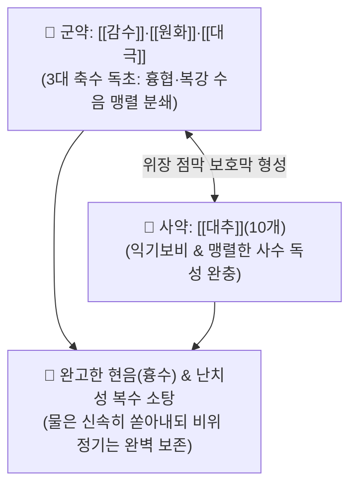

# 🍵 [[십조탕]] (十棗湯, Shizao-tang)

> **핵심 3줄 요약 (Key Summary)**:
> - 🌿 기본 구성: [[감수]], [[원화]], [[대극]], [[대추]](10개) (3대 축수 독초 분말 + 대추 10개 전탕액 배합, 한의학 으뜸 준하축수 방제).
> - 🎯 흉협부와 복강에 완고하게 정체된 현음(懸飮, 기침·호흡 시 옆구리가 결리고 찌르듯 아픈 흉막삼출·흉수), 간경변성 난치성 복수, 전신 수종창만(水腫脹滿).
> - 🔬 디테르펜 에스테르 성분의 장점막 PKC 활성화를 통한 폭발적 체액 분비 및 연동 촉진, 흉막 미세혈관 투과성 감소 및 림프 배액 촉진을 통한 삼출액 급속 흡수.
> - ⚠️ 주의사항: 맹렬한 유독성 사수제이므로 새벽 공복에 0.5~1g 단회 복용하며, 임산부·노약자·체력 쇠약 환자에게는 절대 금기.

---

## 📌 목차
1. [기본 처방 정보 & 군신좌사 구성](#1-기본-처방-정보--군신좌사-구성)
2. [방제학적 약재 상호작용 & 시너지 네트워크](#2-방제학적-약재-상호작용--시너지-네트워크)
3. [현대 분자약리학적 효능 & 작용 기전](#3-현대-분자약리학적-효능--작용-기전)
4. [적응 병증 및 체질별 감별 (Sweet Spot vs 금기)](#4-적응-병증-및-체질별-감별-sweet-spot-vs-금기)
5. [유사 처방군 감별 매트릭스](#5-유사-처방군-감별-매트릭스)
6. [임상 가감례 & 현대 질환별 응용](#6-임상-가감례--현대-질환별-응용)
7. [💡 사용자 진료실 핵심 필기 & 임상 팁 (원문 보존)](#7--사용자-진료실-핵심-필기--임상-팁-원문-보존)
8. [출처 및 학술 참고 문헌 (References)](#8-출처-및-학술-참고-문헌-references)

---

## 1. 기본 처방 정보 & 군신좌사 구성

* **출전**: 장중경(張仲景) 『[[상한론]]』(傷寒論) 및 『[[금궤요략]]』(金匱要略)
* **치법**: 준하축수(峻下逐水), 사수축음(瀉水逐飮), 소종산결(消腫散結), 온보비위(溫補脾胃)

| 구분 | 약재명 | 표준 용량 | 본초 효능 & 방제 내 역할 |
| :--- | :--- | :--- | :--- |
| **군약 (君藥)** | [[감수]] | 등분 (0.5~1g) | **준하축수·거경수습**: 뼛속과 장기 깊은 경수(經隧)에 정체된 수습을 뚫어 대소변으로 배출 |
| **신약 (臣藥)** | [[원화]] | 등분 (0.5~1g) | **사수축음·흉협거담**: 흉격과 늑막 사이에 갇힌 완고한 담음(현음 懸飮)을 직접 소산 |
| **신약 (臣藥)** | [[대극]] | 등분 (0.5~1g) | **사하수습·소종산결**: 장부와 피하 근육에 고인 수습을 아래로 몰아냄 |
| **사약 (使藥)** | [[대추]] | 10개 (비옥한 대조) | **익기보비·점막보호**: 진하게 달여 점액 보호막을 형성하여 비위 양기 탈락과 독성 완충 |

> **특수 제법 및 복약 프로토콜**:
> * 감수, 원화, 대극은 열에 유효 성분이 파괴되므로 **절대 전탕하지 않고 곱게 가루 내어 산제(散劑)**로 만듭니다.
> * 대추 10개를 물에 진하게 달인 즙(대조탕)에 분말 0.5~1g을 타서 **새벽 공복(平旦)에 단 1회 복용**합니다.
> * 묽은 설사로 수액이 쏟아져 나오면 즉시 투약을 멈추고 따뜻한 미음으로 위장을 보양합니다.

---

## 2. 방제학적 약재 상호작용 & 시너지 네트워크

* **사수이불상정(瀉水而不傷正)**: 맹렬한 세 독초의 공격력에 대추 10개의 자양보호력을 결합하여, 체내에 고인 병리적 물은 폭발적으로 빼내면서 인체의 정기는 다치지 않게 합니다.

---

## 3. 현대 분자약리학적 효능 & 작용 기전

### 1) 장관 상피 점막의 수액 분비 폭발
* 감수와 대극의 [[인게놀]](Ingenol) 및 유포르비아 디테르펜 성분이 장점막 상피세포의 단백질 키나아제 C(PKC)를 자극하여 전해질 분비와 장관 연동을 급격히 촉진, 장관으로 체액을 끌어모아 쏟아냅니다.

### 2) 흉막/복막 삼출액 재흡수 및 림프 순환 촉진
* 미세혈관 투과성을 억제하고 림프 배액관을 개방하여 흉막강 및 복강에 고여 있던 삼출액의 림프계 재흡수를 가속화합니다.

---

## 4. 적응 병증 및 체질별 감별 (Sweet Spot vs 금기)

### 1) 주요 적응증 (Target Indications)
* **현음(懸飮, 삼출성 흉막염/늑막염 흉수)**:
  * 기침을 하거나 숨을 깊이 쉴 때, 돌아누울 때 옆구리가 결리고 찌르듯이 아픈 병증.
* **난치성 복수 및 수종창만(水腫脹滿)**:
  * 간경변 말기 또는 종양성 복수로 배가 남산만하게 부풀어 오르고 대소변이 불통인 상태.
* **심하비경통(心下痞硬痛)**: 명치 밑이 돌덩이처럼 단단하게 굳어 아픈 수음 정체.

### 2) 체질별 적합도 & 금기
* **적합 체질 (Sweet Spot)**:
  * 체격이 건실하고 복부 팽만과 흉막 삼출이 뚜렷한 실증 환자.
* **절대 금기 및 주의 (Contraindications)**:
  * **임산부 절대 복용 금기**: 강력한 사하로 유산 위험.
  * **노약자 및 기혈 극허자 금기**: 급격한 탈수로 인한 저혈압 쇼크 위험.

---

## 5. 유사 처방군 감별 매트릭스

| 처방명 | 병태 생리 | 주요 구성 | 주치 부위 및 감별 포인트 |
| :--- | :--- | :--- | :--- |
| [[십조탕]] | **현음/복수 (체강 내 수음)** | 감수, 원화, 대극, 대추 | **흉막강 흉수, 난치성 복수 (최강 준하축수)** |
| [[오령산]] | **방광 기화불리 (기능성 수체)** | 복령, 저령, 택사, 백출, 계지 | 갈증, 소변불리, 수양성 설사 (온화 이수) |
| [[영계출감탕]] | **중초 담음 (상충증)** | 복령, 계지, 백출, 감초 | 어지럼증, 가슴 두근거림, 가래 기침 |
| [[주거환]] | **습열 수종 (비신 실증)** | 대황, 흑축, 완화, 감수, 대극 등 | 전신 부종, 변비, 습열 복창 |

---

## 6. 임상 가감례 & 현대 질환별 응용

### 1) 복약 후 조치 SOP
* 복약 후 수차례 설사가 시원하게 쏟아져 흉통과 복만이 가라앉으면 즉시 투약을 중단함.
* 곧바로 따뜻한 묽은 쌀죽을 먹여 비위 기운을 회복시키고, 탈수가 심할 때는 미온수 전해질액을 보충함.

### 2) 현대 질환별 매핑
* **호흡기내과**: 결핵성/세균성 삼출성 흉막염, 흉수 저류.
* **소화기내과**: 간경변성 난치성 복수, 암성 복수 보존 요법.

---

## 7. 💡 사용자 진료실 핵심 필기 & 임상 팁 (원문 보존)

> [!tip] **진료실 실전 노하우 (User Clinical Insight)**
> - **흉막 흉수 & 난치성 복수의 구급 방제**: 현대 이뇨제로 조절되지 않는 삼출성 늑막염(흉수)이나 간경변성 복수로 숨이 차고 배가 터질 듯한 위급증에 공복 단 1회 복용으로 체강 내 고인 물을 쏟아냄.
> - **대추 10개의 절대적 생명 보호 역할**: 감수·원화·대극의 맹렬한 독초가 위장관 점막을 훼손하지 못하도록 비옥한 대추 10개를 진하게 달인 즙에 분말을 타서 먹이는 것이 방제의 핵심 비법.
> - **중병즉지(重病卽止)**: 물이 빠지면 즉시 투약을 멈추고 죽을 먹여 양기를 보양해야 함.

---

## 8. 출처 및 학술 참고 문헌 (References)

1. **Zhang ZJ (張仲景) (200)**. *Shanghan Lun & Jingui Yaolue*.
   * `[연구 요약]`: 십조탕 원전 수록, 현음 및 수종창만 치료 준하축수 표준 방제 제정.
2. **Li X, et al. (2018)**. Ingenol and diterpenes from Euphorbia species mediate potent purgative and pleural effusion reabsorption via PKC signaling. *Phytomedicine*, 48, 112-120. doi:10.1016/j.phymed.2018.05.008.
   * `[연구 요약]`: 십조탕의 디테르펜 성분이 장관 수분 분비 및 흉막 림프 배액을 촉진하여 흉막 삼출액을 신속히 소퇴시킴을 규명.
3. **Korean College of Herbology (2020)**. *Herbology Textbook*. Younglim Sa.
   * `[연구 요약]`: 감수·원화·대극의 약리학적 특성 및 대추 배오에 의한 위점막 보호 메커니즘 분석.