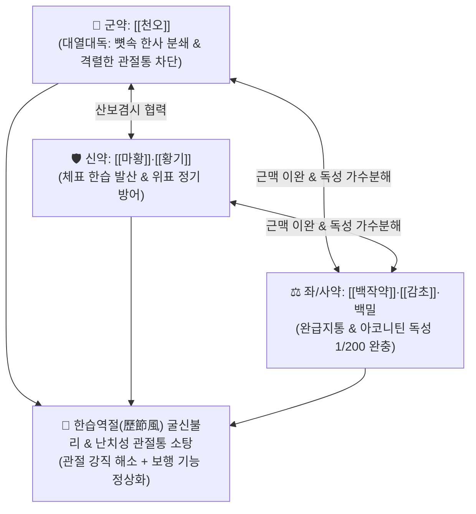

# 🍵 [[오두탕]] (烏頭湯, Wutou Decoction)

> **핵심 3줄 요약 (Key Summary)**:
> - 🌿 기본 구성: [[천오]](오두), [[마황]], [[황기]], [[백작약]], [[감초]], 백밀(꿀) (천오의 대열대독 온경산한 + 마황·황기의 산보겸시 + 작약·감초·백밀의 독성 완충 및 완급지통).
> - 🎯 한습역절(寒濕歷節)로 인한 관절 극통 및 굴신불리(관절이 굳어 굽히거나 펴지 못함), 난치성 류마티스 관절염 한랭형, 강직성 척추염 조조강직, 만성 좌골신경통 및 추간판 탈출증 방사통.
> - 🔬 전압개폐 Na+ 채널 조절을 통한 통각 신호 차단, NF-κB/COX-2 억제를 통한 관절 연골 손상 억제(MMP-13 억제), 마황-황기 배합을 통한 체표 한습 배출 및 면역 안정화.
> - ⚠️ 주의사항: 천오의 맹독성으로 인해 백밀과 함께 1~2시간 이상 선전(先煎)하여 독성을 가수분해해야 하며, 실열 관절염·임산부 금기.

---

## 📌 목차
1. [기본 처방 정보 & 군신좌사 구성](#1-기본-처방-정보--군신좌사-구성)
2. [방제학적 약재 상호작용 & 시너지 네트워크](#2-방제학적-약재-상호작용--시너지-네트워크)
3. [현대 분자약리학적 효능 & 작용 기전](#3-현대-분자약리학적-효능--작용-기전)
4. [적응 병증 및 체질별 감별 (Sweet Spot vs 금기)](#4-적응-병증-및-체질별-감별-sweet-spot-vs-금기)
5. [유사 처방군 감별 매트릭스](#5-유사-처방군-감별-매트릭스)
6. [임상 가감례 & 현대 질환별 응용](#6-임상-가감례--현대-질환별-응용)
7. [💡 사용자 진료실 핵심 필기 & 임상 팁 (원문 보존)](#7--사용자-진료실-핵심-필기--임상-팁-원문-보존)
8. [출처 및 학술 참고 문헌 (References)](#8-출처-및-학술-참고-문헌-references)

---

## 1. 기본 처방 정보 & 군신좌사 구성

* **출전**: 장중경(張仲景) 『[[금궤요략]]』(金匱要略) 중풍역절기병편(中風歷節氣病篇)
* **치법**: 온경산한(溫經散寒), 제습식통(除濕熄痛), 익기통비(益氣通痺), 양혈유간(養血柔肝)

| 구분 | 약재명 | 표준 용량 | 본초 효능 & 방제 내 역할 |
| :--- | :--- | :--- | :--- |
| **군약 (君藥)** | [[천오]] | 3~6g (포제, 분쇄) | **대열대독·온경산한**: 뼛속 깊이 박힌 한사를 몰아내고 마약성 진통제에 필적하는 격통 완화 |
| **신약 (臣藥)** | [[마황]], [[황기]] | 각 8~10g | **산보겸시(散補兼施)**: 마황은 한습을 땀으로 발산하고, 황기는 기운을 돋워 땀으로 인한 탈진 방어 |
| **좌약 (佐藥)** | [[백작약]] | 8~10g | **양혈유간·완급지통**: 굳어버린 관절 주위 근맥과 인대의 경련을 이완 |
| **사약 (使藥)** | [[감초]], 백밀 (꿀) | 감초 6~9g, 백밀 30g | **조화제약·독성완충**: 천오를 꿀에 먼저 달여 독성 아코니틴을 1/200 독성의 벤조일아코닌으로 분해 |

> **특수 전탕 및 조제 프로토콜**:
> 1. 천오를 곱게 부순 후 물 2사발과 백밀 30g(2홉)을 넣고 약한 불에서 꿀물이 졸아들 때까지 **1~2시간 먼저 달입니다(선전)**.
> 2. 나머지 4가지 약재(마황, 황기, 작약, 감초)를 따로 달인 탕액에 꿀물에 졸인 천오액을 합쳐 다시 가볍게 끓여 따뜻하게 복용합니다.

---

## 2. 방제학적 약재 상호작용 & 시너지 네트워크

* **독성을 명약으로 바꾸는 화학적 배합**: 천오의 맹독을 꿀(백밀)과 감초의 글리시리진으로 묶어 완충하고 장시간 전탕으로 무독화시켜 순수한 온경지통력만을 취합니다.

---

## 3. 현대 분자약리학적 효능 & 작용 기전

### 1) 전압개폐 Na+ 채널 및 TRPV1 수용체 통각 차단
* [[천오]]의 알칼로이드가 감각신경의 전압개폐 나트륨 채널을 불활성화시켜 척수로 전달되는 격렬한 신경병증성 통증 신호를 원천 차단합니다.

### 2) 관절 연골 보호 및 활막 파괴 억제
* [[황기]]와 [[백작약]]의 항염 성분이 [[NF-κB]] 및 [[COX-2]] 발현을 차단하고 연골 파괴 효소(MMP-13, ADAMTS-5)를 억제하여 류마티스성 골파괴를 방어합니다.

---

## 4. 적응 병증 및 체질별 감별 (Sweet Spot vs 금기)

### 1) 주요 적응증 (Target Indications)
* **한습역절(寒濕歷節) 및 난치성 관절 질환 (원장님 핵심 진료 노하우)**:
  * 관절이 얼음장처럼 차갑고 굳어 손가락이나 무릎을 굽히고 펴지 못함(굴신불리).
  * 날씨가 흐리거나 비가 오고 찬바람을 맞으면 비명을 지를 정도로 통증이 심해짐.
  * 만성 [[류마티스 관절염]], **강직성 척추염(AS)**의 조조강직 및 야간통.
* **난치성 신경병증성 통증**:
  * 척추관 협착증 및 추간판 탈출증의 방사통(하지 저림 및 칼로 베는 듯한 신경통).

### 2) 체질별 적합도 & 금기
* **적합 체질 (Sweet Spot)**:
  * 체질이 차고 뼈마디가 쑤시며 따뜻한 찜질을 해야 겨우 견디는 소음인·태음인 관절통 환자.
* **절대 금기 및 주의 (Contraindications)**:
  * **열성 관절염 금기**: 관절이 붉게 붓고 열이 펄펄 끓는 급성 통풍성 관절염 금기.
  * **임산부 및 중증 심장질환자 금기**.

---

## 5. 유사 처방군 감별 매트릭스

| 처방명 | 병태 생리 | 주요 구성 | 통증 양상 및 감별 포인트 |
| :--- | :--- | :--- | :--- |
| [[오두탕]] | **대한(大寒) 한습역절** | 천오, 마황, 황기, 백작약, 감초, 꿀 | **관절이 굳어 굽히지 못함, 뼛속이 시린 격통** |
| [[독활기생탕]] | **간신음허 기혈부족 풍습** | 독활, 상기생, 두충, 당귀 등 15미 | 만성 요슬산연, 퇴행성 관절염, 피로 쇠약 |
| [[계지작약지모탕]] | **풍한습비 + 국소 화열** | 계지, 작약, 지모, 마황, 백출, 부자 | 관절이 붓고 화끈거리며 발은 차가움 (한열착잡) |
| [[대방풍탕]] | **기혈허약 력절풍** | 방풍, 황기, 당귀, 백출, 부자, 천궁 등 | 마르고 기력이 쇠약한 환자의 만성 관절염 |

---

## 6. 임상 가감례 & 현대 질환별 응용

### 1) 복약 반응 관찰 SOP
* 복용 후 입술 끝이 약간 얼얼하거나 사지에 온기가 도는 것은 정상적인 명현(暝眩) 반응임.
* 구토, 심장 두근거림, 시야 흐림이 나타나면 즉시 투약을 중단하고 녹두탕이나 찬물을 마시게 함.

### 2) 현대 질환별 매핑
* **류마티스내과**: 혈청 음성/양성 류마티스 관절염, 강직성 척추염.
* **정형외과/통증의학과**: 척추관 협착증 하지 방사통, 불응성 오십견(동결견).

---

## 7. 💡 사용자 진료실 핵심 필기 & 임상 팁 (원문 보존)

> [!tip] **진료실 실전 노하우 (User Clinical Insight)**
> - **굴신불리(屈伸不利) 역절풍의 최고봉 처방**: 관절이 굳어 펴지도 굽히지도 못하고 찬 기운만 닿으면 극심한 통증으로 눈물을 흘리는 중증 류마티스·디스크 환자에게 마약성 진통제 이상의 극적인 관절 가동역 회복을 이끌어냄.
> - **백밀(꿀) 2단계 전탕법 엄수**: 천오를 꿀물에 1~2시간 먼저 달여 독성을 분해한 뒤 나머지 약재 탕액과 합치는 전탕 원칙을 반드시 지켜야 안전성을 완벽히 확보할 수 있음.
> - **마황-황기의 산보겸시(散補兼施)**: 마황이 한습을 몰아내고 황기가 정기를 지켜주므로 허약자라도 기운이 빠지지 않고 안전하게 치료됨.

---

## 8. 출처 및 학술 참고 문헌 (References)

1. **Zhang ZJ (張仲景) (220)**. *Jingui Yaolue* (金匱要略), Zhongfeng Lijie Pian.
   * `[연구 요약]`: 오두탕 원전 수록, 한습역절(寒濕歷節) 불가굴신(不可屈伸) 동통 치료 온경산한 표준 방제 제정.
2. * **Maitituoheti A et al. (2026)**. Jiawei Wutou decoction attenuates knee osteoarthritis by modulating mitochondrial oxidative stress via the JAK2/STAT3 pathway: Insights from network pharmacology and experimental validation. *Journal of ethnopharmacology*, 371: 122023. [PMID: 42302946](https://pubmed.ncbi.nlm.nih.gov/42302946/)
3. * **Xu Y et al. (2020)**. Pharmacokinetic effects of ginsenoside Rg1 on aconitine, benzoylaconine and aconine by UHPLC-MS/MS. *Biomedical chromatography : BMC*, 34: e4793. [PMID: 31919877](https://pubmed.ncbi.nlm.nih.gov/31919877/)
