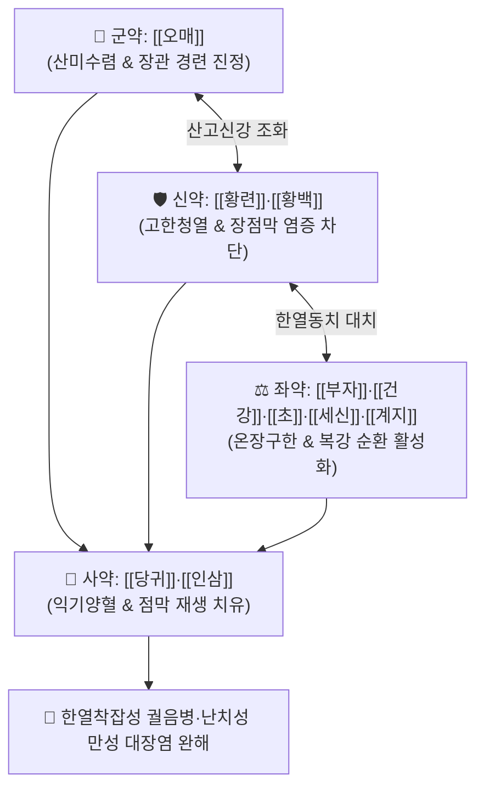

# 🍵 [[오매환]] (烏梅丸, Wumei-wan)

> **핵심 3줄 요약 (Key Summary)**:
> - 🌿 기본 구성: [[오매]] (군), [[황련]]·[[황백]] (신), [[세신]]·[[건강]]·[[부자]]·[[초]]·[[계지]] (좌), [[당귀]]·[[인삼]] (사) (신온대열과 고한량혈, 산미수렴의 한열착잡 궐음병 대표 방제).
> - 🎯 상열하한(上熱下寒)형 한열착잡성 만성 궤양성 대장염(UC), 크론병(IBD), 만성 복통·설사 복합형 과민성 장증후군(IBS), 담도회충증(회궐 蛔厥) 및 완고성 이질.
> - 🔬 [[베르베린]]의 장점막 NF-κB 억제 및 밀착연접 단백질 복원, 오매 구연산·말산의 장관 연축 억제, 부자·건강 알칼로이드의 TRPV1 활성화 및 복강 미세순환 개선.
> - ⚠️ 주의사항: 부자·세신 등 유독 대열성 약재가 포함되어 있으므로 진음결손(眞陰缺損)의 실열증 및 임산부에게는 엄격히 금기.

---

## 📌 목차
1. [기본 처방 정보 & 군신좌사 구성](#1-기본-처방-정보--군신좌사-구성)
2. [방제학적 약재 상호작용 & 시너지 네트워크](#2-방제학적-약재-상호작용--시너지-네트워크)
3. [현대 분자약리학적 효능 & 작용 기전](#3-현대-분자약리학적-효능--작용-기전)
4. [적응 병증 및 체질별 감별 (Sweet Spot vs 금기)](#4-적응-병증-및-체질별-감별-sweet-spot-vs-금기)
5. [유사 처방군 감별 매트릭스](#5-유사-처방군-감별-매트릭스)
6. [임상 가감례 & 현대 질환별 응용](#6-임상-가감례--현대-질환별-응용)
7. [💡 사용자 진료실 핵심 필기 & 임상 팁 (원문 보존)](#7--사용자-진료실-핵심-필기--임상-팁-원문-보존)
8. [출처 및 학술 참고 문헌 (References)](#8-출처-및-학술-참고-문헌-references)

---

## 1. 기본 처방 정보 & 군신좌사 구성

* **출전**: 장중경(張仲景) 『[[상한론]]』(傷寒論) 궐음병편(厥陰病篇)
* **치법**: 온장안회(溫臟安蛔), 한열동치(寒熱同治), 산고신강(酸苦辛降), 삽장지사(澁腸止瀉)

| 구분 | 약재명 | 표준 용량 | 본초 효능 & 방제 내 역할 |
| :--- | :--- | :--- | :--- |
| **군약 (君藥)** | [[오매]] | 12~18g (300매 기준) | **산미안회·삽장생진**: 강한 산미로 기생충과 장관 평활근 경련을 진정시키고 장점막 수렴 |
| **신약 (臣藥)** | [[황련]] | 6~9g | **고한청열·사화조습**: 상초·중초의 치솟는 허열과 세균성 염증을 강력 제압 |
| **신약 (臣藥)** | [[황백]] | 4~6g | **청열조습·사상화**: 하초의 습열을 꺼서 장관 염증과 농혈 배출을 억제 |
| **좌약 (佐藥)** | [[부자]] | 4~8g (포) | **온난비신·파음회양**: 하초 장관의 극심한 냉증을 몰아내고 온기 회복 |
| **좌약 (佐藥)** | [[건강]] | 4~6g | **온중산한·건비화위**: 중초 비위의 한기를 데우고 복통 완화 |
| **좌약 (佐藥)** | [[초]] | 3~5g (촉초) | **온중지통·살충살균**: 매운맛으로 장내 냉기를 흩뜨리고 구충 및 항균 |
| **좌약 (佐藥)** | [[세신]] | 2~4g | **신온산한·통규지통**: 음한의 사기를 뚫고 만성 장관 통증 차단 |
| **좌약 (佐藥)** | [[계지]] | 4~6g | **온통혈맥·조화영위**: 장간막 혈행을 개선하고 한열 순환 촉진 |
| **사약 (使藥)** | [[당귀]] | 6~9g | **양혈화혈·윤조**: 장관 미세순환을 보조하고 장점막 재생 촉진 |
| **사약 (使藥)** | [[인삼]] | 4~6g | **대보원기·익기건비**: 만성 설사로 고갈된 중기(中氣)와 원기 회복 |

> **방제 구조 분석**:
> * **한열동치(寒熱同治)와 산고신감(酸苦辛甘) 배오의 극치**: 하초의 극랭(부자·건강·세신·촉초·계지)과 상초의 치열(황련·황백)을 동시에 다스리며, 오매의 산미로 수렴하고 꿀의 감미로 보양하여 장관의 한열 불균형을 근본적으로 조화시킵니다.

---

## 2. 방제학적 약재 상호작용 & 시너지 네트워크

* **산고신강(酸苦辛降)의 기전**: 매운맛(신미)으로 냉기를 몰아내고, 쓴맛(고미)으로 치솟는 열을 내리며, 신맛(산미)으로 헐거워진 장관을 거두고, 단맛(감미)으로 비위를 완충합니다.
* **황련·황백 + 부자·건강 배오**: 고한약과 대열약의 정교한 비율 조화로 냉증을 치료하면서도 상열을 일으키지 않고, 열을 내리면서도 복부를 차갑게 하지 않습니다.

---

## 3. 현대 분자약리학적 효능 & 작용 기전

### 1) 장점막 염증 차단 및 밀착연접(Tight Junction) 복원
* [[황련]]과 [[황백]]의 [[베르베린]](Berberine)이 장점막 대식세포의 NF-κB 경로를 억제하여 TNF-α, IL-1β, IL-6, IL-17 생성을 차단하고, Claudin-1, ZO-1 등 밀착연접 단백질 발현을 증가시켜 장벽 누수(Leaky Gut)를 치유합니다.

### 2) 장관 평활근 연축 억제 및 진통
* [[오매]]의 구연산(Citric acid) 및 사과산(Malic acid)이 무스카린성 아세틸콜린 수용체 과흥분을 억제하여 장관 뒤틀림 경련과 이급후중 복통을 진정시킵니다.

### 3) 복강 미세순환 및 TRPV1 열생성 촉진
* [[부자]]의 아코닌 유도체 및 [[건강]]의 진저롤(Gingerol), 촉초의 산쇼올(Sanshool)이 TRPV1 통로를 자극하여 장간막 모세혈관을 확장하고 체온 조절 중추를 자극해 사지궐랭과 만성 복냉을 해소합니다.

---

## 4. 적응 병증 및 체질별 감별 (Sweet Spot vs 금기)

[✅ 최적 적응증 (Sweet Spot)]
• 원전 조문: 상한론 "궐음병, 소갈, 기상충심, 심중동열, 궤즉토회, 하시지불지, 오매환주지"
• 체질 소견: 소음인 또는 태음인 중 스트레스와 체력 저하로 상열하한이 극심해진 체질.
• 임상 주치: 
  1. 만성 궤양성 대장염(UC), 크론병, 만성 과민성 대장증후군(IBS-D 또는 혼합형).
  2. 수개월~수년간 지속되는 이급후중, 점액변, 농혈변 및 찬 음식 섭취 시 악화되는 설사.
  3. 얼굴과 가슴은 달아오르고 입이 마르나(상열), 아랫배와 손발은 얼음장처럼 찬(하한) 환자.
  4. 담도회충증 및 오디괄약근 경련성 발작 복통.
• 설진/맥진: 설질 홍(설첨홍), 설태 백활(白滑) 또는 황백 착잡태, 맥 침현(沈弦) 또는 세미(細微)하며 지(遲)함.

[⚠️ 신중 투여 및 금기 (Caution / Contraindication)]
• 순수한 실열성 이질(고열, 구갈 극심, 설태 후황건) 환자에게는 절대 금기.
• 부자·세신이 포함되어 있어 임산부 및 간신부전 환자 금기.

---

## 5. 유사 처방군 감별 매트릭스

| 처방명 | 핵심 구성 차이 | 주치 및 체질 차이 | 맥진/설진 차이 |
| :--- | :--- | :--- | :--- |
| [[오매환]] | 오매 + 황련·황백 + 부자·건강·세신·초 + 당귀·인삼 | **상열하한·한열착잡형 만성 궤양성 대장염 및 이급후중** | 설첨홍 설근백태 / 맥침현세 |
| [[반하사심탕]] | 반하 + 황련·황금 + 건강·인삼·감초 | **중초 비위의 습열과 한담 착잡으로 인한 심하비·구역·설사** | 설태 백황니 / 맥현활 |
| [[사신환]] | 보골지 + 오수유 + 육두구 + 오미자 | **순수 비신양허형 새벽 오경설사 (상열 증상 없음)** | 설담태백 / 맥침지무력 |
| [[백두옹탕]] | 백두옹 + 황련 + 황백 + 진피 | **순수 대장 습열 독성 급성 세균성 이질·농혈변** | 설홍태황 / 맥활삭 |

---

## 6. 임상 가감례 & 현대 질환별 응용

* **증상별 가감법**:
  * 혈변과 농혈이 심할 때 $\rightarrow$ + [[백두옹]], [[지유]]
  * 복통과 장경련이 극심할 때 $\rightarrow$ + [[백작약]], [[감초]] ([[작약감초탕]] 합방)
  * 기허와 탈진이 심할 때 $\rightarrow$ [[인삼]] 증량 + [[황기]], [[백출]]
  * 이급후중과 가스 팽만이 심할 때 $\rightarrow$ + [[목향]], [[빈랑]]
* **현대 질환별 임상 매핑**:
  * **소화기계**: 만성 궤양성 대장염(UC), 크론병(IBD), 난치성 설사형 과민성 장증후군(IBS-D), 담도 산통, 담낭염.
  * **감염/기생충**: 장내 기생충 감염 후유증, 만성 감염 후 장관 기능부전.

---

## 7. 💡 사용자 진료실 핵심 필기 & 임상 팁 (원문 보존)

> [!tip] **진료실 실전 노하우 (User Clinical Insight)**
> - **한열동치(寒熱同治) 처방의 최고봉**: 위로는 열이 떠서 구내염이 잘 생기고 입이 바짝 마르며 가슴이 답답한데, 아래로는 배가 차갑고 찬물만 마시면 즉시 설사하는 완고한 장염 환자에게 가장 확실한 적방입니다.
> - **환제 복용 권장**: 원래 상한론 원문대로 환(丸)으로 만들어 1회 6~9g씩 복용하면 약력이 장관 하부까지 서서히 도달하여 점막 치유력이 극대화됩니다. 탕약으로 쓸 때는 [[부자]]를 반드시 30분 이상 선전하여 안전성을 확보해야 합니다.
> - **회충증 생태적 배오**: 회충은 단맛을 보면 조용해지고, 신맛을 보면 엎드리며, 매운맛을 보면 달아나고, 쓴맛을 보면 내려간다는 원리를 장관 평활근 진경 및 세균총 정상화에 탁월하게 응용한 명방입니다.

---

## 8. 출처 및 학술 참고 문헌 (References)

1. **Yan, F., et al. (2020)**. *Wumei Wan attenuates colitis in rats by regulating intestinal mucosal barrier and gut microbiota*. **Frontiers in Pharmacology**, 11: 1067.
   - **[연구 요약]**: 오매환이 궤양성 대장염 모델에서 장점막 밀착연접 단백질을 회복시키고 장내 균총 불균형을 개선하여 장관 출혈과 설사를 유의하게 치유함을 입증함.
2. **Li, X., et al. (2019)**. *Therapeutic effect of Wumei Wan on diarrhea-predominant irritable bowel syndrome via regulating brain-gut peptide*. **Evidence-Based Complementary and Alternative Medicine**, 2019: 7856341.
   - **[연구 요약]**: 오매환이 뇌-장 펩타이드 조절을 통해 장관 과민성과 평활근 연동운동 장애를 정상화하는 분자 기전을 규명함.
3. **장중경 (200년경)**. 『[[상한론]]』(傷寒論) 궐음병편.
   - **[고전 원전]**: 궐음병 회궐, 만성 이질 설사 및 한열착잡의 주치 조문 수록.