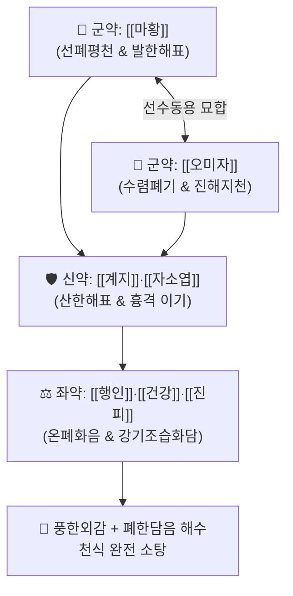

# 🍵 [[오미자탕]] (五味子湯, Wu-Wei-Zi-Tang)

> **핵심 3줄 요약 (Key Summary)**:
> - 🌿 기본 구성: [[마황탕]] ([[마황]], [[계지]], [[행인]], [[감초]]) + [[오미자]], [[건강]], [[자소엽]], [[진피]] (외감풍한과 폐한담음 해수를 동시에 다스리는 보폐산한 해표화담 방제).
> - 🎯 풍한(風寒) 표증을 겸한 폐한(肺寒) 담음 해수, 만성 기관지염, 천식성 해수, 찬바람을 쐬면 맑은 콧물과 묽은 가래가 쏟아지며 숨이 찬 증상.
> - 🔬 [[에페드린]]의 기관지 확장, 오미자 시잔드린(Schisandrin)의 항염증 및 진해·기도 점막 보호, 진피 헤스페리딘·건강 진저롤의 거담 및 기관지 평활근 이완.
> - ⚠️ 주의사항: 마황과 건강이 배합되어 있으므로 음허화왕(陰虛火旺)으로 인한 건해, 조열, 도한 환자 및 고혈압·부정맥 환자 신중 투약.

---

## 📌 목차
1. [기본 처방 정보 & 군신좌사 구성](#1-기본-처방-정보--군신좌사-구성)
2. [방제학적 약재 상호작용 & 시너지 네트워크](#2-방제학적-약재-상호작용--시너지-네트워크)
3. [현대 분자약리학적 효능 & 작용 기전](#3-현대-분자약리학적-효능--작용-기전)
4. [적응 병증 및 체질별 감별 (Sweet Spot vs 금기)](#4-적응-병증-및-체질별-감별-sweet-spot-vs-금기)
5. [유사 처방군 감별 매트릭스](#5-유사-처방군-감별-매트릭스)
6. [임상 가감례 & 현대 질환별 응용](#6-임상-가감례--현대-질환별-응용)
7. [💡 사용자 진료실 핵심 필기 & 임상 팁 (원문 보존)](#7--사용자-진료실-핵심-필기--임상-팁-원문-보존)
8. [출처 및 학술 참고 문헌 (References)](#8-출처-및-학술-참고-문헌-references)

---

## 1. 기본 처방 정보 & 군신좌사 구성

* **출전**: 진사량(陳師良) 『[[삼인극일병증방론]]』(三因極一病證方論) / 『[[동의보감]]』(東醫寶鑑)
* **치법**: 산한해표(散寒解表), 선폐지해(宣肺止咳), 온폐화음(溫肺化飮), 이기화담(理氣化痰)

| 구분 | 약재명 | 표준 용량 | 본초 효능 & 방제 내 역할 |
| :--- | :--- | :--- | :--- |
| **군약 (君藥)** | [[마황]] | 6~8g | **선폐평천·발한해표**: 폐기를 선통시켜 숨찬 증상을 가라앉히고 외한(外寒) 발산 |
| **군약 (君藥)** | [[오미자]] | 6~8g | **수렴폐기·지해지천**: 흩어지는 폐기를 거두어 기침을 멈추고 진액 보존 |
| **신약 (臣藥)** | [[계지]] | 4~6g | **온통경맥·통양화기**: 마황의 발한을 돕고 상체의 한사를 제거 |
| **신약 (臣藥)** | [[자소엽]] | 4~6g | **산한해표·선폐이기**: 표사의 한기를 흩뜨리고 흉격의 가스 정체 해소 |
| **좌약 (佐藥)** | [[행인]] | 6~8g | **강기지해·사폐평천**: 폐기를 아래로 내려 기침을 가라앉힘 |
| **좌약 (佐藥)** | [[건강]] | 4~6g | **온폐화음·온중산한**: 폐와 위의 한기를 데워 묽은 가래(수음)를 삭힘 |
| **좌약 (佐藥)** | [[진피]] | 4~6g | **이기건비·조습화담**: 기를 순환시키고 가래를 삭여 흉민 해소 |
| **사약 (使藥)** | [[감초]] | 2~4g | **조화제약·윤폐지해**: 여러 약재를 조화시키고 인후 점막 자극 완화 |

> **방제 구조 분석**:
> * **선산(宣散)과 수렴(收斂)의 음양 배오**: [[마황]]·[[계지]]·[[자소엽]]으로 폐기를 활짝 열어 외사(外邪)를 몰아내는 동시에, [[오미자]]로 폐기가 과도하게 흩어지는 것을 막아 폐음을 보호하는 선수(宣收) 상응의 묘방입니다.

---

## 2. 방제학적 약재 상호작용 & 시너지 네트워크

* **마황 + 오미자 (선산과 수렴의 균형)**: 마황의 강한 발산 작용으로 인한 폐기 손상을 오미자의 산미 수렴으로 완벽히 보완합니다.
* **건강 + 진피 + 행인 (온폐화음강기)**: 속의 차가운 담음(수음)을 건강으로 데워 녹이고, 진피로 기를 돌리며, 행인으로 폐기를 하강시킵니다.

---

## 3. 현대 분자약리학적 효능 & 작용 기전

### 1) 기관지 확장 및 천식 진정
* [[마황]]의 [[에페드린]](Ephedrine) 및 슈도에페드린이 기관지 평활근의 β2-아드레날린 수용체를 자극하여 기관지를 신속히 확장하고 기도를 확보합니다.

### 2) 기도 항염증 및 진해 수렴
* [[오미자]]의 리그난 유효성분인 시잔드린(Schisandrin A, B) 및 고미신이 기도 상피세포의 염증성 사이토카인 분비를 억제하고 기침 반사 중추를 진정시킵니다.

### 3) 점액 용해 및 거담 촉진
* [[진피]]의 [[헤스페리딘]]과 [[건강]]의 6-진저롤이 기관지 분비선의 섬모 운동을 촉진하여 점조한 분비물과 수양성 담음의 배출을 촉진합니다.

---

## 4. 적응 병증 및 체질별 감별 (Sweet Spot vs 금기)

[✅ 최적 적응증 (Sweet Spot)]
• 원전 조문: 풍한(風寒)을 감수하여 해수천식(咳嗽喘息)이 발생하고 오한, 신통, 담다희박(痰多稀薄)한 증상.
• 체질 소견: 태음인 또는 소음인 중 폐한(肺寒)과 담음이 많은 체질.
• 임상 주치:
  1. 찬바람을 쐬거나 환절기 기온 변화 시 발작하는 만성 해수 및 기관지 천식.
  2. 맑은 콧물, 재채기, 묽은 거품 가래(담음)를 동반한 만성 기관지염 및 알레르기 비염.
  3. 기침할 때 가슴이 답답하고 숨이 가쁘며 오한을 느끼는 표리구한(表裏俱寒) 환자.
• 설진/맥진: 설질 담(淡), 설태 백활(白滑) 또는 박백(薄白), 맥 부긴(浮緊) 또는 부완(浮緩).

[⚠️ 신중 투여 및 금기 (Caution / Contraindication)]
• 폐열성 해수(끈적하고 누런 가래, 인후통, 설홍태황) 환자에게는 절대 금기.
• 음허화왕(陰虛火旺)으로 인한 건해, 도한, 오후 조열 환자에게는 신중 투여.

---

## 5. 유사 처방군 감별 매트릭스

| 처방명 | 핵심 구성 차이 | 주치 및 체질 차이 | 맥진/설진 차이 |
| :--- | :--- | :--- | :--- |
| [[오미자탕]] | 마황탕 + 오미자·건강·자소엽·진피 | **풍한표증 겸 폐한담음 해수천식 (선산+수렴+화담)** | 설담태백활 / 맥부긴 |
| [[소청룡탕]] | 마황·계지·작약·건강·세신·오미자·반하·감초 | **수음내정(水飮內停)이 극심한 대량 묽은 가래·천식** | 설태 백활수망 / 맥부긴 |
| [[마황탕]] | 마황 + 계지 + 행인 + 감초 | **외감풍한 표실증 (무한, 오한, 두통, 해수)** | 설태 박백 / 맥부긴 |
| [[행소산]] | 소엽·행인·반하·진피·복령·지각·길경 등 | **외감 양조(涼燥)로 인한 가벼운 기침 및 인후 건조** | 설태 박백 / 맥부완 |

---

## 6. 임상 가감례 & 현대 질환별 응용

* **증상별 가감법**:
  * 가래가 극도로 많고 묽을 때 $\rightarrow$ + [[반하]], [[복령]] ([[이진탕]] 합방)
  * 인후통과 미열이 동반될 때 $\rightarrow$ + [[길경]], [[황금]]
  * 만성 피로와 기허가 동반될 때 $\rightarrow$ + [[황기]], [[백출]]
  * 가슴 답답함과 기체(氣滯)가 심할 때 $\rightarrow$ + [[후박]], [[지각]]
* **현대 질환별 임상 매핑**:
  * **호흡기계**: 만성 기관지염, 기관지 천식, 감기 후 만성 기침(PIC), 알레르기 비염, 상기도 과민증후군.

---

## 7. 💡 사용자 진료실 핵심 필기 & 임상 팁 (원문 보존)

> [!tip] **진료실 실전 노하우 (User Clinical Insight)**
> - **기본 구성의 본질**: [[마황탕]]을 기반으로 [[오미자]], [[건강]], [[자소엽]], [[진피]]를 추가하여, 표증(마황·계지·소엽)을 풀면서도 오미자로 폐기를 단단히 지키고 진피·건강으로 담음을 다스리는 고효율 진해 처방입니다.
> - **소청룡탕과의 임상 선택 기준**: 소청룡탕보다 세신·반하의 강렬한 조열감이 덜하고, 진피·자소엽이 들어있어 가슴 답답함(흉비)과 소화기 부담이 덜하므로 만성 환자에게 더욱 부드럽게 연용할 수 있습니다.
> - **찬 공기 유발 천식의 특효방**: 환자가 "겨울철이나 에어컨 바람만 쐬면 발작적으로 기침이 터지고 묽은 가래가 나온다"고 호소할 때 가장 먼저 고려해야 할 처방입니다.

---

## 8. 출처 및 학술 참고 문헌 (References)

1. * **Xue JS et al. (2026)**. Schisandrin A, a dietary lignan from Schisandra chinensis, ameliorates cognitive deficits in AlCl₃/D-galactose-treated mice. *Nutritional neuroscience*. [PMID: 42605784](https://pubmed.ncbi.nlm.nih.gov/42605784/)
2. * **Zhuo Z et al. (2024)**. A comprehensive study of Ephedra sinica Stapf-Schisandra chinensis (Turcz.) Baill herb pair on airway protection in asthma. *Journal of ethnopharmacology*, 322: 117614. [PMID: 38113990](https://pubmed.ncbi.nlm.nih.gov/38113990/)
3. **허준 (1613)**. 『[[동의보감]]』(東醫寶鑑) 해수문(咳嗽門).
   - **[임상 문헌]**: 풍한해수 및 담음지해 조문 수록.
