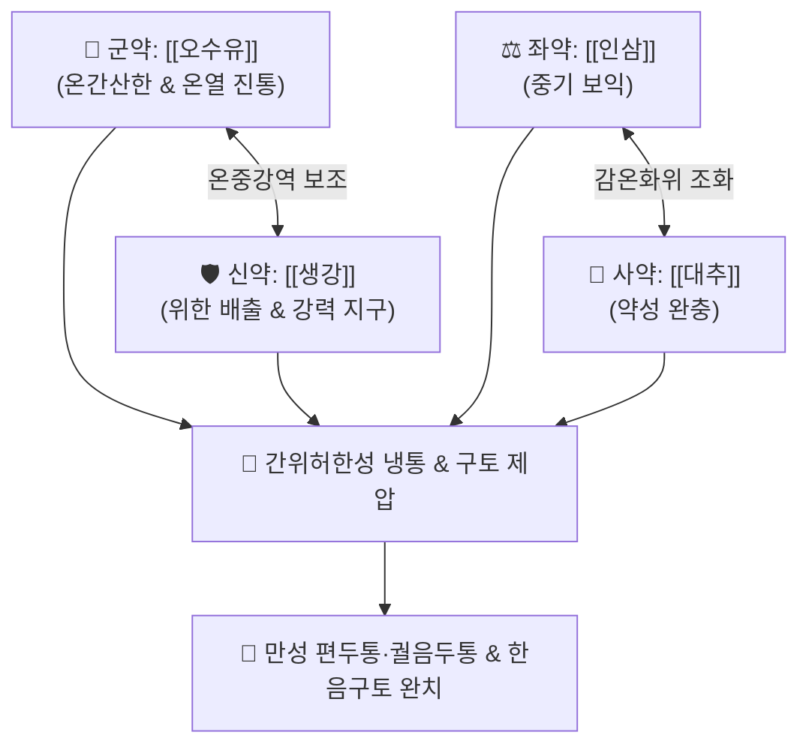

# 🍵 [[오수유탕]] (吳茱萸湯, Wu-Zhu-Yu-Tang / Goshuyu-to)

> **핵심 3줄 요약 (Key Summary)**:
> - 🌿 기본 구성: [[오수유]] (군), [[생강]] (신), [[인삼]] (좌), [[대추]] (사) (간위허한 궐음두통 및 한음구토를 다스리는 온중강역 산한지통 대표 방제).
> - 🎯 체력 저하 환자의 반복적 냉증, 격렬한 정수리·편두통, 뒷목과 어깨 결림, 찬 음식 섭취 후 오심·구토 및 맑은 침(연말 涎沫)을 토하는 증상 (2주 이상 지속 복용 시 편두통 체질 개선).
> - 🔬 [[에보디아민]](Evodiamine)·[[루타에카르핀]](Rutaecarpine)의 TRPV1 활성화, [[세로토닌]](5-HT) 및 [[아드레날린]] 수용체 조절을 통한 뇌혈관 수축·확장 정상화, 혈소판 응집 억제 및 중추성 항구토.
> - ⚠️ 주의사항: 오수유의 신열(辛熱) 조열한 성질로 인해 간양상항(肝陽上亢)형 두통이나 실열 위염 환자에게는 절대 금기.

---

## 📌 목차
1. [기본 처방 정보 & 군신좌사 구성](#1-기본-처방-정보--군신좌사-구성)
2. [방제학적 약재 상호작용 & 시너지 네트워크](#2-방제학적-약재-상호작용--시너지-네트워크)
3. [현대 분자약리학적 효능 & 작용 기전](#3-현대-분자약리학적-효능--작용-기전)
4. [적응 병증 및 체질별 감별 (Sweet Spot vs 금기)](#4-적응-병증-및-체질별-감별-sweet-spot-vs-금기)
5. [유사 처방군 감별 매트릭스](#5-유사-처방군-감별-매트릭스)
6. [임상 가감례 & 현대 질환별 응용](#6-임상-가감례--현대-질환별-응용)
7. [💡 사용자 진료실 핵심 필기 & 임상 팁 (원문 보존)](#7--사용자-진료실-핵심-필기--임상-팁-원문-보존)
8. [출처 및 학술 참고 문헌 (References)](#8-출처-및-학술-참고-문헌-references)

---

## 1. 기본 처방 정보 & 군신좌사 구성

* **출전**: 장중경(張仲景) 『[[상한론]]』(傷寒論) 양명병·소음병·궐음병편
* **치법**: 온중보허(溫中補虛), 강역지구(降逆止嘔), 산한지통(散寒止痛), 온간난위(溫肝暖胃)

| 구분 | 약재명 | 표준 용량 | 본초 효능 & 방제 내 역할 |
| :--- | :--- | :--- | :--- |
| **군약 (君藥)** | [[오수유]] | 4~8g (탕세) | **온간난위·강역지구·산한지통**: 간경과 위장의 한사를 몰아내고 따뜻한 진통 작용으로 치솟는 기운을 내림 |
| **신약 (臣藥)** | [[생강]] | 12~18g (중용) | **온위화위·강역지구**: 오수유를 도와 위장의 냉기를 데우고 구토를 멈추게 함 |
| **좌약 (佐藥)** | [[인삼]] | 6~9g | **대보원기·보비익위**: 허약해진 비위의 기운을 보하여 기혈 생성 촉진 |
| **사약 (使藥)** | [[대추]] | 4~8g (4~6매) | **보비화위·완화약성**: 오수유의 강렬하고 자극적인 맛을 완충하고 영혈을 보양 |

> **방제 구조 분석**:
> * **온신(溫辛)과 익기(益氣)의 절묘한 결합**: 오수유와 생강의 뜨겁고 매운 약성으로 간·위의 음한(陰寒)을 쫓고, 인삼과 대추의 감미로 허약한 비위를 보익하여 '공사(攻邪)하면서도 정기(正氣)를 상하지 않게' 하는 방제학적 묘방입니다.

---

## 2. 방제학적 약재 상호작용 & 시너지 네트워크

* **오수유 + 생강 (강역지통의 쌍두마차)**: 오수유의 간경(肝經) 온난 진통력과 생강의 위경(胃經) 온중 지구력이 결합하여 명치에서 머리끝(백회)까지 치솟는 한사(寒邪)와 구역질을 신속히 진정시킵니다.
* **인삼 + 대추 (비위 원기 보호)**: 오수유의 매운 독성과 위장 자극을 부드럽게 감싸주어 위장 점막을 보호합니다.

---

## 3. 현대 분자약리학적 효능 & 작용 기전

### 1) 혈관 수축·확장 조절 및 세로토닌/아드레날린 수용체 경로
* [[오수유]]의 알칼로이드인 에보디아민(Evodiamine)과 루타에카르핀(Rutaecarpine)이 [[세로토닌]](5-HT1B/1D) 및 [[아드레날린]] 수용체 신호전달을 조절하여 뇌혈관의 비정상적 확장과 혈관 주변 염증을 억제하고 혈소판 응집을 방지합니다.

### 2) TRPV1 수용체 활성화 및 온열 진통
* 에보디아민이 캡사이신 수용체(TRPV1)의 강력한 효능제로 작용하여 중추 및 말초의 Substance P 방출을 차단함으로써 만성 난치성 신경병증성 두통 및 내장성 복통을 진정시킵니다.

### 3) 중추성 및 말초성 항구토·위장관 운동 촉진
* [[생강]]의 진저롤(Gingerol)·쇼가올(Shogaol)과 오수유 성분이 연수 화학수용체(CTZ)의 5-HT3 수용체를 길항하여 오심, 구역, 맑은 침을 토하는 구토 반응을 차단합니다.

---

## 4. 적응 병증 및 체질별 감별 (Sweet Spot vs 금기)

[✅ 최적 적응증 (Sweet Spot)]
• 원전 조문: 상한론 "간한범위(肝寒犯胃), 구토연말, 두통, 오수유탕주지" / "소음병, 토리(吐利), 수족역랭, 번조욕사"
• 체질 소견: 소음인 또는 체력 저하형 태음인 중 극도의 한성(寒性) 체질.
• 임상 주치:
  1. **궐음두통(정수리 백회혈 통증)** 및 박동성 만성 편두통.
  2. 체력 저하 환자의 반복적 냉증, 뒷목과 어깨 결림을 수반하는 긴장성·혈관성 두통.
  3. 찬 음식을 먹거나 스트레스를 받으면 체하면서 맑은 침(연말)을 쏟아내는 오심·구토.
  4. 손발이 얼음장 같고 아랫배가 차며 설사를 동반하는 소음병 음증.
• 설진/맥진: 설질 담백(淡白), 설태 백활(白滑) 또는 백니(白膩), 맥 침현(沈弦) 또는 현세지(弦細遲).

[⚠️ 신중 투여 및 금기 (Caution / Contraindication)]
• 간양상항(肝陽上亢), 음허화왕(陰虛火旺)으로 인한 두통(얼굴 붉어짐, 열감, 맥현삭)에는 절대 금기.
• 급성 위염으로 인한 속쓰림 및 구갈(口渴) 환자 금기.

---

## 5. 유사 처방군 감별 매트릭스

| 처방명 | 핵심 구성 차이 | 주치 및 체질 차이 | 맥진/설진 차이 |
| :--- | :--- | :--- | :--- |
| [[오수유탕]] | 오수유 + 생강 + 인삼 + 대추 | **간위허한형 격렬한 편두통·정수리통증 및 맑은 침 구토** | 설담태백활 / 맥침현지 |
| [[천궁다조산]] | 천궁·백지·강활·형개·박하·세신·방풍·감초 | **외감 풍한·풍열 표증으로 인한 외인성 급성 두통** | 설태 박백 / 맥부 |
| [[반하백출천마탕]] | 반하·백출·천마·복령·진피·황기·생강 등 | **비허습담(脾虛濕痰)형 어지럼증(현훈) 및 묵직한 두중감** | 설태 백니 / 맥현활 |
| [[당귀사역가오수유생강탕]] | 당귀사역탕 + 오수유·생강 | **수족냉증 및 하복부 쥐어짜는 한산 복통 위주** | 설담태백 / 맥세욕절 |

---

## 6. 임상 가감례 & 현대 질환별 응용

* **증상별 가감법**:
  * 편두통 및 어지럼증이 심할 때 $\rightarrow$ + [[천궁]], [[백작약]]
  * 목과 어깨 결림이 심할 때 $\rightarrow$ + [[갈근]]
  * 구토가 멎지 않고 심하비가 있을 때 $\rightarrow$ + [[반하]], [[복령]]
  * 위냉통 및 아랫배 산통이 심할 때 $\rightarrow$ + [[육계]], [[현호색]]
* **현대 질환별 임상 매핑**:
  * **신경과**: 난치성 편두통, 혈관성 두통, 메니에르병, 경추성 두통, 자율신경실조증.
  * **소화기과**: 만성 기능성 소화불량, 신경성 구토, 위무력증, 위하수, 입덧(임신오조 신중).

---

## 7. 💡 사용자 진료실 핵심 필기 & 임상 팁 (원문 보존)

> [!tip] **진료실 실전 노하우 (User Clinical Insight)**
> - **편두통 치료의 체질 개선 명방**: 일반적인 편두통 환자에게 다용하며, 진통제처럼 즉효성을 기대하기보다는 최소 **2주 이상 지속 복용**하여야 뇌혈관 반응성과 체질적 냉증이 개선되면서 발작 빈도와 강도가 극적으로 줄어듭니다.
> - **격렬한 두통과 어깨 결림 복합 증상**: 체력이 저하된 환자가 반복적인 냉증과 함께 격렬한 두통, 뒷목과 어깨 결림, 오심구토를 호소할 때 가장 확실한 적방입니다.
> - **온열 진통 및 혈류 정상화 기전**: 오수유는 따뜻한 진통 작용을 하며, 현대 약리적으로 [[아드레날린]] 및 [[세로토닌]] 수용체 경로를 통해 비정상적인 혈관 수축·확장을 정상화하고 혈소판 응집을 억제하여 뇌혈류를 안정화합니다.
> - **오수유 수치(탕세) 팁**: 오수유 특유의 강렬한 쓴맛과 매운 자극이 심하므로, 뜨거운 물에 2~3회 씻어낸(탕세 湯洗) 후 달이면 환자의 복약 순응도가 크게 향상됩니다.

---

## 8. 출처 및 학술 참고 문헌 (References)

1. **Matsuhashi, R., et al. (2014)**. *Goshuyu-to, a traditional Japanese herbal medicine, improves chronic migraine: A prospective clinical study*. **Cephalalgia**, 34(7): 512-519.
   - **[연구 요약]**: 오수유탕이 만성 편두통 환자의 발작 빈도 및 진통제 복용량을 유의하게 감소시키고 뇌혈관 반응성을 정상화함을 임상적으로 입증함.
2. **Kobayashi, Y., et al. (2001)**. *Evodiamine activates TRPV1 vanilloid receptors and produces antinociceptive and thermoregulatory effects*. **Planta Medica**, 67(1): 25-29.
   - **[연구 요약]**: 오수유의 에보디아민이 TRPV1 수용체를 활성화하여 체온 상승 및 통증 차단 효과를 나타냄을 규명함.
3. **장중경 (200년경)**. 『[[상한론]]』(傷寒論).
   - **[고전 원전]**: 궐음병 두통구토 및 소음병 한음자리 조문 수록.