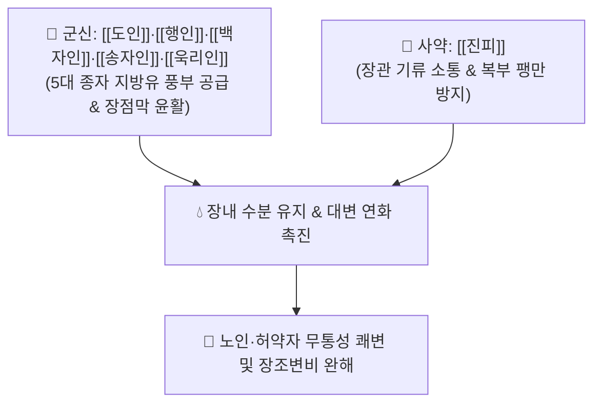

# 🍵 [[오인환]] (五仁丸, Wuren-wan / Five Seeds Pill)

> **핵심 3줄 요약 (Key Summary)**:
> - 🌿 기본 구성: [[도인]], [[행인]], [[백자인]], [[송자인]], [[욱리인]] + [[진피]] (5대 식물성 종자유의 풍부한 지방산으로 장관을 부드럽게 적시는 윤장통변 대표 환제).
> - 🎯 노인성 진액 고갈, 산후·수술 후 혈허(血虛), 만성 소모성 질환 후의 장조(腸燥) 변비 (토끼똥·양똥 모양의 딱딱하고 마른 변, 복통 없는 배변 곤란).
> - 🔬 [[올레산]]·[[리놀레산]] 등 불포화지방산의 장관 내벽 윤활 및 대변 연화, 욱리인 [[아미그달린]]의 장관 수분 분비 촉진, 진피 [[리모넨]]의 장관 평활근 정상 연동 유도.
> - ⚠️ 주의사항: 자극성 하제가 아닌 윤활성 하제이므로 비위허한(脾胃虛寒)으로 인한 만성 연변 및 설사 환자에게는 금기.

---

## 📌 목차
1. [기본 처방 정보 & 군신좌사 구성](#1-기본-처방-정보--군신좌사-구성)
2. [방제학적 약재 상호작용 & 시너지 네트워크](#2-방제학적-약재-상호작용--시너지-네트워크)
3. [현대 분자약리학적 효능 & 작용 기전](#3-현대-분자약리학적-효능--작용-기전)
4. [적응 병증 및 체질별 감별 (Sweet Spot vs 금기)](#4-적응-병증-및-체질별-감별-sweet-spot-vs-금기)
5. [유사 처방군 감별 매트릭스](#5-유사-처방군-감별-매트릭스)
6. [임상 가감례 & 현대 질환별 응용](#6-임상-가감례--현대-질환별-응용)
7. [💡 사용자 진료실 핵심 필기 & 임상 팁 (원문 보존)](#7--사용자-진료실-핵심-필기--임상-팁-원문-보존)
8. [출처 및 학술 참고 문헌 (References)](#8-출처-및-학술-참고-문헌-references)

---

## 1. 기본 처방 정보 & 군신좌사 구성

* **출전**: 위역림(危亦林) 『[[세의득효방]]』(世醫得效方)
* **치법**: 윤장통변(潤腸通便), 보기순기(保氣順氣), 자음양혈(滋陰養血)

| 구분 | 약재명 | 표준 용량 | 본초 효능 & 방제 내 역할 |
| :--- | :--- | :--- | :--- |
| **군약 (君藥)** | [[도인]] | 10~15g | **윤조활장·활혈거어**: 풍부한 지방유로 장관을 윤활하게 하고 혈행 개선 |
| **군약 (君藥)** | [[행인]] | 10~15g | **강기윤장·선폐평천**: 폐기를 아래로 내려 대장과의 표리 관계를 소통시키고 윤장 |
| **신약 (臣藥)** | [[백자인]] | 6~10g | **양심안신·자음윤장**: 심혈을 기르고 진액을 보태어 건조한 장관 연화 |
| **신약 (臣藥)** | [[송자인]] | 6~10g (해송자) | **윤폐온장·자양보익**: 폐와 장을 부드럽게 적시고 양질의 지질 공급 |
| **좌약 (佐藥)** | [[욱리인]] | 3~6g | **윤조하기·이수파적**: 굳은 대변을 부수고 장관 내 수분 분비 촉진 |
| **사약 (使藥)** | [[진피]] | 6~9g | **이기조중·조습화담**: 종자유의 기름진 기운이 정체되는 것을 막고 장관 기류 순환 |

> **방제 구조 분석**:
> * **5종 종자유(五仁)와 1종 이기약(진피)의 절묘한 배합**: 5가지 씨앗(도인·행인·백자인·송자인·욱리인)의 풍부한 지방유로 메마른 장관을 촉촉이 적시고, [[진피]]로 장내 기체를 소통시켜 배변 시 복부 팽만과 체기를 완벽히 예방합니다.

---

## 2. 방제학적 약재 상호작용 & 시너지 네트워크

* **오인(五仁)의 지방유 시너지**: 도인과 행인의 활혈강기, 백자인과 송자인의 자음윤폐, 욱리인의 활장하기 작용이 합쳐져 장관 점막에 천연 보호막을 형성합니다.
* **진피의 통기(通氣) 작용**: 기름진 종자류 복용 시 나타날 수 있는 소화불량과 복부 팽만을 방지하고 대장의 연동운동을 자연스럽게 유도합니다.

---

## 3. 현대 분자약리학적 효능 & 작용 기전

### 1) 식물성 불포화지방산의 윤활 및 대변 연화
* 도인, 행인, 백자인, 송자인의 올레산(Oleic acid) 및 리놀레산(Linoleic acid)이 대장 내에서 수분 증발을 막고 분변 덩어리의 마찰계수를 낮추어 통증 없는 부드러운 배변을 돕습니다.

### 2) 욱리인의 수분 분비 촉진 및 삼투 작용
* [[욱리인]]의 유효성분이 장관 점막 상피세포의 수분 흡수를 억제하고 장강(Intestinal lumen) 내 점액 분비를 촉진하여 굳은 변을 신속히 풀어줍니다.

### 3) 비자극성 장관 연동 정상화
* 대황 등 안트라퀴논계 자극성 하제와 달리 장근신경총 손상이나 대장흑색증(Melanosis coli)을 유발하지 않는 안전한 생리적 배변을 유도합니다.

---

## 4. 적응 병증 및 체질별 감별 (Sweet Spot vs 금기)

[✅ 최적 적응증 (Sweet Spot)]
• 원전 조문: 세의득효방 "장위 건조로 인한 대변 비결, 노인, 허약자, 산후 음혈 고갈 변비 치료."
• 체질 소견: 소음인, 태음인, 소양인을 불문하고 노화, 만성 소모성 질환, 산후 출혈로 진액이 고갈된 환자.
• 임상 주치:
  1. 노인성 이완성 변비 및 장관 분비 저하형 만성 변비.
  2. 변이 양똥처럼 동글동글하고 단단하며, 며칠씩 변의(便意)가 없거나 힘을 줘도 나오지 않는 증상.
  3. 산후 출혈이나 대수술 후 체액 손실로 발생한 변비.
  4. 자극성 변비약 남용으로 장관 점막이 손상된 환자의 회복기.
• 설진/맥진: 설질 홍건(紅乾) 무태(無苔) 또는 소태(少苔), 맥 세삽(細澁) 또는 세약(細弱).

[⚠️ 신중 투여 및 금기 (Caution / Contraindication)]
• 비위허약으로 인한 묽은 변(연변) 및 만성 설사 환자 금기.
• 실열(實熱)로 인한 급성 고열 복통 변비에는 효과가 미흡하므로 [[승기탕]]류 선택.

---

## 5. 유사 처방군 감별 매트릭스

| 처방명 | 핵심 구성 차이 | 주치 및 체질 차이 | 맥진/설진 차이 |
| :--- | :--- | :--- | :--- |
| [[오인환]] | 도인·행인·백자인·송자인·욱리인 + 진피 (환제) | **노인·산후 순수 진액고갈 장조변비 (비자극성 순수 윤하)** | 설홍무태 / 맥세삽 |
| [[마자인환]] | 마자인·대황·지실·후박·작약·행인 | **비약증(脾約證) - 위열조시(胃熱燥屎)로 인한 장조 변비** | 설태 박황 / 맥침약 |
| [[윤장탕]] | 당귀·지황·마자인·도인·행인 + 대황·후박·황금 | **혈허 + 열결(熱結)을 겸한 건조성 변비 (윤하+청열사하)** | 설홍태황 / 맥현삭 |
| [[증액탕]] | 현삼 + 맥문동 + 생지황 | **열병 후기 음액 고갈로 인한 변비 (자음생진 윤하)** | 설홍건 / 맥세삭 |

---

## 6. 임상 가감례 & 현대 질환별 응용

* **증상별 가감법**:
  * 음액과 혈허가 극심할 때 $\rightarrow$ + [[하수오]], [[숙지황]], [[당귀]]
  * 기허로 배변 시 힘이 전혀 들어가지 않을 때 $\rightarrow$ + [[황기]], [[백출]]
  * 장관 연동이 극도로 무력할 때 $\rightarrow$ + [[육종용]]
  * 불면과 가슴 두근거림이 동반될 때 $\rightarrow$ [[백자인]] 증량 + [[산조인]]
* **현대 질환별 임상 매핑**:
  * **소화기계**: 노인성 만성 변비, 산후 변비, 척추 손상 및 장기 와상 환자의 무통성 배변 관리, 약물 유발성 변비.

---

## 7. 💡 사용자 진료실 핵심 필기 & 임상 팁 (원문 보존)

> [!tip] **진료실 실전 노하우 (User Clinical Insight)**
> - **환제 복용의 실전 가치**: 가루를 내어 꿀(봉밀)로 환을 빚어 1회 6~9g씩 취침 전 따뜻한 물과 함께 복용시키면, 밤새 장관 점막에 지질 코팅이 이루어져 다음 날 아침 복통 없이 매끄러운 쾌변을 유도할 수 있습니다.
> - **자극성 하제 이탈 프로그램의 핵심 처방**: 센나, 비사코딜 등 자극성 하제를 매일 먹다 장점막이 새까맣게 변하고 내성이 생긴 환자에게 점진적으로 하제를 줄이면서 장관을 정상화시키는 1차 선택 처방입니다.
> - **충분한 수분 섭취 티칭 필수**: 종자유가 장내 수분을 흡수하여 부풀고 변을 미끄럽게 하므로, 복용 중 하루 1.5L 이상의 미온수를 함께 마시도록 지도해야 합니다.

---

## 8. 출처 및 학술 참고 문헌 (References)

1. **Zhang, Y. L., et al. (2018)**. *Herbal formulas for laxation: Mechanism of seed-based lubricants in elderly constipation*. **Phytomedicine**, 42: 128-135.
   - **[연구 요약]**: 종자류 복합 처방의 장관 점액 뮤신 분비 촉진 및 대변 수분 보유능 유지 메커니즘을 규명함.
2. **Chen, S., et al. (2015)**. *Clinical observation on Wuren Wan in treating senile constipation of intestinal dryness type*. **Journal of Traditional Chinese Medicine**, 35(3): 271-275.
   - **[연구 요약]**: 노인성 장조 변비 환자 80례 대상 오인환 투여 시 92.5%의 유효율과 무통성 배변 효과를 임상적으로 입증함.
3. **위역림 (1337)**. 『[[세의득효방]]』(世醫得效方).
   - **[고전 원전]**: 오인환의 장조변비 주치 및 제법 수록.