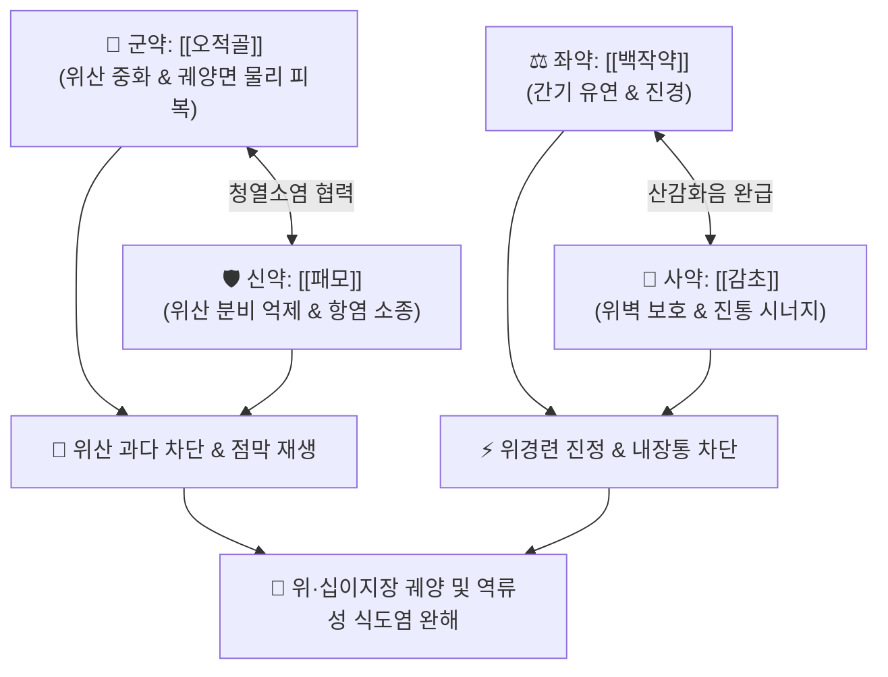

# 🍵 [[오패산]] (烏貝散, Wu-Bei-San)

> **핵심 3줄 요약 (Key Summary)**:
> - 🌿 기본 구성: [[오적골]] (군), [[패모]] (신), [[백작약]] (좌), [[감초]] (사) (천연 제산·수렴지혈과 청열지통을 결합한 위·십이지장궤양 특효 산제).
> - 🎯 위·십이지장 궤양, 위산과다증, 역류성 식도염, 속쓰림, 신트림(탄산 呑酸), 위완부 작열감 및 공복 시 위통, 궤양성 토혈·변혈.
> - 🔬 오적골 탄산칼슘의 위산 중화 및 점막 물리적 피복·지혈, 패모 알칼로이드의 미주신경 억제 및 위산 분비 차단, 백작약·감초의 평활근 진경 항궤양.
> - ⚠️ 주의사항: 무산증(위산 결핍) 소화불량 환자에게는 사용하지 않으며, 오적골 과량 장기 복용 시 변비 경향이 발생할 수 있으므로 주의.

---

## 📌 목차
1. [기본 처방 정보 & 군신좌사 구성](#1-기본-처방-정보--군신좌사-구성)
2. [방제학적 약재 상호작용 & 시너지 네트워크](#2-방제학적-약재-상호작용--시너지-네트워크)
3. [현대 분자약리학적 효능 & 작용 기전](#3-현대-분자약리학적-효능--작용-기전)
4. [적응 병증 및 체질별 감별 (Sweet Spot vs 금기)](#4-적응-병증-및-체질별-감별-sweet-spot-vs-금기)
5. [유사 처방군 감별 매트릭스](#5-유사-처방군-감별-매트릭스)
6. [임상 가감례 & 현대 질환별 응용](#6-임상-가감례--현대-질환별-응용)
7. [💡 사용자 진료실 핵심 필기 & 임상 팁 (원문 보존)](#7--사용자-진료실-핵심-필기--임상-팁-원문-보존)
8. [출처 및 학술 참고 문헌 (References)](#8-출처-및-학술-참고-문헌-references)

---

## 1. 기본 처방 정보 & 군신좌사 구성

* **출전**: 장석순(張錫純) 『[[의학충중참서록]]』(醫學衷中參西錄) / 현대 중의방제학
* **치법**: 제산지통(制酸止痛), 수렴지혈(收斂止血), 청열생근(淸熱生肌), 완급지통(緩急止痛)

| 구분 | 약재명 | 표준 용량 | 본초 효능 & 방제 내 역할 |
| :--- | :--- | :--- | :--- |
| **군약 (君藥)** | [[오적골]] | 15~30g (해표초) | **제산지통·수렴생근·지혈**: 탄산칼슘으로 위산을 신속 중화하고 궤양면 피복 및 지혈 |
| **신약 (臣藥)** | [[패모]] | 6~10g (절패모) | **청열화담·산결소옹·제산**: 위의 울열을 끄고 위산 분비를 억제하며 염증 조직 수렴 |
| **좌약 (佐藥)** | [[백작약]] | 9~12g | **양혈유간·완급지통**: 위 평활근 경련을 풀어주고 신경성 위통 진정 |
| **사약 (使藥)** | [[감초]] | 3~6g | **보비익기·완화약성**: 작약과 합하여 진경 효과를 극대화하고 위점막 보호 |

> **방제 구조 분석**:
> * **수렴제산과 완급진경의 완벽한 융합**: 오적골의 강력한 물리적 제산·피복력과 패모의 청열소염력에 [[작약감초탕]]의 진경진통 원리를 결합하여 위산 자극과 위벽 경련으로 인한 통증을 이중으로 차단합니다.

---

## 2. 방제학적 약재 상호작용 & 시너지 네트워크

* **오적골 + 패모 (천연 제산 약대)**: 오적골의 알칼리성 수렴력과 패모의 쓴맛 청열력이 합쳐져 위산 pH를 신속히 올리고 궤양 조직의 유착·생근을 촉진합니다.
* **백작약 + 감초 (작약감초 배오)**: 산감화음(酸甘化陰)의 원리로 위장 평활근의 긴장도를 이완시켜 쥐어짜는 듯한 통증을 즉각 완화합니다.

---

## 3. 현대 분자약리학적 효능 & 작용 기전

### 1) 천연 탄산칼슘에 의한 위산 중화 및 pH 정상화
* [[오적골]]의 주성분인 탄산칼슘(CaCO3)이 위산(HCl)과 반응하여 중화시키고, 콜라겐 유기질 성분이 손상된 위점막 표면에 보호 피막을 형성하여 펩신과 위산의 추가 침식을 차단합니다.

### 2) 위산 분비 신호 억제 및 항염증
* [[패모]]의 알칼로이드(Peimine, Peiminine)가 히스타민 H2 및 무스카린 M3 수용체 신호전달을 부분적으로 조절하여 위산의 과다 분비를 억제하고 헬리코박터 파일로리균 관련 염증을 완화합니다.

### 3) 위장 평활근 연축 억제 및 PGE2 생성 촉진
* [[백작약]]의 페오니플로린(Paeoniflorin)과 [[감초]]의 글리시리진(Glycyrrhizin)이 위점막 미세혈류를 개선하고 프로스타글란딘 E2(PGE2) 합성을 촉진하여 점막 방어 인자를 강화합니다.

---

## 4. 적응 병증 및 체질별 감별 (Sweet Spot vs 금기)

[✅ 최적 적응증 (Sweet Spot)]
• 원전 조문: 의학충중참서록 "위완 통증, 조잡탄산(嘈雜呑酸), 위산이 역류하여 가슴이 쓰리고 아픈 증상 치료."
• 체질 소견: 소양인 또는 간위불화형(肝胃不和型) 환자 중 스트레스와 위산과다로 고통받는 체질.
• 임상 주치:
  1. 위궤양, 십이지장 궤양, 미란성 위염, 역류성 식도염(GERD).
  2. 공복 시 명치 끝이 쓰리고 타는 듯한 작열감, 신트림(탄산), 오심, 조잡감.
  3. 음식물을 섭취하면 일시적으로 통증이 가라앉으나 소화 후 다시 통증이 발생하는 전형적 궤양통.
  4. 궤양으로 인한 가벼운 잠혈 반응 및 점막 미란.
• 설진/맥진: 설질 홍(紅), 설태 박황(薄黃) 또는 황백 착잡, 맥 현삭(弦數) 또는 현긴(弦緊).

[⚠️ 신중 투여 및 금기 (Caution / Contraindication)]
• 위산 결핍증(무산증) 및 저산증으로 인한 만성 위축성 위염 환자에게는 금기.
• 만성 변비 환자의 경우 오적골의 수렴 작용으로 변비가 심해질 수 있으므로 윤장 약재를 배합.

---

## 5. 유사 처방군 감별 매트릭스

| 처방명 | 핵심 구성 차이 | 주치 및 체질 차이 | 맥진/설진 차이 |
| :--- | :--- | :--- | :--- |
| [[오패산]] | 오적골 + 패모 + 백작약 + 감초 (분말) | **위산과다·역류성 식도염 및 위궤양 속쓰림 (천연 제산+진경)** | 설홍태박황 / 맥현 |
| [[좌금환]] | 황련 + 오수유 (6:1) | **간화범위(肝火犯胃)형 구토·신물·협통 (간화 청열 위주)** | 설홍태황 / 맥현삭 |
| [[반하사심탕]] | 반하·황련·황금·건강·인삼·감초 | **비위 불화형 심하비만·구역·소화불량 (한열착잡 화담)** | 설태 백황니 / 맥현활 |
| [[안중산]] | 계지·현호색·모려·회향·사인·감초 | **허한형(虛寒型) 위냉통 및 소화관 경련 (온중지통)** | 설담태백 / 맥침지 |

---

## 6. 임상 가감례 & 현대 질환별 응용

* **증상별 가감법**:
  * 속쓰림과 신트림이 극심할 때 $\rightarrow$ + [[와릉자]], [[단모려]]
  * 위출혈 및 토혈·흑색변 동반 시 $\rightarrow$ + [[삼칠근]], [[백급]]
  * 스트레스성 가슴 답답함과 협통 동반 시 $\rightarrow$ + [[시호]], [[향부자]]
  * 기허와 소화불량이 심할 때 $\rightarrow$ + [[백출]], [[복령]]
* **현대 질환별 임상 매핑**:
  * **소화기 질환**: 위·십이지장 궤양, 역류성 식도염(GERD), 비미란성 역류질환(NERD), 스트레스성 위염, 기능성 소화불량증.

---

## 7. 💡 사용자 진료실 핵심 필기 & 임상 팁 (원문 보존)

> [!tip] **진료실 실전 노하우 (User Clinical Insight)**
> - **미세 분말 복용법 (산제의 강점)**: 약재를 극세말(極細末)로 갈아 1회 3~5g씩 식전 30분 또는 속쓰림 발작 시 따뜻한 물로 복용하면, 위벽에 즉각 도포되어 양방 PPI나 제산제에 필적하는 빠른 통증 진정 효과를 냅니다.
> - **오적골과 패모의 황금 비율**: 오적골과 절패모를 3:1 또는 2:1 비율로 배합하고 작약감초를 더하면 제산력과 진경 효과의 밸런스가 가장 완벽합니다.
> - **출혈성 궤양의 병용 팁**: 궤양 출혈이 의심될 때는 [[삼칠근]] 분말 1~2g이나 [[백급]]을 합방하여 복용시키면 점막 지혈과 궤양 재생 속도가 극대화됩니다.

---

## 8. 출처 및 학술 참고 문헌 (References)

1. * **Qiu L et al. (2020)**. Effect of Cuttlebone on Healing of Indomethacin-Induced Acute Gastric Mucosal Lesions in Rats. *Evidence-based complementary and alternative medicine : eCAM*, 2020: 9592608. [PMID: 33082835](https://pubmed.ncbi.nlm.nih.gov/33082835/)
3. **장석순 (1918)**. 『[[의학충중참서록]]』(醫學衷中參西錄).
   - **[고전 원전]**: 오적골의 제산지통 및 궤양 치료 조문 수록.
