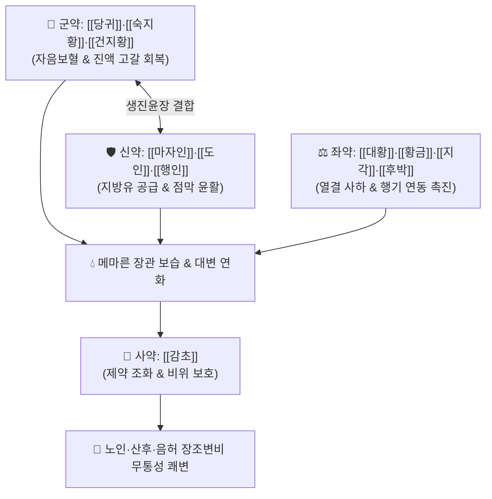

# 🍵 [[윤장탕]] (潤腸湯, Run-Chang-Tang / Juncho-to)

> **핵심 3줄 요약 (Key Summary)**:
> - 🌿 기본 구성: [[당귀]]·[[숙지황]]·[[건지황]] (자음양혈), [[마자인]]·[[도인]]·[[행인]] (윤장활변), [[지각]]·[[후박]] (행기제만), [[대황]]·[[황금]] (청열사하), [[감초]] (사).
> - 🎯 혈허(血虛) 및 진액 고갈과 대장 열결(熱結)이 결합된 노인·허약자·산후의 장조(腸燥) 변비 (단단하고 마른 변, 복부 팽만, 피부 건조, 구갈).
> - 🔬 CFTR 염화물 이온 통로 활성화 및 장관 수분 분비 촉진, 종자유 지방산에 의한 점막 윤활, 센노사이드의 연동 운동 촉진, 후박의 장점막 술잔세포(Goblet cell) 점액 분비 및 수분 배출 조절.
> - ⚠️ 주의사항: 대황과 황금이 포함된 공보겸시(攻補兼施) 처방이므로 비위허한(脾胃虛寒)으로 인한 무른 변 및 임산부 신중 투약.

---

## 📌 목차
1. [기본 처방 정보 & 군신좌사 구성](#1-기본-처방-정보--군신좌사-구성)
2. [방제학적 약재 상호작용 & 시너지 네트워크](#2-방제학적-약재-상호작용--시너지-네트워크)
3. [현대 분자약리학적 효능 & 작용 기전](#3-현대-분자약리학적-효능--작용-기전)
4. [적응 병증 및 체질별 감별 (Sweet Spot vs 금기)](#4-적응-병증-및-체질별-감별-sweet-spot-vs-금기)
5. [유사 처방군 감별 매트릭스](#5-유사-처방군-감별-매트릭스)
6. [임상 가감례 & 현대 질환별 응용](#6-임상-가감례--현대-질환별-응용)
7. [💡 사용자 진료실 핵심 필기 & 임상 팁 (원문 보존)](#7--사용자-진료실-핵심-필기--임상-팁-원문-보존)
8. [출처 및 학술 참고 문헌 (References)](#8-출처-및-학술-참고-문헌-references)

---

## 1. 기본 처방 정보 & 군신좌사 구성

* **출전**: 이천(李梴) 『[[의학입문]]』(醫學入門) / 『[[만병회춘]]』(萬病回春)
* **치법**: 자음양혈(滋陰養血), 윤장통변(潤腸通便), 행기청열(行氣淸熱), 공보겸시(攻補兼施)

| 구분 | 약재명 | 표준 용량 | 본초 효능 & 방제 내 역할 |
| :--- | :--- | :--- | :--- |
| **군약 (君藥)** | [[당귀]] | 6~9g | **보혈활혈·윤장통변**: 혈허를 보하고 장관에 혈류와 진액을 공급 |
| **군약 (君藥)** | [[숙지황]] | 6~9g | **자음보혈·생진익수**: 마른 진액을 채우고 신음(腎陰)을 보양 |
| **군약 (君藥)** | [[건지황]] | 6~9g | **자음청열·양혈생진**: 장관의 허열을 끄고 진액을 보충 |
| **신약 (臣藥)** | [[마자인]] | 6~9g | **윤장통변·자음완하**: 풍부한 지방유로 메마른 장관을 윤활하게 적심 |
| **신약 (臣藥)** | [[도인]] | 4~6g | **활혈거어·윤조활장**: 혈맥을 뚫고 장내 분변의 마찰 저항 감소 |
| **신약 (臣藥)** | [[행인]] | 4~6g | **강기윤장·선폐화위**: 폐기를 내려 대장의 배변 운동 유도 |
| **좌약 (佐藥)** | [[후박]] | 4~6g | **행기제만·온중화위**: 복부 가스를 배출하고 장점막 수분 조절 |
| **좌약 (佐藥)** | [[지각]] | 4~6g | **파기소적·관중행기**: 명치와 장관의 기체를 풀어 하행시킴 |
| **좌약 (佐藥)** | [[대황]] | 3~6g (주세) | **청열사하·통부소적**: 장관의 열독과 굳은 조박을 안전하게 배출 |
| **좌약 (佐藥)** | [[황금]] | 4~6g | **청열조습·사폐화**: 상·중초의 열을 내려 대장 건조 방지 |
| **사약 (使藥)** | [[감초]] | 2~4g | **조화제약·완급지통**: 대황의 준열한 약성을 완충하고 비위 보호 |

> **방제 구조 분석**:
> * **공보겸시(攻補兼施)와 윤조청열(潤燥淸熱)의 조화**: 당귀·숙지황·건지황의 자음보혈(보)과 마자인·도인·행인의 윤장활변(윤), 대황·황금의 청열사하(공), 후박·지각의 행기통부(통)가 어우러져 기혈 손상 없이 장조 변비를 해결합니다.

---

## 2. 방제학적 약재 상호작용 & 시너지 네트워크

* **보음약 + 윤장약 (수분 보충)**: 지황·당귀로 혈액과 진액을 만들고, 마자인·도인·행인으로 장벽에 기름칠을 하여 딱딱한 변을 부드럽게 감쌉니다.
* **행기약 + 사하약 (연동 촉진)**: 지각·후박으로 장관 가스를 몰아내고 대황·황금으로 장열을 씻어내어 막힌 변을 아래로 밀어냅니다.

---

## 3. 현대 분자약리학적 효능 & 작용 기전

### 1) CFTR 염화물 이온 채널 활성화 및 장관 수분 분비 촉진
* 윤장탕 구성 성분은 장점막 상피세포의 **CFTR(Cystic Fibrosis Transmembrane Conductance Regulator) 염화물 이온 채널을 활성화**하여 장강(Lumen) 내로 Cl⁻ 및 Na⁺ 이온 이동을 유도하고, 삼투압 차이에 의해 수분을 장관 내로 대량 유입시켜 건조한 대변을 연화시킵니다.

### 2) 장관 점막 윤활 및 연동 운동 증진
* [[도인]], [[행인]], [[마자인]]의 풍부한 식물성 불포화지방산이 장관 내벽을 윤활하게 코팅하여 분변 통과 저항을 줄이며, [[지각]]과 [[대황]](센노사이드)이 아우에르바흐 신경총을 자극하여 둔화된 장관 연동 운동을 항진시킵니다.

### 3) 술잔세포(Goblet Cell) 점액 분비 및 수분 흡수 조절
* [[후박]]의 마그놀롤 성분이 장점막 상피의 염증성 술잔세포 변성을 억제하고, 점액 과다 점조도를 완화하며 생리적 수분 배출을 증진시켜 정상적인 배변 환경을 회복합니다.

![[Pasted image 20240502093956.png|400]]
> [그림 설명: 윤장탕의 장관 점막 수분 분비 및 CFTR 염화물 이온 채널 활성화, 점액 분비 조절을 통한 배변 촉진 기전]

---

## 4. 적응 병증 및 체질별 감별 (Sweet Spot vs 금기)

[✅ 최적 적응증 (Sweet Spot)]
• 원전 조문: 만병회춘 "풍열비결(風熱秘結), 혈허장조(血虛腸燥), 대변비삽(大便秘澁) 치료."
• 체질 소견: 소음인, 태음인, 소양인 중 노화, 만성 소모성 질환, 산후 출혈로 혈허와 장열(腸熱)이 겹친 체질.
• 임상 주치:
  1. 장관이 건조하여 발생하는 만성 변비 (수일간 배변 불가, 양똥 모양의 단단한 변).
  2. 노인성 이완성 변비, 산후 변비, 갱년기 여성의 진액 고갈 변비.
  3. 배변 시 항문 열상(치열) 및 출혈이 동반되는 건조성 변비.
  4. 복부 팽만감, 구갈, 피부 건조증을 동반한 혈허유열(血虛有熱) 환자.
• 설진/맥진: 설질 홍(紅) 또는 담홍(淡紅), 설태 박황(薄黃) 또는 건(乾), 맥 침현세(沈弦細) 또는 세삭(細數).

[⚠️ 신중 투여 및 금기 (Caution / Contraindication)]
• 비위허한(脾胃虛寒)으로 인한 만성 연변 및 설사 환자에게는 절대 금기.
• 대황이 포함되어 있으므로 임산부 및 수유부에게는 용량을 조절하여 신중 투여.

---

## 5. 유사 처방군 감별 매트릭스

| 처방명 | 핵심 구성 차이 | 주치 및 체질 차이 | 맥진/설진 차이 |
| :--- | :--- | :--- | :--- |
| [[윤장탕]] | 당귀·지황 + 마자인·도인·행인 + 대황·황금·지각·후박 | **혈허 + 장조 + 열결 복합 만성 변비 (공보겸시 윤하)** | 설홍건 / 맥세삭 |
| [[오인환]] | 도인·행인·백자인·송자인·욱리인 + 진피 (환제) | **순수 진액 고갈 노인·산후 장조 변비 (무통성 순수 윤하)** | 설홍무태 / 맥세삽 |
| [[마자인환]] | 마자인 + 대황·지실·후박 + 작약·행인 | **위열조시(胃熱燥屎)로 인한 비약증 변비 (사하+윤하)** | 설태 박황 / 맥침약 |
| [[대승기탕]] | 대황 + 망초 + 지실 + 후박 | **양명부실증 극렬 실열변비 (조·만·비·실 4대증 공하)** | 설태 후황건조 / 맥침실 |

---

## 6. 임상 가감례 & 현대 질환별 응용

* **증상별 가감법**:
  * 음액 부족이 심하여 구갈과 피부 건조가 심할 때 $\rightarrow$ + [[현삼]], [[맥문동]]
  * 기허로 인해 배변 시 힘이 들어가지 않을 때 $\rightarrow$ + [[황기]], [[백출]]
  * 복부 가스와 팽만감이 극심할 때 $\rightarrow$ + [[목향]], [[빈랑]]
  * 항문 치열 통증 및 출혈 동반 시 $\rightarrow$ + [[괴화]], [[지유]]
* **현대 질환별 임상 매핑**:
  * **소화기 질환**: 만성 기능성 변비, 노인성 이완성 변비, 산후 변비, 치질·치열 수반 변비, 마약성 진통제(오피오이드) 유발성 변비.

---

## 7. 💡 사용자 진료실 핵심 필기 & 임상 팁 (원문 보존)

> [!tip] **진료실 실전 노하우 (User Clinical Insight)**
> - **장관 건조 변비의 임상 특효방**: 주로 장관 점막이 건조하고 혈허하여 발생하는 변비에 사용하며, 단순 하제 복용 시 배만 아프고 변이 나오지 않던 환자에게 탁월한 윤활 배변을 제공합니다.
> - **약리 작용의 정밀 분석**:
>   1. **CFTR 염화물 이온 채널 활성화**: 수분과 나트륨 이온을 장관 내로 이동시켜 장관 수분량을 증가시킴으로써 변비를 근본적으로 개선합니다.
>   2. **약재별 분담 구조**: [[도인]], [[행인]], [[마자인]]의 풍부한 지방유로 장관 내를 매끄럽게 윤활하고, [[지각]], [[대황]]으로 연동 운동을 증진시키며, [[후박]]으로 술잔 세포로의 변성을 막아 점액 분비를 정상화하고 수분 배출을 촉진합니다 (술잔 세포의 수분 흡수 우세 억제).
> - **복용 팁**: 탕약으로 달여 따뜻하게 복용하며, 변이 정상화되면 점차 복용량을 줄여 장관 자체의 분비 및 연동 기능을 회복하도록 지도합니다.

---

## 8. 출처 및 학술 참고 문헌 (References)

1. * **Oshiro T et al. (2022)**. Associations between intestinal microbiota, fecal properties, and dietary fiber conditions: The Japanese traditional medicine Junchoto ameliorates dietary fiber deficit-induced constipation with F/B ratio alteration in rats. *Biomedicine & pharmacotherapy = Biomedecine & pharmacotherapie*, 152: 113263. [PMID: 35717933](https://pubmed.ncbi.nlm.nih.gov/35717933/)
3. **이천 (1575)**. 『[[의학입문]]』(醫學入門).
   - **[고전 원전]**: 혈허유열 장조변비 및 윤장통변 주치 조문 수록.
