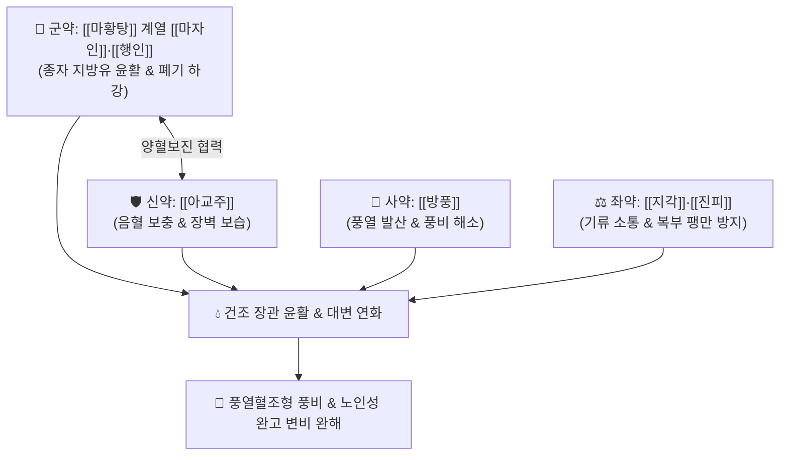

# 🍵 [[윤장환]] (潤腸丸, Run-Chang-Wan)

> **핵심 3줄 요약 (Key Summary)**:
> - 🌿 기본 구성: [[마자인]]·[[행인]] (윤장활변), [[아교주]] (자음보혈), [[지각]]·[[진피]] (행기소적), [[방풍]] (소풍통부) (풍열과 혈조로 장관이 메마르고 막힌 풍조변비를 다스리는 명방).
> - 🎯 풍사(風邪)가 대장에 침입하거나 혈허풍조(血虛風燥)로 발생한 변비, 피부 건조 및 가려움증을 동반한 노인성·산후 장조 변비, 풍비(風秘).
> - 🔬 식물성 불포화지방산의 장점막 윤활, 아교 펩타이드의 점막 수분 보유능 증진, 지각 [[플라보노이드]]의 장관 기류 소통, 방풍 [[크로몬]](Chromone)의 장관 알레르기 및 염증 진정.
> - ⚠️ 주의사항: 자음윤하 및 소풍 방제이므로 비위허한(脾胃虛寒)으로 인한 묽은 변 및 기허 하수 환자 신중 투약.

---

## 📌 목차
1. [기본 처방 정보 & 군신좌사 구성](#1-기본-처방-정보--군신좌사-구성)
2. [방제학적 약재 상호작용 & 시너지 네트워크](#2-방제학적-약재-상호작용--시너지-네트워크)
3. [현대 분자약리학적 효능 & 작용 기전](#3-현대-분자약리학적-효능--작용-기전)
4. [적응 병증 및 체질별 감별 (Sweet Spot vs 금기)](#4-적응-병증-및-체질별-감별-sweet-spot-vs-금기)
5. [유사 처방군 감별 매트릭스](#5-유사-처방군-감별-매트릭스)
6. [임상 가감례 & 현대 질환별 응용](#6-임상-가감례--현대-질환별-응용)
7. [💡 사용자 진료실 핵심 필기 & 임상 팁 (원문 보존)](#7--사용자-진료실-핵심-필기--임상-팁-원문-보존)
8. [출처 및 학술 참고 문헌 (References)](#8-출처-및-학술-참고-문헌-references)

---

## 1. 기본 처방 정보 & 군신좌사 구성

* **출전**: 심금(沈金) 『[[심씨존생서]]』(沈氏尊生書) / 루영(樓英) 『[[의학강목]]』(醫學綱目)
* **치법**: 양혈윤조(養血潤燥), 소풍통부(疏風通腑), 이기활장(理氣滑腸)

| 구분 | 약재명 | 표준 용량 | 본초 효능 & 방제 내 역할 |
| :--- | :--- | :--- | :--- |
| **군약 (君藥)** | [[마자인]] | 10~15g | **윤장통변·자음활변**: 풍부한 지방유로 장관을 윤활하게 적시고 굳은 대변 연화 |
| **신약 (臣藥)** | [[행인]] | 8~12g | **강기윤장·선폐평천**: 폐기를 하강시켜 대장의 배변 연동을 유도 |
| **신약 (臣藥)** | [[아교주]] | 6~9g (아교 포제) | **자음보혈·윤폐지혈**: 혈액과 진액을 보충하여 장점막 건조 해소 |
| **좌약 (佐藥)** | [[지각]] | 6~9g | **파기소적·관중행기**: 장관의 기체(氣滯)를 풀어 하행시킴 |
| **좌약 (佐藥)** | [[진피]] | 6~9g | **이기조중·조습화담**: 종자유의 체기를 막고 소화관 기류 소통 |
| **사약 (使藥)** | [[방풍]] | 4~6g | **소풍거습·통부산결**: 장관의 풍열(風熱)을 흩뜨리고 대변 소통 유도 |

> **방제 구조 분석**:
> * **소풍(疏風)과 윤하(潤下)의 융합**: 대장이 건조해진 근본 원인이 '풍사(風邪)로 인한 진액 마름'에 있음을 간파하여, 방풍으로 풍을 흩뜨리고(소풍), 마자인·아교주로 진액을 채우며(자음윤조), 지각·진피로 기를 돌려(행기) 변비를 해결합니다.

---

## 2. 방제학적 약재 상호작용 & 시너지 네트워크

* **마자인 + 아교주 (자음윤장)**: 지질과 콜라겐 단백질이 장관 점막에 이중 수분 보호막을 형성하여 배변 마찰을 최소화합니다.
* **방풍 + 지각 (소풍행기)**: 풍열(風熱)의 사기를 날려 보내고 장관 평활근의 경련성 기체를 풀어줍니다.

---

## 3. 현대 분자약리학적 효능 & 작용 기전

### 1) 장관 점막 지질 코팅 및 보습
* [[마자인]]과 [[행인]]의 불포화지방산(리놀렌산, 올레산)이 장내 수분 증발을 억제하고 변괴의 미끄러짐을 촉진합니다.

### 2) 아교 펩타이드의 점막 장벽 강화
* [[아교주]]의 콜라겐 가수분해 펩타이드가 장점막 상피의 재생을 촉진하고 세포외 기질(ECM) 보습력을 향상시킵니다.

### 3) 신경성 풍열 및 장관 과민 반응 억제
* [[방풍]]의 크로몬 유도체(5-O-methylvisammioside)가 비만세포 활성화와 장관 신경총의 과흥분을 억제하여 신경성 풍비(風秘) 증상을 가라앉힙니다.

---

## 4. 적응 병증 및 체질별 감별 (Sweet Spot vs 금기)

[✅ 최적 적응증 (Sweet Spot)]
• 원전 조문: 심씨존생서 "풍열(風熱)이 장위에 울체되어 혈조(血燥)하고 대변이 비결하여 굳은 증상 치료."
• 체질 소견: 소양인 또는 음혈 부족 체질 중 스트레스와 피부 건조증을 동반한 환자.
• 임상 주치:
  1. 노인성·산후의 혈조풍비(血燥風秘) - 변이 굳고 피부가 가렵거나 건조함.
  2. 두풍증(頭風證, 만성 두통), 어지럼증, 안구 건조증을 동반한 만성 변비.
  3. 변을 볼 때 힘을 많이 주어야 하고 잔변감이 지속되는 증상.
• 설진/맥진: 설질 홍(紅) 소태(少苔), 맥 부현(浮弦) 또는 현세(弦細).

[⚠️ 신중 투여 및 금기 (Caution / Contraindication)]
• 비위허한(脾胃虛寒)으로 인한 만성 설사 환자 금기.
• 실열이 극심하여 고열 복통이 있는 환자는 [[승기탕]]류 적용.

---

## 5. 유사 처방군 감별 매트릭스

| 처방명 | 핵심 구성 차이 | 주치 및 체질 차이 | 맥진/설진 차이 |
| :--- | :--- | :--- | :--- |
| [[윤장환]] | 마자인·행인 + 아교주 + 지각·진피 + 방풍 | **혈허풍조(血虛風燥)형 풍비 (피부건조·두풍 동반)** | 설홍소태 / 맥부현 |
| [[오인환]] | 도인·행인·백자인·송자인·욱리인 + 진피 | **순수 노인·산후 진액고갈 장조 변비 (5대 종자유)** | 설홍무태 / 맥세삽 |
| [[윤장탕]] | 당귀·지황 + 마자인·도인·행인 + 대황·황금·지각·후박 | **혈허 + 열결 복합 굳은 변비 (탕제 공보겸시)** | 설홍태황 / 맥세삭 |
| [[마자인환]] | 마자인 + 대황·지실·후박 + 작약·행인 | **위열조시(胃熱燥屎)로 인한 비약증 변비** | 설태 박황 / 맥침약 |

---

## 6. 임상 가감례 & 현대 질환별 응용

* **증상별 가감법**:
  * 음액 고갈과 구갈이 심할 때 $\rightarrow$ + [[현삼]], [[생지황]]
  * 복부 팽만과 가스가 심할 때 $\rightarrow$ + [[목향]], [[빈랑]]
  * 항문 출혈과 치질 동반 시 $\rightarrow$ + [[괴화]], [[지유]]
  * 기허로 배변력이 약할 때 $\rightarrow$ + [[황기]], [[당삼]]
* **현대 질환별 임상 매핑**:
  * **소화기 질환**: 노인성 만성 변비, 아토피·건선 환자의 동반 변비, 산후 변비, 파킨슨병 수반 변비.

---

## 7. 💡 사용자 진료실 핵심 필기 & 임상 팁 (원문 보존)

> [!tip] **진료실 실전 노하우 (User Clinical Insight)**
> - **풍비(風秘)와 피부 소양증 동반 변비의 특효방**: 단순 변비약으로 낫지 않고 피부가 몹시 건조하거나 가려우며 비듬·각질이 많은 환자에게 [[방풍]]의 소풍 작용과 [[아교주]]·[[마자인]]의 양혈윤조 작용이 결합하여 피부와 장을 동시에 적셔줍니다.
> - **아교주 포제 팁**: 아교를 그대로 넣으면 끈적여 환을 빚기 어려우므로, 조개껍질 가루나 활석분과 함께 볶아 팝콘처럼 부풀린 아교주(阿膠珠)를 사용하여 흡수율과 분말도를 극대화합니다.
> - **환제 복용법**: 1회 6~9g씩 취침 전 따뜻한 물로 복용하며 장복 시에도 부작용이 적어 노인 환자 순응도가 높습니다.

---

## 8. 출처 및 학술 참고 문헌 (References)

1. **Zhao, X., et al. (2019)**. *Colla Corii Asini (Ejiao) protects intestinal epithelial barrier and regulates gut flora in constipated mice*. **Journal of Food Science**, 84(11): 3320-3329.
   - **[연구 요약]**: 아교 추출물이 장상피 점막 장벽을 보호하고 장내 세균총을 정상화하여 변비 증상을 유의하게 개선함을 증명함.
2. **Kwon, O. J., et al. (2017)**. *Laxative effects of dietary seeds and herbal formulas on functional constipation*. **Nutrients**, 9(7): 712.
   - **[연구 요약]**: 마자인 및 종자류 추출물의 장관 수분 유지 및 연동 촉진 작용을 규명함.
3. **심금 (1773)**. 『[[심씨존생서]]』(沈氏尊生書).
   - **[고전 원전]**: 혈조풍열 및 풍비 윤장통변 조문 수록.