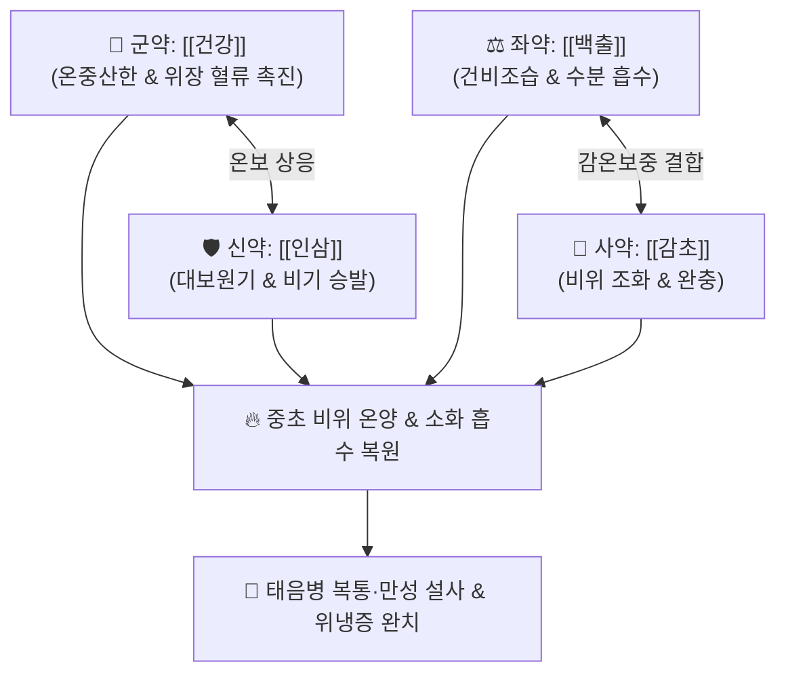

# 🍵 [[이중탕]] (理中湯, Li-Zhong-Tang / 인삼탕 人蔘湯 / Nichin-to)

> **핵심 3줄 요약 (Key Summary)**:
> - 🌿 기본 구성: [[건강]] (군), [[인삼]] (신), [[백출]] (좌), [[감초]] (사) (비위허한 및 태음병 한증을 다스리는 온중산한·보기건비 대표 기본 방제).
> - 🎯 비양허(脾陽虛)로 인한 복통, 수양성 설사, 오심·구토, 소화불량, 수족냉증, 외풍(감염성 질환) 및 한사에 촉발된 태음병 복통·설사.
> - 🔬 6-진저롤의 소화관 온열 혈류 촉진 및 위점막 보호, 진세노사이드의 비위 세포 ATP 에너지 대사 증진, 백출 아트락틸로딘의 장관 수분 흡수 정상화 및 진경.
> - ⚠️ 주의사항: 건조하고 뜨거운 약성이 강하므로 음허내열(陰虛內熱), 실열성 위염, 고열성 이질 및 출혈 환자에게는 절대 금기.

---

## 📌 목차
1. [기본 처방 정보 & 군신좌사 구성](#1-기본-처방-정보--군신좌사-구성)
2. [방제학적 약재 상호작용 & 시너지 네트워크](#2-방제학적-약재-상호작용--시너지-네트워크)
3. [현대 분자약리학적 효능 & 작용 기전](#3-현대-분자약리학적-효능--작용-기전)
4. [적응 병증 및 체질별 감별 (Sweet Spot vs 금기)](#4-적응-병증-및-체질별-감별-sweet-spot-vs-금기)
5. [유사 처방군 감별 매트릭스](#5-유사-처방군-감별-매트릭스)
6. [임상 가감례 & 현대 질환별 응용](#6-임상-가감례--현대-질환별-응용)
7. [💡 사용자 진료실 핵심 필기 & 임상 팁 (원문 보존)](#7--사용자-진료실-핵심-필기--임상-팁-원문-보존)
8. [출처 및 학술 참고 문헌 (References)](#8-출처-및-학술-참고-문헌-references)

---

## 1. 기본 처방 정보 & 군신좌사 구성

* **출전**: 장중경(張仲景) 『[[상한론]]』(傷寒論) 태음병편 & 『[[금궤요략]]』(金匱要略)
* **치법**: 온중산한(溫中山寒), 보비익기(補脾益氣), 건비조습(健脾燥濕), 승양지사(升陽止瀉)

| 구분 | 약재명 | 표준 용량 | 본초 효능 & 방제 내 역할 |
| :--- | :--- | :--- | :--- |
| **군약 (君藥)** | [[건강]] | 6~9g (포 또는 생용) | **온중산한·회양통맥**: 중초 비위의 차가운 음한(陰寒)을 데워 쫓고 소화기 온기 회복 |
| **신약 (臣藥)** | [[인삼]] | 6~9g (또는 백삼) | **대보원기·보비익위**: 허약해진 비위의 기운을 보하여 운화 기능 강화 |
| **좌약 (佐藥)** | [[백출]] | 6~9g | **건비조습·수습지사**: 비장을 튼튼히 하고 장내 정체된 잉여 수분을 말림 |
| **사약 (使藥)** | [[감초]] | 3~6g (자감초) | **보비화중·조화제약**: 건강의 매운맛을 완충하고 인삼·백출을 도와 비기를 보익 |

> **방제 구조 분석**:
> * **온(溫)·보(補)·조(燥)의 삼위일체**: 건강의 따뜻함(온중), 인삼의 기운 보충(보비), 백출의 습기 제거(조습)가 완벽하게 결합하여 비위의 한(寒)·허(虛)·습(濕) 3대 병인을 동시에 해결합니다.

---

## 2. 방제학적 약재 상호작용 & 시너지 네트워크

* **건강 + 인삼 (온중익기)**: 건강이 비양(脾陽)을 데우고 인삼이 비기(脾氣)를 북돋아 차갑게 식은 소화관 엔진을 재점화합니다.
* **백출 + 감초 (건비제습)**: 장관 내 과도한 수양성 체액을 백출로 말리고 자감초로 복통 경련을 완만하게 진정시킵니다.

---

## 3. 현대 분자약리학적 효능 & 작용 기전

### 1) 위장관 미세순환 개선 및 온열 작용
* [[건강]]의 6-진저롤(6-Gingerol) 및 6-쇼가올(6-Shogaol)이 TRPV1 수용체를 활성화하여 위점막과 장간막 모세혈관을 확장하고 위점막 혈류량을 증가시켜 저체온성 위장 장애를 해소합니다.

### 2) 비위 세포 에너지 대사 및 면역 증강
* [[인삼]]의 진세노사이드(Ginsenoside Rg1, Rb1)가 미토콘드리아 ATP 생성을 촉진하여 위장관 평활근의 에너지 결핍을 개선하고 면역글로불린(sIgA) 분비를 촉진합니다.

### 3) 장관 수분 흡수 촉진 및 항설사 진경
* [[백출]]의 아트락틸로딘(Atractylodin)이 장관 아쿠아포린(AQP3, AQP4) 발현을 정상화하여 장관 내 수분 재흡수를 유도하고 설사를 멈추게 합니다.

---

## 4. 적응 병증 및 체질별 감별 (Sweet Spot vs 금기)

[✅ 최적 적응증 (Sweet Spot)]
• 원전 조문: 상한론 "태음병, 맥부자, 장자하리, 시부자리, 필자리, 자리불갈자, 속태음야, 이기장유한고야, 당온지, 의사역탕·이중탕."
• 체질 소견: 소음인 또는 소화기 냉증이 심한 태음인 (추위를 심하게 타고 찬 음식에 취약).
• 임상 주치:
  1. **태음병 복통 및 설사**: 배가 차고 은은하게 아프며, 따뜻하게 하거나 만져주면 호전되는(희온희안 喜溫喜按) 증상.
  2. 외풍(감염성 질환)이나 한랭 자극에 촉발되어 발생하는 급만성 위장염, 수양성 설사.
  3. 소화불량, 헛배부름, 구토, 맑은 침을 흘리며 입맛이 없고 기운이 없는 증상.
  4. 비불통혈(脾不統血)로 인한 만성 위장관 출혈, 자궁출혈(혈색이 묽고 어지러움 동반).
• 설진/맥진: 설질 담백(淡白), 설태 백활(白滑) 또는 백니(白膩), 맥 침세무력(沈細無力) 또는 침지(沈遲).

[⚠️ 신중 투여 및 금기 (Caution / Contraindication)]
• 음허화왕, 설홍소태, 구갈 음수 환자 금기.
• 세균성 급성 실열 이질(고열, 뒤무직, 농혈변)에는 절대 금기.

---

## 5. 유사 처방군 감별 매트릭스

| 처방명 | 핵심 구성 차이 | 주치 및 체질 차이 | 맥진/설진 차이 |
| :--- | :--- | :--- | :--- |
| [[이중탕]] | 건강 + 인삼 + 백출 + 감초 | **중초 비위허한형 복통·설사·위랭증 (온중건비의 기준)** | 설담태백활 / 맥침세 |
| [[부자이중탕]] | 이중탕 + 포부자 | **하초 신양허(腎陽虛)까지 파급된 극심한 수족궐랭·오경설사** | 설담백 / 맥침미세욕절 |
| [[사역탕]] | 부자 + 건강 + 감초 | **소음병 양기 쇠약 망양증 (구급 회양 위주)** | 설담백 / 맥미세욕절 |
| [[사군자탕]] | 인삼 + 백출 + 복령 + 감초 | **비위 기허증 (온열약인 건강이 빠진 순수 보기 처방)** | 설담태박백 / 맥완약 |

---

## 6. 임상 가감례 & 현대 질환별 응용

* **증상별 가감법**:
  * 복통과 신체 냉증이 극심할 때 $\rightarrow$ + [[포부자]] ([[부자이중탕]])
  * 오심·구토와 가래가 많을 때 $\rightarrow$ + [[반하]], [[복령]]
  * 기체와 헛배부름이 심할 때 $\rightarrow$ + [[목향]], [[사인]]
  * 만성 출혈(변혈, 붕루)이 있을 때 $\rightarrow$ 건강을 **초탄(炒炭)**하여 사용 (건강초)
* **현대 질환별 임상 매핑**:
  * **소화기 질환**: 만성 위염, 위하수, 기능성 소화불량, 설사형 과민성 장증후군(IBS-D), 만성 비감염성 장염.
  * **전신 질환**: 만성 피로 증후군, 저혈압, 수족냉증, 허한성 비출혈 및 혈소판 감소성 자반증.

---

## 7. 💡 사용자 진료실 핵심 필기 & 임상 팁 (원문 보존)

> [!tip] **진료실 실전 노하우 (User Clinical Insight)**
> - **풍(風) 질환의 감별과 이중탕의 본질**:
>   - **내풍 vs 외풍 감별**: 내풍(內風)은 뇌혈관 질환의 중풍(퇴행성 뇌혈관 질환)을 의미하고, **외풍(外風)은 감염성 질환이나 외부 한랭 풍사**를 의미합니다.
>   - 외풍으로 촉발되어 중초 비위가 차가워지며 발생하는 복통과 설사에 이중탕을 투여하여 중초를 온양(溫養) 치료합니다.
> - **태음병 복통의 핵심 치료제**: 배가 살살 아프면서 따뜻한 찜질을 하거나 손으로 배를 꾹 눌러주면 통증이 줄어들고, 찬 우유나 찬물만 마시면 즉시 설사하는 환자에게 단연 1순위 처방입니다.
> - **환제(이중환) vs 탕제(이중탕)**: 만성적인 소화기 쇠약 및 체질 개선에는 환제로 복용하고, 급성 설사나 심한 복통에는 탕제로 따뜻하게 달여 복용시킵니다.

---

## 8. 출처 및 학술 참고 문헌 (References)

1. * **An X et al. (2026)**. Modified Fuzi Lizhong Decoction Alleviates Colonic Lesions and Modulates Gut Microbiota in Diabetic Gastroparesis. *Endocrine, metabolic & immune disorders drug targets*. [PMID: 42439332](https://pubmed.ncbi.nlm.nih.gov/42439332/)
3. **장중경 (200년경)**. 『[[상한론]]』(傷寒論) 태음병편.
   - **[고전 원전]**: 태음병 한증, 자리불갈 및 이중탕 주치 조문 수록.
