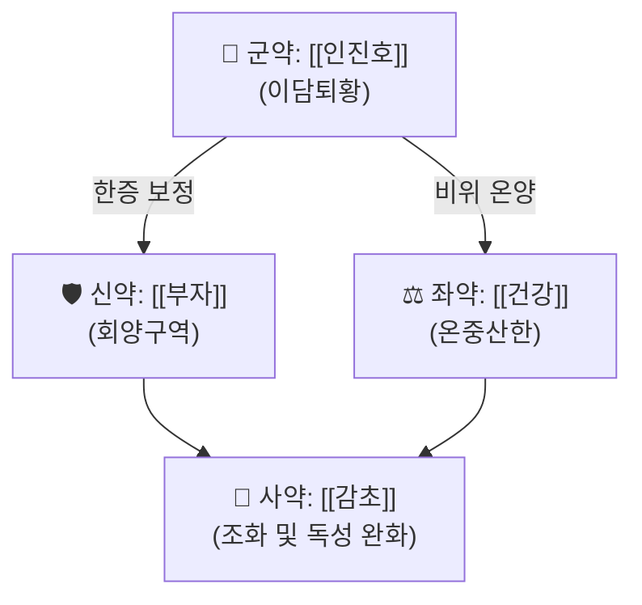

---
aliases:
  - 茵蔯四逆湯
  - Injin-sayeok-tang
tags:
  - 약리
  - 처방
  - 황달
created: 2026-09-21
updated: 2026-09-21
status: complete
title: 인진사역탕
date: 2026-09-21
출처: PMID 26366183
---

# 🍵 [[인진사역탕]] (茵蔯四逆湯)

> **핵심 3줄 요약 (Key Summary)**:
> - 🌿 모체/기원 처방: 『[[동의보감]]』 中統 처방. [[사역탕]](부자·건강·감초)에 [[인진호]]를 더한 구조로, [[인진호탕]]·[[인진오령산]]과 함께 황달 치료 3대 처방군을 이루되 한증(寒證) 전용으로 분화된 처방.
> - 🎯 임상 최적 적응증: 음황(陰黃, 한습형 황달) — 안색이 어둡고 칙칙한 암황색, 사지 궐냉(肢體逆冷), 자한(自汗), 맥침미(脈沈微)를 동반한 비신양허(脾腎陽虛) 병리.
> - 🔬 핵심 분자약리 기전: 군약 [[인진호]]의 간 보호·이담(利膽) 작용에, 좌사약 [[부자]]·[[건강]]의 온양(溫陽)·체온 상승 작용이 더해져 한습(寒濕)으로 정체된 담즙 배설을 온양건비(溫陽健脾)로 촉진한다는 관점이 성립됨.
> - ⚠️ 주의사항: 실열형 양황(陽黃)에는 절대 금기 — 부자·건강의 대열(大熱) 약성이 열증을 조장할 위험. 부자는 반드시 법제(포부자)하여 정량 사용해야 하며, 처방 자체의 현대 임상·약리 연구는 검색 범위 내에서 확인하지 못해(⚠️ 확인 불가) 구성 약재 개별 연구로 대체 서술함을 명시.

---
## 📌 목차
1. [기본 처방 정보 & 구성](#1-기본-처방-정보--구성)
2. [방제학적 약재 상호작용 & 시너지 네트워크](#2-방제학적-약재-상호작용--시너지-네트워크)
3. [현대 분자약리학적 효능 & 작용 기전](#3-현대-분자약리학적-효능--작용-기전)
4. [적응 병증 및 체질별 감별 (Sweet Spot vs 금기)](#4-적응-병증-및-체질별-감별-sweet-spot-vs-금기)
5. [유사 처방군 감별 매트릭스](#5-유사-처방군-감별-매트릭스)
6. [임상 가감례 & 현대 질환별 응용](#6-임상-가감례--현대-질환별-응용)
7. [💡 사용자 진료실 핵심 필기 & 임상 팁 (원문 보존)](#7--사용자-진료실-핵심-필기--임상-팁-원문-보존)
8. [출처 및 학술 참고 문헌 (References)](#8-출처-및-학술-참고-문헌-references)
---
## 1. 기본 처방 정보 & 구성

* **출전**: 『[[동의보감]]』 中統 처방(온리제 계열). 상한론 [[사역탕]]의 부자·건강·감초 골격에 [[인진호]]를 가미한 구조로 알려짐.
* **치법**: 온양건비(溫陽健脾), 화습퇴황(化濕退黃) — 몸을 덥혀 한습(寒濕)으로 정체된 황달을 흩어냄.

| 구분 | 약재명 | 표준 용량 | 본초 효능 & 방제 내 역할 |
| :--- | :--- | :--- | :--- |
| **군약 (君藥)** | [[인진호]] | 1돈(약 3.75g) | 이담퇴황(利膽退黃), 청열이습(淸熱利濕) — 담즙 배설을 촉진하는 황달 전문약 |
| **신약 (臣藥)** | [[부자]](포) | 1돈(약 3.75g) | 회양구역(回陽救逆) — 신양(腎陽)을 북돋아 사지 궐냉을 온양 |
| **좌약 (佐藥)** | [[건강]](포) | 1돈(약 3.75g) | 온중산한(溫中散寒) — 비위를 덥혀 소화 기능을 회복하고 부자의 온양을 보조 |
| **사약 (使藥)** | [[감초]](구) | 1돈(약 3.75g) | 조화제약(調和諸藥), 부자의 독성 완화 및 비위 보호 |

> **배오 특징**: [[인진호]]가 이담퇴황의 방향을 잡되, [[부자]]·[[건강]]의 강한 온양 작용이 더해져 일반적인 청열 위주의 황달 처방([[인진호탕]] 등)과 달리 한증(寒證)으로 기울어진 음황 전용으로 승강출입의 방향이 완전히 반전된 것이 특징입니다.

---
## 2. 방제학적 약재 상호작용 & 시너지 네트워크

* [[인진호]] + [[부자]]·[[건강]] 배오: 청열이습 성질의 인진호 단독으로는 오히려 한증을 악화시킬 수 있는 음황 병리에, 대열(大熱)한 부자·건강을 더해 온양퇴황(溫陽退黃)의 방향으로 전환하는 것이 이 처방의 핵심 묘미.
* [[부자]] + [[감초]] 배오: 부자의 독성(아코니틴류)을 감초의 완화 작용으로 억제하는 상한론 이래의 고전적 배오 원리(구성 약재 개별 문헌에 근거, ⚠️ 처방 전체 수준의 독성 완화 정량 자료는 미확인).

---
## 3. 현대 분자약리학적 효능 & 작용 기전

> ⚠️ 확인 불가: 인진사역탕 처방 자체를 대상으로 한 현대 약리·임상 연구는 검색 범위 내에서 확인하지 못했습니다. 아래는 구성 약재([[인진호]], [[부자]]·[[건강]])에 대한 개별 문헌을 근거로 한 기전적 추론이며, 처방 전체 수준의 실증 자료가 아님을 명시합니다.

### 1) 간 보호·이담 관점([[인진호]] 개별 연구)
* [[인진호]](Artemisia capillaris)의 간질환에 대한 치료적 효과를 종합한 리뷰에서 스코파론(scoparone) 등 지표 성분의 간 보호·이담·항염증 기전이 정리되어 있습니다(PMID 26366183).
### 2) 온양·체온 상승 관점([[부자]]·[[건강]] 병용 개별 연구)
* [[부자]]·[[건강]]·황련 3약 병용이 침 경혈 부위의 직장·피부 온도에 미치는 영향을 관찰한 연구에서, 온리약 병용의 체온 상승(회양) 효과가 실측된 바 있습니다(PMID 29259648).
* [[부자]]·[[건강]]에 당귀를 더한 조합이 고지방식이 마우스의 비알코올성 지방간 및 비진전성 열생성(thermogenesis)에 미치는 영향을 다룬 2025년 최신 연구도 확인됩니다(PMID 41306340) — ⚠️ 음황(황달)이 아닌 지방간 모델 연구로, 간접적 참고 자료임을 명시.
### 3) 음황(陰黃) 전통 주치와의 연계(고전 문헌)
* 본 볼트의 [[인진호]]·[[인진오령탕]]·[[인진호탕]] 노트들이 공통적으로 인진사역탕을 "음황(한습 황달), 안색 암황, 수족궐냉, 맥침미" 치료 처방으로 인용하고 있어, 볼트 내 기존 임상 지식과 정합됨을 확인했습니다.

---
## 4. 적응 병증 및 체질별 감별 (Sweet Spot vs 금기)

[✅ 최적 적응증 (Sweet Spot)]
• 원전 조문: 『동의보감』 "治陰黃 肢體逆冷 自汗"(음황을 치료하니 사지가 차고 저절로 땀이 남)
• 체질 소견: 비신양허(脾腎陽虛) 경향 — 평소 손발이 차고 소화력이 약하며 기운이 없는 환자
• 임상 주치: 음황(陰黃) — 안색 암황(暗黃, 어둡고 칙칙한 황색), 전신 극심한 냉감, 무른 변
• 설진/맥진: 설질 담백(淡白), 맥침미(脈沈微) 또는 맥미세(脈微細)

[⚠️ 신중 투여 및 금기 (Caution / Contraindication)]
• 양황(陽黃, 습열형 황달) 절대 금기 — 안색이 선명한 귤색이고 발열·구갈·변비를 동반하는 실열 병증에는 [[인진호탕]]을 써야 하며, 인진사역탕 오용 시 열증을 조장할 위험
• 부자 독성(아코니틴류) 주의 — 반드시 법제된 포부자를 정량 사용, 심장질환자·임신부는 신중 투여
• 경구약물(간 대사 관련 양약) 병용 시 인진호의 CYP 효소 간섭 가능성에 대한 정량 임상 자료는 확인되지 않음(⚠️ 확인 필요)

---
## 5. 유사 처방군 감별 매트릭스

| 처방명 | 핵심 구성 차이 | 주치 및 체질 차이 | 맥진/설진 차이 |
| :--- | :--- | :--- | :--- |
| **[[인진사역탕]]** | 인진호 + 부자·건강·감초(온리 위주) | **음황(陰黃), 사지궐냉, 자한, 비신양허** | 설담백, 맥침미 |
| [[인진호탕]] | 인진호·치자·대황(청열사하 위주) | 양황(陽黃), 발열·구갈·변비, 습열 실증 | 설홍태황, 맥활삭 |
| [[인진오령탕]] | 인진호 + 오령산(이수삼습 위주) | 습중(濕重) 황달, 소변불리, 부종 경향 | 설태백니, 맥유완 |

> ⚠️ 표 내부에서는 마크다운 열 구분자 파괴를 방지하기 위해 파이프(`|`)가 들어간 링크를 쓰지 않고 순수한 [[처방명]] 단독 형태로만 작성합니다.

---
## 6. 임상 가감례 & 현대 질환별 응용

* **수반 증상별 가감법**:
  * ⚠️ 확인 필요 — 원장님의 실제 임상 가감 경험이 아직 반영되지 않았습니다.
* **현대 질환별 임상 매핑**:
  * **간담도계**: 한습형(비진행성) 황달, 만성 담도 질환에서의 냉증 동반 소화불량 — ⚠️ 임상 확증 단계 아님, 전통 주치 기반 추정
  * **소화기계**: 만성 설사를 동반한 비신양허 병증
  * **내분비/대사**: 저체온 경향을 동반한 만성 피로 상태에서의 온양 보조 활용 가능성(⚠️ 추정)

---
## 7. 💡 사용자 진료실 핵심 필기 & 임상 팁 (원문 보존)

> [!tip] **진료실 실전 노하우 (User Clinical Insight)**
> ⚠️ 내용 검토 필요: 원장님의 기존 메모·필기가 아직 반영되지 않았습니다. 음황 vs 양황 감별 포인트, 인진사역탕 vs [[인진호탕]]/[[인진오령탕]] 선택 기준 등 실전 진료 경험을 추가해 주시면 다빈치가 다음 순찰 시 정리해 드리겠습니다.

---
## 8. 출처 및 학술 참고 문헌 (References)

1. **허준 (1613)**. 『[[동의보감]]』.
   - **[고전 원전]**: "茵蔯四逆湯 治陰黃 肢體逆冷 自汗" 조문 및 인진·부자·건강·감초 각 1전 구성 기록.
2. **Jang E, Kim BJ, Lee KT, et al. (2015)**. *A Survey of Therapeutic Effects of Artemisia capillaris in Liver Diseases*.
   - [PubMed: PMID 26366183](https://pubmed.ncbi.nlm.nih.gov/26366183/) · [DOI: 10.1155/2015/728137](https://doi.org/10.1155/2015/728137) · **Evidence-Based Complementary and Alternative Medicine, 2015, 728137.**
   - **[연구 요약]**: 군약 [[인진호]]의 간질환(황달 포함)에 대한 치료적 효과와 스코파론 등 핵심 성분의 간 보호·이담 기전을 종합한 리뷰.
3. **Yang CH, et al. (2017)**. *The Effects of Natural Chinese Medicine Aconite Root, Dried Ginger Rhizome, and Coptis on Rectal and Skin Temperatures at Acupuncture Points*.
   - [PubMed: PMID 29259648](https://pubmed.ncbi.nlm.nih.gov/29259648/) · [DOI: 10.1155/2017/7250340](https://doi.org/10.1155/2017/7250340) · **Evidence-Based Complementary and Alternative Medicine, 2017, 7250340.**
   - **[연구 요약]**: 신약 [[부자]]·좌약 [[건강]] 등 온리약 병용이 경혈 부위 직장·피부 온도를 상승시킴을 실측 — 회양구역·온중산한 전통 효능의 현대적 근거.
4. **(2025)**. *Herbal Combination of Angelica gigas, Zingiber officinale, and Aconitum carmichaeli Alleviates High Fat Diet-Induced Non-Alcoholic Fatty Liver Disease in Mice Through NRF2-Mediated Regulation of Adipogenesis and Non-Shivering Thermogenesis*.
   - [PubMed: PMID 41306340](https://pubmed.ncbi.nlm.nih.gov/41306340/)
   - **[연구 요약]**: [[건강]]·[[부자]] 조합이 고지방식이 마우스의 비알코올성 지방간 개선과 비진전성 열생성에 미치는 영향을 다룬 최신 연구 — ⚠️ 황달이 아닌 지방간 모델로 간접 참고 자료.

> ⚠️ 확인 불가/추정 표시 총괄: 처방(인진사역탕) 자체 수준의 현대 임상·약리 연구는 검색 범위 내에서 확인하지 못해 구성 약재 개별 문헌으로 대체 서술했음을 3장 서두에 명시했습니다. 진료실 필기·정량 가감례는 미확인 상태입니다. 『동의보감』 원전 조문과 참고문헌 2~4는 모두 실제 확인된 자료입니다.

<!-- 보관 태그(1회용·링크오류, 필요시 복원): 온리제, 음황 -->
