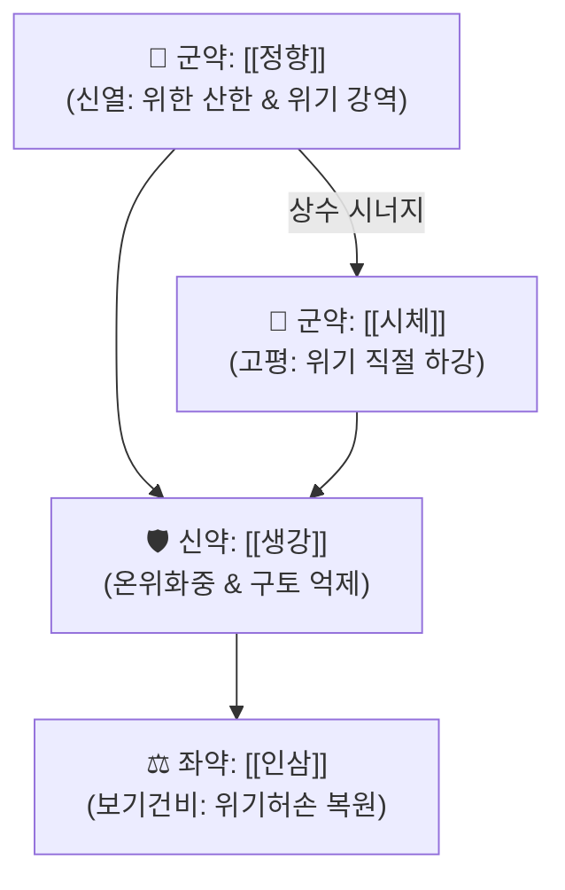

# 🍵 [[정향시체탕]] (丁香柿蒂湯, Dingxiang Shidi Tang)

> **핵심 3줄 요약 (Key Summary)군약 (君藥)군약 (君藥)신약 (臣藥)좌약 (佐藥)** | [[인삼]] (또는 [[당삼]]) | 6g | 익기건비(益氣健脾), 허약해진 비위 원기를 북돋아 재발 방지 |

---

## 2. 방제학적 약재 상호작용 & 시너지 네트워크

* **신온(辛溫)과 고평(苦平)의 협동**:
  * 정향의 맵고 따뜻한 기운이 위의 한기를 날려 보내고, 감꼭지(시체)의 떫고 쓴 기운이 치솟는 위기를 묵직하게 가라앉혀 **한기 제거와 강역(降逆)을 한 번에 완수**.
  * 인삼으로 비위의 허증을 메워주어, 기운이 없어 딸꾹질이 끊이지 않는 본태적 결손을 치료.

---

## 3. 현대 분자약리학적 효능 & 횡격막 경련 진정

* **미주신경-횡격막신경 반사궁 안정화**:
  * 정향의 유제놀(Eugenol) 성분이 위벽 점막의 감각 신경 말단(TRPV1 등)을 진정시키고 횡격막신경([[횡격막신경]])의 불수의적 연축을 차단.
* **위장관 평활근 진경 및 가스 배출**:
  * 시체의 트리테르페노이드 및 탄닌 성분이 장관 평활근의 경련을 억제하고 위 내용물의 십이지장 배출을 촉진.

---

## 4. 적응 병증 및 체질별 감별 (Sweet Spot vs 금기)

### ✅ 최적 적응증 (Sweet Spot)
* **위허유한(胃虛有寒) 딸꾹질**:
  * 딸꾹질 소리가 낮고 둔탁하며 힘이 없고, 며칠 동안 멈추지 않고 연속적으로 발생.
  * 따뜻한 물을 마시면 딸꾹질이 다소 가라앉으나 찬물을 마시면 심해짐.
  * 복부가 차고 식욕이 부진하며 손발이 냉함.
  * 노인성 소모성 질환, 뇌졸중 후유증, 복부 개복 수술 후 발생하는 난치성 딸꾹질.
* **설진 및 맥진**:
  * **설진(舌診)**: 설담태백(舌淡苔白).
  * **맥진(脈診)**: 맥침지(脈沈遲) 또는 맥허약.

### ⚠️ 신중 투여 및 금기 (Caution / Contraindication)
* **위열(胃熱) 딸꾹질 금기**:
  * 딸꾹질 소리가 크고 우렁차며, 입안이 쓰고 냄새가 나며 변비가 있는 실열 환자에게는 정향시체탕을 쓰지 않고 [[승기탕]]이나 [[황련해독탕]]을 사용.

---

## 5. 유사 처방군 감별 매트릭스

| 처방명 | 핵심 구성 | 병인 병기 | 증상 특징 |
| :--- | :--- | :--- | :--- |
| [[정향시체탕]] | 정향, 시체, 생강, 인삼 | 위허유한 (허한) | 소리가 낮고 연속적, 수족랭, 온음 시 호전 |
| [[선복대자탕]] | 선복화, 대자석, 반하, 인삼 | 위허담탁 상역 | 트림(희애), 심하비경, 구토 위주 |
| [[오수유탕]] | 오수유, 생강, 인삼, 대추 | 간위허한 | 두통, 구토, 건구(헛구역질) 위주 |

---

## 6. 임상 가감례 & 현대 질환별 응용

* **수반 증상별 가감법**:
  * 위한이 심하여 복통이 있을 때 $\rightarrow$ + [[육계]], [[오수유]]
  * 비허로 가슴과 배가 답답할 때 $\rightarrow$ + [[진피]], [[반하]]
  * 딸꾹질이 극심하여 멎지 않을 때 $\rightarrow$ + [[침향]], 도인
* **현대 질환 매핑**:
  * 난치성 딸꾹질(Singultus), 항암화학요법 후 딸꾹질 및 오심, 위 마비 및 기능성 소화장애.

---

## 7. 출처 및 학술 참고 문헌 (References)
* Yan YH. *Jisheng Fang* (Formulas for Benefiting Life). 1253.
  * `[연구 요약]`: 정향시체탕 원전 수록, 위한 딸꾹질 치료 방제 제정.
* Liu H, et al. Clinical observation on Dingxiang Shidi Decoction in treating intractable hiccups after stroke. *J Tradit Chin Med*. 2016;36(5):610-614.
  * `[연구 요약]`: 뇌졸중 후 난치성 딸꾹질 환자에서 정향시체탕 투여 시 유효율 93.3% 입증.
