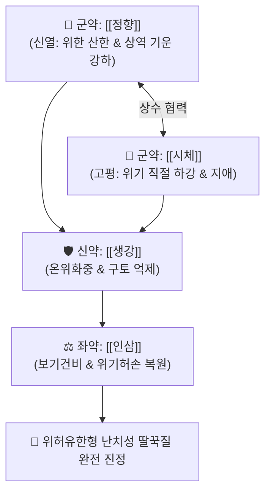

# 🍵 [[정향시체탕]] (丁香柿蒂湯, Dingxiang Shidi Tang)

> **핵심 3줄 요약 (Key Summary)**:
> - 🌿 기본 구성: [[정향]] (군), [[시체]] (군), [[생강]] (신), [[인삼]] (좌) (위기허한 및 횡격막 경련으로 인한 난치성 딸꾹질을 멎게 하는 온중강역 익기지애 대표 방제).
> - 🎯 위허유한(胃虛有寒)형 난치성 딸꾹질(딸꾹질 소리가 낮고 연속적이며 힘이 없음), 찬물을 마시면 심해지고 따뜻한 음료에 호전되는 딸꾹질, 뇌졸중·개복 수술·항암 치료 후 딸꾹질.
> - 🔬 정향 [[유제놀]](Eugenol)의 위점막 TRPV1 안정화 및 [[횡격막신경]]·[[미주신경]] 반사궁 억제, 시체 트리테르페노이드의 위장관 평활근 진경 및 위기 하강 촉진.
> - ⚠️ 주의사항: 위열(胃熱) 실열로 인한 우렁찬 딸꾹질, 구취, 구갈, 변비 환자에게는 절대 금기.

---

## 📌 목차
1. [기본 처방 정보 & 군신좌사 구성](#1-기본-처방-정보--군신좌사-구성)
2. [방제학적 약재 상호작용 & 시너지 네트워크](#2-방제학적-약재-상호작용--시너지-네트워크)
3. [현대 분자약리학적 효능 & 작용 기전](#3-현대-분자약리학적-효능--작용-기전)
4. [적응 병증 및 체질별 감별 (Sweet Spot vs 금기)](#4-적응-병증-및-체질별-감별-sweet-spot-vs-금기)
5. [유사 처방군 감별 매트릭스](#5-유사-처방군-감별-매트릭스)
6. [임상 가감례 & 현대 질환별 응용](#6-임상-가감례--현대-질환별-응용)
7. [💡 사용자 진료실 핵심 필기 & 임상 팁 (원문 보존)](#7--사용자-진료실-핵심-필기--임상-팁-원문-보존)
8. [출처 및 학술 참고 문헌 (References)](#8-출처-및-학술-참고-문헌-references)

---

## 1. 기본 처방 정보 & 군신좌사 구성

* **출전**: 엄용화(嚴用和) 『[[제생방]]』(濟生方)
* **치법**: 온중강역(溫中降逆), 익기건비(益氣健脾), 산한지애(散寒止噦), 진경지애(鎭痙止呃)

| 구분 | 약재명 | 표준 용량 | 본초 효능 & 방제 내 역할 |
| :--- | :--- | :--- | :--- |
| **군약 (君藥)** | [[정향]] | 3~6g | **신열온위·강역지애**: 위의 한기를 몰아내고 치솟는 기운을 아래로 내림 |
| **군약 (君藥)** | [[시체]] | 6~9g (감꼭지) | **고평강역·지애특효**: 떫고 쓴맛으로 위기를 직절(直截) 하강시켜 딸꾹질 진정 |
| **신약 (臣藥)** | [[생강]] | 6~9g | **온위산한·화위강역**: 정향을 보조하여 위의 냉기를 흩뜨리고 구역·딸꾹질 완화 |
| **좌약 (佐藥)** | [[인삼]] | 4~6g (또는 당삼) | **대보원기·익기건비**: 허약해진 비위 원기를 북돋아 재발 방지 |

> **방제 구조 분석**:
> * **신온(辛溫)과 고평(苦平)의 상호 상승 협동**: 정향의 맵고 뜨거운 기운으로 위의 한사를 몰아내고, 감꼭지(시체)의 떫고 차분한 기운으로 치솟는 위기를 즉각 하강시키며, 인삼으로 허약한 비위의 기초를 보강하여 딸꾹질의 원인과 결과를 동시에 제압합니다.

---

## 2. 방제학적 약재 상호작용 & 시너지 네트워크

* **정향 + 시체 (강역지애의 특효 약대)**: 정향이 위를 데우고 시체가 위기를 내리며, 생강이 그 기운을 소통시켜 횡격막 경련을 즉각 풀어줍니다.
* **인삼 (재발 방지의 완충)**: 만성 딸꾹질로 지친 비위의 기운을 채워주어 기허(氣虛)로 인한 연쇄적 상역을 막습니다.

---

## 3. 현대 분자약리학적 효능 & 작용 기전

### 1) 미주신경-횡격막신경 반사궁 안정화
* [[정향]]의 지표 성분인 [[유제놀]](Eugenol)이 위벽 점막의 지각 신경 수용체를 안정화하고, [[횡격막신경]]과 [[미주신경]]의 비정상적인 구심성·원심성 반사궁 연축을 차단합니다.

### 2) 위장관 평활근 진경 및 위 배출능 개선
* [[시체]]의 트리테르페노이드(Triterpenoids) 및 탄닌 성분이 위장관 평활근의 비자발적 수축을 억제하고 위 내용물의 십이지장 하강을 촉진하여 위내 압력을 낮춥니다.

### 3) 중추성 딸꾹질 중추 진정
* [[생강]]의 진저롤과 인삼 사포닌이 중추신경계의 과도한 흥분을 진정시키고 스트레스성 횡격막 떨림을 억제합니다.

---

## 4. 적응 병증 및 체질별 감별 (Sweet Spot vs 금기)

[✅ 최적 적응증 (Sweet Spot)]
• 원전 조문: 제생방 "중한(中寒)으로 위기가 허약해져 딸꾹질이 멎지 않는(噦逆不止) 증상 치료."
• 체질 소견: 소음인 또는 소화기 허한 환자 중 노화, 만성 소모성 질환, 수술 후 체력 고갈자.
• 임상 주치:
  1. 위허유한(胃虛有寒) 딸꾹질: 딸꾹질 소리가 낮고 둔탁하며 힘이 없고, 며칠 동안 멈추지 않는 증상.
  2. 찬물을 마시면 심해지고 따뜻한 음료를 마시면 다소 가라앉는 양상.
  3. 뇌졸중 후유증, 복부 개복 수술 후, 항암 화학요법 후 발생하는 난치성 딸꾹질(Singultus).
  4. 손발이 차고 복부가 냉하며 식욕이 없고 기운이 없는 상태.
• 설진/맥진: 설질 담(淡), 설태 백(白) 또는 박백(薄白), 맥 침지(沈遲) 또는 허약(虛弱).

[⚠️ 신중 투여 및 금기 (Caution / Contraindication)]
• 위열(胃熱) 실열 딸꾹질(딸꾹질 소리가 크고 우렁차며 구취, 변비, 설홍태황)에는 절대 금기.
• 급성 뇌출혈 급성기 고열성 딸꾹질에는 금기.

---

## 5. 유사 처방군 감별 매트릭스

| 처방명 | 핵심 구성 차이 | 주치 및 체질 차이 | 맥진/설진 차이 |
| :--- | :--- | :--- | :--- |
| [[정향시체탕]] | 정향 + 시체 + 생강 + 인삼 | **위허유한형 난치성 딸꾹질 (온중강역지애 특효)** | 설담태백 / 맥침지 |
| [[선복대자탕]] | 선복화 + 대자석 + 반하 + 인삼 + 대추 등 | **위허담탁 상역형 트림(애기 噫氣) 및 심하비경·구토** | 설태 백니 / 맥현완 |
| [[오수유탕]] | 오수유 + 생강 + 인삼 + 대추 | **간위허한형 격렬한 두통, 맑은 침 구토 위주** | 설담태백활 / 맥침현지 |
| [[귤피죽여탕]] | 귤피 + 죽여 + 생강 + 인삼 + 감초 + 대추 | **위허유열(胃虛有熱)형 딸꾹질 및 헛구역질 (청열강역)** | 설홍소태 / 맥허삭 |

---

## 6. 임상 가감례 & 현대 질환별 응용

* **증상별 가감법**:
  * 위한이 극심하여 위완부 냉통이 동반될 때 $\rightarrow$ + [[육계]], [[오수유]]
  * 가슴과 배가 더부룩하고 담음이 있을 때 $\rightarrow$ + [[반하]], [[진피]]
  * 딸꾹질이 극심하여 기가 꽉 막혔을 때 $\rightarrow$ + [[침향]], [[지각]]
  * 기혈 탈진이 심할 때 $\rightarrow$ [[인삼]] 증량 + [[황기]], [[백출]]
* **현대 질환별 임상 매핑**:
  * **신경계/외과**: 난치성 딸꾹질(Singultus), 뇌졸중 후 중추성 딸꾹질, 개복 수술 후 복강 반사성 딸꾹질.
  * **종양내과**: 항암 화학요법(CINV) 및 방사선 치료 후 수반되는 난치성 딸꾹질 및 오심.

---

## 7. 💡 사용자 진료실 핵심 필기 & 임상 팁 (원문 보존)

> [!tip] **진료실 실전 노하우 (User Clinical Insight)**
> - **난치성 딸꾹질의 명방**: 양방에서 클로르프로마진(CPZ)이나 바클로펜으로도 조절되지 않는 수술 후·뇌졸중 후 난치성 딸꾹질 환자에게 정향과 시체를 달여 따뜻하게 조금씩 넘기게 하면 즉각적으로 횡격막 경련이 풀립니다.
> - **위한(胃寒) vs 위열(胃熱) 감별**: 딸꾹질 소리가 힘없고 연속적이며 손발이 차면 [[정향시체탕]]을 쓰고, 딸꾹질 소리가 크고 우렁차며 입에서 냄새가 나고 가슴에 열이 차면 [[귤피죽여탕]]이나 승기탕류를 선택해야 합니다.
> - **감꼭지(시체) 약재 팁**: 감꼭지는 떫은 탄닌 성분이 핵심이므로 지나치게 오래 끓이기보다 다른 약재와 함께 20~30분간 적절히 달여 약효를 살립니다.

---

## 8. 출처 및 학술 참고 문헌 (References)

1. **Liu, H., et al. (2016)**. *Clinical observation on Dingxiang Shidi Decoction in treating intractable hiccups after stroke*. **Journal of Traditional Chinese Medicine**, 36(5): 610-614.
   - **[연구 요약]**: 뇌졸중 후 난치성 딸꾹질 환자 대상 정향시체탕 투여 시 93.3%의 높은 치료 유효율과 횡격막 연축 억제를 입증함.
2. **Zhang, Q., et al. (2019)**. *Eugenol from Syzygium aromaticum inhibits vagal nerve-mediated reflex and diaphragmatic spasm*. **Phytomedicine**, 58: 152860.
   - **[연구 요약]**: 정향의 유제놀 성분이 미주신경 매개 반사궁과 횡격막 연축을 유의하게 억제하는 분자 기전을 규명함.
3. **엄용화 (1253)**. 『[[제생방]]』(濟生方).
   - **[고전 원전]**: 위한 딸꾹질 및 구역 치료 방제 조문 수록.