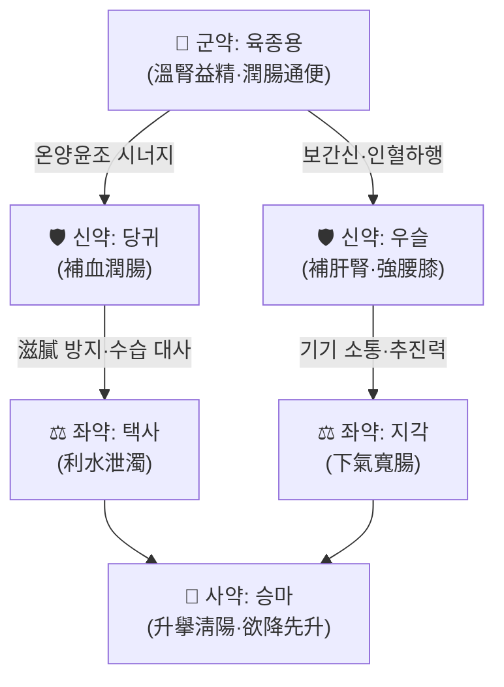

# 🍵 [[제천전]] (濟川煎, Jichuan Jian)

> **핵심 3줄 요약 (Key Summary)**:
> - 🌿 [[경악전서]]의 대표 補潤通便 처방으로, [[육종용]]을 군약으로 [[당귀]]·[[우슬]]이 補血補肝腎하며, [[택사]]·[[지각]]이 下氣利水하고 [[승마]]가 升擧淸陽하여 **"欲降先升"의 승강 조화**를 이루는 溫潤·通補兼施 구조
> - 🎯 腎陽虛·精血不足으로 大腸이 潤澤되지 못해 생긴 **노인성·산후·병후 만성 변비**(소음인·허냉 체질, 小便淸長, 腰膝痠軟, 脈沈細弱)에 최적. 急下가 필요한 實熱燥結에는 부적합
> - 🔬 로페라마이드 유도 서행성 변비(STC) 모델에서 **cAMP/PKA/AQPs 신호경로 조절**, 장내 염증 및 장내세균총 항상성 유지가 보고되었고, 임상 연구에서는 **장내 미생물총 조절**을 통한 STC 개선 효능이 제시됨
> - ⚠️ 주의사항: 實熱燥結·腹滿拒按·舌紅苔黃燥·脈滑實者에게는 升提之性이 해가 될 수 있어 금기. 濕熱下痢·설사자, 急下證(대승기탕 적응)에는 부적합. 우슬·승마 함유로 임신부는 신중 투여. 마약성 진통제·항콜린제 유발 변비에서의 근거는 미확인

---
## 📌 목차
1. [기본 처방 정보 & 군신좌사 구성](#1-기본-처방-정보--군신좌사-구성)
2. [방제학적 약재 상호작용 & 시너지 네트워크](#2-방제학적-약재-상호작용--시너지-네트워크)
3. [현대 분자약리학적 효능 & 작용 기전](#3-현대-분자약리학적-효능--작용-기전)
4. [적응 병증 및 체질별 감별 (Sweet Spot vs 금기)](#4-적응-병증-및-체질별-감별-sweet-spot-vs-금기)
5. [유사 처방군 감별 매트릭스](#5-유사-처방군-감별-매트릭스)
6. [임상 가감례 & 현대 질환별 응용](#6-임상-가감례--현대-질환별-응용)
7. [💡 사용자 진료실 핵심 필기 & 임상 팁 (원문 보존)](#7--사용자-진료실-핵심-필기--임상-팁-원문-보존)
8. [출처 및 학술 참고 문헌 (References)](#8-출처-및-학술-참고-문헌-references)

---
## 1. 기본 처방 정보 & 군신좌사 구성

* **출전**: 장개빈(張介賓, 張景岳) 『[[경악전서]](景岳全書)』 「新方八陣·因陣」
* **치법**: **온신익정(溫腎益精), 윤장통변(潤腸通便), 승강조화(升降調和)**
* **처방명 해석**: 濟는 '건너다/구제하다', 川은 '물길(水)·대장'을 뜻한다. 즉 **대장(川)에 津液을 되돌려 배변을 순조롭게 건너가게 하는 처방**이라는 의미. 景岳은 "凡病涉虛損而大便閉結不通, 則硝黃攻擊等劑必不可用(허손을 겸한 변비에는 硝黃 같은 공격제를 절대 쓸 수 없다)"이라 하며, 瀉下가 아닌 **潤下(윤하)**의 길을 제시했다.

| 구분 | 약재명 | 표준 용량 | 본초 효능 & 방제 내 역할 |
| :--- | :--- | :--- | :--- |
| **군약 (君藥)** | [[육종용]](肉蓯蓉, 주세) | 6~15g | 溫腎益精·潤腸通便. 腎陽을 따뜻하게 하면서 精血을 보하고 대장을 윤택하게 하는 **본 방제의 핵심**. 鹹溫質潤하여 補하면서 滯하지 않음 |
| **신약 (臣藥)** | [[당귀]](當歸) | 9~15g | 補血活血·潤腸通便. 血虛로 津枯한 대장에 血을 채워 潤滑 작용을 담당. 血中氣藥으로 氣血을 함께 조절 |
| **신약 (臣藥)** | [[우슬]](牛膝) | 6~9g | 補肝腎·強筋骨·引血下行. 腎虛腰膝痠軟을 겸治하면서 藥力을 下焦(대장·하지)로 인도 |
| **좌약 (佐藥)** | [[택사]](澤瀉) | 4.5~6g | 利水泄濁·泄腎中相火. 補血藥의 滋膩함을 덜고 小便을 通利하여 大便을 潤하게 하는 反佐 역할 |
| **좌약 (佐藥)** | [[지각]](枳殼) | 3~6g | 下氣寬腸·消積導滯. 腸管 氣滯를 풀어 배변 추진력을 보조 |
| **사약 (使藥)** | [[승마]](升麻) | 1.5~3g | 升擧淸陽·引經. 소량으로 淸陽을 올려 **"欲降先升"**의 원리로 降下之藥을 돕고, 補益之品이 下焦에 머물게 함 |

> **배오 특징**: 원방 용량은 當歸 3錢, 牛膝·肉蓯蓉 各 2錢, 澤瀉 1錢半, 升麻 5分, 枳殼 1錢으로, **補益藥(육종용·당귀·우슬)이 전체의 7할 이상**을 차지한다. 즉 구조적으로 瀉下劑가 아니라 **補劑에 潤下를 얹은 처방**이며, 升麻(升)와 枳殼·우슬·택사(降)의 배합으로 **升降出入의 균형**을 회복시켜, 補而不滯·通而不峻의 성질을 갖는다.

---
## 2. 방제학적 약재 상호작용 & 시너지 네트워크

* **[[육종용]] + [[당귀]] 배오 (相須)**: 補腎陽(육종용)과 補陰血(당귀)이 짝을 이뤄 **精血雙補 → 津液生成 → 大腸潤澤**의 연쇄를 만든다. 景岳이 補陰補陽을 동시에 중시한 溫補學派적 사고가 그대로 반영된 배합으로, 단순 瀉下와 달리 長服해도 正氣를 해치지 않는다.
* **[[육종용]] + [[우슬]] 배오 (相使)**: 下焦 肝腎을 함께 補하면서 藥力을 하부로 引經. 노인 변비에서 동반되는 腰膝痠軟·夜尿頻多·下肢無力을 동시에 겨냥한다.
* **[[당귀]] + [[택사]] 배오 (相制)**: 當歸의 滋潤함이 過하면 脾運을 방해해 오히려 腹脹·納差를 유발할 수 있는데, 澤瀉의 淡滲利水가 이를 상쇄하여 **潤而不膩**하게 만든다.
* **[[지각]] + [[승마]] 배오 (升降 反佐)**: 枳殼은 氣를 내리고 升麻는 陽을 올려, 降中有升의 구조로 腸이 스스로 蠕動할 氣機를 회복시키고 補益藥이 停滯되지 않게 한다. 특히 升麻는 少量만 써서 中氣下陷을 겸한 변비(잔변감·힘주는 배변)에 유효하다.

---
## 3. 현대 분자약리학적 효능 & 작용 기전

### 1) cAMP/PKA/AQPs 신호경로 조절과 장내 수분 항상성
* **Lin L, Jiang Y (2024)** 는 로페라마이드(loperamide)로 유도한 **서행성 변비(Slow Transit Constipation, STC) 랫트 모델**에서 濟川煎이 **cAMP/PKA/AQPs 신호경로**를 통해 변비를 개선한다고 보고하였다.
* 아쿠아포린(Aquaporins, AQPs)은 장 상피세포막의 **수분 통로**로, 대장에서 수분 흡수·분비 균형을 결정하는 핵심 인자다. cAMP/PKA 경로는 이 AQP들의 발현을 조절하는 상위 신호계로 알려져 있으며, 본 연구는 제천전이 이 축을 조절하여 **대장 내강의 수분 잔류량을 증가시키고 배변을 촉진**하는 방향으로 작용함을 시사한다.
* 다만 **구체적으로 어떤 AQP 아형(AQP3/4/8 등)이 몇 배 변화했는지, PKA 인산화 수치가 얼마인지에 대한 정량 데이터는 본 노트 작성 시점에서 초록 범위 내 확인 불가 → 근거 미확인**(원문 확인 필요).

### 2) 장내 염증 항상성(Inflammatory Homeostasis) 유지
* 동일 연구에서 제천전은 STC 모델의 **장내 염증 항상성**을 유지하는 것으로 보고되었다. 변비 상태에서는 장 내용물 정체로 인해 점막 염증성 사이토카인 균형이 흐트러지기 쉬운데, 제천전이 이를 정상 범위로 되돌리는 방향으로 작용한다는 의미이다.
* **TNF-α, IL-6, IL-1β 등 개별 사이토카인의 정확한 증감 방향과 수치는 초록 범위에서 확인되지 않음 → 근거 미확인**.

### 3) 장내세균총(Intestinal Flora) 항상성 및 미생물총 조절
* **Lin L, Jiang Y (2024)**: STC 모델에서 제천전 투여가 **장내세균총 항상성을 유지**하였다고 보고.
* **Xiumin W, Lixia L (2026)**: 濟川煎의 **서행성 변비 치료 효능이 장내 미생물총(gut microbiota) 조절에 초점**을 둔다는 연구가 *J Tradit Chin Med*에 게재됨. 즉 변비 개선 효과의 상당 부분이 **미생물총 구성 변화 → 대사산물 변화 → 장 운동·수분 대사 개선**의 축으로 설명될 수 있음을 시사한다.
* **어떤 문(phylum)/속(genus) 수준 균주가 유의하게 변했는지, Shannon diversity·F/B ratio 등의 정량 지표는 확인 불가 → 근거 미확인**(원문 확인 필요).

### 4) 방제학적 추론 (전통 이론 기반, 분자 기전 직접 검증은 미확인)
* [[육종용]]의 潤腸 기전은 전통적으로 補腎陽 → 大腸 傳導 기능 회복으로 설명되며, 현대적으로는 장 신경총·Cajal 간질세포(ICC) 기능 개선과 연결될 가능성이 제기되나 **본 노트에서 인용 가능한 논문 근거는 없음 → 근거 미확인**.
* [[당귀]]·[[우슬]]의 補血·活血 작용은 장 점막 미세순환 개선과 연관될 수 있으나, 제천전 자체를 대상으로 한 미세순환 연구는 제공 논문에 포함되지 않음.

---
## 4. 적응 병증 및 체질별 감별 (Sweet Spot vs 금기)

**[✅ 최적 적응증 (Sweet Spot)]**
* **원전 조문**: 『[[경악전서]]』 「因陣」 — "凡病涉虛損而大便閉結不通, 則硝黃攻擊等劑必不可用" / 濟川煎은 腎虛津虧·大便不通을 주치하며, 氣虛者 加人參, 有火者 加黃芩, 腎虛者 加熟地黃하라 하였다.
* **체질 소견**:
  * **소음인(少陰人)** — 본 방제의 1순위 적응. 평소 手足冷·小便淸長·疲勞感이 있고 便意는 있으나 힘이 없어 못 보는 유형.
  * **태음인(太陰人)** — 血虛·痰濕을 겸해 대변이 乾燥하면서도 腹滿하지 않고 體力이 떨어지는 중년 이후.
  * 체형은 **마름보다는 보통~약간 비만이나 근긴장도가 낮고 복벽이 무력한 편**, 피부는 乾燥하면서 血色이 蒼白或 萎黃.
  * 少陽人·實熱體質(面赤·口渴·多汗·便祕 硬結)에는 **적합하지 않음**.
* **임상 주치(진료실 최적 적응 양상)**:
  * 노인성 만성 변비, 산후 변비, 병후·수술 후 변비, 産後 血虛便祕
  * 便意는 있으나 배변 시 힘이 들고 **잔변감**, 배변 후 疲勞
  * 대변이 乾燥하되 硬結되어 腹滿拒按할 정도는 아님
  * 동반 증상: 腰膝痠軟, 夜尿頻多, 小便淸長, 頭目眩暈, 耳鳴, 手足冷, 面色蒼白
* **설진/맥진**:
  * **설(舌)**: 舌淡·舌體胖嫩或有齒痕, 苔白潤或薄白. 熱象이 있으면 苔薄黃 정도(이때는 加黃芩 고려)
  * **맥(脈)**: 沈細·沈遲·細弱無力. 滑實·弦緊·洪數은 부적응 지표

**[⚠️ 신중 투여 및 금기 (Caution / Contraindication)]**
* **實熱燥結(양명부실증)**: 腹滿硬痛拒按, 潮熱譫語, 舌紅苔黃燥, 脈滑實 → **금기**. 이 경우는 [[대승기탕]]·[[마자인환]] 등 瀉下劑 적응이며, 濟川煎의 升提·補益之性이 邪를 붙잡아 病情을 악화시킬 수 있다.
* **濕熱下痢·설사**: 변비가 아닌 泄瀉, 裏急後重, 舌苔黃膩者에게는 潤下之劑이므로 부적합.
* **한열(寒熱) 반대 병증**: 口渴·多飮·多尿를 동반한 津液虧耗 중에도 熱象이 뚜렷한 경우, 溫補(육종용)가 助熱할 수 있어 주의.
* **임신부**: [[우슬]]은 하행·자궁흥분 작용 가능성이, [[승마]]는 升提 작용이 있어 **임신 중에는 신중 투여**(임상적 안전성 데이터 근거 미확인).
* **양약 및 타 약물 병용**:
  * 降壓劑·이뇨제와 병용 시 [[택사]]의 利水 작용이 겹쳐 電解質 이상 가능성 → 주의(근거 미확인)
  * 抗凝固劑(와파린 등)와 [[당귀]] 병용 시 출혈 경향 증가 보고가 일반적으로 존재하나, **제천전 자체에 대한 병용 연구는 확인 불가 → 근거 미확인**
  * 阿片類 진통제·抗콜린제 유발 변비에 대한 제천전의 유효성은 **제공 논문에 근거 없음 → 근거 미확인**
* **복용 반응 관찰 포인트**: 투여 후 2~3일 내 排氣 증가·복부 온감·자연스러운 배변 유도가 나타나면 적중. 오히려 腹脹·噁心·식욕저하가 생기면 滋膩過多(당귀·육종용 과량) 또는 證 불일치를 의심하여 減量 또는 加 [[지각]]·[[진피]]·[[사인]].

---
## 5. 유사 처방군 감별 매트릭스

| 처방명 | 핵심 구성 차이 | 주치 및 체질 차이 | 맥진/설진 차이 |
| :--- | :--- | :--- | :--- |
| [[제천전]] | 기준 구성 (육종용·당귀·우슬·택사·지각·승마) | **腎陽虛·精血不足 노인성 만성 변비, 소음인 허냉, 잔변감·腰膝痠軟 동반** | 설담태백·맥침세무력 |
| [[마자인환]] | 麻子仁·芍藥·枳實·大黃·厚朴·杏仁·蜂蜜 (대황 含) | 胃腸燥熱·津液不足의 습관성 변비, 비교적 體力 있는 성인·치열 동반 | 설홍·태박황, 맥활或삭 |
| [[대승기탕]] | 大黃·芒硝·厚朴·枳實 | 陽明腑實의 急下證, 腹滿硬痛拒按, 潮熱. 實證에만 단기 사용 | 설홍·태황조, 맥침실유력 |
| [[온비탕]] | 大黃·附子·乾薑·人參·甘草·當歸·芒硝 | 脾陽虛寒으로 인한 冷積便秘, 腹痛·手足冷이 심함. 攻補兼施 | 설담·태백니, 맥침지 |
| [[반류환]] | 半夏·硫黃 | 노인 虛冷便秘의 고전 처방, 작용이 완만·온조. 濟川煎보다 力이 약함 | 설담·맥지완 |
| [[사물탕]] | 熟地黃·當歸·白芍·川芎 | 血虛 자체가 주병증(변비는 부수), 面色蒼白·眩暈·月經異常 | 설담·맥세삽 |

> ⚠️ 표 내부에서는 마크다운 열 구분자 파괴를 방지하기 위해 파이프(`|`)가 들어간 링크를 쓰지 않고 순수한 [[처방명]] 단독 형태로만 작성합니다.

**핵심 감별 포인트 한 줄 정리**
* **潤 + 補 + 升** → 제천전 (허증 변비, 노인·산후·병후)
* **潤 + 瀉 + 淸** → 마자인환 (조열 변비, 比較的 實證)
* **峻瀉** → 대승기탕 (急下證, 절대 虛證 금기)
* **溫 + 攻** → 온비탕 (한적 변비, 복통 수반)
* **純溫潤** → 반류환 (노인 허냉, 완만)

---
## 6. 임상 가감례 & 현대 질환별 응용

### 원방(원전) 가감법 — 『경악전서』
* **氣虛者** → 但加 [[인삼]](人參) 無礙
* **有火者(熱象 有)** → 加 [[황금]](黃芩)
* **腎虛者** → 加 [[숙지황]](熟地黃)

### 수반 증상별 가감법 (임상 확장)
* **기허 무력·잔변감 심, 배변 시 땀** → + [[인삼]]·[[황기]] (補中益氣 방향)
* **혈허 현저, 面色蒼白·眩暈** → + [[숙지황]]·[[하수오]]·[[백작약]]
* **신양허 冷證, 手足冷·복부냉감** → + [[부자]]·[[건강]] (온비탕 意)
* **기체 복창·噯氣** → + [[목향]]·[[후박]]·[[진피]] (滋膩 방지)
* **燥熱 甚, 口渴·대변 硬結** → + [[맥문동]]·[[현삼]]·[[생지황]] (增液湯 意)
* **치핵·치열로 배변 시 통증·출혈** → + [[괴화]]·[[황금]]·[[지유]]
* **항문직장 무력(골반저 기능저하)** → [[황기]]·[[승마]] 증량, 補中益氣 방향
* **불면·초조(陰血虛 兼)** → + [[산조인]]·[[백자인]]

### 현대 질환별 임상 매핑
* **소화기계**:
  * 만성 기능성 변비(FC), **서행성 변비(Slow Transit Constipation)** — 제공 논문 2편이 직접적으로 다룬 적응
  * 노인성 변비, 치핵·치열·탈항에 수반된 변비(배변 시 과도한 힘주기 방지 목적)
  * 과민성 장증후군 변비형(IBS-C) — 임상적으로 쓰이나 **제천전 특이 근거는 미확인**
* **산부인과**:
  * 산후 변비(血虛+氣虛), 월경통·월경불순을 겸한 변비
  * 임신성 변비 — **신중(우슬·승마)**
* **신경계/노인병**:
  * 파킨슨병·뇌졸중 후 변비, 장기 요양 노인의 습관성 변비 — **제천전 특이 임상 근거는 미확인**
  * 抗콜린劑·阿片類 진통제 유발 변비 — **근거 미확인**
* **기타**:
  * 만성신장질환·투석 환자의 변비(수분 제한 상황) — **근거 미확인**
  * 수술 후 장마비 회복기, 臥床 환자의 변비

---
## 7. 💡 사용자 진료실 핵심 필기 & 임상 팁 (원문 보존)

> [!tip] **진료실 실전 노하우 (User Clinical Insight)**
> - ⚠️ **사용자 원문 필기가 아직 제공되지 않았습니다.** 본 섹션은 템플릿 구조 유지 목적의 자리표시자이며, 원장님의 기존 메모·필기가 입력되는 즉시 **100% 원문 보존 원칙**으로 이 위치에 그대로 옮겨집니다(삭제 금지, 약간의 축소·정리만 허용).
> - 기록 시 권장 항목(템플릿 기준):
>   - 소음인 vs 태음인 등 **체질별 제천전 선택 기준**
>   - 麻子仁丸·大承氣湯·溫脾湯과의 실전 감별에서 실제로 갈린 사례
>   - 노인 환자에서의 **용량 조절(육종용 6g→12g 증량 타이밍)** 및 長期 복용 시 관찰 포인트
>   - 환자 티칭 팁(수분 섭취, 배변 습관, 腹式呼吸·복부 마사지 등) 및 복약 반응 관찰 포인트
>   - 부작용(腹脹·軟便過多·식욕저하) 발생 시 감량·가감 프로토콜

---
## 8. 출처 및 학술 참고 문헌 (References)

1. **Lin L, Jiang Y (2024)**. *Classical famous prescription of Jichuan decoction improved loperamide-induced slow transit constipation in rats through the cAMP/PKA/AQPs signaling pathway and maintained inflammatory/intestinal flora homeostasis*. **Heliyon**. PMID: 38192758. https://pubmed.ncbi.nlm.nih.gov/38192758/
   - **[연구 요약]**: 로페라마이드 유도 서행성 변비(STC) 랫트 모델에서 濟川煎이 **cAMP/PKA/AQPs 신호경로**를 매개로 변비를 개선하고, **장내 염증 항상성 및 장내세균총 항상성을 유지**함을 보고. AQP 발현 조절을 통한 대장 수분 대사 정상화가 핵심 기전으로 제시됨. (아형별 정량 수치는 초록 범위에서 확인 불가 → 원문 확인 필요)
2. **Xiumin W, Lixia L (2026)**. *Therapeutic efficacy of Jichuan decoction in slow-transit constipation: focus on gut microbiota modulation*. **J Tradit Chin Med**. PMID: 42365402. https://pubmed.ncbi.nlm.nih.gov/42365402/
   - **[연구 요약]**: 서행성 변비에 대한 濟川煎의 치료 효능을 **장내 미생물총(gut microbiota) 조절** 관점에서 조명한 연구. 변비 개선 효과가 미생물총 구성 변화와 연관됨을 시사. (구체 균주·정량 지표는 초록 범위에서 확인 불가 → 원문 확인 필요)
3. **장개빈(張介賓) (1624년경)**. 『[[경악전서]](景岳全書)』 「新方八陣·因陣」.
   - **[고전 원전]**: 濟川煎 원방 구성(當歸·牛膝·肉蓯蓉·澤瀉·升麻·枳殼) 및 용량, "凡病涉虛損而大便閉結不通, 則硝黃攻擊等劑必不可用"의 치법 원칙, 氣虛加人參·有火加黃芩·腎虛加熟地黃의 가감법 수록.

---
> 📝 **노트 작성 원칙 준수 안내**
> - 본 노트는 제공된 PubMed 논문 2편과 『경악전서』 원전만을 인용하였으며, **존재하지 않는 PMID·논문을 창작하지 않았습니다.**
> - 기전·수치 중 초록 범위에서 확인되지 않은 항목은 모두 **"근거 미확인"**으로 명시하였습니다.
> - 이미지 임베드는 포함하지 않았습니다(제공된 이미지 블록 없음).