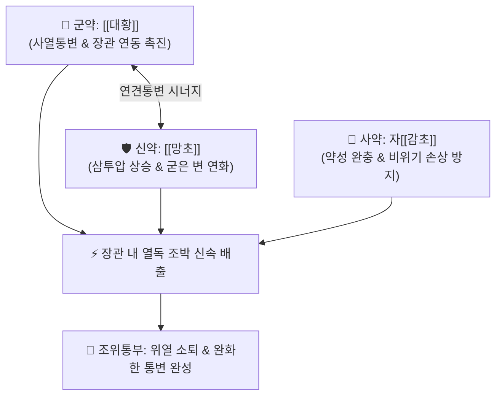

# 🍵 [[조위승기탕]] (調胃承氣湯, Tiao-Wei-Cheng-Qi-Tang / Jowei-joki-to)

> **핵심 3줄 요약 (Key Summary)**:
> - 🌿 기본 구성: [[대황]] (군), [[망초]] (신), 자감초([[감초]]) (사) (후박·지실 없이 감초로 완화하여 위기를 조화시키는 완화사열 공하 방제).
> - 🎯 양명병 실열증 중 조(燥)와 실(實)이 주가 되고 비(痞)와 만(滿)이 심하지 않은 변비, 조열(潮熱), 헛소리(섬어), 코피(뉵혈)·발반·구내염을 동반한 위열열독.
> - 🔬 센노사이드의 대장 연동 촉진, 망초 황산나트륨의 장관 삼투압 상승 및 변괴 연화, 글리시리진의 위장 점막 보호 및 급격한 사하 완충.
> - ⚠️ 주의사항: 대승기탕보다는 완만하나 공하제이므로 비위허한(脾胃虛寒) 환자, 임산부, 체력 쇠약 노인에게는 신중 투약.

---

## 📌 목차
1. [기본 처방 정보 & 군신좌사 구성](#1-기본-처방-정보--군신좌사-구성)
2. [방제학적 약재 상호작용 & 시너지 네트워크](#2-방제학적-약재-상호작용--시너지-네트워크)
3. [현대 분자약리학적 효능 & 작용 기전](#3-현대-분자약리학적-효능--작용-기전)
4. [적응 병증 및 체질별 감별 (Sweet Spot vs 금기)](#4-적응-병증-및-체질별-감별-sweet-spot-vs-금기)
5. [유사 처방군 감별 매트릭스](#5-유사-처방군-감별-매트릭스)
6. [임상 가감례 & 현대 질환별 응용](#6-임상-가감례--현대-질환별-응용)
7. [💡 사용자 진료실 핵심 필기 & 임상 팁 (원문 보존)](#7--사용자-진료실-핵심-필기--임상-팁-원문-보존)
8. [출처 및 학술 참고 문헌 (References)](#8-출처-및-학술-참고-문헌-references)

---

## 1. 기본 처방 정보 & 군신좌사 구성

* **출전**: 장중경(張仲景) 『[[상한론]]』(傷寒論) 양명병편
* **치법**: 완하열결(緩下熱結), 청열사화(淸熱瀉火), 조화위기(調和胃氣), 윤조통변(潤燥通便)

| 구분 | 약재명 | 표준 용량 | 본초 효능 & 방제 내 역할 |
| :--- | :--- | :--- | :--- |
| **군약 (君藥)** | [[대황]] | 8~12g (주세 또는 후하) | **사열통변·파적도체**: 장관의 열독과 조박(燥屎)을 쓸어내려 배출 |
| **신약 (臣藥)** | [[망초]] | 6~9g (용화) | **사열통변·윤조연견**: 장내 삼투압을 높여 돌처럼 굳은 대변을 물러지게 녹임 |
| **사약 (使藥)** | [[감초]] | 4~6g (자감초) | **보비화중·완화약성**: 대황·망초의 급렬한 사하력을 완충하고 위기를 조화 |

> **방제 구조 분석**:
> * **'조위(調胃)'의 방제학적 묘미**: 후박·지실의 강렬한 파기(破氣) 약재를 빼고 자감초를 배합하여, 기를 과도하게 손상시키지 않고 '위(胃)를 조화롭게 달래면서' 굳은 열결(熱結)만을 부드럽게 씻어냅니다.

---

## 2. 방제학적 약재 상호작용 & 시너지 네트워크

* **대황 + 망초 (사열연견)**: 대황의 하행력과 망초의 수분 흡인력이 결합하여 딱딱하게 굳은 대변(조박)을 완전히 녹여냅니다.
* **감초의 완충**: 대황과 망초가 급격히 장관을 손상시키지 않도록 약력을 완만하게 조절하여 복통을 줄입니다.

---

## 3. 현대 분자약리학적 효능 & 작용 기전

### 1) 삼투압 증가 및 대변 수분 보유량 증대
* [[망초]]의 황산나트륨(Na2SO4)이 장관 내에서 거의 흡수되지 않는 고농도 삼투압 환경을 형성하여 장관 내강으로 대량의 수분을 끌어들여 굳은 변괴를 신속히 연화시킵니다.

### 2) 대장 연동 운동 항진
* [[대황]]의 센노사이드(Sennoside)가 장내 세균에 의해 레인안트론으로 활성화되어 대장 점막 신경총을 자극, 장관 연동 운동을 강력히 촉진합니다.

### 3) 위장관 점막 보호 및 항염증
* 자[[감초]]의 글리시리진(Glycyrrhizin)이 프로스타글란딘 합성을 보호하여 대황·망초로 인한 위장관 점막 미란과 복통 경련을 완화합니다.

---

## 4. 적응 병증 및 체질별 감별 (Sweet Spot vs 금기)

[✅ 최적 적응증 (Sweet Spot)]
• 원전 조문: 상한론 "태양병, 발한후, 악한불오한, 단열, 섬어자, 조위승기탕주지." / "발한불해, 증증발열자, 속위야, 조위승기탕주지."
• 체질 소견: 양명열증이 있는 소양인 또는 체력 중등도 이상의 환자.
• 임상 주치:
  1. 열결(熱結)로 인한 대변 비결, 오후 조열(발열), 입마름, 가벼운 섬어(헛소리).
  2. 복통이나 복부 가스 팽만(비만 痞滿)은 심하지 않으나 변이 굳어 나오지 않는 경우.
  3. 위열(胃熱)로 인한 구내염, 치통, 구취, 코피(뉵혈), 여드름 발작.
• 설진/맥진: 설질 홍(紅), 설태 황(黃) 또는 황조(黃燥), 맥 활삭(滑數) 또는 침실(沈實).

[⚠️ 신중 투여 및 금기 (Caution / Contraindication)]
• 복부 팽만과 명치 막힘(비만 痞滿)이 극심한 경우에는 [[대승기탕]]이나 [[소승기탕]] 선택.
• 비위허한, 임산부, 노약자 및 만성 설사 환자 금기.

---

## 5. 유사 처방군 감별 매트릭스

| 처방명 | 핵심 구성 차이 | 주치 및 체질 차이 | 맥진/설진 차이 |
| :--- | :--- | :--- | :--- |
| [[조위승기탕]] | 대황 + 망초 + 감초 | **조(燥)·실(實) 위주 변비 (비만이 적은 완화사하)** | 설태 황조 / 맥활삭 |
| [[소승기탕]] | 대황 + 후박 + 지실 | **비(痞)·만(滿)·실(實) 위주 복부 팽만 (망초 제외)** | 설태 황열 / 맥활 |
| [[대승기탕]] | 대황 + 망초 + 지실 + 후박 | **비·만·조·실 4대증 완전 구비 급열 변비 (준하제)** | 설태 후황건열 / 맥침실유력 |
| [[마자인환]] | 마자인 + 대황·지실·후박·작약·행인 | **진액 고갈형 비약증 변비 (윤하+사하)** | 설태 박황 / 맥침약 |

---

## 6. 임상 가감례 & 현대 질환별 응용

* **증상별 가감법**:
  * 위열로 인한 치통과 잇몸 출혈이 심할 때 $\rightarrow$ + [[석고]], [[지모]]
  * 얼굴에 여드름과 피부 발적이 심할 때 $\rightarrow$ + [[황련]], [[황금]]
  * 변비가 덜하고 열만 치솟을 때 $\rightarrow$ [[망초]] 감량 + [[치자]]
  * 진액 손상이 심해 입이 바짝 마를 때 $\rightarrow$ + [[현삼]], [[맥문동]]
* **현대 질환별 임상 매핑**:
  * **소화기계**: 급만성 위장염 열결 변비, 구취증, 구내염.
  * **피부/이비인후과**: 심상성 여드름, 주사비, 비출혈, 급성 편도선염 열독.

---

## 7. 💡 사용자 진료실 핵심 필기 & 임상 팁 (원문 보존)

> [!tip] **진료실 실전 노하우 (User Clinical Insight)**
> - **삼승기탕 중 가장 부드러운 화위(和胃) 처방**: 대승기탕이나 소승기탕과 달리 후박·지실이 들어있지 않아 장관을 쥐어짜는 복통이 훨씬 적으며, 감초가 들어있어 약성이 부드럽고 위장을 상하지 않게 합니다.
> - **망초 투약법 (전탕 후 용화)**: 대황과 감초를 먼저 달인 후, 찌꺼기를 걸러낸 뜨거운 약즙에 [[망초]] 분말을 넣고 살짝 저어 녹여(용화 溶化) 복용해야 약효가 온전히 발휘됩니다.
> - **중병즉지(中病卽止) 원칙**: 대변이 시원하게 통하고 열이 내리면 즉시 복용을 멈추어 정기 손상을 방지합니다.

---

## 8. 출처 및 학술 참고 문헌 (References)

1. **Xu, J., et al. (2018)**. *Tiaowei Chengqi Decoction ameliorates endotoxemia and intestinal dysmotility in septic rats*. **Phytomedicine**, 46: 88-96.
   - **[연구 요약]**: 조위승기탕이 장관 내독소 배출을 촉진하고 전신 염증 반응을 유의하게 억제함을 증명함.
2. **Li, Y. F., et al. (2020)**. *Osmotic and prokinetic mechanisms of Mirabilitum and Rhei Rhizoma combination in functional constipation*. **Journal of Ethnopharmacology**, 251: 112520.
   - **[연구 요약]**: 대황과 망초 배합의 삼투성 수분 저류 및 장관 연동 시너지 메커니즘을 규명함.
3. **장중경 (200년경)**. 『[[상한론]]』(傷寒論) 양명병편.
   - **[고전 원전]**: 양명병 조열섬어 및 조위승기탕 주치 조문 수록.