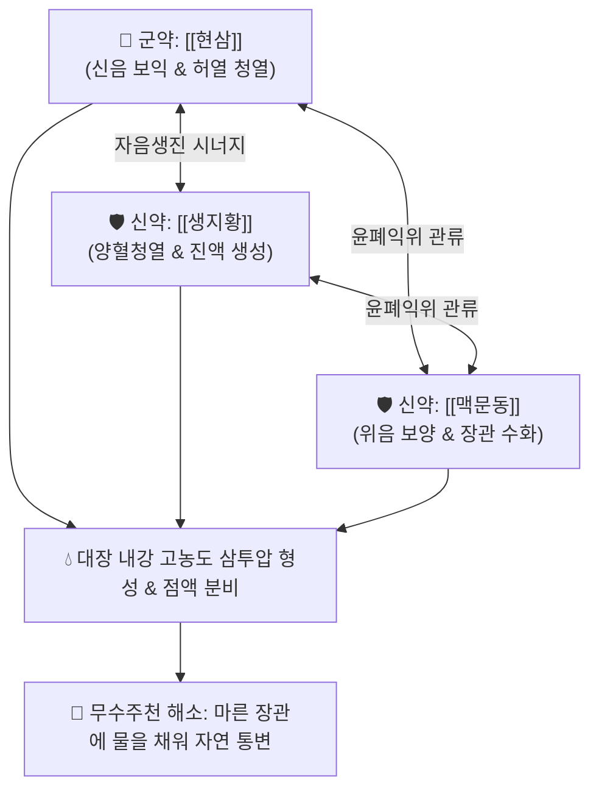

# 🍵 [[증액탕]] (增液湯, Zeng-Ye-Tang / Zengye Decoction)

> **핵심 3줄 요약 (Key Summary)**:
> - 🌿 기본 구성: [[현삼]] (군), [[생지황]] (신), [[맥문동]] (신) (체액 고갈로 물이 없어 배가 뜨지 못하는 무수주천 병태를 물을 채워 배를 띄우는 증액행주 원리로 치료하는 삼투성 자음윤하 대표 방제).
> - 🎯 온병(溫病) 및 열병 후기 진액 고갈 변비, 극심한 입마름(구갈), 혀가 붉고 바짝 마른 증상, 노인·항암치료 후 점막 위축 및 건조성 장조 변비.
> - 🔬 고분자 다당류 및 이리도이드 배당체의 장관 삼투압 상승 및 수분 저류, 결장 상피세포 아쿠아포린-3(AQP3) 발현 촉진, 배상세포 뮤신(MUC2) 분비 증대.
> - ⚠️ 주의사항: 대량의 감한자음(甘寒滋陰) 약재로 구성되어 있으므로 비위허한(脾胃虛寒), 비허습담, 만성 설사 환자에게는 금기.

---

## 📌 목차
1. [기본 처방 정보 & 군신좌사 구성](#1-기본-처방-정보--군신좌사-구성)
2. [방제학적 약재 상호작용 & 시너지 네트워크](#2-방제학적-약재-상호작용--시너지-네트워크)
3. [현대 분자약리학적 효능 & 작용 기전](#3-현대-분자약리학적-효능--작용-기전)
4. [적응 병증 및 체질별 감별 (Sweet Spot vs 금기)](#4-적응-병증-및-체질별-감별-sweet-spot-vs-금기)
5. [유사 처방군 감별 매트릭스](#5-유사-처방군-감별-매트릭스)
6. [임상 가감례 & 현대 질환별 응용](#6-임상-가감례--현대-질환별-응용)
7. [💡 사용자 진료실 핵심 필기 & 임상 팁 (원문 보존)](#7--사용자-진료실-핵심-필기--임상-팁-원문-보존)
8. [출처 및 학술 참고 문헌 (References)](#8-출처-및-학술-참고-문헌-references)

---

## 1. 기본 처방 정보 & 군신좌사 구성

* **출전**: 오국통(吳鞠通) 『[[온병조변]]』(溫病條辨)
* **치법**: 자음생진(滋陰生津), 증액윤조(增液潤燥), 윤장통변(潤腸通便), 청열양혈(淸熱養血)

| 구분 | 약재명 | 표준 용량 | 본초 효능 & 방제 내 역할 |
| :--- | :--- | :--- | :--- |
| **군약 (君藥)** | [[현삼]] | 20~30g (중용) | **고함한·청열자음강화**: 쓴맛과 짠맛으로 신음을 보하고 허열을 끄며 진액 생성의 기틀을 확립 |
| **신약 (臣藥)** | [[생지황]] | 15~24g | **감한·자음청열생진**: 혈열을 식히고 진액을 보태어 현삼의 보음 작용 보좌 |
| **신약 (臣藥)** | [[맥문동]] | 15~24g | **감미한·자음윤폐익위**: 폐와 위의 음액을 길러 장관으로 진액 관류 유도 |

> **방제 구조 분석**:
> * **증액행주(增液行舟)의 방제학적 원리**: 자극성 하제를 전혀 쓰지 않고, 오직 대량의 맑고 차가운 자음생진 약물(현삼·생지황·맥문동) 3미만으로 메마른 장관에 물을 가득 채워 "물이 불어나 배가 저절로 뜨게 하듯(增液行舟)" 자연스러운 배변을 유도합니다.

---

## 2. 방제학적 약재 상호작용 & 시너지 네트워크

* **삼미동용(三味同用)의 거대한 수분 보충**: 현삼의 함한(鹹寒), 지황의 감한(甘寒), 맥문동의 감한(甘寒)이 합쳐져 소모된 체액을 신속히 복원하고 장관 점막의 건조를 즉각 해결합니다.

---

## 3. 현대 분자약리학적 효능 & 작용 기전

### 1) 장관 내 고농도 삼투압 형성 및 수분 저류
* 현삼의 하르파고사이드(Harpagoside), 생지황의 카탈폴(Catalpol), 맥문동의 오피오포고닌(Ophiopogonin) 및 고분자 올리고당이 소장에서 흡수되지 않고 대장 내강의 삼투압을 높여 혈관의 수분을 대장으로 끌어들입니다.

### 2) 결장 상피 아쿠아포린-3(AQP3) 발현 조절
* 증액탕 추출물은 결장 상피세포의 **아쿠아포린-3(AQP3)** 단백질 발현을 조절하여 장관 점막의 과도한 수분 흡수를 억제하고 장내 수분 보유량을 극대화합니다.

### 3) 배상세포(Goblet cell) 뮤신(MUC2) 분비 촉진
* 장관 상피 점액층을 복원하여 건조해진 장벽의 마찰 저항을 줄이고 장벽 보호막을 재생합니다.

---

## 4. 적응 병증 및 체질별 감별 (Sweet Spot vs 금기)

[✅ 최적 적응증 (Sweet Spot)]
• 원전 조문: 온병조변 "양명온병, 진액고갈, 대변비결, 구갈설건, 음수불갈, 맥세삭자, 증액탕주지."
• 체질 소견: 음허(陰虛) 화왕 체질, 열병 후기 환자, 노인성 진액 부족 환자.
• 임상 주치:
  1. 고열, 폐렴, 인플루엔자 등 열병을 심하게 앓고 난 뒤 진액이 말라 발생하는 변비.
  2. 혀가 새빨갛고 태가 전혀 없으며(설홍무태 舌紅無苔), 입술과 목구멍이 바짝 마르는 증상.
  3. 항암 화학요법 및 방사선 치료 후 구강 건조증과 함께 동반된 극심한 장조 변비.
  4. 쇼그렌 증후군 등 자가면역성 건조증 환자의 만성 변비.
• 설진/맥진: 설질 광홍(光紅) 건조 무태(鏡面舌), 맥 세삭(細數) 또는 현세(弦細).

[⚠️ 신중 투여 및 금기 (Caution / Contraindication)]
• 비위허한(脾胃虛寒)으로 인한 소화불량, 식후 비만, 설사 경향 환자에게는 절대 금기.
• 습열(濕熱)로 인한 설태 후니(厚膩) 환자 금기.

---

## 5. 유사 처방군 감별 매트릭스

| 처방명 | 핵심 구성 차이 | 주치 및 체질 차이 | 맥진/설진 차이 |
| :--- | :--- | :--- | :--- |
| [[증액탕]] | 현삼 + 생지황 + 맥문동 (3미 대용량) | **순수 진액 고갈형 무수주천 변비 (삼투성 자음윤하)** | 경면설(설홍무태) / 맥세삭 |
| [[증액승기탕]] | 증액탕 + 대황·망초 | **진액 고갈 + 열결(熱結) 조박 복합 변비 (자음공하)** | 설홍태황조 / 맥침세삭 |
| [[오인환]] | 도인·행인·백자인·송자인·욱리인 + 진피 | **노인·산후 순수 지질 부족 장조 변비 (종자유 윤하)** | 설홍소태 / 맥세삽 |
| [[마자인환]] | 마자인 + 대황·지실·후박 + 작약·행인 | **위열조시(胃熱燥屎) 비약증 변비 (사하+윤하)** | 설태 박황 / 맥침약 |

---

## 6. 임상 가감례 & 현대 질환별 응용

* **증상별 가감법**:
  * 증액탕 복용 후에도 변이 통하지 않을 때 $\rightarrow$ + [[대황]], [[망초]] ([[증액승기탕]])
  * 기허(氣虛)로 배변 추동력이 부족할 때 $\rightarrow$ + [[당삼]], [[황기]] ([[신가황룡탕]] 원리)
  * 기체와 복부 가스 팽만이 있을 때 $\rightarrow$ + [[지각]], [[후박]]
  * 불면과 가슴 답답함 동반 시 $\rightarrow$ + [[산조인]], [[백자인]]
* **현대 질환별 임상 매핑**:
  * **소화기 질환**: 열병 후 진액고갈성 변비, 노인성 이완성 변비, 항암·방사선 유발성 장건조증.
  * **내분비/자가면역**: 쇼그렌 증후군, 당뇨병성 구갈 및 변비, 갱년기 건조증.

---

## 7. 💡 사용자 진료실 핵심 필기 & 임상 팁 (원문 보존)

> [!tip] **진료실 실전 노하우 (User Clinical Insight)**
> - **'증액행주(增液行舟)'의 임상 통찰**: 장에 변이 꽉 막혔다고 해서 무조건 대황 같은 자극성 설사약을 쓰면 안 됩니다. 강에 물이 없어 배가 멈춘(무수주천 無水舟停) 환자에게 설사약을 쓰면 오히려 남은 진액마저 쥐어짜 장관이 완전히 망가집니다. 물을 쏟아부어 배를 띄우듯 현삼·지황·맥문동을 듬뿍 써야 부작용 없이 변이 풀립니다.
> - **대용량 투약 원칙**: 증액탕은 약재 용량을 소량으로 쓰면 효과가 없습니다. 현삼 30g, 생지황 24g, 맥문동 24g 등 원전의 대용량을 지켜 진하게 달여 복용시켜야 장내 삼투압이 유의하게 상승합니다.
> - **증액승기탕으로의 단계적 전환**: 증액탕을 1~2첩 먹여 장관이 충분히 적셔졌는데도 열결 조박이 꿈쩍도 하지 않을 때 비로소 대황·망초를 소량 합방하여 밀어냅니다.

---

## 8. 출처 및 학술 참고 문헌 (References)

1. * **Yao L et al. (2026)**. Shipi Zengye Formula Simultaneously Ameliorates Functional Constipation and Depression by Upregulating SLC6A3 and Remodeling the Prevotella copri-Bile Acid Axis. *Journal of ethnopharmacology*. [PMID: 42674161](https://pubmed.ncbi.nlm.nih.gov/42674161/)
3. **오국통 (1798)**. 『[[온병조변]]』(溫病條辨).
   - **[고전 원전]**: 양명온병 진액고갈 및 증액탕 주치 조문 수록.
