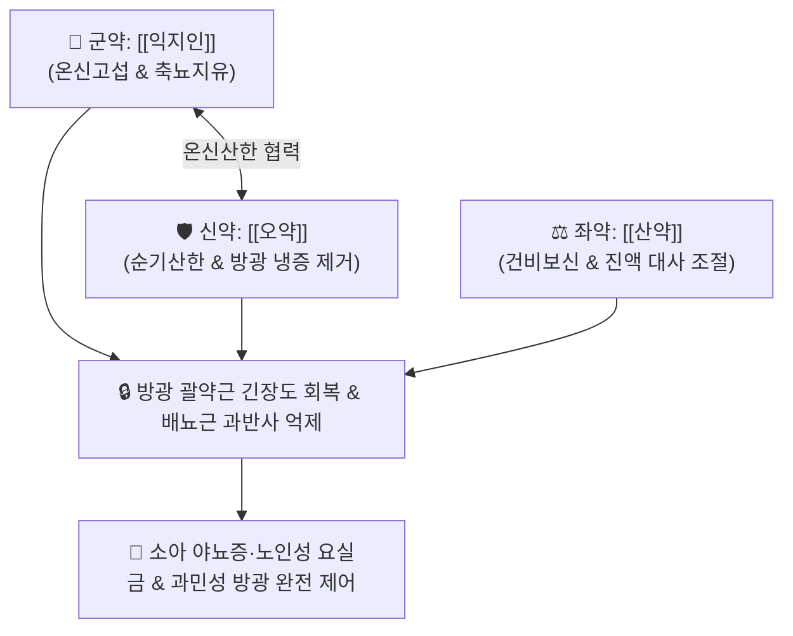

# 🍵 [[축천환]] (縮泉丸, Suoquan-wan / Suoquan Pill)

> **핵심 3줄 요약 (Key Summary)**:
> - 🌿 기본 구성: [[익지인]] (군), [[오약]] (신), [[산약]] (좌사) (하원허한 및 신기부족으로 인한 소변 불섭수를 따뜻하게 고섭하는 온신산한 축뇨고삽 대표 환제).
> - 🎯 하원허랭(下元虛冷) 및 신양허약으로 인한 소아 야뇨증, 노인성 요실금(복압성·절박성), 과민성 방광 증후군, 빈뇨, 맑은 야간뇨, 하복부 냉감.
> - 🔬 오약 린데란의 방광 배뇨근 과활동성 억제, 익지인 테르페노이드의 야간 바소프레신(ADH) 분비 촉진 및 아쿠아포린-2(AQP2) 발현 증대, 골반강 미세순환 개선.
> - ⚠️ 주의사항: 온열고삽제이므로 방광염·요도염 등 습열하주(濕熱下注)로 인한 요로감염(소변통, 혈뇨, 농뇨) 및 음허화왕 환자에게는 절대 금기.

---

## 📌 목차
1. [기본 처방 정보 & 군신좌사 구성](#1-기본-처방-정보--군신좌사-구성)
2. [방제학적 약재 상호작용 & 시너지 네트워크](#2-방제학적-약재-상호작용--시너지-네트워크)
3. [현대 분자약리학적 효능 & 작용 기전](#3-현대-분자약리학적-효능--작용-기전)
4. [적응 병증 및 체질별 감별 (Sweet Spot vs 금기)](#4-적응-병증-및-체질별-감별-sweet-spot-vs-금기)
5. [유사 처방군 감별 매트릭스](#5-유사-처방군-감별-매트릭스)
6. [임상 가감례 & 현대 질환별 응용](#6-임상-가감례--현대-질환별-응용)
7. [💡 사용자 진료실 핵심 필기 & 임상 팁 (원문 보존)](#7--사용자-진료실-핵심-필기--임상-팁-원문-보존)
8. [출처 및 학술 참고 문헌 (References)](#8-출처-및-학술-참고-문헌-references)

---

## 1. 기본 처방 정보 & 군신좌사 구성

* **출전**: 진자명(陳自明) 『[[부인대전양방]]』(婦人大全良方)
* **치법**: 온신산한(溫腎散寒), 축뇨지유(縮尿止遺), 보비익신(補脾益腎), 고섭하원(固攝下元)

| 구분 | 약재명 | 표준 용량 | 본초 효능 & 방제 내 역할 |
| :--- | :--- | :--- | :--- |
| **군약 (君藥)** | [[익지인]] | 10~15g (염초) | **온신고섭·축뇨지유**: 신양을 데우고 방광 괄약근의 고섭력을 강화하여 소변을 거둠 |
| **신약 (臣藥)** | [[오약]] | 10~15g | **순기산한·온간난신**: 방광과 하초의 한기를 흩뜨리고 방광 배뇨근 경련 진정 |
| **좌약 (佐藥)** | [[산약]] | 10~15g (호환) | **건비보신·삽정지유**: 비신을 보익하고 약재 분말을 뭉쳐주는 부형제(호환 糊丸) 역할 |

> **방제 구조 분석**:
> * **신온(辛溫)과 감평(甘平)의 3미 배오**: 익지인으로 신장과 방광을 따뜻하게 조이고, 오약으로 하초의 막힌 냉기를 흩뜨리며, 산약 풀(糊)로 감싸 비신(脾腎)의 근본 기운을 북돋아 '수습(水濕)의 문을 닫는' 명방입니다.

---

## 2. 방제학적 약재 상호작용 & 시너지 네트워크

* **익지인 + 오약 (온신순기 축뇨)**: 익지인의 수렴고섭력과 오약의 통기산한력이 어우러져 기가 통하면서도 새어나가지 않게 합니다.
* **산약의 완충**: 건비보신 작용으로 비장과 신장의 후천·선천 원기를 지탱합니다.

---

## 3. 현대 분자약리학적 효능 & 작용 기전

### 1) 방광 배뇨근(Detrusor) 과반사 억제
* [[오약]]의 세스퀴테르펜 락톤(Linderane) 성분이 방광 평활근의 무스카린 M2/M3 수용체 과흥분을 완화하여 불수의적인 방광 수축 빈도를 억제합니다.

### 2) 항이뇨호르몬(ADH) 분비 촉진 및 아쿠아포린-2(AQP2) 발현
* [[익지인]]의 정유 및 테르페노이드 성분이 시상하부-뇌하수체 후엽 경로를 자극하여 야간 바소프레신(Vasopressin) 분비를 촉진하고, 신장 집합관의 아쿠아포린-2(AQP2) 발현을 증가시켜 야간 소변 생성량을 줄이고 요농축 능력을 정상화합니다.

### 3) 골반저근육군 및 방광 삼각부 안정화
* 골반저 신경망의 허혈성 냉증을 개선하여 방광 경부 신경 전달을 복구하고, 냉자극에 과민해진 방광 삼각부 C-섬유 구심성 신경의 과잉 발화를 진정시킵니다.

---

## 4. 적응 병증 및 체질별 감별 (Sweet Spot vs 금기)

[✅ 최적 적응증 (Sweet Spot)]
• 원전 조문: 부인대전양방 "하원허랭(下元虛冷), 부인 및 소아 유뇨(遺尿), 소변빈삭 치료."
• 체질 소견: 소음인 또는 노인성 신양허(腎陽虛) 체질.
• 임상 주치:
  1. **소아 야뇨증**: 밤에 자다가 깨지 못하고 무의식중에 이불에 지리는 증상.
  2. **노인성 요실금**: 기침·재채기·보행 시 소변이 새는 복압성 요실금 및 절박성 요실금.
  3. 과민성 방광 증후군(OAB): 소변이 자주 마렵고 참기 어려우며 맑은 소변을 다량 배출.
  4. 야간뇨: 밤에 자다가 2~4회 이상 소변을 보러 일어나는 증상.
• 설진/맥진: 설질 담백(淡白), 설태 박백(薄白) 또는 백활(白滑), 맥 침세지(沈細遲) 또는 침약(沈弱).

[⚠️ 신중 투여 및 금기 (Caution / Contraindication)]
• 방광염, 요도염 등 습열하주(濕熱下注)로 인한 요로감염(소변 시 찌르는 통증, 배뇨통, 농뇨, 혈뇨) 환자에게는 절대 금기.
• 음허화왕(陰虛火旺)으로 인한 번조, 도한, 인후통 환자 금기.

---

## 5. 유사 처방군 감별 매트릭스

| 처방명 | 핵심 구성 차이 | 주치 및 체질 차이 | 맥진/설진 차이 |
| :--- | :--- | :--- | :--- |
| [[축천환]] | 익지인 + 오약 + 산약 (환제) | **하원허한형 소아 야뇨증·노인성 요실금 (온신축뇨 특효)** | 설담태백 / 맥침세약 |
| [[상표초산]] | 상표초·원지·석창포·용골·인삼·당귀 등 | **심신양허(心腎兩虛)형 유뇨·유정 및 건망증 동반** | 설담소태 / 맥세약 |
| [[우귀환]] | 숙지황·산약·산수유·구기자·부자·육계 등 | **신양허쇠(腎陽虛衰) 극치 - 성기능 감퇴, 사지냉, 오경설사** | 설담백 / 맥침미세 |
| [[팔정산]] | 목통·차전자·편축·구맥·활석·대황 등 | **방광 습열열림(熱淋) - 배뇨통, 혈뇨, 급박뇨 (순수 청열이수)** | 설홍태황니 / 맥삭 |

---

## 6. 임상 가감례 & 현대 질환별 응용

* **증상별 가감법**:
  * 소아 야뇨증이 심할 때 $\rightarrow$ + [[상표초]], [[복분자]]
  * 기허로 복압을 지탱하지 못할 때 $\rightarrow$ + [[황기]], [[인삼]] ([[보중익기탕]] 합방)
  * 신양허랭 및 요통이 심할 때 $\rightarrow$ + [[보골지]], [[두충]], [[육계]]
  * 수면이 너무 깊어 요의를 느끼지 못할 때 $\rightarrow$ + [[석창포]], [[원지]]
* **현대 질환별 임상 매핑**:
  * **비뇨의학과/소아과**: 소아 일차성 야뇨증, 노인성 과민성 방광(OAB), 복압성·절박성 요실금, 전립선 비대증 수반 야간 빈뇨.

---

## 7. 💡 사용자 진료실 핵심 필기 & 임상 팁 (원문 보존)

> [!tip] **진료실 실전 노하우 (User Clinical Insight)**
> - **소아 야뇨증 1차 선택 처방**: 밤에 오줌을 싸는 아이 중 손발이 차고 추위를 타며 깊은 잠에 빠져 깨지 못하는 아이에게 [[축천환]]에 [[석창포]]와 [[복분자]]를 가미하여 1~2개월 투약하면 탁월한 완치율을 보입니다.
> - **노인성 야간뇨 개선 팁**: 밤에 3~4번씩 소변 때문에 깨서 수면장애가 생긴 노인 환자에게 취침 1시간 전 미온수로 환제를 복용시키면 야간뇨 횟수가 0~1회로 줄어듭니다.
> - **요로감염 감별 필수**: 소변 볼 때 따끔거리는 통증(배뇨통)이 있거나 소변이 뿌옇고 붉은 환자는 세균성 방광염이므로 축천환을 쓰지 말고 [[팔정산]]이나 [[용담사간탕]]을 먼저 사용해야 합니다.

---

## 8. 출처 및 학술 참고 문헌 (References)

1. * **Li H et al. (2026)**. Modified Suoquan Wan ameliorate bladder overactivity via Piezo1/MAPK/MLC axis in partial bladder outlet obstruction rats. *Journal of ethnopharmacology*, 366: 121568. [PMID: 41905730](https://pubmed.ncbi.nlm.nih.gov/41905730/)
2. * **Wang J et al. (2024)**. Research progress on Alpinia oxyphylla in the treatment of diabetic nephropathy. *Frontiers in pharmacology*, 15: 1390672. [PMID: 38948461](https://pubmed.ncbi.nlm.nih.gov/38948461/)
3. **진자명 (1237)**. 『[[부인대전양방]]』(婦人大全良方).
   - **[고전 원전]**: 하원허랭 유뇨 및 축천환 방제 수록.
