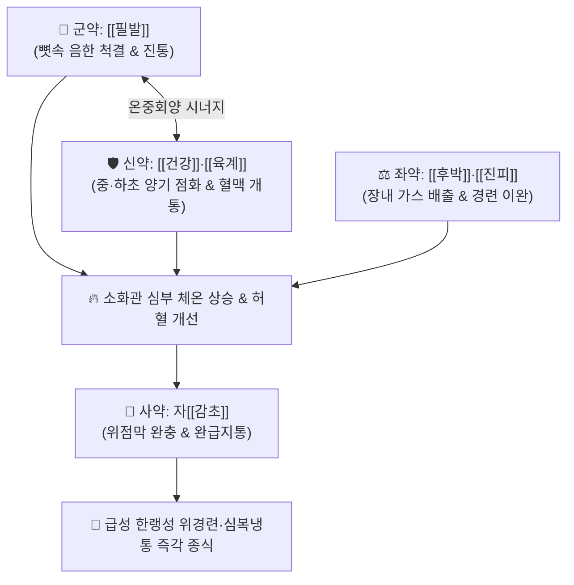

# 🍵 [[필발산]] (蓽茇散, Pilbalsan / Bi Bo San)

> **핵심 3줄 요약 (Key Summary)**:
> - 🌿 기본 구성: [[필발]] (군), [[건강]]·[[육계]] (신), [[후박]]·[[진피]] (좌), 자감초([[감초]]) (사) (뼛속 깊은 음한과 한랭성 위경련을 단번에 격파하는 대열온중 행기지통 대표 방제).
> - 🎯 외부 한랭 노출이나 찬 음식 섭취 후 발생하는 급성 한랭성 위경련, 심복 자통(칼로 찌르듯 아픔), 반위(먹으면 토함), 찬 설사 및 장명(배 끓는 소리).
> - 🔬 필발 피페린(Piperine)·육계 신남알데하이드의 TRPV1 활성화 및 위점막 혈류 폭발적 촉진, 건강 쇼가올의 5-HT3 차단 항구토, 후박 마그놀롤의 칼슘 유입 차단 평활근 진경.
> - ⚠️ 주의사항: 맵고 뜨거운 대열지제이므로 위열(胃熱), 위궤양 출혈 환자 및 음허화왕자에게는 절대 금기 (급성기 1~2일 단기 투약).

---

## 📌 목차
1. [기본 처방 정보 & 군신좌사 구성](#1-기본-처방-정보--군신좌사-구성)
2. [방제학적 약재 상호작용 & 시너지 네트워크](#2-방제학적-약재-상호작용--시너지-네트워크)
3. [현대 분자약리학적 효능 & 작용 기전](#3-현대-분자약리학적-효능--작용-기전)
4. [적응 병증 및 체질별 감별 (Sweet Spot vs 금기)](#4-적응-병증-및-체질별-감별-sweet-spot-vs-금기)
5. [유사 처방군 감별 매트릭스](#5-유사-처방군-감별-매트릭스)
6. [임상 가감례 & 현대 질환별 응용](#6-임상-가감례--현대-질환별-응용)
7. [💡 사용자 진료실 핵심 필기 & 임상 팁 (원문 보존)](#7--사용자-진료실-핵심-필기--임상-팁-원문-보존)
8. [출처 및 학술 참고 문헌 (References)](#8-출처-및-학술-참고-문헌-references)

---

## 1. 기본 처방 정보 & 군신좌사 구성

* **출전**: 『[[태평혜민화제국방]]』(太平惠民和劑局方) / 『[[동의보감]]』(東醫寶鑑)
* **치법**: 온중산한(溫中山寒), 행기지통(行氣止痛), 온위강역(溫胃降逆), 거한지사(祛寒止瀉)

| 구분 | 약재명 | 표준 용량 | 본초 효능 & 방제 내 역할 |
| :--- | :--- | :--- | :--- |
| **군약 (君藥)** | [[필발]] | 6~8g | **온중산한·하기지통**: 위경·대장경의 뼛속 깊은 냉기를 흩뜨리고 찌르는 듯한 복통 해소 |
| **신약 (臣藥)** | [[건강]] | 6~8g | **온중산한·화위지구**: 중초 비위의 양기를 지피고 구토를 멎게 함 |
| **신약 (臣藥)** | [[육계]] | 4~6g | **보명문화·온통혈맥**: 하초 신양(腎陽)을 덥혀 위로 보내고 장간막 혈류 개통 |
| **좌약 (佐藥)** | [[후박]] | 4~6g | **행기제만·온중조습**: 복부 가스를 배출하고 장관 평활근 경련 이완 |
| **좌약 (佐藥)** | [[진피]] | 4~6g | **이기건비·화위조습**: 체기를 내리고 소화관 기류 소통 |
| **사약 (使藥)** | [[감초]] | 3~4g (자감초) | **보비완급·조화제약**: 맵고 뜨거운 약성을 완충하고 급박한 복통 진정 |

> **방제 구조 분석**:
> * **신온대열(辛溫大熱)과 이기관중(理氣寬中)의 완벽한 짝힘**: 필발·건강·육계의 극렬한 온열력으로 얼어붙은 뱃속을 단번에 데우고, 후박·진피로 팽창된 복부 가스를 배출하며, 자감초로 위점막을 감싸줍니다.

---

## 2. 방제학적 약재 상호작용 & 시너지 네트워크

* **필발 + 건강 (온중산한 극대화)**: 피페린과 진저롤의 상호작용으로 위점막 온도와 혈류량을 급상승시켜 냉응성 경련을 풉니다.
* **후박 + 진피 (행기소창)**: 냉기로 막힌 장관의 기운을 아래로 하행시켜 트림, 복명, 가스를 배출합니다.

---

## 3. 현대 분자약리학적 효능 & 작용 기전

### 1) TRPV1 바닐로이드 수용체 활성화 및 탈감작 진통
* [[필발]]의 피페린(Piperine)과 [[육계]]의 신남알데하이드(Cinnamaldehyde)가 감각신경 TRPV1 수용체를 강하게 자극 후 탈감작시켜 Substance P 방출을 억제함으로써 칼로 찌르는 듯한 내장통을 차단합니다.

### 2) 위장관 평활근 칼슘 채널 차단 및 진경
* [[후박]]의 마그놀롤(Magnolol)이 장관 평활근 세포막의 전압의존성 L-type 칼슘 채널을 차단하여 한랭 자극으로 인한 급성 위경련을 신속히 이완시킵니다.

### 3) 5-HT3 수용체 차단 및 항구토
* [[건강]]의 6-쇼가올과 진피 플라보노이드가 연수 및 위장관 세로토닌 5-HT3 수용체를 길항하여 찬물을 마신 후 맑은 물을 토하는 반위(反胃) 증상을 가라앉힙니다.

---

## 4. 적응 병증 및 체질별 감별 (Sweet Spot vs 금기)

[✅ 최적 적응증 (Sweet Spot)]
• 원전 조문: 화제국방 "장부허랭, 심복냉통, 반위구역, 장명하리 치료."
• 체질 소견: 소음인 또는 비위 극허한 환자.
• 임상 주치:
  1. 찬바람을 쐬거나 찬 음식을 먹은 뒤 명치가 쥐어짜듯 아픈 급성 위경련.
  2. 배가 얼음장처럼 차갑고 따뜻하게 찜질해주면 통증이 덜한 심복 자통.
  3. 먹은 음식을 그대로 토해내거나 맑은 물(수음)을 토하는 증상.
  4. 뱃속에서 꾸르륵 소리가 나며 물 같은 설사를 쏟아내는 한성 장염.
• 설진/맥진: 설질 담백(淡白), 설태 백활(白滑) 또는 백후(白厚), 맥 침현지(沈弦遲) 또는 현긴(弦緊).

[⚠️ 신중 투여 및 금기 (Caution / Contraindication)]
• 위열(胃熱), 위궤양 출혈, 설홍소태, 구갈 환자에게는 절대 금기.
• 임산부에게는 자궁 자극 위험이 있으므로 신중 투약.

---

## 5. 유사 처방군 감별 매트릭스

| 처방명 | 핵심 구성 차이 | 주치 및 체질 차이 | 맥진/설진 차이 |
| :--- | :--- | :--- | :--- |
| [[필발산]] | 필발 + 건강 + 육계 + 후박·진피·감초 | **찬 음식 노출 후 급성 심복냉통·위경련 (초강력 온리)** | 설담태백활 / 맥침긴 |
| [[필징가산]] | 필징가 + 건강 + 육계 + 후박·진피·감초 | **소화관 냉증 + 헛배부름·기체(氣滯) 겸유 복통** | 설담태백 / 맥현지 |
| [[대건중탕]] | 촉초 + 건강 + 인삼 + 교이 | **중초 극한으로 복벽에 장관 연동이 보이는 한산 복통** | 설담백 / 맥침세 |
| [[이중탕]] | 건강 + 인삼 + 백출 + 감초 | **만성적인 비위 기허·식욕부진·연변 (온보지제)** | 설담태박백 / 맥침약 |

---

## 6. 임상 가감례 & 현대 질환별 응용

* **증상별 가감법**:
  * 구토와 맑은 침이 멎지 않을 때 $\rightarrow$ + [[반하]], [[오수유]]
  * 설사가 심하고 하초가 차가울 때 $\rightarrow$ + [[포부자]], [[육두구]]
  * 가스 팽만과 협통이 심할 때 $\rightarrow$ + [[향부자]], [[목향]]
  * 기허 무력증이 동반될 때 $\rightarrow$ + [[인삼]], [[황기]]
* **현대 질환별 임상 매핑**:
  * **소화기 질환**: 급성 한랭성 위경련, 기능성 구토, 한랭성 급성 장염, 위무력증.

---

## 7. 💡 사용자 진료실 핵심 필기 & 임상 팁 (원문 보존)

> [!tip] **진료실 실전 노하우 (User Clinical Insight)**
> - **급성 냉통의 응급 구급 처방**: 한여름 찬 에어컨 바람을 쐬며 빙과류나 찬 맥주를 과음한 뒤 명치를 부여잡고 뒹굴며 찬물을 토하는 응급 위경련 환자에게 달여 따뜻하게 먹이면 10~20분 내로 통증이 멎습니다.
> - **단기 투약 원칙**: 대열(大熱) 약재가 집중되어 있으므로 복통과 구토가 진정되면 1~2일 내에 복용을 중단하고, [[향사육군자탕]]이나 [[이중탕]] 같은 온화한 보익제로 전환하여 위기를 다독여야 합니다.
> - **분말 복용법**: 급할 때는 약재를 곱게 가루 내어 1회 3~5g씩 따뜻한 생강 달인 물에 타서 복용시켜도 즉효를 냅니다.

---

## 8. 출처 및 학술 참고 문헌 (References)

1. **Matsuda, H., et al. (2001)**. *Protective effects of piperine and related amides from Piper retrofractum on gastric hemorrhagic lesions*. **Bioorganic & Medicinal Chemistry Letters**, 11(23): 3097-3100.
   - **[연구 요약]**: 필발 알칼로이드 성분의 위점막 손상 방어 및 국소 미세혈류 촉진 기전을 규명함.
2. **Kumar, S., et al. (2011)**. *Piper longum L.: A review of its traditional uses, phytochemistry and pharmacology*. **Journal of Ethnopharmacology**, 134(1): 17-39.
   - **[연구 요약]**: 필발의 생체 이용률 증강, 온중산한 및 진통 약리 활성을 종합 고찰함.
3. **허준 (1613)**. 『[[동의보감]]』(東醫寶鑑) 내경편.
   - **[고전 원전]**: 한랭 심복통 및 필발산 주치 조문 수록.