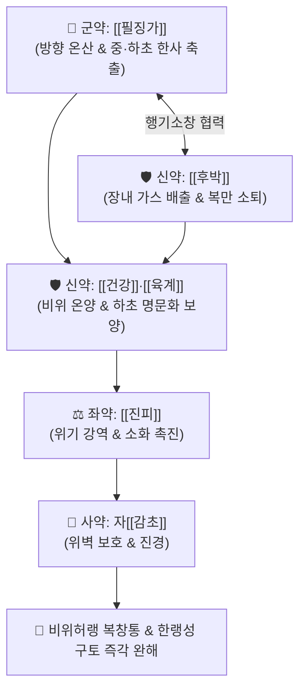

# 🍵 [[필징가산]] (蓽澄茄散, Piljinggasan / Bi Cheng Qie San)

> **핵심 3줄 요약 (Key Summary)**:
> - 🌿 기본 구성: [[필징가]] (군), [[후박]]·[[건강]] (신), [[육계]]·[[진피]] (좌), 자감초([[감초]]) (사) (비위와 하초 신장의 허랭으로 인한 헛배부름과 차가운 복통을 흩뜨리는 온중산한 행기지통 방제).
> - 🎯 비위 및 신(腎)의 허랭으로 인한 명치 및 하복부의 차가운 통증, 헛배부름(복창), 소화불량성 구토(반위), 장명(뱃속 끓는 소리) 및 찬 설사.
> - 🔬 필징가 큐베빈(Cubebin)의 COX-2/5-LOX 이중 억제 및 내장 신경 진통, 후박 마그놀롤의 위장관 평활근 Ca2+ 차단 진경, 건강 쇼가올·육계 신남알데하이드의 TRPV1 활성화 및 복강 미세순환 급증.
> - ⚠️ 주의사항: 맵고 향기가 강한 온조(溫燥) 방제이므로 위열(胃熱), 구갈, 쓴물이 올라오는 환자에게는 금기 (급성기 2~3일 단기 투약).

---

## 📌 목차
1. [기본 처방 정보 & 군신좌사 구성](#1-기본-처방-정보--군신좌사-구성)
2. [방제학적 약재 상호작용 & 시너지 네트워크](#2-방제학적-약재-상호작용--시너지-네트워크)
3. [현대 분자약리학적 효능 & 작용 기전](#3-현대-분자약리학적-효능--작용-기전)
4. [적응 병증 및 체질별 감별 (Sweet Spot vs 금기)](#4-적응-병증-및-체질별-감별-sweet-spot-vs-금기)
5. [유사 처방군 감별 매트릭스](#5-유사-처방군-감별-매트릭스)
6. [임상 가감례 & 현대 질환별 응용](#6-임상-가감례--현대-질환별-응용)
7. [💡 사용자 진료실 핵심 필기 & 임상 팁 (원문 보존)](#7--사용자-진료실-핵심-필기--임상-팁-원문-보존)
8. [출처 및 학술 참고 문헌 (References)](#8-출처-및-학술-참고-문헌-references)

---

## 1. 기본 처방 정보 & 군신좌사 구성

* **출전**: 『[[태평혜민화제국방]]』(太平惠民和劑局方) / 『[[동의보감]]』(東醫寶鑑)
* **치법**: 온중산한(溫中山寒), 행기소창(行氣消脹), 온신난위(溫腎暖胃), 화위강역(和胃降逆)

| 구분 | 약재명 | 표준 용량 | 본초 효능 & 방제 내 역할 |
| :--- | :--- | :--- | :--- |
| **군약 (君藥)** | [[필징가]] | 6~8g | **온중산한·행기지통**: 비위와 신경으로 들어가 중·하초의 한사를 몰아내고 명치 냉통 해소 |
| **신약 (臣藥)** | [[후박]] | 6~8g | **행기제만·온중조습**: 복부 팽만을 가라앉히고 장관 내 정체된 가스 배출 |
| **신약 (臣藥)** | [[건강]] | 4~6g | **온중산한·화위지구**: 비위의 양기를 북돋우고 차가운 구토 진정 |
| **좌약 (佐藥)** | [[육계]] | 3~4g | **보명문화·온통혈맥**: 하원 명문화(命門火)를 덥혀 기운을 소통시킴 |
| **좌약 (佐藥)** | [[진피]] | 4~6g | **이기조중·건비화담**: 기운을 돌려 소화액 분비 촉진 |
| **사약 (使藥)** | [[감초]] | 3~4g (자감초) | **보비완급·조화제약**: 복부 경련을 이완시키고 약성을 완충 |

> **방제 구조 분석**:
> * **방향 온산(芳香溫散)과 소창하기(消脹下氣)의 조화**: 필징가의 향기롭고 매운 기운으로 굳은 한사를 흩뜨리고, 후박·진피로 헛배부름(기체 氣滯)을 가라앉히며, 건강·육계로 속을 데워 차가움과 체기를 동시에 다스립니다.

---

## 2. 방제학적 약재 상호작용 & 시너지 네트워크

* **필징가 + 후박 (산한행기)**: 필징가의 방향성 정유가 통증을 멈추고 후박이 가스를 빼내어 복부 팽만통을 완화합니다.
* **건강 + 육계 (비신 동온)**: 중초 비위와 하초 신장을 동시에 덥혀 소화기 전체의 온기를 되살립니다.

---

## 3. 현대 분자약리학적 효능 & 작용 기전

### 1) 내장 평활근 진경 및 COX-2/5-LOX 억제
* [[필징가]]의 리그난 유효성분인 큐베빈(Cubebin)이 COX-2와 5-LOX 염증 경로를 차단하고, [[후박]]의 마그놀롤이 세포막 칼슘 이온 유입을 억제하여 쥐어짜는 듯한 위장관 연축을 신속히 이완시킵니다.

### 2) 복강 내 미세혈류 증대 및 체온 정상화
* [[건강]]의 진저롤과 [[육계]]의 신남알데하이드가 TRPV1 통로를 자극하여 장간막 모세혈관을 확장하고 위점막 혈류량을 증가시켜 저체온성 위장 마비를 회복합니다.

### 3) 위장관 운동 정상화 및 항구토
* [[진피]]의 헤스페리딘과 필징가 정유가 위배출능을 개선하고 십이지장 하향 연동 운동을 촉진하여 복부 가스와 트림을 해소합니다.

---

## 4. 적응 병증 및 체질별 감별 (Sweet Spot vs 금기)

[✅ 최적 적응증 (Sweet Spot)]
• 원전 조문: 화제국방 "비위허랭, 심복창통(心腹脹痛), 구토반위, 장명하리 치료."
• 체질 소견: 소음인 또는 비신허한(脾腎虛寒) 체질.
• 임상 주치:
  1. 찬 음식을 먹거나 찬바람을 쐰 뒤 명치와 배가 빵빵하게 부풀어 오르며 아픈 증상.
  2. 뱃속에서 물 끓는 소리(장명)가 나며 찬 설사를 하는 소화기 냉증.
  3. 아랫배가 차가우면서 발생하는 방광 냉통 및 소변 찔끔거림.
  4. 먹은 것이 삭지 않고 신물이 넘어오며 맑은 물을 토하는 반위(反胃).
• 설진/맥진: 설질 담(淡), 설태 백니(白膩) 또는 백활(白滑), 맥 침현(沈弦) 또는 현세(弦細).

[⚠️ 신중 투여 및 금기 (Caution / Contraindication)]
• 위열(胃熱), 위산과다로 인한 속쓰림, 설홍소태, 구갈 환자에게는 금기.
• 급성 맹장염, 담낭염 등 급성 복막 자극 증상에는 금기.

---

## 5. 유사 처방군 감별 매트릭스

| 처방명 | 핵심 구성 차이 | 주치 및 체질 차이 | 맥진/설진 차이 |
| :--- | :--- | :--- | :--- |
| [[필징가산]] | 필징가 + 후박 + 건강 + 육계 + 진피 + 감초 | **소화관 냉증 + 헛배부름(복창) 겸유 복통** | 설담태백니 / 맥현지 |
| [[필발산]] | 필발 + 건강 + 육계 + 후박·진피·감초 | **찬 음식 노출 후 칼로 찌르는 듯한 급성 위경련** | 설담태백활 / 맥침긴 |
| [[안중산]] | 계지·현호색·모려·회향·사인·감초 | **신경성 위염, 공복 시 속쓰림 및 위궤양 통증** | 설담태백 / 맥침지 |
| [[이중탕]] | 건강 + 인삼 + 백출 + 감초 | **만성적인 비위 기허·식욕부진·연변 (온보제)** | 설담태박백 / 맥침약 |

---

## 6. 임상 가감례 & 현대 질환별 응용

* **증상별 가감법**:
  * 명치 통증이 극심할 때 $\rightarrow$ + [[현호색]], [[몰약]]
  * 구토와 신물이 심할 때 $\rightarrow$ + [[오수유]], [[반하]]
  * 아랫배 방광 냉통이 심할 때 $\rightarrow$ + [[소회향]], [[오약]]
  * 만성 소화불량이 겸할 때 $\rightarrow$ + [[백출]], [[사인]]
* **현대 질환별 임상 매핑**:
  * **소화기 질환**: 기능성 복부 팽만증, 한랭성 위경련, 과민성 장증후군(가스형/설사형), 만성 위염.

---

## 7. 💡 사용자 진료실 핵심 필기 & 임상 팁 (원문 보존)

> [!tip] **진료실 실전 노하우 (User Clinical Insight)**
> - **'냉증 + 가스 팽만' 복합 복통의 명약**: 필발산이 순수 냉통(찌르는 통증) 위주라면, **필징가산은 배에 가스가 꽉 차서 빵빵하게 아프면서 차가운 환자(한응기체 寒凝氣滯)**에게 탁월한 효과를 발휘합니다.
> - **방향성 정유 보존 팁**: 필징가와 후박은 정유 성분이 핵심이므로 탕약으로 달일 때 너무 오래 달이지 말고 20~30분 내외로 적절히 달여 향기를 살려야 합니다.
> - **복용 지도**: 복용 후 트림과 방귀가 나오면서 복부 팽만과 통증이 시원하게 풀리면 2~3일 내에 복용을 중단하고 온화한 소화기 보약으로 전환합니다.

---

## 8. 출처 및 학술 참고 문헌 (References)

2. * **Qomaladewi NP et al. (2019)**. Piper cubeba L. Methanol Extract Has Anti-Inflammatory Activity Targeting Src/Syk via NF-κB Inhibition. *Evidence-based complementary and alternative medicine : eCAM*, 2019: 1548125. [PMID: 30713566](https://pubmed.ncbi.nlm.nih.gov/30713566/)
3. **허준 (1613)**. 『[[동의보감]]』(東醫寶鑑) 잡병편.
   - **[고전 원전]**: 비위허랭 복창통 및 필징가산 조문 수록.
